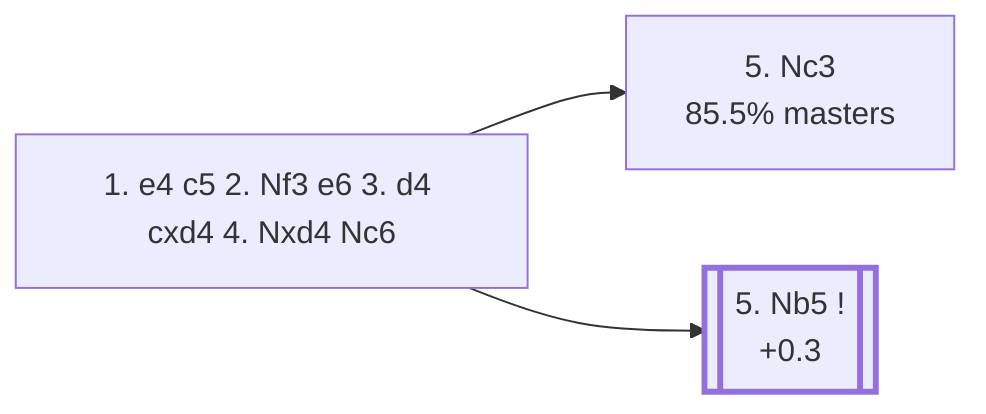

<a name="_TOP_"></a>

# B44 Sicilian Defense: Taimanov Variation <br> 1. e4 c5 2. Nf3 e6 3. d4 cxd4 4. Nxd4 Nc6 #

Spun off from [`B40_Sicilian_e6_Open.md`](https://github.com/onclemarcel/chess_flashcards/blob/main/e4_openings/B40_Sicilian_e6_Open.md)'s own "3. d4" branch — masters' second most popular reply there (36.8%). Develops naturally, keeping the option of ... d6 or ... d5 open, often following up with ... Qc7 and ... a6.

### Overview

*Quick map of every move covered on this card — see the [shape key](https://github.com/onclemarcel/chess_flashcards/blob/main/start.md#content-diagram-optional) in start.md.*

<!-- content-diagram:start -->

<!-- content-diagram:end -->

<a name="_initial_move_"></a>

[](https://lichess.org/analysis/standard/r1bqkbnr/pp1p1ppp/2n1p3/8/3NP3/8/PPP2PPP/RNBQKB1R_w_KQkq_-_1_5)

*... 4... Nc6 — Taimanov Variation*

```
r1bqkbnr/pp1p1ppp/2n1p3/8/3NP3/8/PPP2PPP/RNBQKB1R w KQkq - 1 5
```

|  | +0.3 |
| --- | --- |

<!-- lichess-stats:start fen="r1bqkbnr/pp1p1ppp/2n1p3/8/3NP3/8/PPP2PPP/RNBQKB1R w KQkq - 1 5" db="lichess,masters" speeds="bullet,blitz" ratings="1800,2000,2200,2500" moves="4" -->
| Move | Online | W/D/B | Masters | W/D/B | |
| :--- | ---: | :--- | ---: | :--- | :-- |
| Nc3 | 4.4 M (52.5%) | ⬜⬜⬜⬜⬜⬛⬛⬛⬛⬛ 48/5/47 | 30 k (85.5%) | ⬜⬜⬜🟫🟫🟫🟫⬛⬛⬛ 33/40/26 |  |
| Nxc6 | 1.6 M (18.6%) | ⬜⬜⬜⬜⬜⬛⬛⬛⬛⬛ 46/5/49 | 584 (1.7%) | ⬜⬜🟫🟫🟫🟫⬛⬛⬛⬛ 22/35/43 |  |
| c4 | 634 k (7.5%) | ⬜⬜⬜⬜⬜⬛⬛⬛⬛⬛ 48/5/48 | 0 | — | ⚠ |
| Be3 | 536 k (6.3%) | ⬜⬜⬜⬜⬜⬛⬛⬛⬛⬛ 47/5/48 | 216 (0.6%) | ⬜⬜⬜🟫🟫🟫⬛⬛⬛⬛ 26/28/45 |  |
| Nb5 | 0 | — | 3.4 k (9.7%) | ⬜⬜⬜🟫🟫🟫🟫⬛⬛⬛ 30/40/30 |  |

*Online: bullet/blitz, 1800+ — 8.4 M games. Masters: 35 k games. [Open in the explorer](https://lichess.org/analysis/standard/r1bqkbnr/pp1p1ppp/2n1p3/8/3NP3/8/PPP2PPP/RNBQKB1R_w_KQkq_-_1_5#explorer) — updated 2026-09-02*
<!-- lichess-stats:end -->

### Candidate moves

* **5. Nc3** (85.5% masters): already live-tagged **B45** — see [`B45_Sicilian_Taimanov_Nc3.md`](https://github.com/onclemarcel/chess_flashcards/blob/main/e4_openings/B45_Sicilian_Taimanov_Nc3.md), not built out further here.
* [**5. Nb5**](#_Nb5_) (9.7% masters, +0.3): the *Szén Variation* — stays genuinely B44. See below.

[*Back to TOP*](#_TOP_)

---

<a name="_Nb5_"></a>

### 5. Nb5 — Szén Variation

[](https://lichess.org/analysis/standard/r1bqkbnr/pp1p1ppp/2n1p3/1N6/4P3/8/PPP2PPP/RNBQKB1R_b_KQkq_-_2_5)

*... 5. Nb5 — Szén Variation*

```
r1bqkbnr/pp1p1ppp/2n1p3/1N6/4P3/8/PPP2PPP/RNBQKB1R b KQkq - 2 5
```

|  | +0.3 |
| --- | --- |

<!-- lichess-stats:start fen="r1bqkbnr/pp1p1ppp/2n1p3/1N6/4P3/8/PPP2PPP/RNBQKB1R b KQkq - 2 5" db="lichess,masters" speeds="bullet,blitz" ratings="1800,2000,2200,2500" moves="4" -->
| Move | Online | W/D/B | Masters | W/D/B | |
| :--- | ---: | :--- | ---: | :--- | :-- |
| d6 | 216 k (49.7%) | ⬜⬜⬜⬜⬜⬛⬛⬛⬛⬛ 50/5/46 | 3.3 k (96.0%) | ⬜⬜⬜🟫🟫🟫🟫⬛⬛⬛ 29/41/30 |  |
| a6 | 89 k (20.5%) | ⬜⬜⬜⬜⬜🟫⬛⬛⬛⬛ 55/5/41 | 5 (0.1%) | — |  |
| Nf6 | 51 k (11.7%) | ⬜⬜⬜⬜⬜⬛⬛⬛⬛⬛ 49/5/46 | 114 (3.3%) | ⬜⬜⬜⬜🟫🟫🟫⬛⬛⬛ 36/35/29 |  |
| d5 | 39 k (9.0%) | ⬜⬜⬜⬜⬜⬜⬛⬛⬛⬛ 60/4/36 | 0 | — | ⚠ |
| Bc5 | 0 | — | 17 (0.5%) | — |  |

*Online: bullet/blitz, 1800+ — 434 k games. Masters: 3.4 k games. [Open in the explorer](https://lichess.org/analysis/standard/r1bqkbnr/pp1p1ppp/2n1p3/1N6/4P3/8/PPP2PPP/RNBQKB1R_b_KQkq_-_2_5#explorer) — updated 2026-09-02*
<!-- lichess-stats:end -->

**5... d6** is masters' overwhelming reply (96.0%), immediately kicking the knight back before it can settle on d6.

[](https://lichess.org/analysis/standard/r1bqkbnr/pp3ppp/2npp3/1N6/4P3/8/PPP2PPP/RNBQKB1R_w_KQkq_-_0_6)

*... 5... d6*

```
r1bqkbnr/pp3ppp/2npp3/1N6/4P3/8/PPP2PPP/RNBQKB1R w KQkq - 0 6
```

|  | +0.1 |
| --- | --- |

**6. c4** is masters' clear main try (74.4%), clamping down on d5 Maróczy-style before the knight even retreats. Deeper Szén theory (the resulting Maróczy-Bind-adjacent middlegame) is its own extensive body of work, not covered further here.

[*Back to 4... Nc6*](#_initial_move_)
[*Back to TOP*](#_TOP_)

---

> [!NOTE]
> **6. c4 Nf6 7. N1c3 a6 8. Na3 Be7 9. Be2 O-O 10. O-O b6** is live-tagged the *Modern Line* (`eco.md`'s own name: "Hedgehog Variation" — a real divergence) — a deep, well-tested tabiya (the classic Hedgehog pawn structure, ... b6/... Bb7/... a6 with White's own space advantage).
>
> [](https://lichess.org/analysis/standard/r1bq1rk1/4bppp/ppnppn2/8/2P1P3/N1N5/PP2BPPP/R1BQ1RK1_w_-_-_0_11)
>
> ```
> r1bq1rk1/4bppp/ppnppn2/8/2P1P3/N1N5/PP2BPPP/R1BQ1RK1 w - - 0 11
> ```
>
> |  | +0.3 |
> | --- | --- |
>
> **6... d5**, played immediately instead of the quiet Hedgehog build-up, is live-tagged the *Gary Gambit* (`eco.md`: "Dely-Kasparov Gambit," another real divergence) — a real, if rare, independent try.
>
> [](https://lichess.org/analysis/standard/r1bqkb1r/1p3ppp/p1n1pn2/3p4/2P1P3/N1N5/PP3PPP/R1BQKB1R_w_KQkq_-_0_9)
>
> ```
> r1bqkb1r/1p3ppp/p1n1pn2/3p4/2P1P3/N1N5/PP3PPP/R1BQKB1R w KQkq - 0 9
> ```
>
> |  | +0.2 |
> | --- | --- |
>
> Deeper theory for both is not covered further here.
>
> [*Back to 5. Nb5*](#_Nb5_)
> [*Back to TOP*](#_TOP_)
