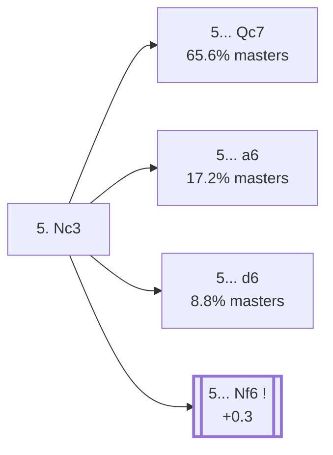

<a name="_TOP_"></a>

# B45 Sicilian Defense: Taimanov Variation <br> 1. e4 c5 2. Nf3 e6 3. d4 cxd4 4. Nxd4 Nc6 5. Nc3 #

Spun off from [`B44_Sicilian_Taimanov_Szen.md`](https://github.com/onclemarcel/chess_flashcards/blob/main/e4_openings/B44_Sicilian_Taimanov_Szen.md)'s own candidate list — White's overwhelming main try there (85.5% masters), developing naturally before deciding on a plan.

### Overview

*Quick map of every move covered on this card — see the [shape key](https://github.com/onclemarcel/chess_flashcards/blob/main/start.md#content-diagram-optional) in start.md.*

<!-- content-diagram:start -->

<!-- content-diagram:end -->

<a name="_initial_move_"></a>

[](https://lichess.org/analysis/standard/r1bqkbnr/pp1p1ppp/2n1p3/8/3NP3/2N5/PPP2PPP/R1BQKB1R_b_KQkq_-_2_5)

*... 5. Nc3 — Taimanov Variation*

```
r1bqkbnr/pp1p1ppp/2n1p3/8/3NP3/2N5/PPP2PPP/R1BQKB1R b KQkq - 2 5
```

|  | +0.3 |
| --- | --- |

<!-- lichess-stats:start fen="r1bqkbnr/pp1p1ppp/2n1p3/8/3NP3/2N5/PPP2PPP/R1BQKB1R b KQkq - 2 5" db="lichess,masters" speeds="bullet,blitz" ratings="1800,2000,2200,2500" moves="6" -->
| Move | Online | W/D/B | Masters | W/D/B | |
| :--- | ---: | :--- | ---: | :--- | :-- |
| Nf6 | 1.7 M (26.5%) | ⬜⬜⬜⬜⬜⬛⬛⬛⬛⬛ 47/5/49 | 2.8 k (7.8%) | ⬜⬜⬜🟫🟫🟫🟫🟫⬛⬛ 35/46/19 |  |
| a6 | 1.3 M (19.8%) | ⬜⬜⬜⬜⬜⬛⬛⬛⬛⬛ 48/4/47 | 6.1 k (17.2%) | ⬜⬜⬜🟫🟫🟫🟫⬛⬛⬛ 33/40/27 |  |
| Qc7 | 1.2 M (18.4%) | ⬜⬜⬜⬜⬜⬛⬛⬛⬛⬛ 45/5/50 | 23 k (65.6%) | ⬜⬜⬜🟫🟫🟫🟫⬛⬛⬛ 34/40/26 |  |
| Bc5 | 744 k (11.3%) | ⬜⬜⬜⬜⬜⬛⬛⬛⬛⬛ 49/4/47 | 109 (0.3%) | ⬜⬜⬜🟫🟫🟫🟫⬛⬛⬛ 29/38/33 |  |
| Bb4 | 457 k (6.9%) | ⬜⬜⬜⬜⬜⬛⬛⬛⬛⬛ 50/4/46 | 54 (0.2%) | ⬜⬜⬜⬜⬜⬜🟫🟫🟫⬛ 54/33/13 |  |
| Nxd4 | 299 k (4.5%) | ⬜⬜⬜⬜⬜⬜⬛⬛⬛⬛ 55/4/41 | 0 | — | ⚠ |
| d6 | 0 | — | 3.1 k (8.8%) | ⬜⬜⬜⬜🟫🟫🟫⬛⬛⬛ 36/35/28 |  |

*Online: bullet/blitz, 1800+ — 6.6 M games. Masters: 35 k games. [Open in the explorer](https://lichess.org/analysis/standard/r1bqkbnr/pp1p1ppp/2n1p3/8/3NP3/2N5/PPP2PPP/R1BQKB1R_b_KQkq_-_2_5#explorer) — updated 2026-09-02*
<!-- lichess-stats:end -->

### Candidate moves

* **5... Qc7** (65.6% masters): already live-tagged **B47** — see [`B47_Sicilian_Taimanov_Bastrikov.md`](https://github.com/onclemarcel/chess_flashcards/blob/main/e4_openings/B47_Sicilian_Taimanov_Bastrikov.md), not built out further here.
* **5... a6** (17.2% masters): already live-tagged **B46** — see [`B46_Sicilian_Taimanov_a6.md`](https://github.com/onclemarcel/chess_flashcards/blob/main/e4_openings/B46_Sicilian_Taimanov_a6.md), not built out further here.
* **5... d6** (8.8% masters): stays B45, transposing toward Scheveningen-style structures — not built out further here.
* [**5... Nf6**](#_Nf6_) (7.8% masters, +0.3): stays B45, the *American Attack*. See below.

[*Back to TOP*](#_TOP_)

---

<a name="_Nf6_"></a>

### 5... Nf6 — American Attack

[](https://lichess.org/analysis/standard/r1bqkb1r/pp1p1ppp/2n1pn2/8/3NP3/2N5/PPP2PPP/R1BQKB1R_w_KQkq_-_3_6)

*... 5... Nf6*

```
r1bqkb1r/pp1p1ppp/2n1pn2/8/3NP3/2N5/PPP2PPP/R1BQKB1R w KQkq - 3 6
```

|  | +0.3 |
| --- | --- |

<!-- lichess-stats:start fen="r1bqkb1r/pp1p1ppp/2n1pn2/8/3NP3/2N5/PPP2PPP/R1BQKB1R w KQkq - 3 6" db="lichess,masters" speeds="bullet,blitz" ratings="1800,2000,2200,2500" moves="4" -->
| Move | Online | W/D/B | Masters | W/D/B | |
| :--- | ---: | :--- | ---: | :--- | :-- |
| Be3 | 1.0 M (23.5%) | ⬜⬜⬜⬜🟫⬛⬛⬛⬛⬛ 43/5/52 | 0 | — | ⚠ |
| Nxc6 | 976 k (22.9%) | ⬜⬜⬜⬜⬜⬛⬛⬛⬛⬛ 46/5/48 | 3.0 k (25.8%) | ⬜⬜⬜⬜🟫🟫🟫🟫⬛⬛ 38/43/18 |  |
| Ndb5 | 662 k (15.5%) | ⬜⬜⬜⬜⬜🟫⬛⬛⬛⬛ 50/6/43 | 6.2 k (53.8%) | ⬜⬜⬜🟫🟫🟫🟫🟫⬛⬛ 33/46/21 |  |
| Bg5 | 404 k (9.5%) | ⬜⬜⬜⬜⬛⬛⬛⬛⬛⬛ 40/5/55 | 0 | — | ⚠ |
| a3 | 0 | — | 797 (6.9%) | ⬜⬜⬜⬜🟫🟫🟫🟫⬛⬛ 43/38/19 |  |
| Be2 | 0 | — | 567 (4.9%) | ⬜⬜⬜⬜🟫🟫🟫🟫⬛⬛ 38/40/23 |  |

*Online: bullet/blitz, 1800+ — 4.3 M games. Masters: 12 k games. [Open in the explorer](https://lichess.org/analysis/standard/r1bqkb1r/pp1p1ppp/2n1pn2/8/3NP3/2N5/PPP2PPP/R1BQKB1R_w_KQkq_-_3_6#explorer) — updated 2026-09-02*
<!-- lichess-stats:end -->

**6. Ndb5 Bb4 7. Nd6+** — the *American Attack* — is a sharp, forcing try: the knight jumps to d6 with check, and **7... Ke7** is forced (the checking knight is untouchable — nothing can capture or block it). Traced move-by-move rather than assumed: this doesn't objectively win material (Stockfish has the position dead level, 0.00, after the forced king move), but it drags Black's king to an awkward square and forces very concrete, well-memorized play rather than natural development.

[](https://lichess.org/analysis/standard/r1bq3r/pp1pkppp/2nNpn2/8/1b2P3/2N5/PPP2PPP/R1BQKB1R_w_KQ_-_7_8)

```
r1bq3r/pp1pkppp/2nNpn2/8/1b2P3/2N5/PPP2PPP/R1BQKB1R w KQ - 7 8
```

|  | 0.0 |
| --- | --- |

Deeper theory past this point is not covered further here.

[*Back to 5. Nc3*](#_initial_move_)
[*Back to TOP*](#_TOP_)
