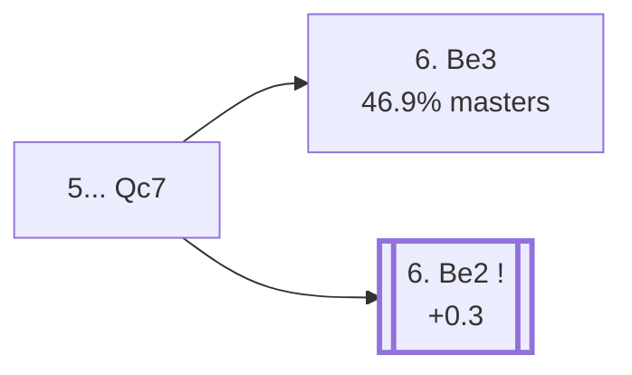

<a name="_TOP_"></a>

# B47 Sicilian Defense: Taimanov Variation, Bastrikov Variation <br> 1. e4 c5 2. Nf3 e6 3. d4 cxd4 4. Nxd4 Nc6 5. Nc3 Qc7 #

Spun off from [`B45_Sicilian_Taimanov_Nc3.md`](https://github.com/onclemarcel/chess_flashcards/blob/main/e4_openings/B45_Sicilian_Taimanov_Nc3.md)'s own candidate list — masters' clear main try there (65.6%). Live-tagged the *Bastrikov Variation*, a real name `eco.md`'s own entry doesn't carry at all (it just calls this leaf the generic "Taimanov Variation").

### Overview

*Quick map of every move covered on this card — see the [shape key](https://github.com/onclemarcel/chess_flashcards/blob/main/start.md#content-diagram-optional) in start.md.*

<!-- content-diagram:start -->

<!-- content-diagram:end -->

<a name="_initial_move_"></a>

[](https://lichess.org/analysis/standard/r1b1kbnr/ppqp1ppp/2n1p3/8/3NP3/2N5/PPP2PPP/R1BQKB1R_w_KQkq_-_3_6)

*... 5... Qc7 — Bastrikov Variation*

```
r1b1kbnr/ppqp1ppp/2n1p3/8/3NP3/2N5/PPP2PPP/R1BQKB1R w KQkq - 3 6
```

|  | +0.4 |
| --- | --- |

<!-- lichess-stats:start fen="r1b1kbnr/ppqp1ppp/2n1p3/8/3NP3/2N5/PPP2PPP/R1BQKB1R w KQkq - 3 6" db="lichess,masters" speeds="bullet,blitz" ratings="1800,2000,2200,2500" moves="6" -->
| Move | Online | W/D/B | Masters | W/D/B | |
| :--- | ---: | :--- | ---: | :--- | :-- |
| Be3 | 566 k (43.1%) | ⬜⬜⬜⬜🟫⬛⬛⬛⬛⬛ 45/5/50 | 12 k (46.9%) | ⬜⬜⬜🟫🟫🟫🟫⬛⬛⬛ 34/41/26 |  |
| Ndb5 | 167 k (12.8%) | ⬜⬜⬜⬜⬜⬛⬛⬛⬛⬛ 45/4/51 | 286 (1.1%) | ⬜⬜⬜⬜🟫🟫🟫⬛⬛⬛ 34/33/33 |  |
| Nxc6 | 144 k (10.9%) | ⬜⬜⬜⬜🟫⬛⬛⬛⬛⬛ 45/5/51 | 0 | — | ⚠ |
| Be2 | 135 k (10.3%) | ⬜⬜⬜⬜🟫⬛⬛⬛⬛⬛ 45/6/49 | 6.6 k (25.6%) | ⬜⬜⬜🟫🟫🟫🟫⬛⬛⬛ 33/41/26 |  |
| g3 | 108 k (8.2%) | ⬜⬜⬜⬜⬜🟫⬛⬛⬛⬛ 47/6/46 | 3.9 k (14.9%) | ⬜⬜⬜🟫🟫🟫🟫⬛⬛⬛ 30/42/28 |  |
| a3 | 52 k (4.0%) | ⬜⬜⬜⬜🟫⬛⬛⬛⬛⬛ 45/6/49 | 0 | — | ⚠ |
| f4 | 0 | — | 1.7 k (6.8%) | ⬜⬜⬜⬜🟫🟫🟫🟫⬛⬛ 38/38/25 |  |
| Qd3 | 0 | — | 368 (1.4%) | ⬜⬜⬜⬜🟫🟫🟫⬛⬛⬛ 44/32/24 |  |

*Online: bullet/blitz, 1800+ — 1.3 M games. Masters: 26 k games. [Open in the explorer](https://lichess.org/analysis/standard/r1b1kbnr/ppqp1ppp/2n1p3/8/3NP3/2N5/PPP2PPP/R1BQKB1R_w_KQkq_-_3_6#explorer) — updated 2026-09-02*
<!-- lichess-stats:end -->

### Candidate moves

* **6. Be3** (46.9% masters): already live-tagged **B48**, the *English Attack* — see [`B48_Sicilian_Taimanov_English_Attack.md`](https://github.com/onclemarcel/chess_flashcards/blob/main/e4_openings/B48_Sicilian_Taimanov_English_Attack.md), not built out further here.
* [**6. Be2**](#_Be2_) (25.6% masters): a quieter developing move — stays genuinely B47. See below.
* **6. g3** (14.9% masters): fianchettoes instead — stays B47, not built out further here.

[*Back to TOP*](#_TOP_)

---

<a name="_Be2_"></a>

### 6. Be2 (+0.3)

A quiet, flexible developing move, sidestepping the sharper English Attack build-up. Black usually continues **6... Nf6** or **6... a6**, with deeper theory not covered further here.

[*Back to TOP*](#_TOP_)
