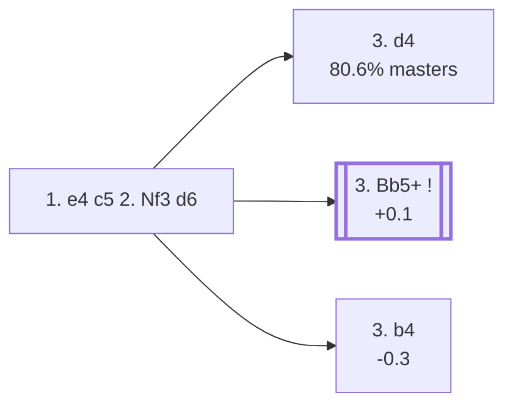

<a name="_TOP_"></a>

# B50 Sicilian Defense <br> 1. e4 c5 2. Nf3 d6 #

**Root corrected 2026-09-02**: this card used to be built entirely around the deep "5. Nc3" tabiya (already **B56**, not B50 — see the fix below) with four huge Najdorf/Classical/Dragon/Scheveningen sub-trees hanging off it. The real B50 is much shallower: the bare **2... d6** itself, live-tagged *Sicilian Defense: Modern Variations*, plus one genuine B50-coded sideline (**3. b4**, the *Wing Gambit, Deferred*). Every other 3rd-move try advances to its own code within a single ply.

### Overview

*Quick map of every move covered on this card — see the [shape key](https://github.com/onclemarcel/chess_flashcards/blob/main/start.md#content-diagram-optional) in start.md.*

<!-- content-diagram:start -->

<!-- content-diagram:end -->

<a name="_initial_move_"></a>

[](https://lichess.org/analysis/standard/rnbqkbnr/pp2pppp/3p4/2p5/4P3/5N2/PPPP1PPP/RNBQKB1R_w_KQkq_-_0_3)

*... 1. e4 c5 2. Nf3 d6*

```
rnbqkbnr/pp2pppp/3p4/2p5/4P3/5N2/PPPP1PPP/RNBQKB1R w KQkq - 0 3
```

|  | +0.2 |
| --- | --- |

<!-- lichess-stats:start fen="rnbqkbnr/pp2pppp/3p4/2p5/4P3/5N2/PPPP1PPP/RNBQKB1R w KQkq - 0 3" db="lichess,masters" speeds="bullet,blitz" ratings="1800,2000,2200,2500" moves="6" -->
| Move | Online | W/D/B | Masters | W/D/B | |
| :--- | ---: | :--- | ---: | :--- | :-- |
| d4 | 34.9 M (61.6%) | ⬜⬜⬜⬜⬜⬛⬛⬛⬛⬛ 48/5/47 | 186 k (80.6%) | ⬜⬜⬜🟫🟫🟫🟫🟫⬛⬛ 30/47/23 |  |
| c3 | 5.3 M (9.4%) | ⬜⬜⬜⬜⬜⬛⬛⬛⬛⬛ 49/5/46 | 7.5 k (3.2%) | ⬜⬜⬜🟫🟫🟫🟫⬛⬛⬛ 33/37/29 |  |
| Bc4 | 5.2 M (9.1%) | ⬜⬜⬜⬜⬜⬛⬛⬛⬛⬛ 47/4/49 | 2.5 k (1.1%) | ⬜⬜⬜⬜🟫🟫🟫🟫⬛⬛ 37/37/26 |  |
| Bb5+ | 4.4 M (7.8%) | ⬜⬜⬜⬜⬜🟫⬛⬛⬛⬛ 50/6/44 | 28 k (12.3%) | ⬜⬜⬜🟫🟫🟫🟫🟫⬛⬛ 27/47/25 |  |
| Nc3 | 3.2 M (5.7%) | ⬜⬜⬜⬜⬜⬛⬛⬛⬛⬛ 48/5/48 | 4.3 k (1.8%) | ⬜⬜⬜🟫🟫🟫🟫🟫⬛⬛ 31/47/22 |  |
| d3 | 1.1 M (1.9%) | ⬜⬜⬜⬜⬜⬛⬛⬛⬛⬛ 48/5/47 | 0 | — | ⚠ |
| g3 | 0 | — | 820 (0.4%) | ⬜⬜⬜🟫🟫🟫🟫⬛⬛⬛ 33/34/33 |  |

*Online: bullet/blitz, 1800+ — 56.6 M games. Masters: 231 k games. [Open in the explorer](https://lichess.org/analysis/standard/rnbqkbnr/pp2pppp/3p4/2p5/4P3/5N2/PPPP1PPP/RNBQKB1R_w_KQkq_-_0_3#explorer) — updated 2026-09-02*
<!-- lichess-stats:end -->

### Candidate moves

* [**3. d4**](https://github.com/onclemarcel/chess_flashcards/blob/main/e4_openings/B54_Sicilian_d6_Modern_Main_Line.md) (80.6% masters): already live-tagged **B54** — see `B54_Sicilian_d6_Modern_Main_Line.md`, not built out further here.
* [**3. Bb5+**](https://github.com/onclemarcel/chess_flashcards/blob/main/e4_openings/B51_Sicilian_Moscow_Variation.md) (12.3% masters, +0.1): the *Moscow Variation* (`eco.md` calls it the *Canal-Sokolsky Attack*, a real name divergence) — already live-tagged **B51**, see `B51_Sicilian_Moscow_Variation.md`, not built out further here.
* [**3. b4**](#_b4_) (0.4% masters, -0.3): the *Wing Gambit, Deferred* — see below.

Everything else (3. c3, 3. Nc3, 3. Bc4, 3. g3, and more) is a real database minority (under 3.2% masters each) with no further named code in this range.

[*Back to TOP*](#_TOP_)

---

<a name="_b4_"></a>

> [!NOTE]
> **3. b4** offers the b-pawn to open lines, one move later than the regular Wing Gambit (2. b4) since Black has already committed to ... d6.
>
> [](https://lichess.org/analysis/standard/rnbqkbnr/pp2pppp/3p4/2p5/1P2P3/5N2/P1PP1PPP/RNBQKB1R_b_KQkq_b3_0_3)
>
> *... 3. b4 — Wing Gambit, Deferred*
>
> ```
> rnbqkbnr/pp2pppp/3p4/2p5/1P2P3/5N2/P1PP1PPP/RNBQKB1R b KQkq b3 0 3
> ```
>
> |  | -0.3 |
> | --- | --- |
>
> Objectively a real practical risk for White (Stockfish already prefers Black by a third of a pawn) — a database rarity, offered mainly for surprise value rather than sound theory. Deeper theory not covered further here.
>
> [*Back to TOP*](#_TOP_)
