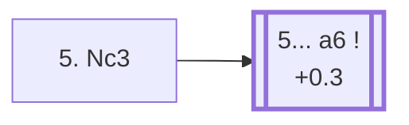

<a name="_TOP_"></a>

# B50 Sicilian Defense, Open <br> 1. e4 c5 2. Nf3 d6 3. d4 cxd4 4. Nxd4 Nf6 5. Nc3 #

After **2... d6**, the game almost always follows the same forced-looking path: White strikes the centre with **3. d4**, Black captures — 96.2% of masters games — White recaptures with the knight rather than the queen, and Black develops with tempo against e4. This exact position, reached in 99.5% of masters games that get this far, is the true starting tabiya of "the Open Sicilian" that so much of chess theory is built around.

### Overview

*Quick map of every move covered on this card — see the [shape key](https://github.com/onclemarcel/chess_flashcards/blob/main/start.md#content-diagram-optional) in start.md. Only the Najdorf (5... a6) continues on this page; the other three systems are discussed as candidate moves but have no card or anchor yet.*

<!-- content-diagram:start -->

<!-- content-diagram:end -->

<a name="_initial_move_"></a>

[](https://lichess.org/analysis/standard/rnbqkb1r/pp2pppp/3p1n2/8/3NP3/2N5/PPP2PPP/R1BQKB1R_b_KQkq_-_2_5)

*... 1. e4 c5 2. Nf3 d6 3. d4 cxd4 4. Nxd4 Nf6 5. Nc3 — the Open Sicilian tabiya*

```
rnbqkb1r/pp2pppp/3p1n2/8/3NP3/2N5/PPP2PPP/R1BQKB1R b KQkq - 2 5
```

|  | +0.3 |
| --- | --- |

<!-- lichess-stats:start fen="rnbqkb1r/pp2pppp/3p1n2/8/3NP3/2N5/PPP2PPP/R1BQKB1R b KQkq - 2 5" db="lichess,masters" speeds="bullet,blitz" ratings="1800,2000,2200,2500" moves="8" -->
| Move | Online | W/D/B | Masters | W/D/B | |
| :--- | ---: | :--- | ---: | :--- | :-- |
| a6 | 15.1 M (61.9%) | ⬜⬜⬜⬜⬜⬛⬛⬛⬛⬛ 48/5/48 | 126 k (71.1%) | ⬜⬜⬜🟫🟫🟫🟫🟫⬛⬛ 27/51/22 |  |
| g6 | 5.9 M (24.1%) | ⬜⬜⬜⬜⬜⬛⬛⬛⬛⬛ 46/5/49 | 20 k (11.1%) | ⬜⬜⬜⬜🟫🟫🟫🟫⬛⬛ 39/37/23 |  |
| Nc6 | 2.0 M (8.2%) | ⬜⬜⬜⬜⬜⬛⬛⬛⬛⬛ 46/5/49 | 24 k (13.8%) | ⬜⬜⬜🟫🟫🟫🟫⬛⬛⬛ 35/37/29 |  |
| e6 | 787 k (3.2%) | ⬜⬜⬜⬜⬜⬛⬛⬛⬛⬛ 49/4/46 | 5.2 k (3.0%) | ⬜⬜⬜🟫🟫🟫🟫⬛⬛⬛ 36/36/27 |  |
| e5 | 441 k (1.8%) | ⬜⬜⬜⬜⬜⬛⬛⬛⬛⬛ 48/5/47 | 397 (0.2%) | ⬜⬜⬜⬜🟫🟫🟫🟫⬛⬛ 40/43/17 |  |
| Bd7 | 54 k (0.2%) | ⬜⬜⬜⬜⬜⬛⬛⬛⬛⬛ 48/5/47 | 1.3 k (0.7%) | ⬜⬜⬜🟫🟫🟫🟫⬛⬛⬛ 32/36/33 |  |
| Nbd7 | 54 k (0.2%) | ⬜⬜⬜⬜⬜⬛⬛⬛⬛⬛ 50/4/46 | 140 (0.1%) | ⬜⬜⬜⬜🟫🟫🟫⬛⬛⬛ 41/28/31 |  |
| Bg4 | 20 k (0.1%) | ⬜⬜⬜⬜⬜🟫⬛⬛⬛⬛ 52/4/44 | 0 | — | ⚠ |
| h6 | 0 | — | 51 (0.0%) | ⬜⬜⬜🟫🟫🟫🟫⬛⬛⬛ 33/43/24 |  |

*Online: bullet/blitz, 1800+ — 24.4 M games. Masters: 177 k games. [Open in the explorer](https://lichess.org/analysis/standard/rnbqkb1r/pp2pppp/3p1n2/8/3NP3/2N5/PPP2PPP/R1BQKB1R_b_KQkq_-_2_5#explorer) — updated 2026-08-25*
<!-- lichess-stats:end -->

### Candidate moves

* [**5... a6**](#_a6_) (+0.3): the *Najdorf Variation* — by far masters' main choice (71.1%), and arguably the single most respected system in the whole Sicilian. Prepares ... e5 or ... b5 without allowing Nb5 tricks.
* **5... Nc6** (masters 13.8%): heads toward the *Classical Variation*, or — after a later ... e5 — the sharp *Sveshnikov Variation*.
* **5... g6** (masters 11.1%): the *Dragon Variation* — fianchettoes the bishop toward the long diagonal, one of the sharpest and most heavily analysed systems in the Sicilian thanks to opposite-side castling races.
* **5... e6** (masters 3.0%): the *Scheveningen Variation* — flexible and solid, keeping options open between a Najdorf- and Taimanov-style setup.

[*Back to TOP*](#_TOP_)

---

<a name="_a6_"></a>

### 5... a6 — Najdorf Variation

[](https://lichess.org/analysis/standard/rnbqkb1r/1p2pppp/p2p1n2/8/3NP3/2N5/PPP2PPP/R1BQKB1R_w_KQkq_-_0_6)

*... 5... a6 — Najdorf Variation*

```
rnbqkb1r/1p2pppp/p2p1n2/8/3NP3/2N5/PPP2PPP/R1BQKB1R w KQkq - 0 6
```

|  | +0.3 |
| --- | --- |

<!-- lichess-stats:start fen="rnbqkb1r/1p2pppp/p2p1n2/8/3NP3/2N5/PPP2PPP/R1BQKB1R w KQkq - 0 6" db="lichess,masters" speeds="bullet,blitz" ratings="1800,2000,2200,2500" moves="6" -->
| Move | Online | W/D/B | Masters | W/D/B | |
| :--- | ---: | :--- | ---: | :--- | :-- |
| Bg5 | 3.8 M (24.6%) | ⬜⬜⬜⬜⬜⬛⬛⬛⬛⬛ 48/4/47 | 26 k (20.1%) | ⬜⬜⬜🟫🟫🟫🟫🟫⬛⬛ 28/50/23 |  |
| Be3 | 3.2 M (20.3%) | ⬜⬜⬜⬜⬜⬛⬛⬛⬛⬛ 47/4/48 | 42 k (33.2%) | ⬜⬜🟫🟫🟫🟫🟫🟫⬛⬛ 25/59/17 |  |
| Bc4 | 2.0 M (12.7%) | ⬜⬜⬜⬜⬜⬛⬛⬛⬛⬛ 49/4/47 | 7.7 k (6.1%) | ⬜⬜⬜🟫🟫🟫🟫⬛⬛⬛ 31/35/34 |  |
| Be2 | 1.8 M (11.8%) | ⬜⬜⬜⬜⬜⬛⬛⬛⬛⬛ 47/5/48 | 16 k (12.9%) | ⬜⬜⬜🟫🟫🟫🟫🟫⬛⬛ 29/46/25 |  |
| f3 | 1.2 M (7.8%) | ⬜⬜⬜⬜⬜⬛⬛⬛⬛⬛ 49/4/47 | 8.2 k (6.5%) | ⬜⬜🟫🟫🟫🟫🟫🟫⬛⬛ 24/58/18 |  |
| Bd3 | 943 k (6.1%) | ⬜⬜⬜⬜🟫⬛⬛⬛⬛⬛ 44/4/51 | 0 | — | ⚠ |
| h3 | 0 | — | 11 k (8.9%) | ⬜⬜🟫🟫🟫🟫🟫🟫⬛⬛ 24/57/18 |  |

*Online: bullet/blitz, 1800+ — 15.6 M games. Masters: 127 k games. [Open in the explorer](https://lichess.org/analysis/standard/rnbqkb1r/1p2pppp/p2p1n2/8/3NP3/2N5/PPP2PPP/R1BQKB1R_w_KQkq_-_0_6#explorer) — updated 2026-08-25*
<!-- lichess-stats:end -->

The point of **5... a6** is prophylactic: it rules out **Nb5** ideas for good, so Black can follow up with ... e5 or ... b5 without a knight jumping into d6 or c7. White has a genuinely wide choice of set-ups here, none of them overwhelmingly dominant:

* **6. Be3** (33.2% masters): the *English Attack* — the modern main line, preparing f3, Qd2, and long castling for an all-out kingside pawn storm.
* **6. Bg5** (20.1% masters): the *Classical* main line, pinning the f6-knight before Black can play ... e5.
* **6. Be2** (12.9% masters): a quieter, more restrained set-up.
* **6. h3** (8.9% masters): a flexible waiting move, avoiding ... Bg4/... Ng4 ideas before committing the bishop.
* **6. f3** (6.5% masters): supports a future e4-e5 or Be3/Qd2 English-Attack-style build-up while ruling out ... Ng4.
* **6. Bc4** (6.1% masters): the *Fischer-Sozin Attack*, aiming the bishop straight at f7.

Each of these six tries is itself the gateway to a huge, independent body of Najdorf theory.

[*Back to 5. Nc3*](#_initial_move_)
[*Back to TOP*](#_TOP_)
