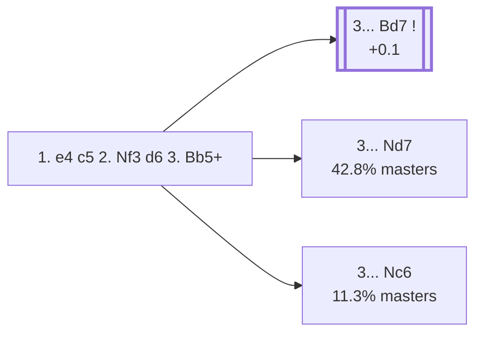

<a name="_TOP_"></a>

# B51 Sicilian Defense: Moscow Variation <br> 1. e4 c5 2. Nf3 d6 3. Bb5+ #

Spun off from [`B50_Sicilian_d6_Open.md`](https://github.com/onclemarcel/chess_flashcards/blob/main/e4_openings/B50_Sicilian_d6_Open.md)'s own candidate list — masters' second most popular try after 2... d6 (12.3%), sidestepping Open Sicilian theory almost entirely. Live-tagged the *Moscow Variation* (`eco.md` calls it the *Canal-Sokolsky Attack*, a real name divergence). The bishop check is genuine — Black's king still sits on e8 with nothing blocking the b5-e8 diagonal.

### Overview

*Quick map of every move covered on this card — see the [shape key](https://github.com/onclemarcel/chess_flashcards/blob/main/start.md#content-diagram-optional) in start.md.*

<!-- content-diagram:start -->

<!-- content-diagram:end -->

<a name="_initial_move_"></a>

[](https://lichess.org/analysis/standard/rnbqkbnr/pp2pppp/3p4/1Bp5/4P3/5N2/PPPP1PPP/RNBQK2R_b_KQkq_-_1_3)

*... 3. Bb5+ — Moscow Variation*

```
rnbqkbnr/pp2pppp/3p4/1Bp5/4P3/5N2/PPPP1PPP/RNBQK2R b KQkq - 1 3
```

|  | +0.1 |
| --- | --- |

<!-- lichess-stats:start fen="rnbqkbnr/pp2pppp/3p4/1Bp5/4P3/5N2/PPPP1PPP/RNBQK2R b KQkq - 1 3" db="lichess,masters" speeds="bullet,blitz" ratings="1800,2000,2200,2500" moves="4" -->
| Move | Online | W/D/B | Masters | W/D/B | |
| :--- | ---: | :--- | ---: | :--- | :-- |
| Bd7 | 2.6 M (58.2%) | ⬜⬜⬜⬜⬜🟫⬛⬛⬛⬛ 50/7/43 | 13 k (46.0%) | ⬜⬜⬜🟫🟫🟫🟫🟫⬛⬛ 26/54/20 |  |
| Nd7 | 1.3 M (28.8%) | ⬜⬜⬜⬜⬜🟫⬛⬛⬛⬛ 48/6/46 | 12 k (42.8%) | ⬜⬜⬜🟫🟫🟫🟫⬛⬛⬛ 28/42/30 |  |
| Nc6 | 561 k (12.7%) | ⬜⬜⬜⬜⬜🟫⬛⬛⬛⬛ 52/5/43 | 3.2 k (11.3%) | ⬜⬜⬜🟫🟫🟫🟫⬛⬛⬛ 31/39/31 |  |
| Qd7 | 8.1 k (0.2%) | ⬜⬜⬜⬜⬜⬜⬜⬜⬜⬛ 91/2/7 | 0 | — | ⚠ |

*Online: bullet/blitz, 1800+ — 4.4 M games. Masters: 28 k games. [Open in the explorer](https://lichess.org/analysis/standard/rnbqkbnr/pp2pppp/3p4/1Bp5/4P3/5N2/PPPP1PPP/RNBQK2R_b_KQkq_-_1_3#explorer) — updated 2026-09-02*
<!-- lichess-stats:end -->

### Candidate moves

* [**3... Bd7**](https://github.com/onclemarcel/chess_flashcards/blob/main/e4_openings/B52_Sicilian_Moscow_Bd7.md) (46.0% masters, +0.1): the most flexible block — already live-tagged **B52**, see `B52_Sicilian_Moscow_Bd7.md`, not built out further here.
* [**3... Nd7**](#_Nd7_) (42.8% masters): blocks with the knight instead, keeping the dark-squared bishop's diagonal open. See below.
* **3... Nc6** (11.3% masters): develops the queenside knight, accepting doubled pawns after a later Bxc6+ — stays B51, no further named code.

[*Back to TOP*](#_TOP_)

---

<a name="_Nd7_"></a>

### 3... Nd7

[](https://lichess.org/analysis/standard/r1bqkbnr/pp1npppp/3p4/1Bp5/4P3/5N2/PPPP1PPP/RNBQK2R_w_KQkq_-_2_4)

*... 3... Nd7*

```
r1bqkbnr/pp1npppp/3p4/1Bp5/4P3/5N2/PPPP1PPP/RNBQK2R w KQkq - 2 4
```

|  | +0.2 |
| --- | --- |

<!-- lichess-stats:start fen="r1bqkbnr/pp1npppp/3p4/1Bp5/4P3/5N2/PPPP1PPP/RNBQK2R w KQkq - 2 4" db="lichess,masters" speeds="bullet,blitz" ratings="1800,2000,2200,2500" moves="6" -->
| Move | Online | W/D/B | Masters | W/D/B | |
| :--- | ---: | :--- | ---: | :--- | :-- |
| O-O | 505 k (39.7%) | ⬜⬜⬜⬜⬜🟫⬛⬛⬛⬛ 48/6/46 | 4.1 k (33.4%) | ⬜⬜⬜🟫🟫🟫🟫⬛⬛⬛ 28/40/32 |  |
| d4 | 203 k (16.0%) | ⬜⬜⬜⬜⬜🟫⬛⬛⬛⬛ 49/7/45 | 4.3 k (35.5%) | ⬜⬜⬜🟫🟫🟫🟫⬛⬛⬛ 27/45/27 |  |
| Bxd7+ | 182 k (14.3%) | ⬜⬜⬜⬜⬜⬛⬛⬛⬛⬛ 47/6/47 | 0 | — | ⚠ |
| c3 | 118 k (9.3%) | ⬜⬜⬜⬜⬜⬛⬛⬛⬛⬛ 48/6/46 | 1.4 k (11.8%) | ⬜⬜⬜🟫🟫🟫🟫⬛⬛⬛ 28/40/32 |  |
| a4 | 98 k (7.7%) | ⬜⬜⬜⬜⬜🟫⬛⬛⬛⬛ 49/6/45 | 1.1 k (8.7%) | ⬜⬜⬜🟫🟫🟫🟫⬛⬛⬛ 28/43/29 |  |
| c4 | 50 k (4.0%) | ⬜⬜⬜⬜⬜⬛⬛⬛⬛⬛ 47/6/47 | 421 (3.5%) | ⬜⬜⬜🟫🟫🟫🟫⬛⬛⬛ 25/41/34 |  |
| Ba4 | 0 | — | 802 (6.6%) | ⬜⬜⬜🟫🟫🟫🟫⬛⬛⬛ 31/42/27 |  |

*Online: bullet/blitz, 1800+ — 1.3 M games. Masters: 12 k games. [Open in the explorer](https://lichess.org/analysis/standard/r1bqkbnr/pp1npppp/3p4/1Bp5/4P3/5N2/PPPP1PPP/RNBQK2R_w_KQkq_-_2_4#explorer) — updated 2026-09-02*
<!-- lichess-stats:end -->

Keeps the bishop's own diagonal to g4/h3 free at the cost of blocking the queen's own development for a while. White usually continues **4. d4** or **4. O-O**, with deeper theory not covered further here.

[*Back to 3. Bb5+*](#_initial_move_)
[*Back to TOP*](#_TOP_)
