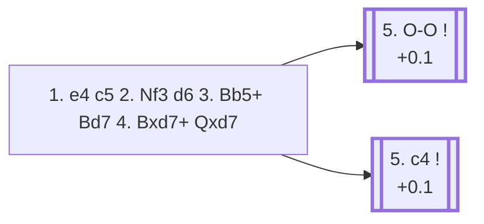

<a name="_TOP_"></a>

# B52 Sicilian Defense: Moscow Variation, 3... Bd7 <br> 1. e4 c5 2. Nf3 d6 3. Bb5+ Bd7 4. Bxd7+ Qxd7 #

Spun off from [`B51_Sicilian_Moscow_Variation.md`](https://github.com/onclemarcel/chess_flashcards/blob/main/e4_openings/B51_Sicilian_Moscow_Variation.md)'s own candidate list — masters' most popular block (46.0%). White trades off the bishop immediately, since **4. Bxd7+ Qxd7** is close to automatic. White's own 5th move is a genuine near-coin-flip between two independent plans.

### Overview

*Quick map of every move covered on this card — see the [shape key](https://github.com/onclemarcel/chess_flashcards/blob/main/start.md#content-diagram-optional) in start.md.*

<!-- content-diagram:start -->

<!-- content-diagram:end -->

<a name="_initial_move_"></a>

[](https://lichess.org/analysis/standard/rn2kbnr/pp1qpppp/3p4/2p5/4P3/5N2/PPPP1PPP/RNBQK2R_w_KQkq_-_0_5)

*... 3. Bb5+ Bd7 4. Bxd7+ Qxd7*

```
rn2kbnr/pp1qpppp/3p4/2p5/4P3/5N2/PPPP1PPP/RNBQK2R w KQkq - 0 5
```

|  | +0.2 |
| --- | --- |

<!-- lichess-stats:start fen="rn2kbnr/pp1qpppp/3p4/2p5/4P3/5N2/PPPP1PPP/RNBQK2R w KQkq - 0 5" db="lichess,masters" speeds="bullet,blitz" ratings="1800,2000,2200,2500" moves="6" -->
| Move | Online | W/D/B | Masters | W/D/B | |
| :--- | ---: | :--- | ---: | :--- | :-- |
| O-O | 629 k (60.9%) | ⬜⬜⬜⬜⬜🟫⬛⬛⬛⬛ 50/7/42 | 4.6 k (51.8%) | ⬜⬜⬜🟫🟫🟫🟫🟫⬛⬛ 25/54/21 |  |
| c4 | 233 k (22.5%) | ⬜⬜⬜⬜⬜🟫⬛⬛⬛⬛ 49/9/42 | 4.1 k (46.7%) | ⬜⬜⬜🟫🟫🟫🟫🟫🟫⬛ 26/58/15 |  |
| d4 | 80 k (7.7%) | ⬜⬜⬜⬜🟫⬛⬛⬛⬛⬛ 45/7/48 | 102 (1.2%) | ⬜⬜🟫🟫🟫🟫🟫🟫⬛⬛ 24/56/21 |  |
| Nc3 | 25 k (2.4%) | ⬜⬜⬜⬜🟫⬛⬛⬛⬛⬛ 44/7/50 | 12 (0.1%) | — |  |
| d3 | 24 k (2.3%) | ⬜⬜⬜⬜🟫⬛⬛⬛⬛⬛ 45/6/49 | 7 (0.1%) | — |  |
| c3 | 23 k (2.2%) | ⬜⬜⬜⬜⬜🟫⬛⬛⬛⬛ 47/7/46 | 10 (0.1%) | — |  |

*Online: bullet/blitz, 1800+ — 1.0 M games. Masters: 8.9 k games. [Open in the explorer](https://lichess.org/analysis/standard/rn2kbnr/pp1qpppp/3p4/2p5/4P3/5N2/PPPP1PPP/RNBQK2R_w_KQkq_-_0_5#explorer) — updated 2026-09-02*
<!-- lichess-stats:end -->

### Candidate moves

* [**5. O-O**](#_OO_) (51.8% masters, +0.1): leads, after Black's own natural development, into the *Haag Gambit* — see below.
* [**5. c4**](#_c4_) (46.7% masters, +0.1): the *Sokolsky Variation* — a Maróczy-style clamp on d5. See below.

[*Back to TOP*](#_TOP_)

---

<a name="_OO_"></a>

### 5. O-O — Haag Gambit

[](https://lichess.org/analysis/standard/r3kb1r/pp1qpppp/2np1n2/2p5/3PP3/2P2N2/PP3PPP/RNBQ1RK1_b_kq_d3_0_7)

*... 5. O-O Nc6 6. c3 Nf6 7. d4 — Haag Gambit (`eco.md`: "Bronstein Gambit," a real name divergence)*

```
r3kb1r/pp1qpppp/2np1n2/2p5/3PP3/2P2N2/PP3PPP/RNBQ1RK1 b kq d3 0 7
```

|  | +0.0 |
| --- | --- |

Genuinely level per Stockfish — White offers the centre pawn back after Black takes on d4, betting on faster development and the queenside pawn majority. Deeper theory not covered further here.

[*Back to 4. Bxd7+ Qxd7*](#_initial_move_)
[*Back to TOP*](#_TOP_)

---

<a name="_c4_"></a>

### 5. c4 — Sokolsky Variation

[](https://lichess.org/analysis/standard/rn2kbnr/pp1qpppp/3p4/2p5/2P1P3/5N2/PP1P1PPP/RNBQK2R_b_KQkq_c3_0_5)

*... 5. c4 — Sokolsky Variation*

```
rn2kbnr/pp1qpppp/3p4/2p5/2P1P3/5N2/PP1P1PPP/RNBQK2R b KQkq c3 0 5
```

|  | +0.1 |
| --- | --- |

<!-- lichess-stats:start fen="rn2kbnr/pp1qpppp/3p4/2p5/2P1P3/5N2/PP1P1PPP/RNBQK2R b KQkq c3 0 5" db="lichess,masters" speeds="bullet,blitz" ratings="1800,2000,2200,2500" moves="6" -->
| Move | Online | W/D/B | Masters | W/D/B | |
| :--- | ---: | :--- | ---: | :--- | :-- |
| Nc6 | 133 k (57.3%) | ⬜⬜⬜⬜⬜🟫⬛⬛⬛⬛ 49/9/42 | 1.9 k (46.7%) | ⬜⬜⬜🟫🟫🟫🟫🟫🟫⬛ 27/59/15 |  |
| Nf6 | 50 k (21.6%) | ⬜⬜⬜⬜⬜🟫⬛⬛⬛⬛ 48/9/43 | 1.6 k (39.2%) | ⬜⬜🟫🟫🟫🟫🟫🟫⬛⬛ 24/61/15 |  |
| g6 | 19 k (8.3%) | ⬜⬜⬜⬜⬜🟫⬛⬛⬛⬛ 50/8/41 | 182 (4.4%) | ⬜⬜⬜🟫🟫🟫🟫🟫⬛⬛ 35/48/17 |  |
| e5 | 18 k (7.6%) | ⬜⬜⬜⬜⬜🟫⬛⬛⬛⬛ 49/9/43 | 338 (8.2%) | ⬜⬜🟫🟫🟫🟫🟫🟫⬛⬛ 26/57/17 |  |
| e6 | 6.6 k (2.8%) | ⬜⬜⬜⬜⬜🟫⬛⬛⬛⬛ 50/8/42 | 7 (0.2%) | — |  |
| Qg4 | 3.1 k (1.3%) | ⬜⬜⬜⬜⬜🟫⬛⬛⬛⬛ 55/5/40 | 52 (1.3%) | ⬜⬜⬜⬜⬜⬜🟫🟫⬛⬛ 58/23/19 |  |

*Online: bullet/blitz, 1800+ — 233 k games. Masters: 4.1 k games. [Open in the explorer](https://lichess.org/analysis/standard/rn2kbnr/pp1qpppp/3p4/2p5/2P1P3/5N2/PP1P1PPP/RNBQK2R_b_KQkq_c3_0_5#explorer) — updated 2026-09-02*
<!-- lichess-stats:end -->

Grabs central space at once, echoing the Maróczy Bind's own logic — clamping down on d5 before Black can contest it. Deeper theory not covered further here.

[*Back to 4. Bxd7+ Qxd7*](#_initial_move_)
[*Back to TOP*](#_TOP_)
