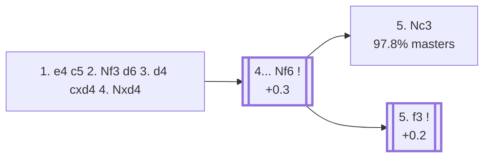

<a name="_TOP_"></a>

# B54 Sicilian Defense: Modern Variations <br> 1. e4 c5 2. Nf3 d6 3. d4 cxd4 4. Nxd4 #

Spun off from [`B50_Sicilian_d6_Open.md`](https://github.com/onclemarcel/chess_flashcards/blob/main/e4_openings/B50_Sicilian_d6_Open.md)'s own "3. d4" branch — masters' overwhelming main try there (80.6%). The bare recapture already earns its own code the moment it's played, live-confirmed via `eco.md`'s own literal PGN for B54.

### Overview

*Quick map of every move covered on this card — see the [shape key](https://github.com/onclemarcel/chess_flashcards/blob/main/start.md#content-diagram-optional) in start.md.*

<!-- content-diagram:start -->

<!-- content-diagram:end -->

<a name="_initial_move_"></a>

[](https://lichess.org/analysis/standard/rnbqkbnr/pp2pppp/3p4/8/3NP3/8/PPP2PPP/RNBQKB1R_b_KQkq_-_0_4)

*... 3. d4 cxd4 4. Nxd4*

```
rnbqkbnr/pp2pppp/3p4/8/3NP3/8/PPP2PPP/RNBQKB1R b KQkq - 0 4
```

|  | +0.2 |
| --- | --- |

**4... Nf6** is close to automatic (99.5% of masters games that continue from here), attacking e4 with tempo. Everything else (a6, Nc6, e6, e5, g6) is a real database minority under 0.2% masters.

[*Back to TOP*](#_TOP_)

---

<a name="_Nf6_"></a>

### 4... Nf6 — Main Line

[](https://lichess.org/analysis/standard/rnbqkb1r/pp2pppp/3p1n2/8/3NP3/8/PPP2PPP/RNBQKB1R_w_KQkq_-_1_5)

*... 4... Nf6 — Main Line*

```
rnbqkb1r/pp2pppp/3p1n2/8/3NP3/8/PPP2PPP/RNBQKB1R w KQkq - 1 5
```

|  | +0.3 |
| --- | --- |

<!-- lichess-stats:start fen="rnbqkb1r/pp2pppp/3p1n2/8/3NP3/8/PPP2PPP/RNBQKB1R w KQkq - 1 5" db="lichess,masters" speeds="bullet,blitz" ratings="1800,2000,2200,2500" moves="4" -->
| Move | Online | W/D/B | Masters | W/D/B | |
| :--- | ---: | :--- | ---: | :--- | :-- |
| Nc3 | 23.0 M (89.3%) | ⬜⬜⬜⬜⬜⬛⬛⬛⬛⬛ 47/5/48 | 168 k (97.8%) | ⬜⬜⬜🟫🟫🟫🟫🟫⬛⬛ 30/47/23 |  |
| Bd3 | 1.2 M (4.5%) | ⬜⬜⬜⬜⬜⬛⬛⬛⬛⬛ 45/5/50 | 296 (0.2%) | ⬜⬜⬜🟫🟫🟫⬛⬛⬛⬛ 30/35/35 |  |
| f3 | 853 k (3.3%) | ⬜⬜⬜⬜⬜🟫⬛⬛⬛⬛ 52/6/42 | 3.3 k (1.9%) | ⬜⬜⬜🟫🟫🟫🟫🟫⬛⬛ 33/44/23 |  |
| Bb5+ | 260 k (1.0%) | ⬜⬜⬜⬜🟫⬛⬛⬛⬛⬛ 44/5/51 | 108 (0.1%) | ⬜⬜⬜🟫🟫🟫🟫🟫⬛⬛ 29/54/18 |  |

*Online: bullet/blitz, 1800+ — 25.7 M games. Masters: 172 k games. [Open in the explorer](https://lichess.org/analysis/standard/rnbqkb1r/pp2pppp/3p1n2/8/3NP3/8/PPP2PPP/RNBQKB1R_w_KQkq_-_1_5#explorer) — updated 2026-09-02*
<!-- lichess-stats:end -->

* **5. Nc3** (97.8% masters): already live-tagged **B56** — see [`B56_Sicilian_Classical_Variation.md`](https://github.com/onclemarcel/chess_flashcards/blob/main/e4_openings/B56_Sicilian_Classical_Variation.md), not built out further here.
* **5. f3** (1.9% masters, +0.2): the *Prins Variation* — see [`B55_Sicilian_Prins_Venice_Attack.md`](https://github.com/onclemarcel/chess_flashcards/blob/main/e4_openings/B55_Sicilian_Prins_Venice_Attack.md), not built out further here.

[*Back to 4. Nxd4*](#_initial_move_)
[*Back to TOP*](#_TOP_)
