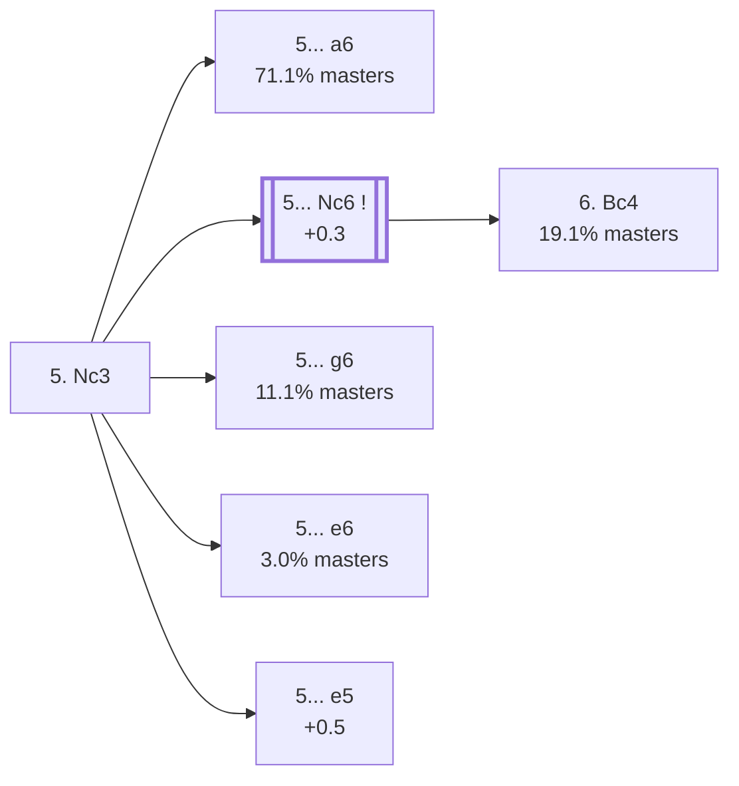

<a name="_TOP_"></a>

# B56 Sicilian Defense: Modern Variations, Main Line <br> 1. e4 c5 2. Nf3 d6 3. d4 cxd4 4. Nxd4 Nf6 5. Nc3 #

**Root corrected 2026-09-02**: this content used to live on `B50_Sicilian_d6_Open.md`, whose own title claimed B50 — but even the bare **5. Nc3** move here is already live-tagged **B56**, several codes past B50's own real (much shallower) scope. Spun off from [`B54_Sicilian_d6_Modern_Main_Line.md`](https://github.com/onclemarcel/chess_flashcards/blob/main/e4_openings/B54_Sicilian_d6_Modern_Main_Line.md)'s own "5. Nc3" branch (97.8% masters, White's overwhelming main try). After **2... d6**, the game almost always follows the same forced-looking path: White strikes the centre with **3. d4**, Black captures, White recaptures with the knight rather than the queen, and Black develops with tempo against e4 — reaching this exact position, the true starting tabiya of "the Open Sicilian" that so much of chess theory is built around.

### Overview

*Quick map of every move covered on this card — see the [shape key](https://github.com/onclemarcel/chess_flashcards/blob/main/start.md#content-diagram-optional) in start.md.*

<!-- content-diagram:start -->

<!-- content-diagram:end -->

<a name="_initial_move_"></a>

[](https://lichess.org/analysis/standard/rnbqkb1r/pp2pppp/3p1n2/8/3NP3/2N5/PPP2PPP/R1BQKB1R_b_KQkq_-_2_5)

*... 1. e4 c5 2. Nf3 d6 3. d4 cxd4 4. Nxd4 Nf6 5. Nc3 — the Open Sicilian tabiya*

```
rnbqkb1r/pp2pppp/3p1n2/8/3NP3/2N5/PPP2PPP/R1BQKB1R b KQkq - 2 5
```

|  | +0.3 |
| --- | --- |

<!-- lichess-stats:start fen="rnbqkb1r/pp2pppp/3p1n2/8/3NP3/2N5/PPP2PPP/R1BQKB1R b KQkq - 2 5" db="lichess,masters" speeds="bullet,blitz" ratings="1800,2000,2200,2500" moves="8" -->
| Move | Online | W/D/B | Masters | W/D/B | |
| :--- | ---: | :--- | ---: | :--- | :-- |
| a6 | 15.1 M (61.9%) | ⬜⬜⬜⬜⬜⬛⬛⬛⬛⬛ 48/5/48 | 126 k (71.1%) | ⬜⬜⬜🟫🟫🟫🟫🟫⬛⬛ 27/51/22 |  |
| g6 | 5.9 M (24.1%) | ⬜⬜⬜⬜⬜⬛⬛⬛⬛⬛ 46/5/49 | 20 k (11.1%) | ⬜⬜⬜⬜🟫🟫🟫🟫⬛⬛ 39/37/23 |  |
| Nc6 | 2.0 M (8.2%) | ⬜⬜⬜⬜⬜⬛⬛⬛⬛⬛ 46/5/49 | 24 k (13.8%) | ⬜⬜⬜🟫🟫🟫🟫⬛⬛⬛ 35/37/29 |  |
| e6 | 787 k (3.2%) | ⬜⬜⬜⬜⬜⬛⬛⬛⬛⬛ 49/4/46 | 5.2 k (3.0%) | ⬜⬜⬜🟫🟫🟫🟫⬛⬛⬛ 36/36/27 |  |
| e5 | 441 k (1.8%) | ⬜⬜⬜⬜⬜⬛⬛⬛⬛⬛ 48/5/47 | 397 (0.2%) | ⬜⬜⬜⬜🟫🟫🟫🟫⬛⬛ 40/43/17 |  |
| Bd7 | 54 k (0.2%) | ⬜⬜⬜⬜⬜⬛⬛⬛⬛⬛ 48/5/47 | 1.3 k (0.7%) | ⬜⬜⬜🟫🟫🟫🟫⬛⬛⬛ 32/36/33 |  |
| Nbd7 | 54 k (0.2%) | ⬜⬜⬜⬜⬜⬛⬛⬛⬛⬛ 50/4/46 | 140 (0.1%) | ⬜⬜⬜⬜🟫🟫🟫⬛⬛⬛ 41/28/31 |  |
| Bg4 | 20 k (0.1%) | ⬜⬜⬜⬜⬜🟫⬛⬛⬛⬛ 52/4/44 | 0 | — | ⚠ |
| h6 | 0 | — | 51 (0.0%) | ⬜⬜⬜🟫🟫🟫🟫⬛⬛⬛ 33/43/24 |  |

*Online: bullet/blitz, 1800+ — 24.4 M games. Masters: 177 k games. [Open in the explorer](https://lichess.org/analysis/standard/rnbqkb1r/pp2pppp/3p1n2/8/3NP3/2N5/PPP2PPP/R1BQKB1R_b_KQkq_-_2_5#explorer) — updated 2026-09-02*
<!-- lichess-stats:end -->

### Candidate moves

* **5... a6** (+0.3, 71.1% masters): the *Najdorf Variation* — by far masters' main choice, and arguably the single most respected system in the whole Sicilian. Already live-tagged **B90**, well out of this card's own B50-B59 range — its own built-out theory (English Attack, Classical Main Line, Opocensky, Adams Attack, Lipnitsky Attack) is kept here for now (see the flagged section below) rather than discarded, but deserves its own proper B90-rooted card in a future B90-B99 batch.
* [**5... Nc6**](#_Nc6_) (+0.3, 13.8% masters): the *Classical Variation* — stays B56. See below.
* **5... g6** (+0.5, 11.1% masters): the *Dragon Variation* — already live-tagged **B70**, out of range; kept here for now (flagged below), deserves its own B70-rooted card in a future batch.
* **5... e6** (+0.5, 3.0% masters): the *Scheveningen Variation* — already live-tagged **B80**, out of range; kept here for now (flagged below), deserves its own B80-rooted card in a future batch.
* [**5... e5**](#_e5_) (+0.5, 0.2% masters): the *Venice Attack* (6. Bb5) — a real database rarity, but stays genuinely B56. See below.

[*Back to TOP*](#_TOP_)

---

<a name="_e5_"></a>

> [!NOTE]
> **5... e5 6. Bb5+** is the *Venice Attack* — a real, if rare (0.2% masters), independent try that stays B56, distinct from [`B55_Sicilian_Prins_Venice_Attack.md`](https://github.com/onclemarcel/chess_flashcards/blob/main/e4_openings/B55_Sicilian_Prins_Venice_Attack.md)'s own Venice Attack (same idea, reached one move order earlier via 5. f3 instead of 5. Nc3 — a genuine name reuse across two different move orders, not a duplicate).
>
> [](https://lichess.org/analysis/standard/rnbqkb1r/pp3ppp/3p1n2/1B2p3/3NP3/2N5/PPP2PPP/R1BQK2R_b_KQkq_-_1_6)
>
> *... 5... e5 6. Bb5+ — Venice Attack*
>
> ```
> rnbqkb1r/pp3ppp/3p1n2/1B2p3/3NP3/2N5/PPP2PPP/R1BQK2R b KQkq - 1 6
> ```
>
> |  | +0.5 |
> | --- | --- |
>
> Deeper theory not covered further here.
>
> [*Back to 5. Nc3*](#_initial_move_)
> [*Back to TOP*](#_TOP_)

---

<a name="_Nc6_"></a>

### 5... Nc6 — Classical Variation

[](https://lichess.org/analysis/standard/r1bqkb1r/pp2pppp/2np1n2/8/3NP3/2N5/PPP2PPP/R1BQKB1R_w_KQkq_-_3_6)

*... 5... Nc6 — Classical Variation*

```
r1bqkb1r/pp2pppp/2np1n2/8/3NP3/2N5/PPP2PPP/R1BQKB1R w KQkq - 3 6
```

|  | +0.3 |
| --- | --- |

<!-- lichess-stats:start fen="r1bqkb1r/pp2pppp/2np1n2/8/3NP3/2N5/PPP2PPP/R1BQKB1R w KQkq - 3 6" db="lichess,masters" speeds="bullet,blitz" ratings="1800,2000,2200,2500" moves="6" -->
| Move | Online | W/D/B | Masters | W/D/B | |
| :--- | ---: | :--- | ---: | :--- | :-- |
| Be3 | 1.1 M (24.4%) | ⬜⬜⬜⬜⬜⬛⬛⬛⬛⬛ 46/4/50 | 1.1 k (2.5%) | ⬜⬜⬜🟫🟫🟫⬛⬛⬛⬛ 32/33/35 |  |
| Bg5 | 945 k (20.3%) | ⬜⬜⬜⬜⬜⬛⬛⬛⬛⬛ 49/5/46 | 25 k (57.4%) | ⬜⬜⬜⬜🟫🟫🟫🟫⬛⬛ 36/38/26 |  |
| Bc4 | 607 k (13.1%) | ⬜⬜⬜⬜⬜⬛⬛⬛⬛⬛ 49/5/46 | 8.3 k (19.1%) | ⬜⬜⬜🟫🟫🟫⬛⬛⬛⬛ 33/33/34 |  |
| Nxc6 | 475 k (10.2%) | ⬜⬜⬜⬜⬜⬛⬛⬛⬛⬛ 46/5/49 | 0 | — | ⚠ |
| Be2 | 464 k (10.0%) | ⬜⬜⬜⬜⬜⬛⬛⬛⬛⬛ 48/6/47 | 4.5 k (10.5%) | ⬜⬜⬜🟫🟫🟫🟫⬛⬛⬛ 28/38/34 |  |
| f3 | 350 k (7.5%) | ⬜⬜⬜⬜⬜⬛⬛⬛⬛⬛ 50/5/45 | 2.0 k (4.6%) | ⬜⬜⬜⬜🟫🟫🟫⬛⬛⬛ 36/35/29 |  |
| g3 | 0 | — | 1.3 k (2.9%) | ⬜⬜⬜🟫🟫🟫🟫⬛⬛⬛ 29/40/31 |  |

*Online: bullet/blitz, 1800+ — 4.6 M games. Masters: 43 k games. [Open in the explorer](https://lichess.org/analysis/standard/r1bqkb1r/pp2pppp/2np1n2/8/3NP3/2N5/PPP2PPP/R1BQKB1R_w_KQkq_-_3_6#explorer) — updated 2026-09-02*
<!-- lichess-stats:end -->

**6. Bg5** is masters' clear main try (57.4%) — pinning the f6-knight before Black can consolidate, with **6. Bc4** (19.1%, already live-tagged **B57** — the *Sozin Attack*, see [`B57_Sicilian_Sozin_Attack.md`](https://github.com/onclemarcel/chess_flashcards/blob/main/e4_openings/B57_Sicilian_Sozin_Attack.md), not built out further here) a real second choice aiming at f7. If Black meets either with a later ... e5 rather than ... e6, the game transposes into the same Sveshnikov-family theory reached via 2... Nc6 — see the [dedicated Sveshnikov section](https://github.com/onclemarcel/chess_flashcards/blob/main/e4_openings/B30_Sicilian_Nc6_Open.md#_Bb5_). Deeper Classical Variation theory (the non-transposing ... e6 lines, and the 6. Bg5 main line itself) is its own extensive body of work, not covered further here.

*This exact position is also reachable via the "Nc6-first" move order, **2... Nc6** instead of ...d6, once White plays 6. Be2 — see [`B58_Sicilian_Classical_System.md`](https://github.com/onclemarcel/chess_flashcards/blob/main/e4_openings/B58_Sicilian_Classical_System.md) for that own branch's own coding (a different code from this one, per `eco.md`'s own per-move-order table, even where the resulting position transposes).*

[*Back to 5. Nc3*](#_initial_move_)
[*Back to TOP*](#_TOP_)

---

> [!NOTE]
> **Out of this card's own B50-B59 range, flagged rather than restructured today** (matching the same "note the mismatch, don't force a rewrite outside today's scope" precedent used throughout this project): the **5... a6** (Najdorf, live-tagged **B90**), **5... g6** (Dragon, live-tagged **B70**), and **5... e6** (Scheveningen, live-tagged **B80**) branches below were already fully built out on the old `B50_Sicilian_d6_Open.md` before this fix, with correct live-verified codes already sitting in their own mermaid tooltips. Rather than delete good, already-verified content, it's kept here for now — but each of these three branches deserves its own proper B90-/B70-/B80-rooted card (and, for the Najdorf, likely several — English Attack, Classical Main Line, Opocensky, Adams Attack, and Lipnitsky Attack are each themselves a whole further B9x code) once a future batch reaches that decade.

---

<a name="_a6_"></a>

### 5... a6 — Najdorf Variation *(B90 — out of range, see note above)*

[](https://lichess.org/analysis/standard/rnbqkb1r/1p2pppp/p2p1n2/8/3NP3/2N5/PPP2PPP/R1BQKB1R_w_KQkq_-_0_6)

*... 5... a6 — Najdorf Variation*

```
rnbqkb1r/1p2pppp/p2p1n2/8/3NP3/2N5/PPP2PPP/R1BQKB1R w KQkq - 0 6
```

|  | +0.3 |
| --- | --- |

<!-- lichess-stats:start fen="rnbqkb1r/1p2pppp/p2p1n2/8/3NP3/2N5/PPP2PPP/R1BQKB1R w KQkq - 0 6" db="lichess,masters" speeds="bullet,blitz" ratings="1800,2000,2200,2500" moves="6" -->
| Move | Online | W/D/B | Masters | W/D/B | |
| :--- | ---: | :--- | ---: | :--- | :-- |
| Bg5 | 3.8 M (24.6%) | ⬜⬜⬜⬜⬜⬛⬛⬛⬛⬛ 48/4/47 | 26 k (20.1%) | ⬜⬜⬜🟫🟫🟫🟫🟫⬛⬛ 28/50/23 |  |
| Be3 | 3.2 M (20.3%) | ⬜⬜⬜⬜⬜⬛⬛⬛⬛⬛ 47/4/48 | 42 k (33.2%) | ⬜⬜🟫🟫🟫🟫🟫🟫⬛⬛ 25/59/17 |  |
| Bc4 | 2.0 M (12.7%) | ⬜⬜⬜⬜⬜⬛⬛⬛⬛⬛ 49/4/47 | 7.7 k (6.1%) | ⬜⬜⬜🟫🟫🟫🟫⬛⬛⬛ 31/35/34 |  |
| Be2 | 1.8 M (11.8%) | ⬜⬜⬜⬜⬜⬛⬛⬛⬛⬛ 47/5/48 | 16 k (12.9%) | ⬜⬜⬜🟫🟫🟫🟫🟫⬛⬛ 29/46/25 |  |
| f3 | 1.2 M (7.8%) | ⬜⬜⬜⬜⬜⬛⬛⬛⬛⬛ 49/4/47 | 8.2 k (6.5%) | ⬜⬜🟫🟫🟫🟫🟫🟫⬛⬛ 24/58/18 |  |
| Bd3 | 943 k (6.1%) | ⬜⬜⬜⬜🟫⬛⬛⬛⬛⬛ 44/4/51 | 0 | — | ⚠ |
| h3 | 0 | — | 11 k (8.9%) | ⬜⬜🟫🟫🟫🟫🟫🟫⬛⬛ 24/57/18 |  |

*Online: bullet/blitz, 1800+ — 15.6 M games. Masters: 127 k games. [Open in the explorer](https://lichess.org/analysis/standard/rnbqkb1r/1p2pppp/p2p1n2/8/3NP3/2N5/PPP2PPP/R1BQKB1R_w_KQkq_-_0_6#explorer) — updated 2026-09-02*
<!-- lichess-stats:end -->

The point of **5... a6** is prophylactic: it rules out **Nb5** ideas for good, so Black can follow up with ... e5 or ... b5 without a knight jumping into d6 or c7. White has a genuinely wide choice of set-ups here, none of them overwhelmingly dominant:

* [**6. Be3**](#_Be3_) (33.2% masters): the *English Attack* — the modern main line, preparing f3, Qd2, and long castling for an all-out kingside pawn storm. See below.
* [**6. Bg5**](#_Bg5_) (20.1% masters): the *Classical* main line, pinning the f6-knight before Black can play ... e5. See below.
* [**6. Be2**](#_Be2_) (12.9% masters): the *Opocensky Variation* — a quieter, more restrained set-up. See below.
* [**6. h3**](#_h3_) (8.9% masters): the *Adams Attack* — a flexible waiting move, avoiding ... Bg4/... Ng4 ideas before committing the bishop. See below.
* [**6. f3**](#_f3_) (6.5% masters): supports a future e4-e5 or Be3/Qd2 English-Attack-style build-up while ruling out ... Ng4. See below.
* [**6. Bc4**](#_Bc4_) (6.1% masters): the *Lipnitsky Attack* (also called the Fischer-Sozin), aiming the bishop straight at f7. See below.

Each of these six tries is itself the gateway to a huge, independent body of Najdorf theory.

[*Back to 5. Nc3*](#_initial_move_)
[*Back to TOP*](#_TOP_)

---

<a name="_Be3_"></a>

### 6. Be3 — English Attack

[](https://lichess.org/analysis/standard/rnbqkb1r/1p2pppp/p2p1n2/8/3NP3/2N1B3/PPP2PPP/R2QKB1R_b_KQkq_-_1_6)

*... 6. Be3 — English Attack*

```
rnbqkb1r/1p2pppp/p2p1n2/8/3NP3/2N1B3/PPP2PPP/R2QKB1R b KQkq - 1 6
```

|  | +0.3 |
| --- | --- |

<!-- lichess-stats:start fen="rnbqkb1r/1p2pppp/p2p1n2/8/3NP3/2N1B3/PPP2PPP/R2QKB1R b KQkq - 1 6" db="lichess,masters" speeds="bullet,blitz" ratings="1800,2000,2200,2500" moves="4" -->
| Move | Online | W/D/B | Masters | W/D/B | |
| :--- | ---: | :--- | ---: | :--- | :-- |
| e5 | 1.7 M (53.6%) | ⬜⬜⬜⬜⬜⬛⬛⬛⬛⬛ 47/5/49 | 30 k (70.9%) | ⬜⬜🟫🟫🟫🟫🟫🟫⬛⬛ 22/63/15 |  |
| e6 | 801 k (25.1%) | ⬜⬜⬜⬜⬜⬛⬛⬛⬛⬛ 48/4/48 | 8.0 k (18.5%) | ⬜⬜⬜⬜🟫🟫🟫🟫⬛⬛ 34/43/23 |  |
| Ng4 | 235 k (7.4%) | ⬜⬜⬜⬜🟫⬛⬛⬛⬛⬛ 44/5/51 | 3.9 k (9.0%) | ⬜⬜🟫🟫🟫🟫🟫🟫⬛⬛ 25/60/15 |  |
| b5 | 128 k (4.0%) | ⬜⬜⬜⬜⬜⬛⬛⬛⬛⬛ 48/4/48 | 0 | — | ⚠ |
| Nc6 | 0 | — | 296 (0.7%) | ⬜⬜⬜🟫🟫🟫🟫⬛⬛⬛ 36/36/28 |  |

*Online: bullet/blitz, 1800+ — 3.2 M games. Masters: 43 k games. [Open in the explorer](https://lichess.org/analysis/standard/rnbqkb1r/1p2pppp/p2p1n2/8/3NP3/2N1B3/PPP2PPP/R2QKB1R_b_KQkq_-_1_6#explorer) — updated 2026-09-02*
<!-- lichess-stats:end -->

**6... e5** is masters' clear main try (70.9%) — striking back in the centre immediately, the sharpest and most theoretical answer to the English Attack. Deeper theory (7. Nb3, the resulting opposite-side-castling races) is its own extensive body of work, not covered further here.

[*Back to 5... a6*](#_a6_)
[*Back to TOP*](#_TOP_)

---

<a name="_Bg5_"></a>

### 6. Bg5 — Classical Main Line

[](https://lichess.org/analysis/standard/rnbqkb1r/1p2pppp/p2p1n2/6B1/3NP3/2N5/PPP2PPP/R2QKB1R_b_KQkq_-_1_6)

*... 6. Bg5 — Classical Main Line*

```
rnbqkb1r/1p2pppp/p2p1n2/6B1/3NP3/2N5/PPP2PPP/R2QKB1R b KQkq - 1 6
```

|  | 0.0 |
| --- | --- |

<!-- lichess-stats:start fen="rnbqkb1r/1p2pppp/p2p1n2/6B1/3NP3/2N5/PPP2PPP/R2QKB1R b KQkq - 1 6" db="lichess,masters" speeds="bullet,blitz" ratings="1800,2000,2200,2500" moves="3" -->
| Move | Online | W/D/B | Masters | W/D/B | |
| :--- | ---: | :--- | ---: | :--- | :-- |
| e6 | 2.7 M (70.3%) | ⬜⬜⬜⬜⬜⬛⬛⬛⬛⬛ 48/4/48 | 20 k (78.2%) | ⬜⬜⬜🟫🟫🟫🟫🟫⬛⬛ 28/50/22 |  |
| Nbd7 | 558 k (14.5%) | ⬜⬜⬜⬜⬜⬛⬛⬛⬛⬛ 47/4/49 | 4.9 k (19.3%) | ⬜⬜🟫🟫🟫🟫🟫⬛⬛⬛ 25/48/26 |  |
| e5 | 384 k (10.0%) | ⬜⬜⬜⬜⬜⬛⬛⬛⬛⬛ 49/5/47 | 0 | — | ⚠ |
| Nc6 | 0 | — | 561 (2.2%) | ⬜⬜⬜🟫🟫🟫🟫⬛⬛⬛ 27/42/31 |  |

*Online: bullet/blitz, 1800+ — 3.8 M games. Masters: 26 k games. [Open in the explorer](https://lichess.org/analysis/standard/rnbqkb1r/1p2pppp/p2p1n2/6B1/3NP3/2N5/PPP2PPP/R2QKB1R_b_KQkq_-_1_6#explorer) — updated 2026-09-02*
<!-- lichess-stats:end -->

**6... e6** is masters' clear main try (78.2%) — the classical response, preparing ... Be7/... Nbd7 and accepting the pin rather than breaking with ... e5 immediately. Deeper theory (7. f4, the Poisoned Pawn Variation after ... Qb6, and more) is its own extensive body of work, not covered further here.

[*Back to 5... a6*](#_a6_)
[*Back to TOP*](#_TOP_)

---

> [!NOTE]
> **6. Be2**, the Opocensky Variation, develops solidly without committing to either the English Attack's pawn storm or the Classical's pin.
>
> <a name="_Be2_"></a>
>
> ### 6. Be2 — Opocensky Variation
>
> [](https://lichess.org/analysis/standard/rnbqkb1r/1p2pppp/p2p1n2/8/3NP3/2N5/PPP1BPPP/R1BQK2R_b_KQkq_-_1_6)
>
> *... 6. Be2 — Opocensky Variation*
>
> ```
> rnbqkb1r/1p2pppp/p2p1n2/8/3NP3/2N5/PPP1BPPP/R1BQK2R b KQkq - 1 6
> ```
>
> |  | +0.2 |
> | --- | --- |
>
> **6... e5** (69.8% masters) is the clear main try, same central break as against the English Attack. Deeper Opocensky theory is its own extensive body of work, not covered further here.
>
> [*Back to 5... a6*](#_a6_)
> [*Back to TOP*](#_TOP_)

---

> [!NOTE]
> **6. h3**, the Adams Attack, rules out ... Bg4/... Ng4 tricks before deciding on a plan — a flexible waiting move that can transpose into English Attack structures a move later.
>
> <a name="_h3_"></a>
>
> ### 6. h3 — Adams Attack
>
> [](https://lichess.org/analysis/standard/rnbqkb1r/1p2pppp/p2p1n2/8/3NP3/2N4P/PPP2PP1/R1BQKB1R_b_KQkq_-_0_6)
>
> *... 6. h3 — Adams Attack*
>
> ```
> rnbqkb1r/1p2pppp/p2p1n2/8/3NP3/2N4P/PPP2PP1/R1BQKB1R b KQkq - 0 6
> ```
>
> |  | +0.1 |
> | --- | --- |
>
> **6... e5** (56.9% masters) is again the main try, with **6... e6** (32.8%) a real second choice. Deeper Adams Attack theory is its own extensive body of work, not covered further here.
>
> [*Back to 5... a6*](#_a6_)
> [*Back to TOP*](#_TOP_)

---

> [!NOTE]
> **6. f3**, un-named by the explorer at this exact position, supports an eventual e4-e5 push or an English-Attack-style Be3/Qd2 build-up while ruling out ... Ng4 in one move.
>
> <a name="_f3_"></a>
>
> ### 6. f3
>
> [](https://lichess.org/analysis/standard/rnbqkb1r/1p2pppp/p2p1n2/8/3NP3/2N2P2/PPP3PP/R1BQKB1R_b_KQkq_-_0_6)
>
> *... 6. f3*
>
> ```
> rnbqkb1r/1p2pppp/p2p1n2/8/3NP3/2N2P2/PPP3PP/R1BQKB1R b KQkq - 0 6
> ```
>
> |  | +0.1 |
> | --- | --- |
>
> **6... e5** (75.1% masters) is masters' clear main try — often simply transposing into English Attack structures once White follows up with Be3/Qd2. Deeper theory past this point is its own extensive body of work, not covered further here.
>
> [*Back to 5... a6*](#_a6_)
> [*Back to TOP*](#_TOP_)

---

> [!NOTE]
> **6. Bc4**, the Lipnitsky Attack (also called the Fischer-Sozin Attack), aims straight at f7 — the same idea as the Italian Game, but a full move faster since Black hasn't played ... e5 or ... e6 yet.
>
> <a name="_Bc4_"></a>
>
> ### 6. Bc4 — Lipnitsky Attack
>
> [](https://lichess.org/analysis/standard/rnbqkb1r/1p2pppp/p2p1n2/8/2BNP3/2N5/PPP2PPP/R1BQK2R_b_KQkq_-_1_6)
>
> *... 6. Bc4 — Lipnitsky Attack*
>
> ```
> rnbqkb1r/1p2pppp/p2p1n2/8/2BNP3/2N5/PPP2PPP/R1BQK2R b KQkq - 1 6
> ```
>
> |  | 0.0 |
> | --- | --- |
>
> **6... e6** is close to automatic (96.1% of masters games) — shielding f7 and preparing ... b5 next, since the bishop on c4 makes ... e5 far riskier than against White's other 6th-move tries. Deeper Lipnitsky Attack theory is its own extensive body of work, not covered further here.
>
> [*Back to 5... a6*](#_a6_)
> [*Back to TOP*](#_TOP_)

---

<a name="_g6_"></a>

### 5... g6 — Dragon Variation *(B70 — out of range, see note above)*

[](https://lichess.org/analysis/standard/rnbqkb1r/pp2pp1p/3p1np1/8/3NP3/2N5/PPP2PPP/R1BQKB1R_w_KQkq_-_0_6)

*... 5... g6 — Dragon Variation*

```
rnbqkb1r/pp2pp1p/3p1np1/8/3NP3/2N5/PPP2PPP/R1BQKB1R w KQkq - 0 6
```

|  | +0.5 |
| --- | --- |

<!-- lichess-stats:start fen="rnbqkb1r/pp2pp1p/3p1np1/8/3NP3/2N5/PPP2PPP/R1BQKB1R w KQkq - 0 6" db="lichess,masters" speeds="bullet,blitz" ratings="1800,2000,2200,2500" moves="4" -->
| Move | Online | W/D/B | Masters | W/D/B | |
| :--- | ---: | :--- | ---: | :--- | :-- |
| Be3 | 2.5 M (42.8%) | ⬜⬜⬜⬜⬜⬛⬛⬛⬛⬛ 47/5/48 | 15 k (73.3%) | ⬜⬜⬜⬜🟫🟫🟫🟫⬛⬛ 41/38/21 |  |
| Bc4 | 708 k (11.9%) | ⬜⬜⬜⬜⬜⬛⬛⬛⬛⬛ 45/5/50 | 900 (4.5%) | ⬜⬜⬜⬜🟫🟫🟫⬛⬛⬛ 38/36/26 |  |
| Bg5 | 580 k (9.8%) | ⬜⬜⬜⬜🟫⬛⬛⬛⬛⬛ 42/4/53 | 0 | — | ⚠ |
| Be2 | 559 k (9.4%) | ⬜⬜⬜⬜⬜⬛⬛⬛⬛⬛ 47/6/47 | 2.4 k (11.9%) | ⬜⬜⬜🟫🟫🟫🟫⬛⬛⬛ 33/38/29 |  |
| g3 | 0 | — | 969 (4.9%) | ⬜⬜⬜⬜🟫🟫🟫🟫⬛⬛ 38/37/24 |  |

*Online: bullet/blitz, 1800+ — 5.9 M games. Masters: 20 k games. [Open in the explorer](https://lichess.org/analysis/standard/rnbqkb1r/pp2pp1p/3p1np1/8/3NP3/2N5/PPP2PPP/R1BQKB1R_w_KQkq_-_0_6#explorer) — updated 2026-09-02*
<!-- lichess-stats:end -->

**6. Be3** is masters' overwhelming choice (73.3%) — heading for the *Yugoslav Attack*, White's own opposite-side-castling pawn-storm answer to Black's fianchetto (Qd2, O-O-O, and h4-h5 against Black's own ... Bg7/... O-O and queenside counterplay). Deeper Yugoslav Attack theory — one of the most sharply forcing systems in all of chess — is its own extensive body of work, not covered further here.

[*Back to 5. Nc3*](#_initial_move_)
[*Back to TOP*](#_TOP_)

---

<a name="_e6_"></a>

### 5... e6 — Scheveningen Variation *(B80 — out of range, see note above)*

[](https://lichess.org/analysis/standard/rnbqkb1r/pp3ppp/3ppn2/8/3NP3/2N5/PPP2PPP/R1BQKB1R_w_KQkq_-_0_6)

*... 5... e6 — Scheveningen Variation*

```
rnbqkb1r/pp3ppp/3ppn2/8/3NP3/2N5/PPP2PPP/R1BQKB1R w KQkq - 0 6
```

|  | +0.5 |
| --- | --- |

<!-- lichess-stats:start fen="rnbqkb1r/pp3ppp/3ppn2/8/3NP3/2N5/PPP2PPP/R1BQKB1R w KQkq - 0 6" db="lichess,masters" speeds="bullet,blitz" ratings="1800,2000,2200,2500" moves="4" -->
| Move | Online | W/D/B | Masters | W/D/B | |
| :--- | ---: | :--- | ---: | :--- | :-- |
| Be3 | 393 k (22.3%) | ⬜⬜⬜⬜⬜⬛⬛⬛⬛⬛ 49/4/46 | 2.8 k (18.3%) | ⬜⬜⬜⬜🟫🟫🟫⬛⬛⬛ 40/32/29 |  |
| Bg5 | 351 k (19.9%) | ⬜⬜⬜⬜⬜⬛⬛⬛⬛⬛ 46/4/50 | 0 | — | ⚠ |
| Be2 | 201 k (11.4%) | ⬜⬜⬜⬜⬜⬛⬛⬛⬛⬛ 48/5/48 | 4.0 k (26.2%) | ⬜⬜⬜🟫🟫🟫🟫⬛⬛⬛ 31/40/30 |  |
| g4 | 155 k (8.8%) | ⬜⬜⬜⬜⬜🟫⬛⬛⬛⬛ 54/5/42 | 4.6 k (30.3%) | ⬜⬜⬜⬜🟫🟫🟫🟫⬛⬛ 43/34/23 |  |
| f4 | 0 | — | 1.3 k (8.5%) | ⬜⬜⬜⬜🟫🟫🟫🟫⬛⬛ 39/36/25 |  |

*Online: bullet/blitz, 1800+ — 1.8 M games. Masters: 15 k games. [Open in the explorer](https://lichess.org/analysis/standard/rnbqkb1r/pp3ppp/3ppn2/8/3NP3/2N5/PPP2PPP/R1BQKB1R_w_KQkq_-_0_6#explorer) — updated 2026-09-02*
<!-- lichess-stats:end -->

> [!NOTE]
> Masters' actual main try, **6. g4** (30.3%), the *Keres Attack*, is a real surprise — a sharp, immediate kingside pawn thrust rather than the quieter developing moves (**6. Be2** 26.2%, **6. Be3** 18.3%) that dominate online play. It's a genuine reminder that the flexible-looking Scheveningen invites some of the sharpest White tries in the whole Sicilian, not just quiet positional play.

**6. g4** — the Keres Attack — is masters' actual top choice (30.3%), gaining space and preparing g5 to kick the f6-knight before Black finishes developing. Deeper Scheveningen theory (including the quieter Be2/Be3 set-ups) is its own extensive body of work, not covered further here.

[*Back to 5. Nc3*](#_initial_move_)
[*Back to TOP*](#_TOP_)
