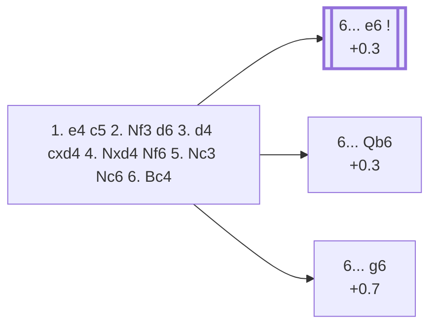

<a name="_TOP_"></a>

# B57 Sicilian Defense: Classical Variation, Sozin Attack <br> 1. e4 c5 2. Nf3 d6 3. d4 cxd4 4. Nxd4 Nf6 5. Nc3 Nc6 6. Bc4 #

Spun off from [`B56_Sicilian_Classical_Variation.md`](https://github.com/onclemarcel/chess_flashcards/blob/main/e4_openings/B56_Sicilian_Classical_Variation.md)'s own "6. Bc4" branch (19.1% of masters' replies at that fork) — the bishop aims straight at f7, the same idea as the Italian Game.

### Overview

*Quick map of every move covered on this card — see the [shape key](https://github.com/onclemarcel/chess_flashcards/blob/main/start.md#content-diagram-optional) in start.md.*

<!-- content-diagram:start -->

<!-- content-diagram:end -->

<a name="_initial_move_"></a>

[](https://lichess.org/analysis/standard/r1bqkb1r/pp2pppp/2np1n2/8/2BNP3/2N5/PPP2PPP/R1BQK2R_b_KQkq_-_4_6)

*... 6. Bc4 — Sozin Attack*

```
r1bqkb1r/pp2pppp/2np1n2/8/2BNP3/2N5/PPP2PPP/R1BQK2R b KQkq - 4 6
```

|  | +0.3 |
| --- | --- |

<!-- lichess-stats:start fen="r1bqkb1r/pp2pppp/2np1n2/8/2BNP3/2N5/PPP2PPP/R1BQK2R b KQkq - 4 6" db="lichess,masters" speeds="bullet,blitz" ratings="1800,2000,2200,2500" moves="6" -->
| Move | Online | W/D/B | Masters | W/D/B | |
| :--- | ---: | :--- | ---: | :--- | :-- |
| e6 | 273 k (34.8%) | ⬜⬜⬜⬜⬜⬛⬛⬛⬛⬛ 48/5/47 | 4.0 k (47.5%) | ⬜⬜⬜⬜🟫🟫🟫⬛⬛⬛ 34/32/34 |  |
| g6 | 180 k (22.9%) | ⬜⬜⬜⬜⬜⬛⬛⬛⬛⬛ 51/4/45 | 49 (0.6%) | ⬜⬜⬜⬜⬜🟫🟫🟫⬛⬛ 45/35/20 |  |
| Qb6 | 112 k (14.3%) | ⬜⬜⬜⬜⬜⬛⬛⬛⬛⬛ 45/5/50 | 3.3 k (39.2%) | ⬜⬜⬜🟫🟫🟫⬛⬛⬛⬛ 32/34/34 |  |
| e5 | 70 k (8.8%) | ⬜⬜⬜⬜⬜⬛⬛⬛⬛⬛ 47/5/48 | 190 (2.3%) | ⬜⬜⬜🟫🟫🟫🟫⬛⬛⬛ 27/38/34 |  |
| a6 | 57 k (7.2%) | ⬜⬜⬜⬜⬜🟫⬛⬛⬛⬛ 53/4/43 | 0 | — | ⚠ |
| Bd7 | 56 k (7.1%) | ⬜⬜⬜⬜⬜⬛⬛⬛⬛⬛ 47/5/48 | 776 (9.3%) | ⬜⬜⬜🟫🟫🟫🟫⬛⬛⬛ 29/38/32 |  |
| Na5 | 0 | — | 78 (0.9%) | ⬜⬜⬜🟫🟫🟫⬛⬛⬛⬛ 28/27/45 |  |

*Online: bullet/blitz, 1800+ — 786 k games. Masters: 8.4 k games. [Open in the explorer](https://lichess.org/analysis/standard/r1bqkb1r/pp2pppp/2np1n2/8/2BNP3/2N5/PPP2PPP/R1BQK2R_b_KQkq_-_4_6#explorer) — updated 2026-09-02*
<!-- lichess-stats:end -->

### Candidate moves

* [**6... e6**](#_e6_) (47.5% masters): the safe, solid main try — see below.
* [**6... Qb6**](#_Qb6_) (39.2% masters): the *Anti-Sozin Variation* (`eco.md`: "Benko Variation," a real name divergence) — see below.
* [**6... g6**](#_MagnusSmith_) (0.6% masters): walks into the *Magnus Smith Trap* — see below.

[*Back to TOP*](#_TOP_)

---

<a name="_e6_"></a>

### 6... e6 (+0.3)

Shielding f7 immediately and preparing quick development. Deeper Sozin theory (7. Bb3, the resulting kingside attacking chances) is its own extensive body of work, not covered further here.

[*Back to 6. Bc4*](#_initial_move_)
[*Back to TOP*](#_TOP_)

---

> [!NOTE]
> **6... Qb6**, the *Anti-Sozin Variation*, counterattacks the d4-knight and the b2-pawn immediately rather than shoring up f7 first — a real second choice, not a minor sideline.
>
> <a name="_Qb6_"></a>
>
> ### 6... Qb6 — Anti-Sozin Variation
>
> [](https://lichess.org/analysis/standard/r1b1kb1r/pp2pppp/1qnp1n2/8/2BNP3/2N5/PPP2PPP/R1BQK2R_w_KQkq_-_5_7)
>
> *... 6... Qb6 — Anti-Sozin Variation*
>
> ```
> r1b1kb1r/pp2pppp/1qnp1n2/8/2BNP3/2N5/PPP2PPP/R1BQK2R w KQkq - 5 7
> ```
>
> |  | +0.3 |
> | --- | --- |
>
> White usually replies **7. Nb3**, retreating the knight rather than defending b2, since **7. Nxc6? Qxc4** or similar tactics along the diagonal make a passive defence of b2 unattractive. Deeper theory not covered further here.
>
> [*Back to 6. Bc4*](#_initial_move_)
> [*Back to TOP*](#_TOP_)

---

<a name="_MagnusSmith_"></a>

> [!NOTE]
> **6... g6?!** walks straight into the *Magnus Smith Trap* — a real database rarity (0.6% masters), essentially a known error at club level.
>
> [](https://lichess.org/analysis/standard/r1bqkb1r/p3pp1p/2pp1np1/4P3/2B5/2N5/PPP2PPP/R1BQK2R_b_KQkq_-_0_8)
>
> *... 6... g6 7. Nxc6 bxc6 8. e5! — Magnus Smith Trap*
>
> ```
> r1bqkb1r/p3pp1p/2pp1np1/4P3/2B5/2N5/PPP2PPP/R1BQK2R b KQkq - 0 8
> ```
>
> |  | +0.7 |
> | --- | --- |
>
> **7. Nxc6 bxc6 8. e5!** hits the f6-knight and, after **8... dxe5**, the real point is **9. Bxf7+! Kxf7 10. Qxd8** — traced move-by-move rather than assumed: once the king is forced to recapture on f7, it can no longer castle and, critically, the d-file between the two queens is completely open with nothing defending d8 (the c8-bishop doesn't cover it, and the h8-rook is blocked by its own f8-bishop). White wins the queen for a bishop — a real, verified tactic, not an estimate.
>
> [*Back to 6. Bc4*](#_initial_move_)
> [*Back to TOP*](#_TOP_)
