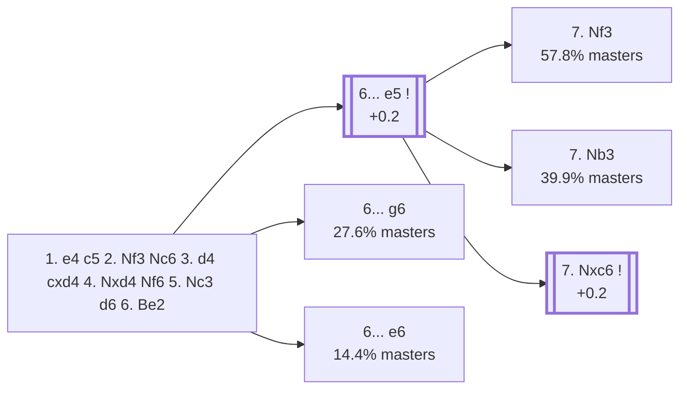

<a name="_TOP_"></a>

# B58 Sicilian Defense: Classical Variation <br> 1. e4 c5 2. Nf3 Nc6 3. d4 cxd4 4. Nxd4 Nf6 5. Nc3 d6 6. Be2 #

**A different move order from `B56_Sicilian_Classical_Variation.md`'s own Classical Variation** — here Black plays **2... Nc6** before ... d6, rather than the other way around. `eco.md` assigns this move order its own separate code even where the resulting tabiya transposes to a position also reachable via B56 (a genuine "same position, different code" case, matching the discipline this whole project applies: `eco.md`'s own per-move-order table is the authority on code boundaries, not just the final FEN). White develops quietly with **6. Be2** rather than pinning with Bg5 or aiming at f7 with Bc4.

### Overview

*Quick map of every move covered on this card — see the [shape key](https://github.com/onclemarcel/chess_flashcards/blob/main/start.md#content-diagram-optional) in start.md.*

<!-- content-diagram:start -->

<!-- content-diagram:end -->

<a name="_initial_move_"></a>

[](https://lichess.org/analysis/standard/r1bqkb1r/pp2pppp/2np1n2/8/3NP3/2N5/PPP1BPPP/R1BQK2R_b_KQkq_-_1_6)

*... 5. Nc3 d6 6. Be2*

```
r1bqkb1r/pp2pppp/2np1n2/8/3NP3/2N5/PPP1BPPP/R1BQK2R b KQkq - 1 6
```

|  | +0.2 |
| --- | --- |

<!-- lichess-stats:start fen="r1bqkb1r/pp2pppp/2np1n2/8/3NP3/2N5/PPP1BPPP/R1BQK2R b KQkq - 1 6" db="lichess,masters" speeds="bullet,blitz" ratings="1800,2000,2200,2500" moves="6" -->
| Move | Online | W/D/B | Masters | W/D/B | |
| :--- | ---: | :--- | ---: | :--- | :-- |
| e5 | 169 k (34.7%) | ⬜⬜⬜⬜🟫⬛⬛⬛⬛⬛ 44/6/49 | 2.5 k (55.5%) | ⬜⬜⬜🟫🟫🟫🟫⬛⬛⬛ 29/38/33 |  |
| g6 | 161 k (33.1%) | ⬜⬜⬜⬜⬜⬛⬛⬛⬛⬛ 49/6/46 | 1.3 k (27.6%) | ⬜⬜🟫🟫🟫🟫⬛⬛⬛⬛ 24/37/39 |  |
| e6 | 74 k (15.2%) | ⬜⬜⬜⬜⬜⬛⬛⬛⬛⬛ 49/5/46 | 657 (14.4%) | ⬜⬜⬜🟫🟫🟫🟫⬛⬛⬛ 31/39/30 |  |
| a6 | 38 k (7.9%) | ⬜⬜⬜⬜⬜🟫⬛⬛⬛⬛ 51/5/44 | 13 (0.3%) | — |  |
| Bd7 | 26 k (5.2%) | ⬜⬜⬜⬜⬜⬛⬛⬛⬛⬛ 50/5/45 | 16 (0.4%) | — |  |
| Nxd4 | 8.6 k (1.8%) | ⬜⬜⬜⬜⬜⬛⬛⬛⬛⬛ 46/6/48 | 74 (1.6%) | ⬜⬜🟫🟫🟫🟫🟫⬛⬛⬛ 23/47/30 |  |

*Online: bullet/blitz, 1800+ — 487 k games. Masters: 4.6 k games. [Open in the explorer](https://lichess.org/analysis/standard/r1bqkb1r/pp2pppp/2np1n2/8/3NP3/2N5/PPP1BPPP/R1BQK2R_b_KQkq_-_1_6#explorer) — updated 2026-09-02*
<!-- lichess-stats:end -->

### Candidate moves

* [**6... e5**](#_e5_) (55.5% masters): the *Boleslavsky Variation* — see below.
* **6... g6** (27.6% masters): fianchettoes instead, transposing toward Classical Dragon-adjacent structures — stays B58, no further named code, not built out further here.
* **6... e6** (14.4% masters): the flexible Scheveningen-style set-up — stays B58, no further named code, not built out further here.

[*Back to TOP*](#_TOP_)

---

<a name="_e5_"></a>

### 6... e5 — Boleslavsky Variation

[](https://lichess.org/analysis/standard/r1bqkb1r/pp3ppp/2np1n2/4p3/3NP3/2N5/PPP1BPPP/R1BQK2R_w_KQkq_e6_0_7)

*... 6... e5 — Boleslavsky Variation*

```
r1bqkb1r/pp3ppp/2np1n2/4p3/3NP3/2N5/PPP1BPPP/R1BQK2R w KQkq e6 0 7
```

|  | +0.2 |
| --- | --- |

<!-- lichess-stats:start fen="r1bqkb1r/pp3ppp/2np1n2/4p3/3NP3/2N5/PPP1BPPP/R1BQK2R w KQkq e6 0 7" db="lichess,masters" speeds="bullet,blitz" ratings="1800,2000,2200,2500" moves="6" -->
| Move | Online | W/D/B | Masters | W/D/B | |
| :--- | ---: | :--- | ---: | :--- | :-- |
| Nb3 | 100 k (59.2%) | ⬜⬜⬜⬜🟫⬛⬛⬛⬛⬛ 44/6/50 | 1.0 k (39.9%) | ⬜⬜🟫🟫🟫🟫⬛⬛⬛⬛ 21/36/43 |  |
| Nf3 | 26 k (15.2%) | ⬜⬜⬜⬜🟫⬛⬛⬛⬛⬛ 46/7/47 | 1.5 k (57.8%) | ⬜⬜⬜🟫🟫🟫🟫⬛⬛⬛ 35/39/26 |  |
| Ndb5 | 22 k (13.0%) | ⬜⬜⬜⬜⬜⬛⬛⬛⬛⬛ 46/5/50 | 7 (0.3%) | — |  |
| Nxc6 | 17 k (10.0%) | ⬜⬜⬜⬜🟫⬛⬛⬛⬛⬛ 43/6/51 | 47 (1.9%) | ⬜⬜🟫🟫🟫🟫⬛⬛⬛⬛ 15/45/40 |  |
| Nf5 | 3.3 k (1.9%) | ⬜⬜⬜⬜⬜⬛⬛⬛⬛⬛ 47/5/48 | 5 (0.2%) | — |  |
| Be3 | 601 (0.4%) | ⬜⬜🟫⬛⬛⬛⬛⬛⬛⬛ 24/4/72 | 0 | — | ⚠ |

*Online: bullet/blitz, 1800+ — 169 k games. Masters: 2.5 k games. [Open in the explorer](https://lichess.org/analysis/standard/r1bqkb1r/pp3ppp/2np1n2/4p3/3NP3/2N5/PPP1BPPP/R1BQK2R_w_KQkq_e6_0_7#explorer) — updated 2026-09-02*
<!-- lichess-stats:end -->

Black grabs the centre before White can consolidate, accepting a slightly weak d5-square in exchange for space and easy piece play — the same trade of structure for activity behind the Sveshnikov/Lasker-Pelikan family.

<a name="_Nf3_"></a>

**A genuine finding, worth stating plainly rather than assumed from `eco.md`'s own two named lines alone**: masters' actual top choice here is **7. Nf3** (57.8%), retreating the knight to keep it flexible — well ahead of *either* named B5x line: **7. Nb3** (39.9%, [→ B59](https://github.com/onclemarcel/chess_flashcards/blob/main/e4_openings/B59_Sicilian_Boleslavsky_Nb3.md)) and **7. Nxc6** (1.9%, the *Louma Variation* — see below). 7. Nf3 itself carries no further named code in this range.

[*Back to 6. Be2*](#_initial_move_)
[*Back to TOP*](#_TOP_)

---

<a name="_Louma_"></a>

> [!NOTE]
> **7. Nxc6**, the *Louma Variation*, trades off immediately rather than retreating — a real database minority (1.9% masters) next to 7. Nf3/7. Nb3.
>
> [](https://lichess.org/analysis/standard/r1bqkb1r/pp3ppp/2Np1n2/4p3/4P3/2N5/PPP1BPPP/R1BQK2R_b_KQkq_-_0_7)
>
> *... 7. Nxc6 — Louma Variation*
>
> ```
> r1bqkb1r/pp3ppp/2Np1n2/4p3/4P3/2N5/PPP1BPPP/R1BQK2R b KQkq - 0 7
> ```
>
> |  | +0.2 |
> | --- | --- |
>
> **7... bxc6** recaptures with the pawn, reaching a structure similar to several other Open Sicilian exchange lines. Deeper theory not covered further here.
>
> [*Back to 6... e5*](#_e5_)
> [*Back to TOP*](#_TOP_)
