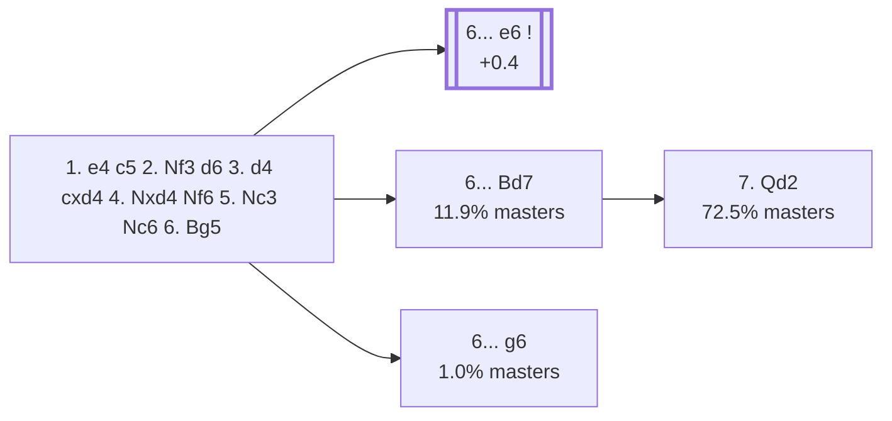

<a name="_TOP_"></a>

# B60 Sicilian Defense: Richter-Rauzer Variation <br> 1. e4 c5 2. Nf3 d6 3. d4 cxd4 4. Nxd4 Nf6 5. Nc3 Nc6 6. Bg5 #

Spun off from [`B56_Sicilian_Classical_Variation.md`](https://github.com/onclemarcel/chess_flashcards/blob/main/e4_openings/B56_Sicilian_Classical_Variation.md)'s own "6. Bg5" branch — masters' clear main try there (57.4%). One of the most heavily analysed systems in the entire Sicilian Defense: the bishop pins the f6-knight immediately, and the whole B60-B69 range is built around the resulting tension.

### Overview

*Quick map of every move covered on this card — see the [shape key](https://github.com/onclemarcel/chess_flashcards/blob/main/start.md#content-diagram-optional) in start.md.*

<!-- content-diagram:start -->

<!-- content-diagram:end -->

<a name="_initial_move_"></a>

[](https://lichess.org/analysis/standard/r1bqkb1r/pp2pppp/2np1n2/6B1/3NP3/2N5/PPP2PPP/R2QKB1R_b_KQkq_-_4_6)

*... 6. Bg5 — Richter-Rauzer Variation*

```
r1bqkb1r/pp2pppp/2np1n2/6B1/3NP3/2N5/PPP2PPP/R2QKB1R b KQkq - 4 6
```

|  | +0.3 |
| --- | --- |

<!-- lichess-stats:start fen="r1bqkb1r/pp2pppp/2np1n2/6B1/3NP3/2N5/PPP2PPP/R2QKB1R b KQkq - 4 6" db="lichess,masters" speeds="bullet,blitz" ratings="1800,2000,2200,2500" moves="6" -->
| Move | Online | W/D/B | Masters | W/D/B | |
| :--- | ---: | :--- | ---: | :--- | :-- |
| e6 | 551 k (58.2%) | ⬜⬜⬜⬜⬜⬛⬛⬛⬛⬛ 47/6/47 | 20 k (81.1%) | ⬜⬜⬜⬜🟫🟫🟫🟫⬛⬛ 36/38/26 |  |
| Bd7 | 99 k (10.5%) | ⬜⬜⬜⬜⬜⬛⬛⬛⬛⬛ 47/6/47 | 3.0 k (11.9%) | ⬜⬜⬜⬜🟫🟫🟫⬛⬛⬛ 38/36/26 |  |
| g6 | 81 k (8.6%) | ⬜⬜⬜⬜⬜⬛⬛⬛⬛⬛ 49/5/46 | 260 (1.0%) | ⬜⬜⬜⬜🟫🟫🟫🟫⬛⬛ 40/37/23 |  |
| e5 | 66 k (7.0%) | ⬜⬜⬜⬜⬜⬜⬛⬛⬛⬛ 54/4/41 | 0 | — | ⚠ |
| a6 | 33 k (3.5%) | ⬜⬜⬜⬜⬜🟫⬛⬛⬛⬛ 52/5/43 | 358 (1.4%) | ⬜⬜⬜⬜🟫🟫🟫🟫⬛⬛ 37/38/25 |  |
| h6 | 32 k (3.4%) | ⬜⬜⬜⬜⬜🟫⬛⬛⬛⬛ 54/4/42 | 0 | — | ⚠ |
| Qb6 | 0 | — | 913 (3.7%) | ⬜⬜⬜⬜🟫🟫🟫⬛⬛⬛ 35/34/31 |  |
| Qa5 | 0 | — | 131 (0.5%) | ⬜⬜⬜⬜🟫🟫⬛⬛⬛⬛ 40/23/37 |  |

*Online: bullet/blitz, 1800+ — 947 k games. Masters: 25 k games. [Open in the explorer](https://lichess.org/analysis/standard/r1bqkb1r/pp2pppp/2np1n2/6B1/3NP3/2N5/PPP2PPP/R2QKB1R_b_KQkq_-_4_6#explorer) — updated 2026-09-02*
<!-- lichess-stats:end -->

### Candidate moves

* [**6... e6**](https://github.com/onclemarcel/chess_flashcards/blob/main/e4_openings/B62_Sicilian_Richter_Rauzer_e6.md) (81.1% masters, +0.4): already live-tagged **B62** — see `B62_Sicilian_Richter_Rauzer_e6.md`, not built out further here.
* [**6... Bd7**](#_Bd7_) (11.9% masters): the *Modern Variation* (`eco.md`: "Larsen Variation") — stays B60. See below.
* [**6... g6**](#_g6_) (1.0% masters): the *Dragon Variation* (`eco.md`: "Bondarevsky Variation") — stays B60. See below.

[*Back to TOP*](#_TOP_)

---

<a name="_Bd7_"></a>

> [!NOTE]
> **6... Bd7** — the *Modern Variation* — develops the bishop before committing to ... e6, keeping the option of a later ... Rc8/... g6.
>
> [](https://lichess.org/analysis/standard/r2qkb1r/pp1bpppp/2np1n2/6B1/3NP3/2N5/PPP2PPP/R2QKB1R_w_KQkq_-_5_7)
>
> *... 6... Bd7 — Modern Variation*
>
> ```
> r2qkb1r/pp1bpppp/2np1n2/6B1/3NP3/2N5/PPP2PPP/R2QKB1R w KQkq - 5 7
> ```
>
> |  | +0.4 |
> | --- | --- |
>
> **7. Qd2** is masters' clear main try (72.5%), already live-tagged **B61** — see [`B61_Sicilian_Richter_Rauzer_Larsen.md`](https://github.com/onclemarcel/chess_flashcards/blob/main/e4_openings/B61_Sicilian_Richter_Rauzer_Larsen.md), not built out further here.
>
> [*Back to 6. Bg5*](#_initial_move_)
> [*Back to TOP*](#_TOP_)

---

<a name="_g6_"></a>

> [!NOTE]
> **6... g6** — the *Dragon Variation*, live-tagged for this exact leaf — fianchettoes at once instead, a real database rarity (1.0% masters) that walks into an immediate reckoning.
>
> [](https://lichess.org/analysis/standard/r1bqkb1r/pp2pp1p/2np1np1/6B1/3NP3/2N5/PPP2PPP/R2QKB1R_w_KQkq_-_0_7)
>
> *... 6... g6 — Dragon Variation*
>
> ```
> r1bqkb1r/pp2pp1p/2np1np1/6B1/3NP3/2N5/PPP2PPP/R2QKB1R w KQkq - 0 7
> ```
>
> |  | +0.5 |
> | --- | --- |
>
> **7. Bxf6** is masters' clear main try (75.0%) — grabbing the bishop pair immediately before Black can complete the fianchetto structure, since the pin is now moot. Deeper theory not covered further here.
>
> [*Back to 6. Bg5*](#_initial_move_)
> [*Back to TOP*](#_TOP_)
