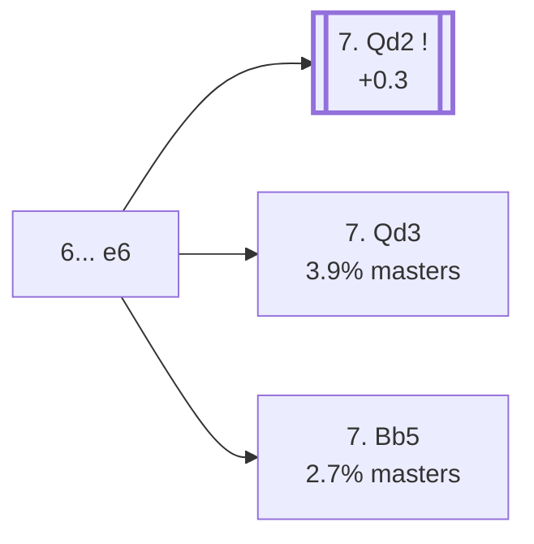

<a name="_TOP_"></a>

# B62 Sicilian Defense: Richter-Rauzer Variation <br> 1. e4 c5 2. Nf3 d6 3. d4 cxd4 4. Nxd4 Nf6 5. Nc3 Nc6 6. Bg5 e6 #

Spun off from [`B60_Sicilian_Richter_Rauzer.md`](https://github.com/onclemarcel/chess_flashcards/blob/main/e4_openings/B60_Sicilian_Richter_Rauzer.md)'s own candidate list — masters' overwhelming main reply there (81.1%), the real backbone of the whole Richter-Rauzer complex.

### Overview

*Quick map of every move covered on this card — see the [shape key](https://github.com/onclemarcel/chess_flashcards/blob/main/start.md#content-diagram-optional) in start.md.*

<!-- content-diagram:start -->

<!-- content-diagram:end -->

<a name="_initial_move_"></a>

[](https://lichess.org/analysis/standard/r1bqkb1r/pp3ppp/2nppn2/6B1/3NP3/2N5/PPP2PPP/R2QKB1R_w_KQkq_-_0_7)

*... 6... e6*

```
r1bqkb1r/pp3ppp/2nppn2/6B1/3NP3/2N5/PPP2PPP/R2QKB1R w KQkq - 0 7
```

|  | +0.4 |
| --- | --- |

<!-- lichess-stats:start fen="r1bqkb1r/pp3ppp/2nppn2/6B1/3NP3/2N5/PPP2PPP/R2QKB1R w KQkq - 0 7" db="lichess,masters" speeds="bullet,blitz" ratings="1800,2000,2200,2500" moves="6" -->
| Move | Online | W/D/B | Masters | W/D/B | |
| :--- | ---: | :--- | ---: | :--- | :-- |
| Qd2 | 322 k (57.1%) | ⬜⬜⬜⬜⬜🟫⬛⬛⬛⬛ 49/6/45 | 19 k (92.0%) | ⬜⬜⬜⬜🟫🟫🟫🟫⬛⬛ 36/39/25 |  |
| f4 | 81 k (14.3%) | ⬜⬜⬜⬜🟫⬛⬛⬛⬛⬛ 45/5/50 | 109 (0.5%) | ⬜⬜🟫🟫🟫🟫⬛⬛⬛⬛ 19/45/36 |  |
| Bb5 | 44 k (7.9%) | ⬜⬜⬜⬜⬜⬛⬛⬛⬛⬛ 46/5/49 | 555 (2.7%) | ⬜⬜⬜⬜🟫🟫🟫⬛⬛⬛ 35/32/33 |  |
| Be2 | 21 k (3.7%) | ⬜⬜⬜⬜🟫⬛⬛⬛⬛⬛ 44/5/51 | 75 (0.4%) | ⬜⬜🟫🟫🟫⬛⬛⬛⬛⬛ 19/35/47 |  |
| Nxc6 | 21 k (3.7%) | ⬜⬜⬜⬜🟫⬛⬛⬛⬛⬛ 43/5/51 | 0 | — | ⚠ |
| f3 | 20 k (3.6%) | ⬜⬜⬜⬜⬜⬛⬛⬛⬛⬛ 50/5/46 | 24 (0.1%) | ⬜⬜⬜🟫🟫🟫⬛⬛⬛⬛ 29/29/42 |  |
| Qd3 | 0 | — | 802 (3.9%) | ⬜⬜⬜⬜🟫🟫🟫⬛⬛⬛ 38/34/28 |  |

*Online: bullet/blitz, 1800+ — 564 k games. Masters: 20 k games. [Open in the explorer](https://lichess.org/analysis/standard/r1bqkb1r/pp3ppp/2nppn2/6B1/3NP3/2N5/PPP2PPP/R2QKB1R_w_KQkq_-_0_7#explorer) — updated 2026-09-02*
<!-- lichess-stats:end -->

**A genuine finding, worth stating plainly**: **7. Qd2** — the *Rauzer Attack* — is masters' overwhelming main try (92.0%), already live-tagged **B63**. Every other named line in `eco.md`'s own B62 entries is a real database rarity by comparison: **7. Qd3** (3.9%, the *Keres Variation*), **7. Bb5** (2.7%, the *Margate Variation*), **7. Nb3** (0.06%, the *Podebrady Variation* — `eco.md` spells it "Podvebrady," a transliteration divergence), and **7. Nxc6** (0.05%, live-tagged the *Exchange Variation*, `eco.md`: "Richter Attack," a real name divergence).

### Candidate moves

* [**7. Qd2**](https://github.com/onclemarcel/chess_flashcards/blob/main/e4_openings/B63_Sicilian_Richter_Rauzer_Traditional.md) (92.0% masters, +0.3): the *Rauzer Attack* — already live-tagged **B63**, see `B63_Sicilian_Richter_Rauzer_Traditional.md`, not built out further here.
* [**7. Qd3**](#_Keres_) (3.9% masters): the *Keres Variation* — stays B62. See below.
* [**7. Bb5**](#_Margate_) (2.7% masters): the *Margate Variation* — stays B62. See below.
* **7. Nb3** (0.06% masters): the *Podebrady Variation* — a genuine database curiosity, not built out further here.
* **7. Nxc6** (0.05% masters): live-tagged the *Exchange Variation* — a genuine database curiosity, not built out further here.

[*Back to TOP*](#_TOP_)

---

<a name="_Keres_"></a>

> [!NOTE]
> **7. Qd3** — the *Keres Variation* — develops the queen to d3 instead of d2, a rare (3.9% masters) alternative to the near-universal Rauzer Attack.
>
> [](https://lichess.org/analysis/standard/r1bqkb1r/pp3ppp/2nppn2/6B1/3NP3/2NQ4/PPP2PPP/R3KB1R_b_KQkq_-_1_7)
>
> *... 7. Qd3 — Keres Variation*
>
> ```
> r1bqkb1r/pp3ppp/2nppn2/6B1/3NP3/2NQ4/PPP2PPP/R3KB1R b KQkq - 1 7
> ```
>
> |  | +0.3 |
> | --- | --- |
>
> Deeper theory not covered further here.
>
> [*Back to 6... e6*](#_initial_move_)
> [*Back to TOP*](#_TOP_)

---

<a name="_Margate_"></a>

> [!NOTE]
> **7. Bb5** — the *Margate Variation* — pins the queenside knight from the other side rather than developing the queen, a genuine database rarity (2.7% masters, and no cached Stockfish evaluation exists for this specific position — stated honestly rather than guessed, per this repo's own standing rule).
>
> [](https://lichess.org/analysis/standard/r1bqkb1r/pp3ppp/2nppn2/1B6/3NP3/2N5/PPP2PPP/R2QKB1R_b_KQkq_-_1_7)
>
> *... 7. Bb5 — Margate Variation*
>
> ```
> r1bqkb1r/pp3ppp/2nppn2/1B6/3NP3/2N5/PPP2PPP/R2QKB1R b KQkq - 1 7
> ```
>
> Deeper theory not covered further here.
>
> [*Back to 6... e6*](#_initial_move_)
> [*Back to TOP*](#_TOP_)
