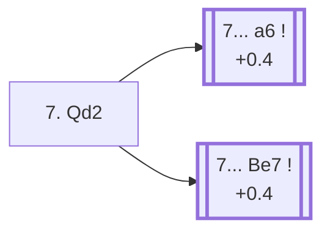

<a name="_TOP_"></a>

# B63 Sicilian Defense: Richter-Rauzer Variation, Traditional Variation <br> 1. e4 c5 2. Nf3 d6 3. d4 cxd4 4. Nxd4 Nf6 5. Nc3 Nc6 6. Bg5 e6 7. Qd2 #

Spun off from [`B62_Sicilian_Richter_Rauzer_e6.md`](https://github.com/onclemarcel/chess_flashcards/blob/main/e4_openings/B62_Sicilian_Richter_Rauzer_e6.md)'s own candidate list — masters' overwhelming main try there (92.0%). The *Rauzer Attack* itself — live-tagged the *Traditional Variation* at this exact root.

### Overview

*Quick map of every move covered on this card — see the [shape key](https://github.com/onclemarcel/chess_flashcards/blob/main/start.md#content-diagram-optional) in start.md.*

<!-- content-diagram:start -->

<!-- content-diagram:end -->

<a name="_initial_move_"></a>

[](https://lichess.org/analysis/standard/r1bqkb1r/pp3ppp/2nppn2/6B1/3NP3/2N5/PPPQ1PPP/R3KB1R_b_KQkq_-_1_7)

*... 7. Qd2 — Rauzer Attack*

```
r1bqkb1r/pp3ppp/2nppn2/6B1/3NP3/2N5/PPPQ1PPP/R3KB1R b KQkq - 1 7
```

|  | +0.3 |
| --- | --- |

<!-- lichess-stats:start fen="r1bqkb1r/pp3ppp/2nppn2/6B1/3NP3/2N5/PPPQ1PPP/R3KB1R b KQkq - 1 7" db="lichess,masters" speeds="bullet,blitz" ratings="1800,2000,2200,2500" moves="6" -->
| Move | Online | W/D/B | Masters | W/D/B | |
| :--- | ---: | :--- | ---: | :--- | :-- |
| a6 | 162 k (50.2%) | ⬜⬜⬜⬜🟫⬛⬛⬛⬛⬛ 46/6/47 | 13 k (70.3%) | ⬜⬜⬜🟫🟫🟫🟫⬛⬛⬛ 35/39/26 |  |
| Be7 | 137 k (42.4%) | ⬜⬜⬜⬜⬜🟫⬛⬛⬛⬛ 51/5/43 | 4.6 k (24.4%) | ⬜⬜⬜⬜🟫🟫🟫🟫⬛⬛ 38/39/23 |  |
| h6 | 8.4 k (2.6%) | ⬜⬜⬜⬜⬜⬛⬛⬛⬛⬛ 46/5/49 | 214 (1.1%) | ⬜⬜⬜⬜🟫🟫🟫⬛⬛⬛ 36/35/29 |  |
| Bd7 | 8.3 k (2.6%) | ⬜⬜⬜⬜⬜🟫⬛⬛⬛⬛ 54/5/41 | 30 (0.2%) | ⬜⬜⬜⬜⬜⬜🟫🟫⬛⬛ 60/20/20 |  |
| Qb6 | 4.4 k (1.4%) | ⬜⬜⬜⬜⬜⬛⬛⬛⬛⬛ 48/6/46 | 686 (3.7%) | ⬜⬜⬜⬜🟫🟫🟫🟫⬛⬛ 37/39/25 |  |
| Nxd4 | 1.8 k (0.6%) | ⬜⬜⬜⬜⬜🟫⬛⬛⬛⬛ 50/7/43 | 77 (0.4%) | ⬜⬜⬜⬜🟫🟫🟫🟫🟫⬛ 40/47/13 |  |

*Online: bullet/blitz, 1800+ — 322 k games. Masters: 19 k games. [Open in the explorer](https://lichess.org/analysis/standard/r1bqkb1r/pp3ppp/2nppn2/6B1/3NP3/2N5/PPPQ1PPP/R3KB1R_b_KQkq_-_1_7#explorer) — updated 2026-09-02*
<!-- lichess-stats:end -->

### Candidate moves

* [**7... a6**](https://github.com/onclemarcel/chess_flashcards/blob/main/e4_openings/B66_Sicilian_Richter_Rauzer_Neo_Modern.md) (70.3% masters, +0.4): the *Neo-Modern Variation* — already live-tagged **B66**, masters' actual most popular try. See `B66_Sicilian_Richter_Rauzer_Neo_Modern.md`, not built out further here.
* [**7... Be7**](#_Be7_) (24.4% masters): the *Classical Variation* — stays B63. See below.

[*Back to TOP*](#_TOP_)

---

<a name="_Be7_"></a>

### 7... Be7 — Classical Variation

[](https://lichess.org/analysis/standard/r1bqk2r/pp2bppp/2nppn2/6B1/3NP3/2N5/PPPQ1PPP/R3KB1R_w_KQkq_-_2_8)

*... 7... Be7 — Classical Variation*

```
r1bqk2r/pp2bppp/2nppn2/6B1/3NP3/2N5/PPPQ1PPP/R3KB1R w KQkq - 2 8
```

|  | +0.4 |
| --- | --- |

<!-- lichess-stats:start fen="r1bqk2r/pp2bppp/2nppn2/6B1/3NP3/2N5/PPPQ1PPP/R3KB1R w KQkq - 2 8" db="lichess,masters" speeds="bullet,blitz" ratings="1800,2000,2200,2500" moves="4" -->
| Move | Online | W/D/B | Masters | W/D/B | |
| :--- | ---: | :--- | ---: | :--- | :-- |
| O-O-O | 114 k (80.0%) | ⬜⬜⬜⬜⬜🟫⬛⬛⬛⬛ 52/5/43 | 4.5 k (98.1%) | ⬜⬜⬜⬜🟫🟫🟫🟫⬛⬛ 38/39/23 |  |
| f4 | 10 k (7.1%) | ⬜⬜⬜⬜⬜⬛⬛⬛⬛⬛ 48/5/47 | 20 (0.4%) | ⬜⬜⬜⬜🟫🟫🟫🟫⬛⬛ 35/40/25 |  |
| f3 | 9.6 k (6.7%) | ⬜⬜⬜⬜⬜🟫⬛⬛⬛⬛ 53/5/43 | 18 (0.4%) | — |  |
| h4 | 2.0 k (1.4%) | ⬜⬜⬜⬜⬜🟫⬛⬛⬛⬛ 52/5/43 | 0 | — | ⚠ |
| Nb3 | 0 | — | 22 (0.5%) | ⬜⬜⬜⬜🟫🟫🟫🟫⬛⬛ 41/36/23 |  |

*Online: bullet/blitz, 1800+ — 143 k games. Masters: 4.6 k games. [Open in the explorer](https://lichess.org/analysis/standard/r1bqk2r/pp2bppp/2nppn2/6B1/3NP3/2N5/PPPQ1PPP/R3KB1R_w_KQkq_-_2_8#explorer) — updated 2026-09-02*
<!-- lichess-stats:end -->

**8. O-O-O** is close to automatic (98.1% of masters games), castling long into the standard opposite-side-castling attacking race. Black usually replies **8... O-O**, and White's own 9th move — already live-tagged **B64** — is not covered further here.

[*Back to TOP*](#_TOP_)
