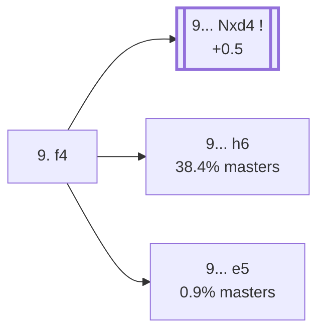

<a name="_TOP_"></a>

# B64 Sicilian Defense: Richter-Rauzer Variation, Classical Variation, 9. f4 <br> 1. e4 c5 2. Nf3 d6 3. d4 cxd4 4. Nxd4 Nf6 5. Nc3 Nc6 6. Bg5 e6 7. Qd2 Be7 8. O-O-O O-O 9. f4 #

Spun off from [`B63_Sicilian_Richter_Rauzer_Traditional.md`](https://github.com/onclemarcel/chess_flashcards/blob/main/e4_openings/B63_Sicilian_Richter_Rauzer_Traditional.md)'s own "7... Be7" branch — both sides castle (98.1% masters for 8. O-O-O, and 8... O-O follows naturally), and White pushes the kingside pawn storm forward immediately.

### Overview

*Quick map of every move covered on this card — see the [shape key](https://github.com/onclemarcel/chess_flashcards/blob/main/start.md#content-diagram-optional) in start.md.*

<!-- content-diagram:start -->

<!-- content-diagram:end -->

<a name="_initial_move_"></a>

[](https://lichess.org/analysis/standard/r1bq1rk1/pp2bppp/2nppn2/6B1/3NPP2/2N5/PPPQ2PP/2KR1B1R_b_-_f3_0_9)

*... 8. O-O-O O-O 9. f4*

```
r1bq1rk1/pp2bppp/2nppn2/6B1/3NPP2/2N5/PPPQ2PP/2KR1B1R b - f3 0 9
```

|  | +0.5 |
| --- | --- |

<!-- lichess-stats:start fen="r1bq1rk1/pp2bppp/2nppn2/6B1/3NPP2/2N5/PPPQ2PP/2KR1B1R b - f3 0 9" db="lichess,masters" speeds="bullet,blitz" ratings="1800,2000,2200,2500" moves="6" -->
| Move | Online | W/D/B | Masters | W/D/B | |
| :--- | ---: | :--- | ---: | :--- | :-- |
| Nxd4 | 12 k (36.6%) | ⬜⬜⬜⬜🟫⬛⬛⬛⬛⬛ 46/7/48 | 979 (56.6%) | ⬜⬜⬜🟫🟫🟫🟫🟫⬛⬛ 36/47/17 |  |
| a6 | 6.7 k (21.1%) | ⬜⬜⬜⬜⬜⬜⬛⬛⬛⬛ 55/4/41 | 19 (1.1%) | — |  |
| h6 | 6.0 k (18.8%) | ⬜⬜⬜⬜🟫⬛⬛⬛⬛⬛ 45/7/48 | 664 (38.4%) | ⬜⬜⬜⬜🟫🟫🟫🟫⬛⬛ 38/40/22 |  |
| d5 | 1.9 k (6.0%) | ⬜⬜⬜⬜🟫⬛⬛⬛⬛⬛ 45/5/49 | 29 (1.7%) | ⬜⬜⬜⬜🟫🟫🟫🟫⬛⬛ 38/41/21 |  |
| Bd7 | 1.7 k (5.4%) | ⬜⬜⬜⬜⬜🟫⬛⬛⬛⬛ 54/5/41 | 0 | — | ⚠ |
| Qa5 | 1.2 k (3.7%) | ⬜⬜⬜⬜⬜⬜⬛⬛⬛⬛ 57/4/39 | 7 (0.4%) | — |  |
| e5 | 0 | — | 16 (0.9%) | — |  |

*Online: bullet/blitz, 1800+ — 32 k games. Masters: 1.7 k games. [Open in the explorer](https://lichess.org/analysis/standard/r1bq1rk1/pp2bppp/2nppn2/6B1/3NPP2/2N5/PPPQ2PP/2KR1B1R_b_-_f3_0_9#explorer) — updated 2026-09-02*
<!-- lichess-stats:end -->

**A genuine finding, worth stating plainly rather than assumed from `eco.md`'s own two named lines alone**: masters' actual main try is **9... Nxd4** (56.6%, already live-tagged **B65**), well ahead of **9... h6** (38.4%, un-named at this leaf despite being a real second choice) and the *Geller Variation* (**9... e5**, only 0.9% masters — a real minority, not a main line, despite the fame of the name).

### Candidate moves

* [**9... Nxd4**](https://github.com/onclemarcel/chess_flashcards/blob/main/e4_openings/B65_Sicilian_Richter_Rauzer_Nxd4.md) (56.6% masters, +0.5): already live-tagged **B65**, see `B65_Sicilian_Richter_Rauzer_Nxd4.md`, not built out further here.
* **9... h6** (38.4% masters): kicks the bishop before deciding on a plan — stays B64, no further named code, not built out further here.
* [**9... e5**](#_Geller_) (0.9% masters): the *Geller Variation* — stays B64. See below.

[*Back to TOP*](#_TOP_)

---

<a name="_Geller_"></a>

> [!NOTE]
> **9... e5** — the *Geller Variation* — strikes back in the centre immediately rather than the more common piece trades, a real database rarity (0.9% masters) despite its well-known name.
>
> [](https://lichess.org/analysis/standard/r1bq1rk1/pp2bppp/2np1n2/4p1B1/3NPP2/2N5/PPPQ2PP/2KR1B1R_w_-_-_0_10)
>
> *... 9... e5 — Geller Variation*
>
> ```
> r1bq1rk1/pp2bppp/2np1n2/4p1B1/3NPP2/2N5/PPPQ2PP/2KR1B1R w - - 0 10
> ```
>
> |  | +0.7 |
> | --- | --- |
>
> **10. Nf5** is masters' most tested reply in this small sample, keeping the knight active on the kingside. Deeper theory not covered further here.
>
> [*Back to 9. f4*](#_initial_move_)
> [*Back to TOP*](#_TOP_)
