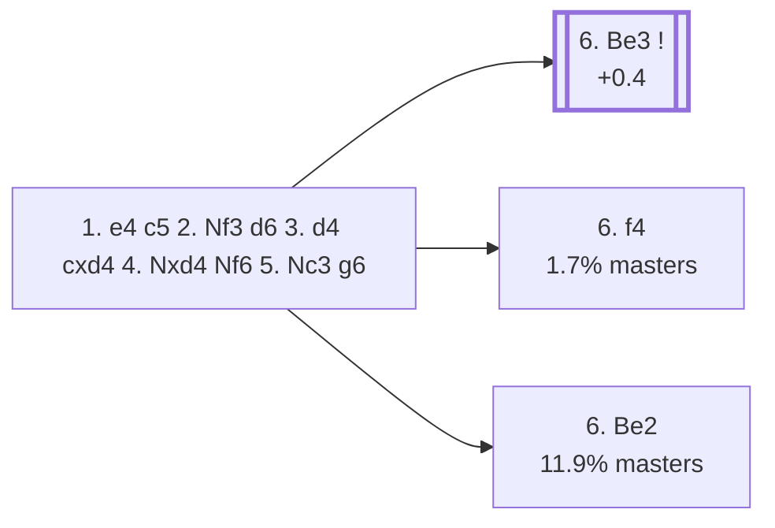

<a name="_TOP_"></a>

# B70 Sicilian Defense: Dragon Variation <br> 1. e4 c5 2. Nf3 d6 3. d4 cxd4 4. Nxd4 Nf6 5. Nc3 g6 #

Spun off from [`B56_Sicilian_Classical_Variation.md`](https://github.com/onclemarcel/chess_flashcards/blob/main/e4_openings/B56_Sicilian_Classical_Variation.md)'s own "5... g6" branch — masters' third most popular reply there (11.1%). Black fianchettoes the bishop toward the long diagonal, one of the sharpest and most heavily analysed systems in the whole Sicilian thanks to opposite-side castling races.

### Overview

*Quick map of every move covered on this card — see the [shape key](https://github.com/onclemarcel/chess_flashcards/blob/main/start.md#content-diagram-optional) in start.md.*

<!-- content-diagram:start -->

<!-- content-diagram:end -->

<a name="_initial_move_"></a>

[](https://lichess.org/analysis/standard/rnbqkb1r/pp2pp1p/3p1np1/8/3NP3/2N5/PPP2PPP/R1BQKB1R_w_KQkq_-_0_6)

*... 5... g6 — Dragon Variation*

```
rnbqkb1r/pp2pp1p/3p1np1/8/3NP3/2N5/PPP2PPP/R1BQKB1R w KQkq - 0 6
```

|  | +0.5 |
| --- | --- |

<!-- lichess-stats:start fen="rnbqkb1r/pp2pp1p/3p1np1/8/3NP3/2N5/PPP2PPP/R1BQKB1R w KQkq - 0 6" db="lichess,masters" speeds="bullet,blitz" ratings="1800,2000,2200,2500" moves="6" -->
| Move | Online | W/D/B | Masters | W/D/B | |
| :--- | ---: | :--- | ---: | :--- | :-- |
| Be3 | 2.5 M (42.8%) | ⬜⬜⬜⬜⬜⬛⬛⬛⬛⬛ 47/5/48 | 15 k (73.3%) | ⬜⬜⬜⬜🟫🟫🟫🟫⬛⬛ 41/38/21 |  |
| Bc4 | 708 k (11.9%) | ⬜⬜⬜⬜⬜⬛⬛⬛⬛⬛ 45/5/50 | 900 (4.5%) | ⬜⬜⬜⬜🟫🟫🟫⬛⬛⬛ 38/36/26 |  |
| Bg5 | 580 k (9.8%) | ⬜⬜⬜⬜🟫⬛⬛⬛⬛⬛ 42/4/53 | 0 | — | ⚠ |
| Be2 | 559 k (9.4%) | ⬜⬜⬜⬜⬜⬛⬛⬛⬛⬛ 47/6/47 | 2.4 k (11.9%) | ⬜⬜⬜🟫🟫🟫🟫⬛⬛⬛ 33/38/29 |  |
| f3 | 528 k (8.9%) | ⬜⬜⬜⬜⬜⬛⬛⬛⬛⬛ 47/5/48 | 352 (1.8%) | ⬜⬜⬜⬜🟫🟫🟫🟫⬛⬛ 35/42/23 |  |
| f4 | 290 k (4.9%) | ⬜⬜⬜⬜⬜⬜⬛⬛⬛⬛ 55/4/41 | 347 (1.7%) | ⬜⬜⬜🟫🟫🟫⬛⬛⬛⬛ 33/29/38 |  |
| g3 | 0 | — | 969 (4.9%) | ⬜⬜⬜⬜🟫🟫🟫🟫⬛⬛ 38/37/24 |  |

*Online: bullet/blitz, 1800+ — 5.9 M games. Masters: 20 k games. [Open in the explorer](https://lichess.org/analysis/standard/rnbqkb1r/pp2pp1p/3p1np1/8/3NP3/2N5/PPP2PPP/R1BQKB1R_w_KQkq_-_0_6#explorer) — updated 2026-09-02*
<!-- lichess-stats:end -->

### Candidate moves

* [**6. Be3**](https://github.com/onclemarcel/chess_flashcards/blob/main/e4_openings/B72_Sicilian_Dragon_Be3.md) (73.3% masters, +0.4): already live-tagged **B72** — see `B72_Sicilian_Dragon_Be3.md`, not built out further here.
* [**6. Be2**](#_Be2_) (11.9% masters): a quiet developing move — stays B70. See below.
* **6. g3** (4.9% masters): fianchettoes to match Black's own set-up — stays B70, not built out further here.
* **6. Bc4** (4.5% masters): aims at f7 immediately, echoing the Sozin idea — stays B70, not built out further here.
* [**6. f4**](https://github.com/onclemarcel/chess_flashcards/blob/main/e4_openings/B71_Sicilian_Dragon_Levenfish.md) (1.7% masters): the *Levenfish Variation* — already live-tagged **B71**, a real database minority despite the well-known name. See `B71_Sicilian_Dragon_Levenfish.md`, not built out further here.

[*Back to TOP*](#_TOP_)

---

<a name="_Be2_"></a>

> [!NOTE]
> **6. Be2** develops solidly without committing to either the Yugoslav Attack's pawn storm or the Classical set-up's own Be3/f3 build-up.
>
> Deeper theory not covered further here.
>
> [*Back to TOP*](#_TOP_)
