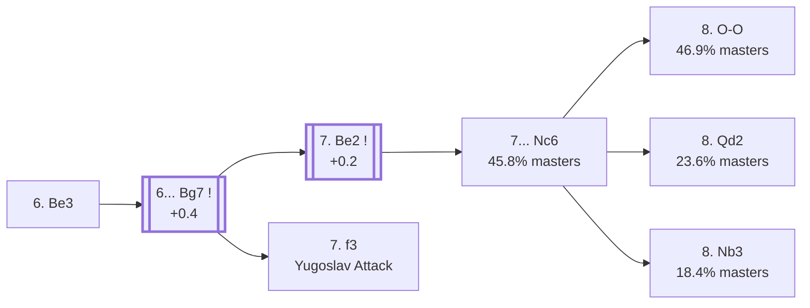

<a name="_TOP_"></a>

# B72 Sicilian Defense: Dragon Variation, Classical Variation <br> 1. e4 c5 2. Nf3 d6 3. d4 cxd4 4. Nxd4 Nf6 5. Nc3 g6 6. Be3 #

Spun off from [`B70_Sicilian_Dragon.md`](https://github.com/onclemarcel/chess_flashcards/blob/main/e4_openings/B70_Sicilian_Dragon.md)'s own candidate list — masters' overwhelming main try there (73.3%), the gateway to both the calm Classical set-up and the razor-sharp Yugoslav Attack.

### Overview

*Quick map of every move covered on this card — see the [shape key](https://github.com/onclemarcel/chess_flashcards/blob/main/start.md#content-diagram-optional) in start.md.*

<!-- content-diagram:start -->

<!-- content-diagram:end -->

<a name="_initial_move_"></a>

[](https://lichess.org/analysis/standard/rnbqkb1r/pp2pp1p/3p1np1/8/3NP3/2N1B3/PPP2PPP/R2QKB1R_b_KQkq_-_1_6)

*... 6. Be3*

```
rnbqkb1r/pp2pp1p/3p1np1/8/3NP3/2N1B3/PPP2PPP/R2QKB1R b KQkq - 1 6
```

|  | +0.4 |
| --- | --- |

<!-- lichess-stats:start fen="rnbqkb1r/pp2pp1p/3p1np1/8/3NP3/2N1B3/PPP2PPP/R2QKB1R b KQkq - 1 6" db="lichess,masters" speeds="bullet,blitz" ratings="1800,2000,2200,2500" moves="4" -->
| Move | Online | W/D/B | Masters | W/D/B | |
| :--- | ---: | :--- | ---: | :--- | :-- |
| Bg7 | 2.4 M (95.8%) | ⬜⬜⬜⬜⬜⬛⬛⬛⬛⬛ 47/5/48 | 14 k (95.6%) | ⬜⬜⬜⬜🟫🟫🟫🟫⬛⬛ 41/38/21 |  |
| Nc6 | 47 k (1.8%) | ⬜⬜⬜⬜🟫⬛⬛⬛⬛⬛ 46/6/48 | 322 (2.2%) | ⬜⬜⬜⬜🟫🟫🟫🟫⬛⬛ 36/40/24 |  |
| a6 | 41 k (1.6%) | ⬜⬜⬜⬜⬜⬛⬛⬛⬛⬛ 48/4/48 | 298 (2.0%) | ⬜⬜⬜⬜🟫🟫🟫⬛⬛⬛ 40/29/31 |  |
| Ng4 | 10 k (0.4%) | ⬜⬜⬜⬜⬜⬜⬛⬛⬛⬛ 56/3/41 | 4 (0.0%) | — | ⚠ |

*Online: bullet/blitz, 1800+ — 2.6 M games. Masters: 15 k games. [Open in the explorer](https://lichess.org/analysis/standard/rnbqkb1r/pp2pp1p/3p1np1/8/3NP3/2N1B3/PPP2PPP/R2QKB1R_b_KQkq_-_1_6#explorer) — updated 2026-09-02*
<!-- lichess-stats:end -->

**6... Bg7** is close to automatic (95.6% of masters games).

<a name="_Bg7_"></a>

[](https://lichess.org/analysis/standard/rnbqk2r/pp2ppbp/3p1np1/8/3NP3/2N1B3/PPP2PPP/R2QKB1R_w_KQkq_-_2_7)

*... 6... Bg7*

```
rnbqk2r/pp2ppbp/3p1np1/8/3NP3/2N1B3/PPP2PPP/R2QKB1R w KQkq - 2 7
```

|  | +0.4 |
| --- | --- |

### Candidate moves

* [**7. Be2**](#_Be2_) (+0.2): the *Classical Variation* — a genuine two-way fork with 7. f3 below, both real and heavily played. See below.
* [**7. f3**](https://github.com/onclemarcel/chess_flashcards/blob/main/e4_openings/B75_Sicilian_Dragon_Yugoslav.md): the *Yugoslav Attack* — already live-tagged **B75**, White's own opposite-side-castling pawn-storm answer. See `B75_Sicilian_Dragon_Yugoslav.md`, not built out further here.

[*Back to TOP*](#_TOP_)

---

<a name="_Be2_"></a>

### 7. Be2 — Classical Variation

[](https://lichess.org/analysis/standard/rnbqk2r/pp2ppbp/3p1np1/8/3NP3/2N1B3/PPP1BPPP/R2QK2R_b_KQkq_-_3_7)

*... 7. Be2 — Classical Variation*

```
rnbqk2r/pp2ppbp/3p1np1/8/3NP3/2N1B3/PPP1BPPP/R2QK2R b KQkq - 3 7
```

|  | +0.2 |
| --- | --- |

<!-- lichess-stats:start fen="rnbqk2r/pp2ppbp/3p1np1/8/3NP3/2N1B3/PPP1BPPP/R2QK2R b KQkq - 3 7" db="lichess,masters" speeds="bullet,blitz" ratings="1800,2000,2200,2500" moves="4" -->
| Move | Online | W/D/B | Masters | W/D/B | |
| :--- | ---: | :--- | ---: | :--- | :-- |
| O-O | 423 k (77.3%) | ⬜⬜⬜⬜⬜⬛⬛⬛⬛⬛ 47/6/47 | 420 (52.8%) | ⬜⬜⬜🟫🟫🟫🟫⬛⬛⬛ 31/39/30 |  |
| Nc6 | 88 k (16.1%) | ⬜⬜⬜⬜⬜⬛⬛⬛⬛⬛ 47/6/47 | 364 (45.8%) | ⬜⬜⬜🟫🟫🟫🟫⬛⬛⬛ 31/41/27 |  |
| a6 | 19 k (3.5%) | ⬜⬜⬜⬜⬜⬛⬛⬛⬛⬛ 49/5/47 | 7 (0.9%) | — |  |
| Bd7 | 5.2 k (1.0%) | ⬜⬜⬜⬜⬜⬛⬛⬛⬛⬛ 50/5/45 | 0 | — | ⚠ |
| Nbd7 | 0 | — | 4 (0.5%) | — |  |

*Online: bullet/blitz, 1800+ — 547 k games. Masters: 795 games. [Open in the explorer](https://lichess.org/analysis/standard/rnbqk2r/pp2ppbp/3p1np1/8/3NP3/2N1B3/PPP1BPPP/R2QK2R_b_KQkq_-_3_7#explorer) — updated 2026-09-02*
<!-- lichess-stats:end -->

**7... O-O** (52.8% masters) and **7... Nc6** (45.8%, see below) are both real, near-even tries — White's own 8th move fork looks essentially the same regardless of which order Black chooses.

[*Back to 6... Bg7*](#_Bg7_)
[*Back to TOP*](#_TOP_)

---

<a name="_Nc6_"></a>

### 7... Nc6

[](https://lichess.org/analysis/standard/r1bqk2r/pp2ppbp/2np1np1/8/3NP3/2N1B3/PPP1BPPP/R2QK2R_w_KQkq_-_4_8)

*... 7... Nc6*

```
r1bqk2r/pp2ppbp/2np1np1/8/3NP3/2N1B3/PPP1BPPP/R2QK2R w KQkq - 4 8
```

|  | +0.2 |
| --- | --- |

<!-- lichess-stats:start fen="r1bqk2r/pp2ppbp/2np1np1/8/3NP3/2N1B3/PPP1BPPP/R2QK2R w KQkq - 4 8" db="lichess,masters" speeds="bullet,blitz" ratings="1800,2000,2200,2500" moves="4" -->
| Move | Online | W/D/B | Masters | W/D/B | |
| :--- | ---: | :--- | ---: | :--- | :-- |
| O-O | 168 k (39.9%) | ⬜⬜⬜⬜⬜⬛⬛⬛⬛⬛ 48/6/46 | 447 (46.9%) | ⬜⬜🟫🟫🟫🟫⬛⬛⬛⬛ 21/43/36 |  |
| Qd2 | 112 k (26.7%) | ⬜⬜⬜⬜⬜🟫⬛⬛⬛⬛ 51/5/44 | 225 (23.6%) | ⬜⬜⬜⬜🟫🟫🟫🟫⬛⬛ 37/37/26 |  |
| f3 | 66 k (15.6%) | ⬜⬜⬜⬜⬜🟫⬛⬛⬛⬛ 51/5/44 | 0 | — | ⚠ |
| Nb3 | 16 k (3.8%) | ⬜⬜⬜⬜⬜🟫⬛⬛⬛⬛ 52/5/43 | 175 (18.4%) | ⬜⬜⬜⬜🟫🟫🟫⬛⬛⬛ 35/31/34 |  |
| h4 | 0 | — | 33 (3.5%) | ⬜⬜⬜🟫🟫🟫🟫⬛⬛⬛ 30/39/30 |  |

*Online: bullet/blitz, 1800+ — 420 k games. Masters: 953 games. [Open in the explorer](https://lichess.org/analysis/standard/r1bqk2r/pp2ppbp/2np1np1/8/3NP3/2N1B3/PPP1BPPP/R2QK2R_w_KQkq_-_4_8#explorer) — updated 2026-09-02*
<!-- lichess-stats:end -->

* **8. O-O** (46.9% masters): already live-tagged **B73** — see [`B73_Sicilian_Dragon_Classical_OO.md`](https://github.com/onclemarcel/chess_flashcards/blob/main/e4_openings/B73_Sicilian_Dragon_Classical_OO.md), not built out further here.
* [**8. Qd2**](#_Amsterdam_) (23.6% masters): the *Amsterdam Variation* — stays B72. See below.
* [**8. Nb3**](#_Nottingham_) (18.4% masters): the *Nottingham Variation* — stays B72. See below.

[*Back to 6... Bg7*](#_Bg7_)
[*Back to TOP*](#_TOP_)

---

<a name="_Amsterdam_"></a>

> [!NOTE]
> **8. Qd2** — the *Amsterdam Variation* — prepares long castling even without playing f3 first.
>
> [](https://lichess.org/analysis/standard/r1bqk2r/pp2ppbp/2np1np1/8/3NP3/2N1B3/PPPQBPPP/R3K2R_b_KQkq_-_5_8)
>
> *... 8. Qd2 — Amsterdam Variation*
>
> ```
> r1bqk2r/pp2ppbp/2np1np1/8/3NP3/2N1B3/PPPQBPPP/R3K2R b KQkq - 5 8
> ```
>
> |  | +0.2 |
> | --- | --- |
>
> **8... O-O** is masters' clear main try (75.6%). **9. O-O-O**, castling into the opposite-side race even without f3, is the *Grigoriev Variation*.
>
> <a name="_Grigoriev_"></a>
>
> [](https://lichess.org/analysis/standard/r1bq1rk1/pp2ppbp/2np1np1/8/3NP3/2N1B3/PPPQBPPP/2KR3R_b_-_-_7_9)
>
> *... 8... O-O 9. O-O-O — Grigoriev Variation*
>
> ```
> r1bq1rk1/pp2ppbp/2np1np1/8/3NP3/2N1B3/PPPQBPPP/2KR3R b - - 7 9
> ```
>
> |  | +0.1 |
> | --- | --- |
>
> Deeper theory not covered further here.
>
> [*Back to 7... Nc6*](#_Nc6_)
> [*Back to TOP*](#_TOP_)

---

<a name="_Nottingham_"></a>

> [!NOTE]
> **8. Nb3** — the *Nottingham Variation* — retreats the knight to a flexible square rather than committing to O-O or Qd2 first.
>
> [](https://lichess.org/analysis/standard/r1bqk2r/pp2ppbp/2np1np1/8/4P3/1NN1B3/PPP1BPPP/R2QK2R_b_KQkq_-_5_8)
>
> *... 8. Nb3 — Nottingham Variation*
>
> ```
> r1bqk2r/pp2ppbp/2np1np1/8/4P3/1NN1B3/PPP1BPPP/R2QK2R b KQkq - 5 8
> ```
>
> |  | -0.1 |
> | --- | --- |
>
> **8... O-O** is masters' overwhelming reply (84.3%). Deeper theory not covered further here.
>
> [*Back to 7... Nc6*](#_Nc6_)
> [*Back to TOP*](#_TOP_)
