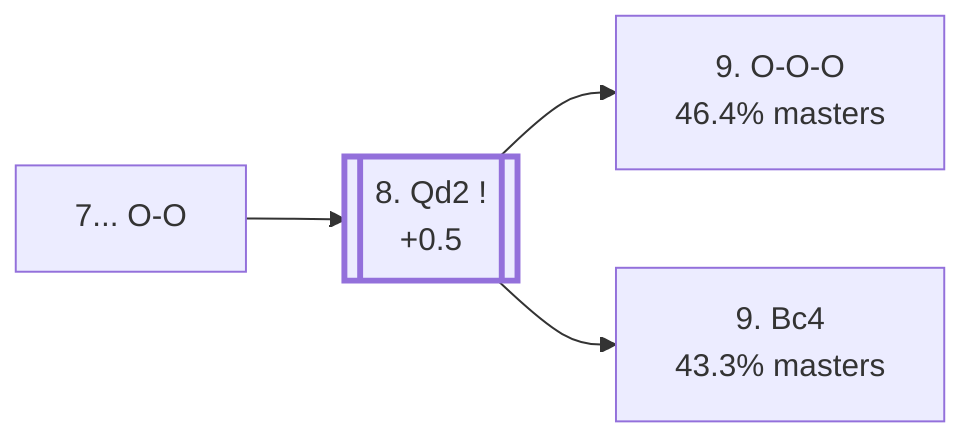

<a name="_TOP_"></a>

# B76 Sicilian Defense: Dragon Variation, Yugoslav Attack <br> 1. e4 c5 2. Nf3 d6 3. d4 cxd4 4. Nxd4 Nf6 5. Nc3 g6 6. Be3 Bg7 7. f3 O-O #

Spun off from [`B75_Sicilian_Dragon_Yugoslav.md`](https://github.com/onclemarcel/chess_flashcards/blob/main/e4_openings/B75_Sicilian_Dragon_Yugoslav.md)'s own candidate list — masters' clear main try there (57.4%).

### Overview

*Quick map of every move covered on this card — see the [shape key](https://github.com/onclemarcel/chess_flashcards/blob/main/start.md#content-diagram-optional) in start.md.*

<!-- content-diagram:start -->

<!-- content-diagram:end -->

<a name="_initial_move_"></a>

[](https://lichess.org/analysis/standard/rnbq1rk1/pp2ppbp/3p1np1/8/3NP3/2N1BP2/PPP3PP/R2QKB1R_w_KQ_-_1_8)

*... 7... O-O*

```
rnbq1rk1/pp2ppbp/3p1np1/8/3NP3/2N1BP2/PPP3PP/R2QKB1R w KQ - 1 8
```

|  | +0.5 |
| --- | --- |

<!-- lichess-stats:start fen="rnbq1rk1/pp2ppbp/3p1np1/8/3NP3/2N1BP2/PPP3PP/R2QKB1R w KQ - 1 8" db="lichess,masters" speeds="bullet,blitz" ratings="1800,2000,2200,2500" moves="4" -->
| Move | Online | W/D/B | Masters | W/D/B | |
| :--- | ---: | :--- | ---: | :--- | :-- |
| Qd2 | 1.4 M (81.3%) | ⬜⬜⬜⬜⬜⬛⬛⬛⬛⬛ 49/5/46 | 7.1 k (92.2%) | ⬜⬜⬜⬜🟫🟫🟫🟫⬛⬛ 41/40/19 |  |
| Bc4 | 243 k (14.2%) | ⬜⬜⬜⬜⬜⬛⬛⬛⬛⬛ 47/5/48 | 574 (7.4%) | ⬜⬜⬜⬜🟫🟫🟫⬛⬛⬛ 43/27/30 |  |
| g4 | 27 k (1.6%) | ⬜⬜⬜⬜⬜⬛⬛⬛⬛⬛ 49/5/46 | 27 (0.4%) | ⬜⬜⬜⬜⬜🟫🟫🟫⬛⬛ 44/33/22 |  |
| Be2 | 26 k (1.5%) | ⬜⬜⬜⬜🟫⬛⬛⬛⬛⬛ 43/6/51 | 0 | — | ⚠ |
| Qe2 | 0 | — | 2 (0.0%) | — |  |

*Online: bullet/blitz, 1800+ — 1.7 M games. Masters: 7.7 k games. [Open in the explorer](https://lichess.org/analysis/standard/rnbq1rk1/pp2ppbp/3p1np1/8/3NP3/2N1BP2/PPP3PP/R2QKB1R_w_KQ_-_1_8#explorer) — updated 2026-09-02*
<!-- lichess-stats:end -->

<a name="_Qd2_"></a>

**8. Qd2** is masters' overwhelming main try (92.2%), preparing long castling. **8... Nc6** follows almost automatically (99.2%), and White's own 9th move is a genuine near-coin-flip.

[](https://lichess.org/analysis/standard/r1bq1rk1/pp2ppbp/2np1np1/8/3NP3/2N1BP2/PPPQ2PP/R3KB1R_w_KQ_-_3_9)

*... 8. Qd2 Nc6*

```
r1bq1rk1/pp2ppbp/2np1np1/8/3NP3/2N1BP2/PPPQ2PP/R3KB1R w KQ - 3 9
```

|  | +0.5 |
| --- | --- |

### Candidate moves

* [**9. O-O-O**](#_Rauser_) (46.4% masters): live-tagged the *Modern Line* (`eco.md`: "Rauser Variation") — stays B76. See below.
* [**9. Bc4**](https://github.com/onclemarcel/chess_flashcards/blob/main/e4_openings/B77_Sicilian_Dragon_Yugoslav_Bc4.md) (43.3% masters): already live-tagged **B77**, the *Main Line* — see `B77_Sicilian_Dragon_Yugoslav_Bc4.md`, not built out further here.

[*Back to TOP*](#_TOP_)

---

<a name="_Rauser_"></a>

> [!NOTE]
> **9. O-O-O** — live-tagged the *Modern Line* — completes the race to opposite-side castling before committing the bishop to c4 or e2.
>
> [](https://lichess.org/analysis/standard/r1bq1rk1/pp2ppbp/2np1np1/8/3NP3/2N1BP2/PPPQ2PP/2KR1B1R_b_-_-_4_9)
>
> *... 9. O-O-O — Modern Line*
>
> ```
> r1bq1rk1/pp2ppbp/2np1np1/8/3NP3/2N1BP2/PPPQ2PP/2KR1B1R b - - 4 9
> ```
>
> |  | +0.5 |
> | --- | --- |
>
> **9... d5** is masters' clear main try (73.2%), striking in the centre before White's own kingside pawns can advance — the classic Dragon counterpunch. Deeper theory not covered further here.
>
> [*Back to 8. Qd2 Nc6*](#_Qd2_)
> [*Back to TOP*](#_TOP_)
