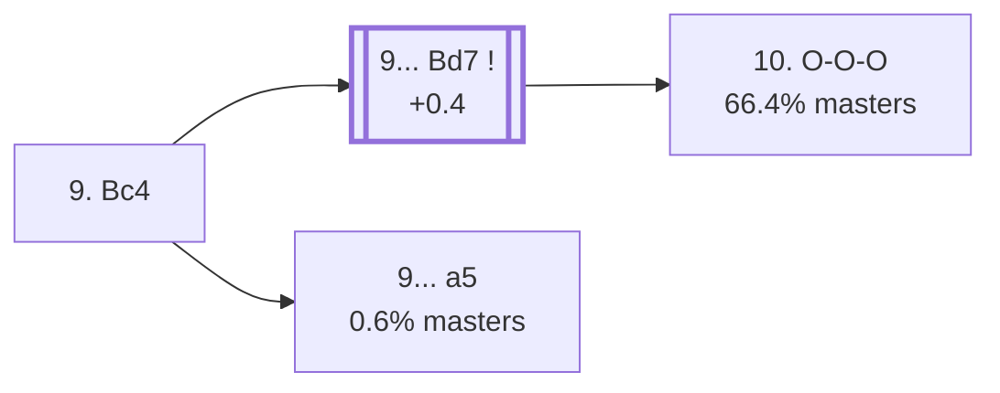

<a name="_TOP_"></a>

# B77 Sicilian Defense: Dragon Variation, Yugoslav Attack, Main Line <br> 1. e4 c5 2. Nf3 d6 3. d4 cxd4 4. Nxd4 Nf6 5. Nc3 g6 6. Be3 Bg7 7. f3 O-O 8. Qd2 Nc6 9. Bc4 #

Spun off from [`B76_Sicilian_Dragon_Yugoslav_OO.md`](https://github.com/onclemarcel/chess_flashcards/blob/main/e4_openings/B76_Sicilian_Dragon_Yugoslav_OO.md)'s own 9th-move fork — a genuine near-coin-flip there (43.3% masters). Live-tagged the *Main Line* both here and one ply deeper, after 9... Bd7.

### Overview

*Quick map of every move covered on this card — see the [shape key](https://github.com/onclemarcel/chess_flashcards/blob/main/start.md#content-diagram-optional) in start.md.*

<!-- content-diagram:start -->

<!-- content-diagram:end -->

<a name="_initial_move_"></a>

[](https://lichess.org/analysis/standard/r1bq1rk1/pp2ppbp/2np1np1/8/2BNP3/2N1BP2/PPPQ2PP/R3K2R_b_KQ_-_4_9)

*... 9. Bc4 — Main Line*

```
r1bq1rk1/pp2ppbp/2np1np1/8/2BNP3/2N1BP2/PPPQ2PP/R3K2R b KQ - 4 9
```

|  | +0.3 |
| --- | --- |

<!-- lichess-stats:start fen="r1bq1rk1/pp2ppbp/2np1np1/8/2BNP3/2N1BP2/PPPQ2PP/R3K2R b KQ - 4 9" db="lichess,masters" speeds="bullet,blitz" ratings="1800,2000,2200,2500" moves="4" -->
| Move | Online | W/D/B | Masters | W/D/B | |
| :--- | ---: | :--- | ---: | :--- | :-- |
| Bd7 | 635 k (60.7%) | ⬜⬜⬜⬜⬜⬛⬛⬛⬛⬛ 47/5/48 | 5.3 k (88.5%) | ⬜⬜⬜⬜🟫🟫🟫🟫⬛⬛ 41/35/24 |  |
| a6 | 107 k (10.2%) | ⬜⬜⬜⬜⬜⬜⬛⬛⬛⬛ 61/4/35 | 0 | — | ⚠ |
| Nxd4 | 99 k (9.4%) | ⬜⬜⬜⬜⬜🟫⬛⬛⬛⬛ 50/7/43 | 222 (3.7%) | ⬜⬜⬜🟫🟫🟫🟫🟫⬛⬛ 32/53/15 |  |
| Ne5 | 67 k (6.4%) | ⬜⬜⬜⬜⬜🟫⬛⬛⬛⬛ 53/4/43 | 0 | — | ⚠ |
| Nd7 | 0 | — | 257 (4.3%) | ⬜⬜⬜⬜⬜🟫🟫🟫⬛⬛ 50/28/22 |  |
| Qa5 | 0 | — | 66 (1.1%) | ⬜⬜⬜⬜🟫🟫🟫🟫⬛⬛ 42/39/18 |  |

*Online: bullet/blitz, 1800+ — 1.0 M games. Masters: 6.0 k games. [Open in the explorer](https://lichess.org/analysis/standard/r1bq1rk1/pp2ppbp/2np1np1/8/2BNP3/2N1BP2/PPPQ2PP/R3K2R_b_KQ_-_4_9#explorer) — updated 2026-09-02*
<!-- lichess-stats:end -->

### Candidate moves

* [**9... Bd7**](#_Bd7_) (88.5% masters): stays B77, the *Main Line* itself. See below.
* [**9... a5**](#_Byrne_) (0.6% masters): the *Byrne Variation* — a real database rarity. See below.

[*Back to TOP*](#_TOP_)

---

<a name="_Bd7_"></a>

### 9... Bd7 — Main Line

[](https://lichess.org/analysis/standard/r2q1rk1/pp1bppbp/2np1np1/8/2BNP3/2N1BP2/PPPQ2PP/R3K2R_w_KQ_-_5_10)

*... 9... Bd7 — Main Line*

```
r2q1rk1/pp1bppbp/2np1np1/8/2BNP3/2N1BP2/PPPQ2PP/R3K2R w KQ - 5 10
```

|  | +0.4 |
| --- | --- |

<!-- lichess-stats:start fen="r2q1rk1/pp1bppbp/2np1np1/8/2BNP3/2N1BP2/PPPQ2PP/R3K2R w KQ - 5 10" db="lichess,masters" speeds="bullet,blitz" ratings="1800,2000,2200,2500" moves="4" -->
| Move | Online | W/D/B | Masters | W/D/B | |
| :--- | ---: | :--- | ---: | :--- | :-- |
| O-O-O | 451 k (66.2%) | ⬜⬜⬜⬜⬜⬛⬛⬛⬛⬛ 47/5/49 | 3.6 k (66.4%) | ⬜⬜⬜⬜🟫🟫🟫🟫⬛⬛ 40/37/23 |  |
| Bb3 | 101 k (14.9%) | ⬜⬜⬜⬜⬜⬛⬛⬛⬛⬛ 48/5/46 | 563 (10.4%) | ⬜⬜⬜⬜🟫🟫🟫🟫⬛⬛ 39/36/25 |  |
| h4 | 79 k (11.6%) | ⬜⬜⬜⬜⬜🟫⬛⬛⬛⬛ 51/5/44 | 1.2 k (21.9%) | ⬜⬜⬜⬜🟫🟫🟫⬛⬛⬛ 44/29/27 |  |
| g4 | 27 k (3.9%) | ⬜⬜⬜⬜⬜⬛⬛⬛⬛⬛ 46/4/50 | 35 (0.6%) | ⬜⬜⬜⬜⬜⬜🟫🟫⬛⬛ 57/26/17 |  |

*Online: bullet/blitz, 1800+ — 681 k games. Masters: 5.4 k games. [Open in the explorer](https://lichess.org/analysis/standard/r2q1rk1/pp1bppbp/2np1np1/8/2BNP3/2N1BP2/PPPQ2PP/R3K2R_w_KQ_-_5_10#explorer) — updated 2026-09-02*
<!-- lichess-stats:end -->

**10. O-O-O** is masters' clear main try (66.4%), already live-tagged **B78** — see [`B78_Sicilian_Dragon_Yugoslav_OOO.md`](https://github.com/onclemarcel/chess_flashcards/blob/main/e4_openings/B78_Sicilian_Dragon_Yugoslav_OOO.md), not built out further here. **10. h4** (21.9%) is a real second choice, launching the pawn storm even before castling.

[*Back to 9. Bc4*](#_initial_move_)
[*Back to TOP*](#_TOP_)

---

<a name="_Byrne_"></a>

> [!NOTE]
> **9... a5** — the *Byrne Variation* — grabs queenside space immediately instead of developing the bishop, a genuine database rarity (only 37 masters games).
>
> [](https://lichess.org/analysis/standard/r1bq1rk1/1p2ppbp/2np1np1/p7/2BNP3/2N1BP2/PPPQ2PP/R3K2R_w_KQ_a6_0_10)
>
> *... 9... a5 — Byrne Variation*
>
> ```
> r1bq1rk1/1p2ppbp/2np1np1/p7/2BNP3/2N1BP2/PPPQ2PP/R3K2R w KQ a6 0 10
> ```
>
> |  | +1.0 |
> | --- | --- |
>
> Objectively a real practical risk for Black (Stockfish already prefers White by a full pawn) — White's own best reply is a genuine spread (10. a4 45.9% / 10. Bb3 16.2% / 10. O-O-O 13.5%). Deeper theory not covered further here.
>
> [*Back to 9. Bc4*](#_initial_move_)
> [*Back to TOP*](#_TOP_)
