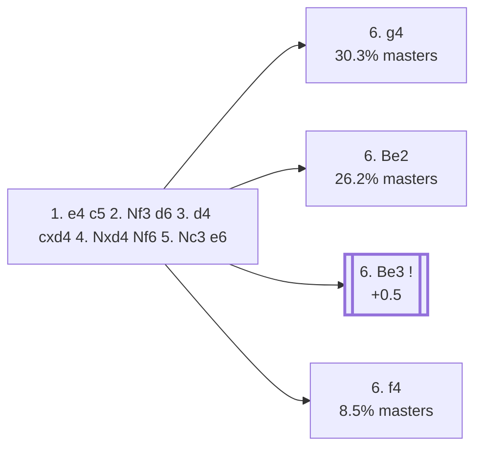

<a name="_TOP_"></a>

# B80 Sicilian Defense: Scheveningen Variation <br> 1. e4 c5 2. Nf3 d6 3. d4 cxd4 4. Nxd4 Nf6 5. Nc3 e6 #

Spun off from [`B56_Sicilian_Classical_Variation.md`](https://github.com/onclemarcel/chess_flashcards/blob/main/e4_openings/B56_Sicilian_Classical_Variation.md)'s own "5... e6" branch — masters' least popular of the four main tries there (3.0%), but flexible and solid, keeping options open between a Najdorf- and Taimanov-style set-up.

### Overview

*Quick map of every move covered on this card — see the [shape key](https://github.com/onclemarcel/chess_flashcards/blob/main/start.md#content-diagram-optional) in start.md.*

<!-- content-diagram:start -->

<!-- content-diagram:end -->

<a name="_initial_move_"></a>

[](https://lichess.org/analysis/standard/rnbqkb1r/pp3ppp/3ppn2/8/3NP3/2N5/PPP2PPP/R1BQKB1R_w_KQkq_-_0_6)

*... 5... e6 — Scheveningen Variation*

```
rnbqkb1r/pp3ppp/3ppn2/8/3NP3/2N5/PPP2PPP/R1BQKB1R w KQkq - 0 6
```

|  | +0.5 |
| --- | --- |

<!-- lichess-stats:start fen="rnbqkb1r/pp3ppp/3ppn2/8/3NP3/2N5/PPP2PPP/R1BQKB1R w KQkq - 0 6" db="lichess,masters" speeds="bullet,blitz" ratings="1800,2000,2200,2500" moves="6" -->
| Move | Online | W/D/B | Masters | W/D/B | |
| :--- | ---: | :--- | ---: | :--- | :-- |
| Be3 | 393 k (22.3%) | ⬜⬜⬜⬜⬜⬛⬛⬛⬛⬛ 49/4/46 | 2.8 k (18.3%) | ⬜⬜⬜⬜🟫🟫🟫⬛⬛⬛ 40/32/29 |  |
| Bg5 | 351 k (19.9%) | ⬜⬜⬜⬜⬜⬛⬛⬛⬛⬛ 46/4/50 | 0 | — | ⚠ |
| Be2 | 201 k (11.4%) | ⬜⬜⬜⬜⬜⬛⬛⬛⬛⬛ 48/5/48 | 4.0 k (26.2%) | ⬜⬜⬜🟫🟫🟫🟫⬛⬛⬛ 31/40/30 |  |
| g4 | 155 k (8.8%) | ⬜⬜⬜⬜⬜🟫⬛⬛⬛⬛ 54/5/42 | 4.6 k (30.3%) | ⬜⬜⬜⬜🟫🟫🟫🟫⬛⬛ 43/34/23 |  |
| Bc4 | 154 k (8.7%) | ⬜⬜⬜⬜⬜⬛⬛⬛⬛⬛ 49/4/47 | 919 (6.1%) | ⬜⬜⬜🟫🟫🟫⬛⬛⬛⬛ 34/31/35 |  |
| Bd3 | 144 k (8.2%) | ⬜⬜⬜⬜⬜⬛⬛⬛⬛⬛ 45/4/51 | 0 | — | ⚠ |
| f4 | 0 | — | 1.3 k (8.5%) | ⬜⬜⬜⬜🟫🟫🟫🟫⬛⬛ 39/36/25 |  |
| g3 | 0 | — | 991 (6.6%) | ⬜⬜⬜🟫🟫🟫🟫⬛⬛⬛ 32/39/28 |  |

*Online: bullet/blitz, 1800+ — 1.8 M games. Masters: 15 k games. [Open in the explorer](https://lichess.org/analysis/standard/rnbqkb1r/pp3ppp/3ppn2/8/3NP3/2N5/PPP2PPP/R1BQKB1R_w_KQkq_-_0_6#explorer) — updated 2026-09-02*
<!-- lichess-stats:end -->

> [!NOTE]
> Masters' actual main try, **6. g4** (30.3%), the *Keres Attack*, is a real surprise — a sharp, immediate kingside pawn thrust rather than the quieter developing moves (**6. Be2** 26.2%, **6. Be3** 18.3%) that dominate online play. It's a genuine reminder that the flexible-looking Scheveningen invites some of the sharpest White tries in the whole Sicilian, not just quiet positional play.

### Candidate moves

* [**6. g4**](https://github.com/onclemarcel/chess_flashcards/blob/main/e4_openings/B81_Sicilian_Scheveningen_Keres.md) (30.3% masters): the *Keres Attack* — already live-tagged **B81**, see `B81_Sicilian_Scheveningen_Keres.md`, not built out further here.
* [**6. Be2**](https://github.com/onclemarcel/chess_flashcards/blob/main/e4_openings/B83_Sicilian_Scheveningen_Be2.md) (26.2% masters): already live-tagged **B83** — see `B83_Sicilian_Scheveningen_Be2.md`, not built out further here.
* [**6. Be3**](#_Be3_) (18.3% masters, +0.5): the *English Attack* — stays genuinely B80. See below.
* [**6. f4**](https://github.com/onclemarcel/chess_flashcards/blob/main/e4_openings/B82_Sicilian_Scheveningen_f4.md) (8.5% masters): live-tagged the *Matanovic Attack* — already live-tagged **B82**, see `B82_Sicilian_Scheveningen_f4.md`, not built out further here.
* **6. g3** (6.6% masters): the *Fianchetto Variation* — stays B80, not built out further here.
* **6. Bc4** (6.1% masters): stays B80, not built out further here.
* **6. Bb5** (a real database rarity): the *Vitolins Variation* — stays B80, not built out further here.

[*Back to TOP*](#_TOP_)

---

<a name="_Be3_"></a>

> [!NOTE]
> **6. Be3** — the *English Attack* — heads for the same aggressive f3/Qd2/O-O-O plan seen against the Najdorf, but unlike there, this whole line stays B80 all the way through (`eco.md`'s own entry gives it a full named continuation, "English Variation," without a further code split).
>
> [](https://lichess.org/analysis/standard/rnbqkb1r/pp3ppp/3ppn2/8/3NP3/2N1B3/PPP2PPP/R2QKB1R_b_KQkq_-_1_6)
>
> *... 6. Be3 — English Attack*
>
> ```
> rnbqkb1r/pp3ppp/3ppn2/8/3NP3/2N1B3/PPP2PPP/R2QKB1R b KQkq - 1 6
> ```
>
> **6... a6 7. Qd2** reaches the "English Attack, with Qd2" tabiya, live-confirmed still B80.
>
> [](https://lichess.org/analysis/standard/rnbqkb1r/1p3ppp/p2ppn2/8/3NP3/2N1B3/PPPQ1PPP/R3KB1R_b_KQkq_-_1_7)
>
> *... 6... a6 7. Qd2 — English Variation*
>
> ```
> rnbqkb1r/1p3ppp/p2ppn2/8/3NP3/2N1B3/PPPQ1PPP/R3KB1R b KQkq - 1 7
> ```
>
> |  | +0.3 |
> | --- | --- |
>
> **7... b5** is masters' clear main try (69.2%), grabbing queenside space immediately. Deeper theory not covered further here.
>
> [*Back to TOP*](#_TOP_)
