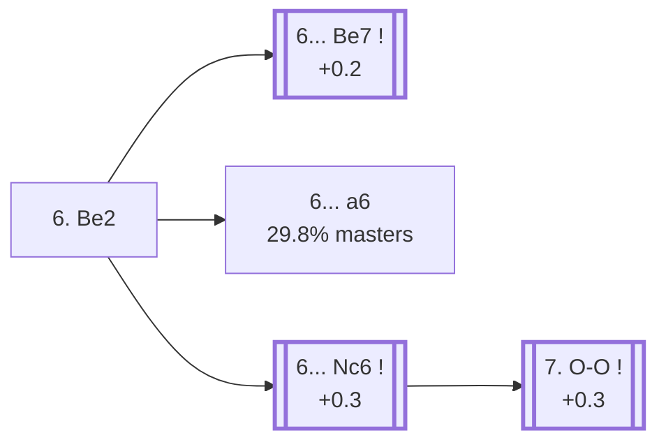

<a name="_TOP_"></a>

# B83 Sicilian Defense: Scheveningen Variation, Classical Variation <br> 1. e4 c5 2. Nf3 d6 3. d4 cxd4 4. Nxd4 Nf6 5. Nc3 e6 6. Be2 #

Spun off from [`B80_Sicilian_Scheveningen.md`](https://github.com/onclemarcel/chess_flashcards/blob/main/e4_openings/B80_Sicilian_Scheveningen.md)'s own candidate list — masters' actual second-most-popular try there (26.2%, despite trailing online play).

### Overview

*Quick map of every move covered on this card — see the [shape key](https://github.com/onclemarcel/chess_flashcards/blob/main/start.md#content-diagram-optional) in start.md.*

<!-- content-diagram:start -->

<!-- content-diagram:end -->

<a name="_initial_move_"></a>

[](https://lichess.org/analysis/standard/rnbqkb1r/pp3ppp/3ppn2/8/3NP3/2N5/PPP1BPPP/R1BQK2R_b_KQkq_-_1_6)

*... 6. Be2 — Classical Variation*

```
rnbqkb1r/pp3ppp/3ppn2/8/3NP3/2N5/PPP1BPPP/R1BQK2R b KQkq - 1 6
```

|  | +0.2 |
| --- | --- |

<!-- lichess-stats:start fen="rnbqkb1r/pp3ppp/3ppn2/8/3NP3/2N5/PPP1BPPP/R1BQK2R b KQkq - 1 6" db="lichess,masters" speeds="bullet,blitz" ratings="1800,2000,2200,2500" moves="4" -->
| Move | Online | W/D/B | Masters | W/D/B | |
| :--- | ---: | :--- | ---: | :--- | :-- |
| Be7 | 116 k (55.7%) | ⬜⬜⬜⬜⬜⬛⬛⬛⬛⬛ 48/5/47 | 2.4 k (61.0%) | ⬜⬜⬜🟫🟫🟫🟫⬛⬛⬛ 30/41/29 |  |
| a6 | 75 k (35.8%) | ⬜⬜⬜⬜⬜⬛⬛⬛⬛⬛ 46/5/49 | 1.2 k (29.8%) | ⬜⬜⬜🟫🟫🟫🟫⬛⬛⬛ 32/35/33 |  |
| Nc6 | 14 k (6.7%) | ⬜⬜⬜⬜⬜🟫⬛⬛⬛⬛ 49/6/45 | 349 (8.8%) | ⬜⬜⬜🟫🟫🟫🟫⬛⬛⬛ 30/43/27 |  |
| Nbd7 | 1.7 k (0.8%) | ⬜⬜⬜⬜⬜⬛⬛⬛⬛⬛ 47/5/48 | 0 | — | ⚠ |
| e5 | 0 | — | 9 (0.2%) | — |  |

*Online: bullet/blitz, 1800+ — 209 k games. Masters: 4.0 k games. [Open in the explorer](https://lichess.org/analysis/standard/rnbqkb1r/pp3ppp/3ppn2/8/3NP3/2N5/PPP1BPPP/R1BQK2R_b_KQkq_-_1_6#explorer) — updated 2026-09-02*
<!-- lichess-stats:end -->

### Candidate moves

* **6... Be7** (61.0% masters, +0.2): stays B83, the Classical set-up itself — deeper theory not covered further here.
* [**6... a6**](https://github.com/onclemarcel/chess_flashcards/blob/main/e4_openings/B84_Sicilian_Scheveningen_Classical_a6.md) (29.8% masters): already live-tagged **B84** — see `B84_Sicilian_Scheveningen_Classical_a6.md`, not built out further here.
* [**6... Nc6**](#_Nc6_) (8.8% masters, +0.3): live-tagged the *Modern Variation* — stays B83. See below.

[*Back to TOP*](#_TOP_)

---

<a name="_Nc6_"></a>

### 6... Nc6 — Modern Variation

[](https://lichess.org/analysis/standard/r1bqkb1r/pp3ppp/2nppn2/8/3NP3/2N5/PPP1BPPP/R1BQK2R_w_KQkq_-_2_7)

*... 6... Nc6 — Modern Variation*

```
r1bqkb1r/pp3ppp/2nppn2/8/3NP3/2N5/PPP1BPPP/R1BQK2R w KQkq - 2 7
```

|  | +0.3 |
| --- | --- |

<!-- lichess-stats:start fen="r1bqkb1r/pp3ppp/2nppn2/8/3NP3/2N5/PPP1BPPP/R1BQK2R w KQkq - 2 7" db="lichess,masters" speeds="bullet,blitz" ratings="1800,2000,2200,2500" moves="4" -->
| Move | Online | W/D/B | Masters | W/D/B | |
| :--- | ---: | :--- | ---: | :--- | :-- |
| O-O | 53 k (45.4%) | ⬜⬜⬜⬜⬜⬛⬛⬛⬛⬛ 48/6/46 | 1.3 k (68.8%) | ⬜⬜⬜🟫🟫🟫🟫⬛⬛⬛ 29/42/29 |  |
| Be3 | 46 k (39.4%) | ⬜⬜⬜⬜⬜🟫⬛⬛⬛⬛ 50/5/45 | 527 (28.7%) | ⬜⬜⬜🟫🟫🟫🟫⬛⬛⬛ 31/41/28 |  |
| g4 | 5.1 k (4.4%) | ⬜⬜⬜⬜⬜⬜⬛⬛⬛⬛ 55/4/41 | 15 (0.8%) | — |  |
| Bg5 | 5.0 k (4.3%) | ⬜⬜⬜⬜⬜⬛⬛⬛⬛⬛ 46/5/49 | 0 | — | ⚠ |
| f4 | 0 | — | 13 (0.7%) | — |  |

*Online: bullet/blitz, 1800+ — 117 k games. Masters: 1.8 k games. [Open in the explorer](https://lichess.org/analysis/standard/r1bqkb1r/pp3ppp/2nppn2/8/3NP3/2N5/PPP1BPPP/R1BQK2R_w_KQkq_-_2_7#explorer) — updated 2026-09-02*
<!-- lichess-stats:end -->

**7. O-O** is masters' clear main try (68.8%, +0.3). **7... Be7 8. Be3 O-O 9. f4** reaches the Modern Scheveningen's own real main line.

<a name="_MainLine_"></a>

[](https://lichess.org/analysis/standard/r1bq1rk1/pp2bppp/2nppn2/8/3NPP2/2N1B3/PPP1B1PP/R2Q1RK1_b_-_f3_0_9)

*... 7. O-O Be7 8. Be3 O-O 9. f4 — Modern Variation, Main Line*

```
r1bq1rk1/pp2bppp/2nppn2/8/3NPP2/2N1B3/PPP1B1PP/R2Q1RK1 b - f3 0 9
```

|  | +0.2 |
| --- | --- |

<!-- lichess-stats:start fen="r1bq1rk1/pp2bppp/2nppn2/8/3NPP2/2N1B3/PPP1B1PP/R2Q1RK1 b - f3 0 9" db="lichess,masters" speeds="bullet,blitz" ratings="1800,2000,2200,2500" moves="6" -->
| Move | Online | W/D/B | Masters | W/D/B | |
| :--- | ---: | :--- | ---: | :--- | :-- |
| a6 | 22 k (45.7%) | ⬜⬜⬜⬜⬜🟫⬛⬛⬛⬛ 50/5/44 | 556 (25.6%) | ⬜⬜⬜🟫🟫🟫🟫⬛⬛⬛ 32/42/26 |  |
| e5 | 8.5 k (17.4%) | ⬜⬜⬜⬜⬜🟫⬛⬛⬛⬛ 47/7/46 | 647 (29.8%) | ⬜⬜🟫🟫🟫🟫🟫🟫⬛⬛ 23/54/23 |  |
| Bd7 | 8.4 k (17.2%) | ⬜⬜⬜⬜⬜⬛⬛⬛⬛⬛ 48/6/46 | 636 (29.3%) | ⬜⬜⬜🟫🟫🟫🟫⬛⬛⬛ 30/38/32 |  |
| Qc7 | 3.6 k (7.4%) | ⬜⬜⬜⬜⬜🟫⬛⬛⬛⬛ 49/6/45 | 286 (13.2%) | ⬜⬜⬜🟫🟫🟫🟫⬛⬛⬛ 32/41/27 |  |
| Nxd4 | 2.5 k (5.1%) | ⬜⬜⬜⬜⬜🟫⬛⬛⬛⬛ 53/7/41 | 26 (1.2%) | ⬜⬜⬜🟫🟫🟫🟫🟫⬛⬛ 27/50/23 |  |
| d5 | 1.5 k (3.1%) | ⬜⬜⬜⬜⬜⬛⬛⬛⬛⬛ 48/5/47 | 0 | — | ⚠ |
| Re8 | 0 | — | 10 (0.5%) | — |  |

*Online: bullet/blitz, 1800+ — 49 k games. Masters: 2.2 k games. [Open in the explorer](https://lichess.org/analysis/standard/r1bq1rk1/pp2bppp/2nppn2/8/3NPP2/2N1B3/PPP1B1PP/R2Q1RK1_b_-_f3_0_9#explorer) — updated 2026-09-02*
<!-- lichess-stats:end -->

Black has a genuine wide spread, no dominant try: **9... e5** (29.8%), **9... Bd7** (29.3%, see below), **9... a6** (25.6%), **9... Qc7** (13.2%).

[*Back to 6... Nc6*](#_Nc6_)
[*Back to TOP*](#_TOP_)

---

> [!NOTE]
> **9... Bd7 10. Nb3** is the *Main Line With Nb3*.
>
> [](https://lichess.org/analysis/standard/r2q1rk1/pp1bbppp/2nppn2/8/4PP2/1NN1B3/PPP1B1PP/R2Q1RK1_b_-_-_2_10)
>
> *... 9... Bd7 10. Nb3 — Main Line With Nb3*
>
> ```
> r2q1rk1/pp1bbppp/2nppn2/8/4PP2/1NN1B3/PPP1B1PP/R2Q1RK1 b - - 2 10
> ```
>
> |  | +0.3 |
> | --- | --- |
>
> **10... a6** is masters' clear main try (52.3%). Deeper theory not covered further here.
>
> [*Back to 7. O-O Be7 8. Be3 O-O 9. f4*](#_MainLine_)
> [*Back to TOP*](#_TOP_)
