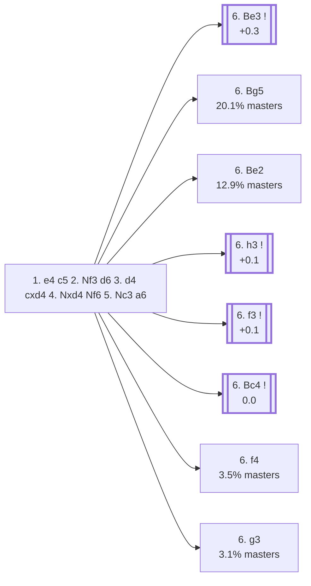

<a name="_TOP_"></a>

# B90 Sicilian Defense: Najdorf Variation <br> 1. e4 c5 2. Nf3 d6 3. d4 cxd4 4. Nxd4 Nf6 5. Nc3 a6 #

Spun off from [`B56_Sicilian_Classical_Variation.md`](https://github.com/onclemarcel/chess_flashcards/blob/main/e4_openings/B56_Sicilian_Classical_Variation.md)'s own "5... a6" branch — by far masters' main choice there (71.1%), and arguably the single most respected system in the whole Sicilian. The point of **5... a6** is prophylactic: it rules out **Nb5** ideas for good, so Black can follow up with ... e5 or ... b5 without a knight jumping into d6 or c7.

### Overview

*Quick map of every move covered on this card — see the [shape key](https://github.com/onclemarcel/chess_flashcards/blob/main/start.md#content-diagram-optional) in start.md.*

<!-- content-diagram:start -->

<!-- content-diagram:end -->

<a name="_initial_move_"></a>

[](https://lichess.org/analysis/standard/rnbqkb1r/1p2pppp/p2p1n2/8/3NP3/2N5/PPP2PPP/R1BQKB1R_w_KQkq_-_0_6)

*... 5... a6 — Najdorf Variation*

```
rnbqkb1r/1p2pppp/p2p1n2/8/3NP3/2N5/PPP2PPP/R1BQKB1R w KQkq - 0 6
```

|  | +0.3 |
| --- | --- |

<!-- lichess-stats:start fen="rnbqkb1r/1p2pppp/p2p1n2/8/3NP3/2N5/PPP2PPP/R1BQKB1R w KQkq - 0 6" db="lichess,masters" speeds="bullet,blitz" ratings="1800,2000,2200,2500" moves="8" -->
| Move | Online | W/D/B | Masters | W/D/B | |
| :--- | ---: | :--- | ---: | :--- | :-- |
| Bg5 | 3.8 M (24.6%) | ⬜⬜⬜⬜⬜⬛⬛⬛⬛⬛ 48/4/47 | 26 k (20.1%) | ⬜⬜⬜🟫🟫🟫🟫🟫⬛⬛ 28/50/23 |  |
| Be3 | 3.2 M (20.3%) | ⬜⬜⬜⬜⬜⬛⬛⬛⬛⬛ 47/4/48 | 42 k (33.2%) | ⬜⬜🟫🟫🟫🟫🟫🟫⬛⬛ 25/59/17 |  |
| Bc4 | 2.0 M (12.7%) | ⬜⬜⬜⬜⬜⬛⬛⬛⬛⬛ 49/4/47 | 7.7 k (6.1%) | ⬜⬜⬜🟫🟫🟫🟫⬛⬛⬛ 31/35/34 |  |
| Be2 | 1.8 M (11.8%) | ⬜⬜⬜⬜⬜⬛⬛⬛⬛⬛ 47/5/48 | 16 k (12.9%) | ⬜⬜⬜🟫🟫🟫🟫🟫⬛⬛ 29/46/25 |  |
| f3 | 1.2 M (7.8%) | ⬜⬜⬜⬜⬜⬛⬛⬛⬛⬛ 49/4/47 | 8.2 k (6.5%) | ⬜⬜🟫🟫🟫🟫🟫🟫⬛⬛ 24/58/18 |  |
| Bd3 | 943 k (6.1%) | ⬜⬜⬜⬜🟫⬛⬛⬛⬛⬛ 44/4/51 | 0 | — | ⚠ |
| h3 | 644 k (4.1%) | ⬜⬜⬜⬜⬜🟫⬛⬛⬛⬛ 50/5/44 | 11 k (8.9%) | ⬜⬜🟫🟫🟫🟫🟫🟫⬛⬛ 24/57/18 |  |
| a4 | 515 k (3.3%) | ⬜⬜⬜⬜⬜⬛⬛⬛⬛⬛ 45/5/49 | 0 | — | ⚠ |
| f4 | 0 | — | 4.5 k (3.5%) | ⬜⬜⬜🟫🟫🟫🟫⬛⬛⬛ 32/38/30 |  |
| g3 | 0 | — | 3.9 k (3.1%) | ⬜⬜⬜🟫🟫🟫🟫⬛⬛⬛ 30/43/27 |  |

*Online: bullet/blitz, 1800+ — 15.6 M games. Masters: 127 k games. [Open in the explorer](https://lichess.org/analysis/standard/rnbqkb1r/1p2pppp/p2p1n2/8/3NP3/2N5/PPP2PPP/R1BQKB1R_w_KQkq_-_0_6#explorer) — updated 2026-09-02*
<!-- lichess-stats:end -->

White has a genuinely wide choice of set-ups here, none of them overwhelmingly dominant:

* [**6. Be3**](#_Be3_) (33.2% masters): the *Byrne (English) Attack* — stays genuinely B90, despite being the modern main line. See below.
* [**6. Bg5**](https://github.com/onclemarcel/chess_flashcards/blob/main/e4_openings/B94_Sicilian_Najdorf_Bg5.md) (20.1% masters): already live-tagged **B94** — see `B94_Sicilian_Najdorf_Bg5.md`, not built out further here.
* [**6. Be2**](https://github.com/onclemarcel/chess_flashcards/blob/main/e4_openings/B92_Sicilian_Najdorf_Opocensky.md) (12.9% masters): the *Opocensky Variation* — already live-tagged **B92**, see `B92_Sicilian_Najdorf_Opocensky.md`, not built out further here.
* [**6. h3**](#_h3_) (8.9% masters): the *Adams Attack* — stays B90. See below.
* [**6. f3**](#_f3_) (6.5% masters): stays B90, un-named by the explorer at this exact position. See below.
* [**6. Bc4**](#_Bc4_) (6.1% masters): the *Lipnitzky Attack* (also called the Fischer-Sozin) — stays B90. See below.
* [**6. f4**](https://github.com/onclemarcel/chess_flashcards/blob/main/e4_openings/B93_Sicilian_Najdorf_Amsterdam.md) (3.5% masters): already live-tagged **B93**, live-tagged the *Amsterdam Variation* (`eco.md` just says "6.f4," a real name divergence) — see `B93_Sicilian_Najdorf_Amsterdam.md`, not built out further here.
* [**6. g3**](https://github.com/onclemarcel/chess_flashcards/blob/main/e4_openings/B91_Sicilian_Najdorf_Zagreb.md) (3.1% masters): the *Zagreb Variation* — already live-tagged **B91**, see `B91_Sicilian_Najdorf_Zagreb.md`, not built out further here.

Each of these tries is itself the gateway to a huge, independent body of Najdorf theory.

[*Back to TOP*](#_TOP_)

---

<a name="_Be3_"></a>

### 6. Be3 — Byrne (English) Attack

[](https://lichess.org/analysis/standard/rnbqkb1r/1p2pppp/p2p1n2/8/3NP3/2N1B3/PPP2PPP/R2QKB1R_b_KQkq_-_1_6)

*... 6. Be3 — Byrne (English) Attack*

```
rnbqkb1r/1p2pppp/p2p1n2/8/3NP3/2N1B3/PPP2PPP/R2QKB1R b KQkq - 1 6
```

|  | +0.3 |
| --- | --- |

<!-- lichess-stats:start fen="rnbqkb1r/1p2pppp/p2p1n2/8/3NP3/2N1B3/PPP2PPP/R2QKB1R b KQkq - 1 6" db="lichess,masters" speeds="bullet,blitz" ratings="1800,2000,2200,2500" moves="4" -->
| Move | Online | W/D/B | Masters | W/D/B | |
| :--- | ---: | :--- | ---: | :--- | :-- |
| e5 | 1.7 M (53.6%) | ⬜⬜⬜⬜⬜⬛⬛⬛⬛⬛ 47/5/49 | 30 k (70.9%) | ⬜⬜🟫🟫🟫🟫🟫🟫⬛⬛ 22/63/15 |  |
| e6 | 801 k (25.1%) | ⬜⬜⬜⬜⬜⬛⬛⬛⬛⬛ 48/4/48 | 8.0 k (18.5%) | ⬜⬜⬜⬜🟫🟫🟫🟫⬛⬛ 34/43/23 |  |
| Ng4 | 235 k (7.4%) | ⬜⬜⬜⬜🟫⬛⬛⬛⬛⬛ 44/5/51 | 3.9 k (9.0%) | ⬜⬜🟫🟫🟫🟫🟫🟫⬛⬛ 25/60/15 |  |
| b5 | 128 k (4.0%) | ⬜⬜⬜⬜⬜⬛⬛⬛⬛⬛ 48/4/48 | 0 | — | ⚠ |
| Nc6 | 0 | — | 296 (0.7%) | ⬜⬜⬜🟫🟫🟫🟫⬛⬛⬛ 36/36/28 |  |

*Online: bullet/blitz, 1800+ — 3.2 M games. Masters: 43 k games. [Open in the explorer](https://lichess.org/analysis/standard/rnbqkb1r/1p2pppp/p2p1n2/8/3NP3/2N1B3/PPP2PPP/R2QKB1R_b_KQkq_-_1_6#explorer) — updated 2026-09-02*
<!-- lichess-stats:end -->

**6... e5** is masters' clear main try (70.9%) — striking back in the centre immediately, the sharpest and most theoretical answer to the English Attack. Deeper theory (7. Nb3, the resulting opposite-side-castling races) is its own extensive body of work, not covered further here.

[*Back to 5... a6*](#_initial_move_)
[*Back to TOP*](#_TOP_)

---

> [!NOTE]
> **6. h3**, the Adams Attack, rules out ... Bg4/... Ng4 tricks before deciding on a plan — a flexible waiting move that can transpose into English Attack structures a move later.
>
> <a name="_h3_"></a>
>
> ### 6. h3 — Adams Attack
>
> [](https://lichess.org/analysis/standard/rnbqkb1r/1p2pppp/p2p1n2/8/3NP3/2N4P/PPP2PP1/R1BQKB1R_b_KQkq_-_0_6)
>
> *... 6. h3 — Adams Attack*
>
> ```
> rnbqkb1r/1p2pppp/p2p1n2/8/3NP3/2N4P/PPP2PP1/R1BQKB1R b KQkq - 0 6
> ```
>
> |  | +0.1 |
> | --- | --- |
>
> **6... e5** (56.9% masters) is again the main try, with **6... e6** (32.8%) a real second choice. Deeper Adams Attack theory is its own extensive body of work, not covered further here.
>
> [*Back to 5... a6*](#_initial_move_)
> [*Back to TOP*](#_TOP_)

---

> [!NOTE]
> **6. f3**, un-named by the explorer at this exact position, supports an eventual e4-e5 push or an English-Attack-style Be3/Qd2 build-up while ruling out ... Ng4 in one move.
>
> <a name="_f3_"></a>
>
> ### 6. f3
>
> [](https://lichess.org/analysis/standard/rnbqkb1r/1p2pppp/p2p1n2/8/3NP3/2N2P2/PPP3PP/R1BQKB1R_b_KQkq_-_0_6)
>
> *... 6. f3*
>
> ```
> rnbqkb1r/1p2pppp/p2p1n2/8/3NP3/2N2P2/PPP3PP/R1BQKB1R b KQkq - 0 6
> ```
>
> |  | +0.1 |
> | --- | --- |
>
> **6... e5** (75.1% masters) is masters' clear main try — often simply transposing into English Attack structures once White follows up with Be3/Qd2. Deeper theory past this point is its own extensive body of work, not covered further here.
>
> [*Back to 5... a6*](#_initial_move_)
> [*Back to TOP*](#_TOP_)

---

> [!NOTE]
> **6. Bc4**, the Lipnitzky Attack (also called the Fischer-Sozin Attack), aims straight at f7 — the same idea as the Italian Game, but a full move faster since Black hasn't played ... e5 or ... e6 yet.
>
> <a name="_Bc4_"></a>
>
> ### 6. Bc4 — Lipnitzky Attack
>
> [](https://lichess.org/analysis/standard/rnbqkb1r/1p2pppp/p2p1n2/8/2BNP3/2N5/PPP2PPP/R1BQK2R_b_KQkq_-_1_6)
>
> *... 6. Bc4 — Lipnitzky Attack*
>
> ```
> rnbqkb1r/1p2pppp/p2p1n2/8/2BNP3/2N5/PPP2PPP/R1BQK2R b KQkq - 1 6
> ```
>
> |  | 0.0 |
> | --- | --- |
>
> **6... e6** is close to automatic (96.1% of masters games) — shielding f7 and preparing ... b5 next, since the bishop on c4 makes ... e5 far riskier than against White's other 6th-move tries. Deeper Lipnitzky Attack theory is its own extensive body of work, not covered further here.
>
> [*Back to 5... a6*](#_initial_move_)
> [*Back to TOP*](#_TOP_)
