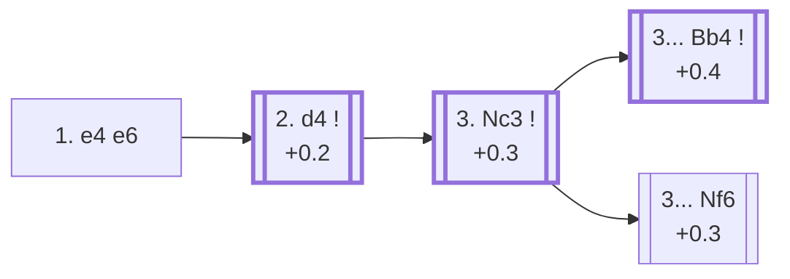

<a name="_TOP_"></a>

# C00 French Defense <br> 1. e4 e6 #

Black prepares ... d5 before playing it, avoiding the immediate central clash of 1... e5 or 1... d5 in favour of a slower build-up. The trade-off is well known: Black's light-squared bishop is often shut in behind its own pawn chain for much of the game, while White gets a free hand to grab extra space. In exchange, Black's structure is very solid and the resulting positions are rich in long-term strategic play — the French has a reputation as a fighting, if slightly passive-looking, defense.

### Overview

*Quick map of every move covered on this card — see the [shape key](https://github.com/onclemarcel/chess_flashcards/blob/main/start.md#content-diagram-optional) in start.md. White's other three tries after 2... d5 (Nd2/e5/exd5) don't have their own card yet, so that fan-out is left off the map — see the candidate-move list below instead.*

<!-- content-diagram:start -->

<!-- content-diagram:end -->

<a name="_initial_move_"></a>

[](https://lichess.org/analysis/standard/rnbqkbnr/pppp1ppp/4p3/8/4P3/8/PPPP1PPP/RNBQKBNR_w_KQkq_-_0_2)

*... 1. e4 e6 — French Defense*

```
rnbqkbnr/pppp1ppp/4p3/8/4P3/8/PPPP1PPP/RNBQKBNR w KQkq - 0 2
```

|  | +0.2 |
| --- | --- |

<!-- lichess-stats:start fen="rnbqkbnr/pppp1ppp/4p3/8/4P3/8/PPPP1PPP/RNBQKBNR w KQkq - 0 2" db="lichess,masters" speeds="bullet,blitz" ratings="1800,2000,2200,2500" moves="8" -->
| Move | Online | W/D/B | Masters | W/D/B | |
| :--- | ---: | :--- | ---: | :--- | :-- |
| d4 | 81.1 M (51.0%) | ⬜⬜⬜⬜⬜⬛⬛⬛⬛⬛ 49/5/46 | 137 k (89.5%) | ⬜⬜⬜⬜🟫🟫🟫🟫⬛⬛ 35/42/23 |  |
| Nf3 | 35.9 M (22.6%) | ⬜⬜⬜⬜⬜⬛⬛⬛⬛⬛ 47/5/48 | 2.5 k (1.6%) | ⬜⬜⬜🟫🟫🟫🟫⬛⬛⬛ 32/35/33 |  |
| Nc3 | 14.0 M (8.8%) | ⬜⬜⬜⬜⬜⬛⬛⬛⬛⬛ 49/4/47 | 1.1 k (0.7%) | ⬜⬜⬜🟫🟫🟫🟫⬛⬛⬛ 32/39/29 |  |
| d3 | 6.8 M (4.3%) | ⬜⬜⬜⬜⬜⬛⬛⬛⬛⬛ 50/5/46 | 8.8 k (5.8%) | ⬜⬜⬜⬜🟫🟫🟫⬛⬛⬛ 36/34/30 |  |
| f4 | 6.5 M (4.1%) | ⬜⬜⬜⬜⬜⬛⬛⬛⬛⬛ 47/4/49 | 319 (0.2%) | ⬜⬜⬜⬜🟫🟫🟫🟫⬛⬛ 36/39/26 |  |
| c4 | 3.6 M (2.3%) | ⬜⬜⬜⬜⬜⬛⬛⬛⬛⬛ 51/4/45 | 241 (0.2%) | ⬜⬜⬜⬜🟫🟫🟫⬛⬛⬛ 35/30/35 |  |
| Bc4 | 3.4 M (2.2%) | ⬜⬜⬜⬜🟫⬛⬛⬛⬛⬛ 43/4/52 | 0 | — | ⚠ |
| e5 | 2.2 M (1.4%) | ⬜⬜⬜⬜⬜⬛⬛⬛⬛⬛ 47/4/48 | 0 | — | ⚠ |
| Qe2 | 0 | — | 2.1 k (1.4%) | ⬜⬜⬜⬜🟫🟫🟫⬛⬛⬛ 39/32/29 |  |
| b3 | 0 | — | 721 (0.5%) | ⬜⬜⬜🟫🟫🟫🟫⬛⬛⬛ 34/35/31 |  |

*Online: bullet/blitz, 1800+ — 159.0 M games. Masters: 153 k games. [Open in the explorer](https://lichess.org/analysis/standard/rnbqkbnr/pppp1ppp/4p3/8/4P3/8/PPPP1PPP/RNBQKBNR_w_KQkq_-_0_2#explorer) — updated 2026-09-15*
<!-- lichess-stats:end -->

### Candidate moves

* [**2. d4**](#_d4_) (+0.2): occupies the centre and is masters' overwhelming preference (89.5%) — Black answers almost automatically with **2... d5**, completing the point of 1... e6.

Eight further real C00 tries sit in the stats table above with no candidate bullet — a genuine zero-coverage gap surfaced by a full A00-E99 ECO-code audit. None built out past this ply (all backlog), but every one is live-confirmed and named:

* **2. c4** (−0.1, 0.2% masters): the *Steiner Variation*.
* **2. b3** (−0.2, 0.5% masters): live-tagged the *Horwitz Attack* — `eco.md`'s own name here is the *Reti Variation*, a real name divergence.
* **2. e5** (−0.2, 0% masters): the *Steinitz Attack*.
* **2. f4** (−0.2, 0.2% masters): the *La Bourdonnais Variation*.
* **2. Nf3** (+0.1, 1.6% masters): the *Knight Variation*. Deeper, **2... d5 3. e5 c5 4. b4!?**, the *Wing Gambit* (−0.3, a genuine database curiosity), offers a queenside pawn to divert Black's own c-pawn.
* **2. Nc3** (+0.3, 0.7% masters): live-tagged the *Queen's Knight*. Two further named lines follow **2... d5**: **3. f4!?**, the *Pelikan Variation* (−0.2, a real database curiosity), and **3. Nf3**, the *Two Knights Variation* (−0.1, the best-tested of the two, 1.8k masters games).
* **2. Qe2** (−0.1, 1.4% masters): the *Chigorin Variation* — masters' main reply is **2... c5** (65.4%), not the more natural-looking **2... d5** that dominates online play (52.2%), another real online/masters inversion.
* **2. d3** (0.0, 5.8% masters): the *King's Indian Attack*. Deeper still, **2... d5 3. Nd2 Nf6 4. Ngf3 Nc6 5. Be2!?**, the *Reversed Philidor Formation* (0.0, a real database curiosity), reaches a fully symmetric-in-spirit tabiya a tempo down for Black.

[*Back to TOP*](#_TOP_)

---

<a name="_d4_"></a>

### 2. d4 d5

[](https://lichess.org/analysis/standard/rnbqkbnr/ppp2ppp/4p3/3p4/3PP3/8/PPP2PPP/RNBQKBNR_w_KQkq_d6_0_3)

*... 2. d4 d5 — masters play 2... d5 98.8% of the time*

```
rnbqkbnr/ppp2ppp/4p3/3p4/3PP3/8/PPP2PPP/RNBQKBNR w KQkq d6 0 3
```

|  | +0.4 |
| --- | --- |

<!-- lichess-stats:start fen="rnbqkbnr/ppp2ppp/4p3/3p4/3PP3/8/PPP2PPP/RNBQKBNR w KQkq d6 0 3" db="lichess,masters" speeds="bullet,blitz" ratings="1800,2000,2200,2500" moves="6" -->
| Move | Online | W/D/B | Masters | W/D/B | |
| :--- | ---: | :--- | ---: | :--- | :-- |
| exd5 | 19.7 M (29.3%) | ⬜⬜⬜⬜⬜⬛⬛⬛⬛⬛ 47/6/47 | 8.2 k (5.9%) | ⬜⬜🟫🟫🟫🟫🟫🟫⬛⬛ 20/55/25 |  |
| Nc3 | 18.2 M (26.9%) | ⬜⬜⬜⬜⬜⬛⬛⬛⬛⬛ 50/5/45 | 71 k (50.5%) | ⬜⬜⬜⬜🟫🟫🟫🟫⬛⬛ 36/42/22 |  |
| e5 | 16.7 M (24.7%) | ⬜⬜⬜⬜⬜⬛⬛⬛⬛⬛ 48/4/48 | 16 k (11.4%) | ⬜⬜⬜⬜🟫🟫🟫⬛⬛⬛ 36/35/29 |  |
| Nd2 | 9.8 M (14.5%) | ⬜⬜⬜⬜⬜🟫⬛⬛⬛⬛ 50/5/44 | 44 k (31.3%) | ⬜⬜⬜⬜🟫🟫🟫🟫⬛⬛ 36/42/22 |  |
| Bd3 | 1.7 M (2.5%) | ⬜⬜⬜⬜⬜🟫⬛⬛⬛⬛ 50/5/45 | 1.3 k (0.9%) | ⬜⬜⬜⬜🟫🟫🟫⬛⬛⬛ 37/35/29 |  |
| c4 | 496 k (0.7%) | ⬜⬜⬜⬜⬜⬛⬛⬛⬛⬛ 51/4/45 | 0 | — | ⚠ |
| Be3 | 0 | — | 30 (0.0%) | ⬜⬜⬜🟫🟫🟫🟫⬛⬛⬛ 27/40/33 |  |

*Online: bullet/blitz, 1800+ — 67.4 M games. Masters: 140 k games. [Open in the explorer](https://lichess.org/analysis/standard/rnbqkbnr/ppp2ppp/4p3/3p4/3PP3/8/PPP2PPP/RNBQKBNR_w_KQkq_d6_0_3#explorer) — updated 2026-09-15*
<!-- lichess-stats:end -->

Black's second move of the French Defence attacks the e-pawn and puts the question to White, who has to decide how to resolve the central tension: exchange the pawn, advancing it, or protecting it.

* [**3. Nc3**](#_Nc3_) (+0.3, 50.5% masters): develops naturally, keeping the tension — masters' clear main try, covered below.
* [**3. Nd2**](https://github.com/onclemarcel/chess_flashcards/blob/main/e4_openings/C03_French_Tarrasch.md) (+0.3, 31.3% masters): the *Tarrasch Variation*, avoiding the pin that 3... Bb4 would otherwise place on the knight, at the cost of blocking the c1-bishop's most natural diagonal for a while. Already live-tagged **C03**, fully built out through C09.
* [**3. e5**](https://github.com/onclemarcel/chess_flashcards/blob/main/e4_openings/C02_French_Advance.md) (+0.5, 11.4% masters): the *Advance Variation* — gains space immediately and locks the centre, giving Black a clear target on d4 to attack with ... c5. Already live-tagged **C02**.
* [**3. exd5**](https://github.com/onclemarcel/chess_flashcards/blob/main/e4_openings/C01_French_Exchange.md) (+0.1, 5.9% masters, 29.3% online): the *Exchange Variation* — trades off the central tension for a symmetrical pawn structure. Exchanging the d-pawns immediately frees Black's queen's bishop and dissipates White's advantage. Simple and drawish, and correspondingly far more common in casual play than at master level. Already live-tagged **C01**.

Two further real tries sit in the stats table above with no candidate bullet, both bishop developing moves that sidestep the main Nc3/Nd2/e5/exd5 fork: **3. Bd3** (0.9% masters), the *Schlechter Variation* — masters' main reply is **3... dxe4** (62.3%); and **3. Be3** (masters: negligible sample), the *Alapin Gambit* — `eco.md`'s own name is just the *Alapin Variation*, but the live explorer already tags it a gambit. Neither built out further here (backlog).

[*Back to 1... e6*](#_initial_move_)
[*Back to TOP*](#_TOP_)

---

<a name="_Nc3_"></a>

## 3. Nc3

[](https://lichess.org/analysis/standard/rnbqkbnr/ppp2ppp/4p3/3p4/3PP3/2N5/PPP2PPP/R1BQKBNR_b_KQkq_-_1_3)

*... 3. Nc3*

```
rnbqkbnr/ppp2ppp/4p3/3p4/3PP3/2N5/PPP2PPP/R1BQKBNR b KQkq - 1 3
```

|  | +0.3 |
| --- | --- |

<!-- lichess-stats:start fen="rnbqkbnr/ppp2ppp/4p3/3p4/3PP3/2N5/PPP2PPP/R1BQKBNR b KQkq - 1 3" db="lichess,masters" speeds="bullet,blitz" ratings="1800,2000,2200,2500" moves="4" -->
| Move | Online | W/D/B | Masters | W/D/B | |
| :--- | ---: | :--- | ---: | :--- | :-- |
| Nf6 | 7.9 M (36.1%) | ⬜⬜⬜⬜⬜⬛⬛⬛⬛⬛ 50/5/46 | 31 k (43.6%) | ⬜⬜⬜🟫🟫🟫🟫🟫⬛⬛ 33/46/21 |  |
| dxe4 | 5.9 M (27.0%) | ⬜⬜⬜⬜⬜🟫⬛⬛⬛⬛ 51/5/44 | 5.8 k (8.2%) | ⬜⬜⬜⬜🟫🟫🟫🟫🟫⬛ 36/50/14 |  |
| Bb4 | 5.2 M (24.0%) | ⬜⬜⬜⬜⬜⬛⬛⬛⬛⬛ 49/5/46 | 32 k (44.6%) | ⬜⬜⬜⬜🟫🟫🟫🟫⬛⬛ 37/38/24 |  |
| c5 | 1.2 M (5.4%) | ⬜⬜⬜⬜⬜🟫⬛⬛⬛⬛ 53/4/43 | 0 | — | ⚠ |
| Nc6 | 0 | — | 1.6 k (2.2%) | ⬜⬜⬜⬜🟫🟫🟫🟫⬛⬛ 40/36/25 |  |

*Online: bullet/blitz, 1800+ — 21.9 M games. Masters: 71 k games. [Open in the explorer](https://lichess.org/analysis/standard/rnbqkbnr/ppp2ppp/4p3/3p4/3PP3/2N5/PPP2PPP/R1BQKBNR_b_KQkq_-_1_3#explorer) — updated 2026-09-15*
<!-- lichess-stats:end -->

A genuine near-even fork — neither try is presented as dominant:

* [**3... Bb4**](https://github.com/onclemarcel/chess_flashcards/blob/main/e4_openings/C15_French_Winawer.md) (+0.4, 44.6% masters): the ***Winawer Variation*** — pins the knight immediately, accepting a damaged pawn structure later in exchange for the bishop pair and active piece play. Considered the French's most theoretically critical line. Already live-tagged **C15**, fully built out onward through C19.
* [**3... Nf6**](https://github.com/onclemarcel/chess_flashcards/blob/main/e4_openings/C11_French_Classical.md) (+0.3, 43.6% masters): the ***Classical Variation*** — develops naturally, keeping the position more solid at the cost of some of the Winawer's sharper chances. Already live-tagged **C11**, fully built out onward through C14.

Each is its own extensive body of theory, on a par with the Nimzo-Indian or Grünfeld covered elsewhere in this repository — see those cards for the full depth, not repeated here.

[*Back to 2. d4 d5*](#_d4_)
[*Back to TOP*](#_TOP_)
