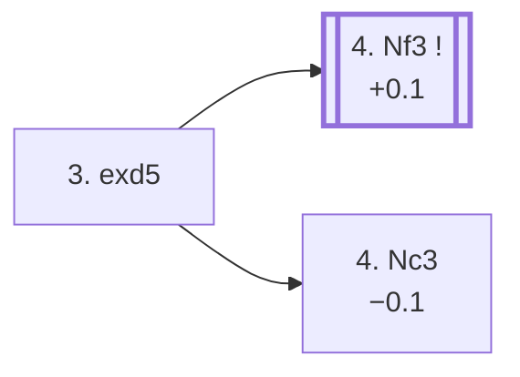

<a name="_TOP_"></a>

# C01 French Defense: Exchange Variation <br> 1. e4 e6 2. d4 d5 3. exd5 #

Spun off from [`C00_French_Defense.md`](https://github.com/onclemarcel/chess_flashcards/blob/main/e4_openings/C00_French_Defense.md)'s own candidate list — masters' least popular try at that fork (5.9%), far more common in casual play (29.3% online). <br><br>
**With this move, White is resolving Black's problem**: one drawback of the French Defence for Black is the difficulty to get the c8-bishop active early in the game, but exchanging the d-pawns immediately frees Black's queen's bishop and dissipates White's advantage. This White's move results in a symmetrical pawn structure; simple and drawish by French standards, though not without independent try for both sides.

### Overview

*Quick map of every move covered on this card — see the [shape key](https://github.com/onclemarcel/chess_flashcards/blob/main/start.md#content-diagram-optional) in start.md.*

<!-- content-diagram:start -->

<!-- content-diagram:end -->

<a name="_initial_move_"></a>

[](https://lichess.org/analysis/standard/rnbqkbnr/ppp2ppp/4p3/3P4/3P4/8/PPP2PPP/RNBQKBNR_b_KQkq_-_0_3)

*... 3. exd5 — Exchange Variation*

```
rnbqkbnr/ppp2ppp/4p3/3P4/3P4/8/PPP2PPP/RNBQKBNR b KQkq - 0 3
```

|  | +0.1 |
| --- | --- |

<!-- lichess-stats:start fen="rnbqkbnr/ppp2ppp/4p3/3P4/3P4/8/PPP2PPP/RNBQKBNR b KQkq - 0 3" db="lichess,masters" speeds="bullet,blitz" ratings="1800,2000,2200,2500" moves="4" -->
| Move | Online | W/D/B | Masters | W/D/B | |
| :--- | ---: | :--- | ---: | :--- | :-- |
| exd5 | 19.2 M (96.1%) | ⬜⬜⬜⬜⬜⬛⬛⬛⬛⬛ 47/6/48 | 8.1 k (99.5%) | ⬜⬜🟫🟫🟫🟫🟫🟫⬛⬛ 20/55/25 |  |
| Qxd5 | 521 k (2.6%) | ⬜⬜⬜⬜⬜🟫⬛⬛⬛⬛ 52/5/43 | 42 (0.5%) | ⬜⬜⬜🟫🟫🟫🟫⬛⬛⬛ 33/38/29 |  |
| Nf6 | 118 k (0.6%) | ⬜⬜⬜⬜⬜⬛⬛⬛⬛⬛ 52/4/44 | 1 (0.0%) | — | ⚠ |
| c5 | 56 k (0.3%) | ⬜⬜⬜⬜⬜⬛⬛⬛⬛⬛ 50/5/45 | 1 (0.0%) | — | ⚠ |

*Online: bullet/blitz, 1800+ — 19.9 M games. Masters: 8.2 k games. [Open in the explorer](https://lichess.org/analysis/standard/rnbqkbnr/ppp2ppp/4p3/3P4/3P4/8/PPP2PPP/RNBQKBNR_b_KQkq_-_0_3#explorer) — updated 2026-09-06*
<!-- lichess-stats:end -->

**3... exd5** is close to automatic (99.5% of masters games) — Black keeps the position symmetrical rather than trying **3... Qxd5** (0.5%), which loses time to a future Nc3 tempo-gain on the queen. With the d-pawn exchange, Black frees his light-squares bishop, resolving its main difficulty in the French Defence. It is important to note that Black can hardly play for a win in this variation in masters games. That said, White has played timidely and is trying to achieve a draw : overly safe play often results in minor concessions and disappointment may lay ahead.

<a name="_afterexd5_"></a>

[](https://lichess.org/analysis/standard/rnbqkbnr/ppp2ppp/8/3p4/3P4/8/PPP2PPP/RNBQKBNR_w_KQkq_-_0_4)

```
rnbqkbnr/ppp2ppp/8/3p4/3P4/8/PPP2PPP/RNBQKBNR w KQkq - 0 4
```

|  | +0.1 |
| --- | --- |

<!-- lichess-stats:start fen="rnbqkbnr/ppp2ppp/8/3p4/3P4/8/PPP2PPP/RNBQKBNR w KQkq - 0 4" db="lichess,masters" speeds="bullet,blitz" ratings="1800,2000,2200,2500" moves="4" -->
| Move | Online | W/D/B | Masters | W/D/B | |
| :--- | ---: | :--- | ---: | :--- | :-- |
| Nf3 | 7.8 M (37.8%) | ⬜⬜⬜⬜⬜⬛⬛⬛⬛⬛ 47/6/47 | 4.6 k (56.0%) | ⬜⬜🟫🟫🟫🟫🟫⬛⬛⬛ 22/54/24 |  |
| Bd3 | 4.4 M (21.4%) | ⬜⬜⬜⬜⬜⬛⬛⬛⬛⬛ 47/6/46 | 2.3 k (27.9%) | ⬜🟫🟫🟫🟫🟫🟫⬛⬛⬛ 11/64/25 |  |
| c4 | 3.8 M (18.6%) | ⬜⬜⬜⬜⬜⬛⬛⬛⬛⬛ 49/5/46 | 854 (10.4%) | ⬜⬜⬜🟫🟫🟫🟫⬛⬛⬛ 30/41/29 |  |
| Nc3 | 2.2 M (10.6%) | ⬜⬜⬜⬜🟫⬛⬛⬛⬛⬛ 44/5/51 | 0 | — | ⚠ |
| Bf4 | 0 | — | 200 (2.4%) | ⬜🟫🟫🟫🟫🟫🟫⬛⬛⬛ 12/63/24 |  |

*Online: bullet/blitz, 1800+ — 20.7 M games. Masters: 8.2 k games. [Open in the explorer](https://lichess.org/analysis/standard/rnbqkbnr/ppp2ppp/8/3p4/3P4/8/PPP2PPP/RNBQKBNR_w_KQkq_-_0_4#explorer) — updated 2026-09-06*
<!-- lichess-stats:end -->

**4. Nf3** is masters' main try (56.0%), developing naturally toward the symmetrical structure. **4. Nc3 Nf6 5. Bg5** reaches the *Svenonius Variation*, a further-named sideline.

### Candidate moves

* [**4. Nf3**](#_4Nf3_) (56.0% masters): main development move for White. Here the position is equal with White having a tempo advantage. This position is the most known position. Nc3, Bd3 and c4 below are less common, so may be more surprising for unprepared opponents.
* **4. Bd3** (27.9% masters): stays C01, not built out further here.
* [**4. Nc3**](#_Svenonius_) (1.4% masters): the road to the *Svenonius Variation* — see below.

[*Back to TOP*](#_TOP_)

---

<a name="_Svenonius_"></a>

> [!NOTE]
> **4. Nc3 Nf6 5. Bg5** is the *Svenonius Variation*, pinning the newly-developed knight at once.
>
> [](https://lichess.org/analysis/standard/rnbqkb1r/ppp2ppp/5n2/3p2B1/3P4/2N5/PPP2PPP/R2QKBNR_b_KQkq_-_3_5)
>
> *... 4. Nc3 Nf6 5. Bg5 — Svenonius Variation*
>
> ```
> rnbqkb1r/ppp2ppp/5n2/3p2B1/3P4/2N5/PPP2PPP/R2QKBNR b KQkq - 3 5
> ```
>
> |  | −0.1 |
> | --- | --- |
>
> **5... Be7** is masters' overwhelming reply (85.3%). **5... Nc6** reaches the *Bogolyubov Variation* — a real database rarity (0 masters games, 6.8 k online), not built out further here.
>
> [*Back to TOP*](#_TOP_)

---

<a name="_4Nf3_"></a>

### 4. Nf3

In this position, White is playing for a secured, safe play, aiming at a quick kingside castling by developping its bishop to d3. Typical White plan here is to develop according to the green arrows of the following diagram: both bishops on the 3rd row, Nb1 on d2 to defend Nf3, and quick kingside castling.

[](https://lichess.org/analysis/standard/rnbqkbnr/ppp2ppp/8/3p4/3P4/5N2/PPP2PPP/RNBQKB1R_b_KQkq_-_1_4)

*... 4. Nf3 — White's typical plan: both bishops to the 3rd rank, Nd2, and O-O*

```
rnbqkbnr/ppp2ppp/8/3p4/3P4/5N2/PPP2PPP/RNBQKB1R b KQkq - 1 4
```

|  | +0.1 |
| --- | --- |

<!-- lichess-stats:start fen="rnbqkbnr/ppp2ppp/8/3p4/3P4/5N2/PPP2PPP/RNBQKB1R b KQkq - 1 4" db="lichess,masters" speeds="bullet,blitz" ratings="1800,2000,2200,2500" moves="4" -->
| Move | Online | W/D/B | Masters | W/D/B | |
| :--- | ---: | :--- | ---: | :--- | :-- |
| Nf6 | 12.3 M (53.3%) | ⬜⬜⬜⬜⬜⬛⬛⬛⬛⬛ 46/6/48 | 1.8 k (38.1%) | ⬜⬜🟫🟫🟫🟫🟫🟫⬛⬛ 20/62/18 |  |
| Bd6 | 3.6 M (15.4%) | ⬜⬜⬜⬜🟫⬛⬛⬛⬛⬛ 45/6/49 | 1.5 k (31.0%) | ⬜⬜🟫🟫🟫🟫🟫⬛⬛⬛ 25/50/26 |  |
| c6 | 2.4 M (10.4%) | ⬜⬜⬜⬜⬜⬛⬛⬛⬛⬛ 47/5/48 | 0 | — | ⚠ |
| Nc6 | 1.3 M (5.8%) | ⬜⬜⬜⬜⬜⬛⬛⬛⬛⬛ 46/5/49 | 941 (19.5%) | ⬜⬜🟫🟫🟫🟫🟫⬛⬛⬛ 20/49/31 |  |
| Bg4 | 0 | — | 351 (7.3%) | ⬜⬜⬜🟫🟫🟫🟫⬛⬛⬛ 26/43/30 |  |

*Online: bullet/blitz, 1800+ — 23.2 M games. Masters: 4.8 k games. [Open in the explorer](https://lichess.org/analysis/standard/rnbqkbnr/ppp2ppp/8/3p4/3P4/5N2/PPP2PPP/RNBQKB1R_b_KQkq_-_1_4#explorer) — updated 2026-09-06*
<!-- lichess-stats:end -->

Here Black can easily play for draw with 4... Nf6 to get a very common position learned by many players. Noting that this resulting position is also a drawing one, Black may also play for more surprising moves - same as White later on - in order to get out of the main known lines, but Black should avoid inaccuracies as well.

### Candidate moves

* **4... Nf6** (+0.17, 38.1% masters): masters' most common try, developing naturally and eyeing e4/d5 support. The most heavily analysed of the four, and correspondingly the safest against a well-prepared opponent.
* **4... Bd6** (+0.22, 31.0% masters): develops the bishop to its most active diagonal at once, ahead of ...Nf6, pointing straight at White's kingside — a real independent try, not just a move-order quirk.
* **4... Nc6** (+0.13, 19.5% masters, **the engine's actual preference** of the four): develops the queenside knight first, keeping ...Nf6/...Bd6 move-order flexible for later.
* **4... Bg4** (+0.34, 7.3% masters): pins the f3-knight immediately rather than developing quietly — the sharpest and least common of the four, correspondingly the one likeliest to surprise an opponent coasting on autopilot in this "drawish" line.

None built out further here yet (backlog) — pending further work on this section.

[*Back to 3... exd5*](#_initial_move_)<br>
[*Back to TOP*](#_TOP_)