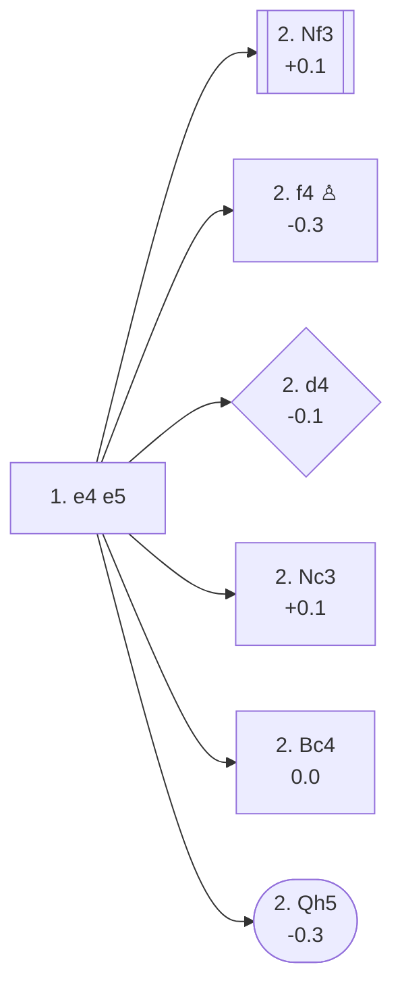

<a name="_TOP_"></a>

# C20 King's Pawn Game <br> 1. e4 e5 #

By mirroring White's move, Black grabs an equal share of the centre and scope to develop some pieces. 1... e5 is also one of the few moves that directly interferes with White's ideal plan of playing d4. Black's pawn on e5 is undefended, so it is easy for White to develop in a way that restricts Black's possible responses by threatening to capture it. This is White's most common plan, but they may also choose to develop without attacking.

### Overview

*Quick map of every move covered on this card — see the [shape key](https://github.com/onclemarcel/chess_flashcards/blob/main/start.md#content-diagram-optional) in start.md. C20 is mostly a hub: 2. Nf3/2. f4/2. Nc3/2. Bc4 each immediately earn their own further ECO code and don't continue here. 2. d4 and 2. Qh5, though, are both still bare C20 themselves — Black hasn't yet forced a divergence into a new code — so both are built out fully on this same page.*

<!-- content-diagram:start -->

<!-- content-diagram:end -->

<a name="_initial_move_"></a>

[](https://lichess.org/analysis/standard/rnbqkbnr/pppp1ppp/8/4p3/4P3/8/PPPP1PPP/RNBQKBNR_w_KQkq_-_0_2)

*... 1. e4 e5 — King's Pawn Game*

```
rnbqkbnr/pppp1ppp/8/4p3/4P3/8/PPPP1PPP/RNBQKBNR w KQkq - 0 2
```

|  | +0.2 |
| --- | --- |

<!-- lichess-stats:start fen="rnbqkbnr/pppp1ppp/8/4p3/4P3/8/PPPP1PPP/RNBQKBNR w KQkq - 0 2" db="lichess,masters" speeds="bullet,blitz" ratings="1800,2000,2200,2500" moves="8" -->
| Move | Online | W/D/B | Masters | W/D/B | |
| :--- | ---: | :--- | ---: | :--- | :-- |
| Nf3 | 177.9 M (61.7%) | ⬜⬜⬜⬜⬜⬛⬛⬛⬛⬛ 50/5/45 | 290 k (92.2%) | ⬜⬜⬜🟫🟫🟫🟫🟫⬛⬛ 29/52/20 |  |
| f4 | 27.4 M (9.5%) | ⬜⬜⬜⬜⬜⬛⬛⬛⬛⬛ 50/4/47 | 4.9 k (1.5%) | ⬜⬜⬜🟫🟫🟫🟫⬛⬛⬛ 29/36/35 |  |
| Nc3 | 27.0 M (9.4%) | ⬜⬜⬜⬜⬜🟫⬛⬛⬛⬛ 52/4/44 | 8.2 k (2.6%) | ⬜⬜⬜🟫🟫🟫🟫⬛⬛⬛ 30/44/26 |  |
| d4 | 22.7 M (7.9%) | ⬜⬜⬜⬜⬜🟫⬛⬛⬛⬛ 53/4/43 | 1.9 k (0.6%) | ⬜⬜⬜🟫🟫🟫🟫⬛⬛⬛ 30/36/34 |  |
| Bc4 | 20.4 M (7.1%) | ⬜⬜⬜⬜⬜⬛⬛⬛⬛⬛ 50/4/46 | 9.3 k (3.0%) | ⬜⬜⬜⬜🟫🟫🟫🟫⬛⬛ 34/43/22 |  |
| d3 | 5.7 M (2.0%) | ⬜⬜⬜⬜⬜⬛⬛⬛⬛⬛ 48/4/48 | 66 (0.0%) | ⬜⬜🟫🟫🟫🟫⬛⬛⬛⬛ 24/36/39 |  |
| c3 | 1.7 M (0.6%) | ⬜⬜⬜⬜⬜⬛⬛⬛⬛⬛ 49/4/48 | 0 | — | ⚠ |
| Qh5 | 1.1 M (0.4%) | ⬜⬜⬜⬜⬜🟫⬛⬛⬛⬛ 53/4/43 | 0 | — | ⚠ |
| Ne2 | 0 | — | 65 (0.0%) | ⬜⬜⬜⬜🟫🟫🟫⬛⬛⬛ 42/29/29 |  |
| Bb5 | 0 | — | 62 (0.0%) | ⬜⬜⬜🟫🟫🟫⬛⬛⬛⬛ 32/32/35 |  |

*Online: bullet/blitz, 1800+ — 288.4 M games. Masters: 314 k games. [Open in the explorer](https://lichess.org/analysis/standard/rnbqkbnr/pppp1ppp/8/4p3/4P3/8/PPPP1PPP/RNBQKBNR_w_KQkq_-_0_2#explorer) — updated 2026-09-09*
<!-- lichess-stats:end -->

### Candidate moves

* White may try to:
  - Attack Black's undefended e5 pawn directly.
  - Develop a piece.
  - Play for traps.
  - Play unusual opening moves.

* [**2. Nf3**](https://github.com/onclemarcel/chess_flashcards/blob/main/e4_openings/C40_King_Knight.md) (+0.1): **2. Nf3** leads to the [King's Knight Opening (C40)](https://github.com/onclemarcel/chess_flashcards/blob/main/e4_openings/C40_King_Knight.md), White directly attacks the pawn while also developing a piece. Additionally, it controls the d4 square, ready to support a future d4 pawn push, and starts to make room for White to castle. This move represents 92% of King's Pawn masters games.
* [**2. f4**](https://github.com/onclemarcel/chess_flashcards/blob/main/e4_openings/C30_King_Gambit.md) (-0.3): [the King's Gambit](https://github.com/onclemarcel/chess_flashcards/blob/main/e4_openings/C30_King_Gambit.md), confronts the e5 pawn and tries to lever open the f-file for an attack on Black's weak f7 pawn. This is the quintessential Romantic chess opening, popular with the likes of Paul Morphy. A prepared Black player should be able to grab the proffered pawn and keep it.
* [**2. d4**](#_d4_) (-0.1): the *Centre Game* smashes the centre open. White can then sacrifice a pawn or two to develop pieces with great speed (2... exd4 3. c3, the Danish Gambit) — see below.
* [**2. Nc3**](https://github.com/onclemarcel/chess_flashcards/blob/main/e4_openings/C25_Vienna_Game.md) (+0.1): this development move offers flexibility in Black's response since it doesn't immediately challenge e5. Nc3 controls d5 and protects e4. The [Vienna Game](https://github.com/onclemarcel/chess_flashcards/blob/main/e4_openings/C25_Vienna_Game.md) is also a preparing move for the **f4** [King's Gambit](https://github.com/onclemarcel/chess_flashcards/blob/main/e4_openings/C30_King_Gambit.md).
* [**2. Bc4**](https://github.com/onclemarcel/chess_flashcards/blob/main/e4_openings/C23_Bishop_Opening.md) (0.0): another development move that doesn't challenge e5, but aims at f7 while preventing d5. Similarly to **2. Nc3** above, the [Bishop's Opening](https://github.com/onclemarcel/chess_flashcards/blob/main/e4_openings/C23_Bishop_Opening.md) gives flexibility in Black's response.
* [**2. Qh5**](#_Qh5_) (-0.3): this move violates an opening principle by bringing the queen out early. However, Black has to be careful, as White's queen is placed on an aggressive square. The f7-pawn is guarded only by Black's king and is considered Black's weakest pawn at the beginning of the game — see below.

Six further real C20 tries sit in the stats table above with no candidate bullet or below its own display cutoff — a genuine zero-coverage gap surfaced by a full A00-E99 ECO-code audit. None built out past this ply (all backlog), but every one is live-confirmed and named:

* **2. d3** (0% masters): live-tagged the *Leonardis Variation* — `eco.md`'s own name here is the *Indian Opening*, a real name divergence. Masters' main reply is **2... Nc6** (51.4%).
* **2. a3** (0% masters): *Mengarini's Opening* — masters answer **2... Nf6** (79.6%).
* **2. f3** (a genuine database curiosity, 1 masters game): the *King's Head Opening*.
* **2. Qf3** (0% masters): live-tagged the *Napoleon Attack* — `eco.md`'s own name is *Napoleon's Opening*, a minor divergence.
* **2. c3** (0% masters): live-tagged the *MacLeod Attack* — `eco.md`'s own name here is the *Lopez Opening*, a real name divergence.
* **2. Ne2** (0% masters): the *Alapin Opening* — masters' main reply is **2... Nf6** (61.5%).

[*Back to TOP*](#_TOP_)

---

<a name="_d4_"></a>

## 2. d4 — Center Game

[](https://lichess.org/analysis/standard/rnbqkbnr/pppp1ppp/8/4p3/3PP3/8/PPP2PPP/RNBQKBNR_b_KQkq_d3_0_2)

*... 1. e4 e5 2. d4 — Center Game*

```
rnbqkbnr/pppp1ppp/8/4p3/3PP3/8/PPP2PPP/RNBQKBNR b KQkq d3 0 2
```

|  | -0.1 |
| --- | --- |

<!-- lichess-stats:start fen="rnbqkbnr/pppp1ppp/8/4p3/3PP3/8/PPP2PPP/RNBQKBNR b KQkq d3 0 2" db="lichess,masters" speeds="bullet,blitz" ratings="1800,2000,2200,2500" moves="8" -->
| Move | Online | W/D/B | Masters | W/D/B | |
| :--- | ---: | :--- | ---: | :--- | :-- |
| exd4 | 15.1 M (65.2%) | ⬜⬜⬜⬜⬜🟫⬛⬛⬛⬛ 53/4/43 | 1.8 k (95.3%) | ⬜⬜⬜🟫🟫🟫🟫⬛⬛⬛ 30/36/34 |  |
| Nc6 | 4.5 M (19.3%) | ⬜⬜⬜⬜⬜⬛⬛⬛⬛⬛ 52/3/45 | 28 (1.5%) | ⬜⬜⬜⬜🟫🟫🟫⬛⬛⬛ 36/32/32 |  |
| d6 | 1.4 M (6.0%) | ⬜⬜⬜⬜⬜🟫⬛⬛⬛⬛ 52/5/43 | 37 (2.0%) | ⬜⬜⬜⬜⬜🟫🟫⬛⬛⬛ 54/22/24 |  |
| Nf6 | 994 k (4.3%) | ⬜⬜⬜⬜⬜⬛⬛⬛⬛⬛ 51/4/45 | 9 (0.5%) | — |  |
| d5 | 505 k (2.2%) | ⬜⬜⬜⬜⬜🟫⬛⬛⬛⬛ 53/4/43 | 10 (0.5%) | — |  |
| f5 | 223 k (1.0%) | ⬜⬜⬜⬜⬜⬜⬛⬛⬛⬛ 55/3/42 | 0 | — | ⚠ |
| Qf6 | 122 k (0.5%) | ⬜⬜⬜⬜⬜⬜⬛⬛⬛⬛ 57/3/40 | 0 | — | ⚠ |
| Bc5 | 85 k (0.4%) | ⬜⬜⬜⬜⬜⬜⬜⬛⬛⬛ 68/3/29 | 0 | — | ⚠ |
| Qh4 | 0 | — | 1 (0.1%) | — |  |
| g6 | 0 | — | 1 (0.1%) | — |  |
| b6 | 0 | — | 1 (0.1%) | — |  |

*Online: bullet/blitz, 1800+ — 23.2 M games. Masters: 1.9 k games. [Open in the explorer](https://lichess.org/analysis/standard/rnbqkbnr/pppp1ppp/8/4p3/3PP3/8/PPP2PPP/RNBQKBNR_b_KQkq_d3_0_2#explorer) — updated 2026-09-09*
<!-- lichess-stats:end -->

* [**2... exd4**](https://github.com/onclemarcel/chess_flashcards/blob/main/e4_openings/C21_Center_Game_Accepted.md) (0.0): capturing is essentially forced at the top level — 95.3% of masters games — since declining lets White simply keep the extra central pawn for free. Already live-tagged its own code, **C21**, the *Center Game Accepted* — see [`C21_Center_Game_Accepted.md`](https://github.com/onclemarcel/chess_flashcards/blob/main/e4_openings/C21_Center_Game_Accepted.md), not built out further here.
* **2... Nc6** (+0.4 ⚠): declining the pawn and developing instead, protecting e5 a second time. Reasonably common online (19.3%) but rare in masters play (1.5%) — after **3. dxe5 Nxe5**, White simply keeps a small, safe edge.

[*Back to TOP*](#_TOP_)

---

<a name="_Qh5_"></a>

## 2. Qh5 — Wayward Queen Attack

[](https://lichess.org/analysis/standard/rnbqkbnr/pppp1ppp/8/4p2Q/4P3/8/PPPP1PPP/RNB1KBNR_b_KQkq_-_1_2)

*... 1. e4 e5 2. Qh5 — Wayward Queen Attack (Parham Attack)*

```
rnbqkbnr/pppp1ppp/8/4p2Q/4P3/8/PPPP1PPP/RNB1KBNR b KQkq - 1 2
```

|  | -0.3 |
| --- | --- |

<!-- lichess-stats:start fen="rnbqkbnr/pppp1ppp/8/4p2Q/4P3/8/PPPP1PPP/RNB1KBNR b KQkq - 1 2" db="lichess,masters" speeds="bullet,blitz" ratings="1800,2000,2200,2500" moves="8" -->
| Move | Online | W/D/B | Masters | W/D/B | |
| :--- | ---: | :--- | ---: | :--- | :-- |
| Nc6 | 708 k (64.9%) | ⬜⬜⬜⬜⬜🟫⬛⬛⬛⬛ 53/5/43 | 43 (89.6%) | ⬜⬜⬜🟫🟫🟫🟫⬛⬛⬛ 28/37/35 |  |
| d6 | 135 k (12.3%) | ⬜⬜⬜⬜⬜🟫⬛⬛⬛⬛ 53/5/42 | 3 (6.2%) | — | ⚠ |
| Nf6 | 112 k (10.2%) | ⬜⬜⬜⬜⬜⬛⬛⬛⬛⬛ 48/4/49 | 0 | — | ⚠ |
| Qf6 | 76 k (7.0%) | ⬜⬜⬜⬜⬜🟫⬛⬛⬛⬛ 55/6/40 | 0 | — | ⚠ |
| Qe7 | 23 k (2.1%) | ⬜⬜⬜⬜⬜⬛⬛⬛⬛⬛ 51/4/45 | 1 (2.1%) | — | ⚠ |
| d5 | 11 k (1.0%) | ⬜⬜⬜⬜⬜⬛⬛⬛⬛⬛ 49/4/47 | 0 | — | ⚠ |
| g6 | 9.9 k (0.9%) | ⬜⬜⬜⬜⬜⬜⬜⬜⬛⬛ 80/3/18 | 0 | — | ⚠ |
| Bc5 | 9.7 k (0.9%) | ⬜⬜⬜⬜⬜⬜⬛⬛⬛⬛ 58/4/38 | 0 | — | ⚠ |
| Bd6 | 0 | — | 1 (2.1%) | — |  |

*Online: bullet/blitz, 1800+ — 1.1 M games. Masters: 48 games. [Open in the explorer](https://lichess.org/analysis/standard/rnbqkbnr/pppp1ppp/8/4p2Q/4P3/8/PPPP1PPP/RNB1KBNR_b_KQkq_-_1_2#explorer) — updated 2026-09-09*
<!-- lichess-stats:end -->

### Candidate moves

* [**2... Nc6**](#_Qh5_Nc6_) (-0.4): defends e5 and develops a piece — the correct, near-universal reply (89.6% of masters games, 64.9% online).
* [**2... d6**](#_Qh5_d6_) (-0.2): also defends e5, at the cost of blocking the f8-bishop for now.
* [**2... Qf6**](#_Qh5_Qf6_) (-0.1 ⚠): an *amateur try* seen 7.0% of the time online but essentially never in masters play — it defends f7 and e5 in one move, but blocks Black's own knight from its best square.
* [**2... Qe7**](#_Qh5_Qe7_) (-0.1 ⚠): playable, but it blocks the f8-bishop's own development for no real gain.

[*Back to TOP*](#_TOP_)

---

<a name="_Qh5_Nc6_"></a>

### 2... Nc6

[](https://lichess.org/analysis/standard/r1bqkbnr/pppp1ppp/2n5/4p2Q/4P3/8/PPPP1PPP/RNB1KBNR_w_KQkq_-_2_3)

*... 2... Nc6*

```
r1bqkbnr/pppp1ppp/2n5/4p2Q/4P3/8/PPPP1PPP/RNB1KBNR w KQkq - 2 3
```

|  | -0.4 |
| --- | --- |

<!-- lichess-stats:start fen="r1bqkbnr/pppp1ppp/2n5/4p2Q/4P3/8/PPPP1PPP/RNB1KBNR w KQkq - 2 3" db="lichess,masters" speeds="bullet,blitz" ratings="1800,2000,2200,2500" moves="6" -->
| Move | Online | W/D/B | Masters | W/D/B | |
| :--- | ---: | :--- | ---: | :--- | :-- |
| Bc4 | 664 k (93.5%) | ⬜⬜⬜⬜⬜🟫⬛⬛⬛⬛ 54/5/42 | 43 (100.0%) | ⬜⬜⬜🟫🟫🟫🟫⬛⬛⬛ 28/37/35 |  |
| Bb5 | 16 k (2.2%) | ⬜⬜⬜⬜🟫⬛⬛⬛⬛⬛ 42/4/54 | 0 | — | ⚠ |
| Qxf7+ | 8.2 k (1.2%) | ⬜⬜⬜⬛⬛⬛⬛⬛⬛⬛ 28/3/68 | 0 | — | ⚠ |
| Nf3 | 7.1 k (1.0%) | ⬜⬜⬜⬜🟫⬛⬛⬛⬛⬛ 43/3/53 | 0 | — | ⚠ |
| c3 | 6.1 k (0.9%) | ⬜⬜⬜⬜🟫⬛⬛⬛⬛⬛ 41/5/55 | 0 | — | ⚠ |
| Nc3 | 3.1 k (0.4%) | ⬜⬜⬜⬜⬛⬛⬛⬛⬛⬛ 40/4/56 | 0 | — | ⚠ |

*Online: bullet/blitz, 1800+ — 710 k games. Masters: 43 games. [Open in the explorer](https://lichess.org/analysis/standard/r1bqkbnr/pppp1ppp/2n5/4p2Q/4P3/8/PPPP1PPP/RNB1KBNR_w_KQkq_-_2_3#explorer) — updated 2026-09-09*
<!-- lichess-stats:end -->

> [!TIP]
> **3. Bc4** is White's only real try, and it isn't idle: with the queen on h5 and the bishop on c4 both bearing on f7, White is already threatening **4. Qxf7#** — the queen is defended by the bishop along the c4-f7 diagonal, so the king cannot recapture, and the black queen on d8 blocks the king's only other escape square. Black must react at once.
>
> <a name="_Bc4_threat_"></a>
>
> ### 2... Nc6 3. Bc4 — the mate threat
>
> [](https://lichess.org/analysis/standard/r1bqkbnr/pppp1ppp/2n5/4p2Q/2B1P3/8/PPPP1PPP/RNB1K1NR_b_KQkq_-_3_3)
>
> *... 3. Bc4 — red: the Qxf7# threat*
>
> ```
> r1bqkbnr/pppp1ppp/2n5/4p2Q/2B1P3/8/PPPP1PPP/RNB1K1NR b KQkq - 3 3
> ```
>
> |  | -0.4 |
> | --- | --- |
>
> <!-- lichess-stats:start fen="r1bqkbnr/pppp1ppp/2n5/4p2Q/2B1P3/8/PPPP1PPP/RNB1K1NR b KQkq - 3 3" db="lichess,masters" speeds="bullet,blitz" ratings="1800,2000,2200,2500" moves="6" -->
> | Move | Online | W/D/B | Masters | W/D/B | |
> | :--- | ---: | :--- | ---: | :--- | :-- |
> | g6 | 757 k (55.0%) | ⬜⬜⬜⬜⬜⬛⬛⬛⬛⬛ 51/4/45 | 41 (93.2%) | ⬜⬜⬜🟫🟫🟫⬛⬛⬛⬛ 29/34/37 |  |
> | Qf6 | 317 k (23.0%) | ⬜⬜⬜⬜⬜🟫⬛⬛⬛⬛ 52/5/43 | 1 (2.3%) | — | ⚠ |
> | Qe7 | 189 k (13.8%) | ⬜⬜⬜⬜⬜⬛⬛⬛⬛⬛ 50/4/46 | 2 (4.5%) | — | ⚠ |
> | Nf6 | 63 k (4.6%) | ⬜⬜⬜⬜⬜⬜⬜⬜⬜⬜ 95/0/5 | 0 | — | ⚠ |
> | Nh6 | 15 k (1.1%) | ⬜⬜⬜⬜⬜⬜⬛⬛⬛⬛ 55/3/42 | 0 | — | ⚠ |
> | Bc5 | 12 k (0.9%) | ⬜⬜⬜⬜⬜⬜⬜⬜⬜⬜ 99/0/1 | 0 | — | ⚠ |
> 
> *Online: bullet/blitz, 1800+ — 1.4 M games. Masters: 44 games. [Open in the explorer](https://lichess.org/analysis/standard/r1bqkbnr/pppp1ppp/2n5/4p2Q/2B1P3/8/PPPP1PPP/RNB1K1NR_b_KQkq_-_3_3#explorer) — updated 2026-09-09*
> <!-- lichess-stats:end -->
>
> Almost every reply that meets the threat is fine for Black; the only real trap is missing it entirely. The most natural is **3... g6**, gaining a tempo by attacking the queen while blocking the diagonal:
>
> [](https://lichess.org/analysis/standard/r1bqkbnr/pppp1p1p/2n3p1/4p2Q/2B1P3/8/PPPP1PPP/RNB1K1NR_w_KQkq_-_0_4)
>
> *... 3... g6 — attacking the queen*
>
> ```
> r1bqkbnr/pppp1p1p/2n3p1/4p2Q/2B1P3/8/PPPP1PPP/RNB1K1NR w KQkq - 0 4
> ```
>
> |  | -0.2 |
> | --- | --- |
>
> White's queen has to retreat, most commonly **4. Qf3**, and Black is simply better developed for the tempo White spent.
>
> [DN-2] **4... Nf6!** is the accurate follow-up: it blocks the queen's own control of f7 along the f-file, and the knight cannot be taken because it is defended by the queen on d8 along the now-open d8-h4 diagonal (the e7 pawn moved away back on move 1).
>
> [](https://lichess.org/analysis/standard/r1bqkb1r/pppp1p1p/2n2np1/4p3/2B1P3/5Q2/PPPP1PPP/RNB1K1NR_w_KQkq_-_2_5)
>
> *... 4. Qf3 Nf6 — the knight cannot be taken, defended by the queen on d8*
>
> ```
> r1bqkb1r/pppp1p1p/2n2np1/4p3/2B1P3/5Q2/PPPP1PPP/RNB1K1NR w KQkq - 2 5
> ```
>
> |  | -0.2 |
> | --- | --- |
>
> [DN-2] White commonly continues **5. d3**, and here Black has a strong practical shot: **5... Nd4!**, hopping into the centre to attack the queen a third time. The point is that **c2 is undefended** in this whole variation — nothing White has played (Bc4, Qf3, d3) covers it — so the retreating queen must also watch that square.
>
> [](https://lichess.org/analysis/standard/r1bqkb1r/pppp1p1p/5np1/4p3/2BnP3/3P1Q2/PPP2PPP/RNB1K1NR_w_KQkq_-_1_6)
>
> *... 5. d3 Nd4 — attacking the queen a third time, eyeing c2*
>
> ```
> r1bqkb1r/pppp1p1p/5np1/4p3/2BnP3/3P1Q2/PPP2PPP/RNB1K1NR w KQkq - 1 6
> ```
>
> |  | -1.0 |
> | --- | --- |
>
> [DN-2] The only good square is **6. Qd1!**, which retreats to safety *and* covers c2 along the d1-a4 diagonal. Play might continue **6... Bg7 7. c3** (chasing the knight away, the only try) **Nc6 8. Nf3**, reaching a position that is only slightly better for Black (-0.3) despite White's lost tempi — a far cry from a disaster.
>
> Anywhere else, and **6... Nxc2+!** forks king, queen and rook at once — a real "family fork" (the knight on c2 hits e1, e3/wherever the queen is, and a1 simultaneously). This is exactly what happened in the source game: White played **6. Qe3??**, missing that the knight's next stop covers the queen too.
>
> [](https://lichess.org/analysis/standard/r1bqkb1r/pppp1p1p/5np1/4p3/2B1P3/3PQ3/PPn2PPP/RNB1K1NR_w_KQkq_-_0_7)
>
> *... 6. Qe3?? Nxc2+ — the knight forks the king (check), the queen on e3, and the rook on a1*
>
> ```
> r1bqkb1r/pppp1p1p/5np1/4p3/2B1P3/3PQ3/PPn2PPP/RNB1K1NR w KQkq - 0 7
> ```
>
> |  | -6.9 |
> | --- | --- |
>
> After **7. Kf1** (forced), Black takes the bigger prize with **7... Nxe3+ 8. Bxe3**, ending up a full queen for a knight — not just the exchange that a hasty **7... Nxa1** would have grabbed instead.
>
> [*Back to 2... Nc6*](#_Qh5_Nc6_)
> [*Back to TOP*](#_TOP_)

[*Back to 2. Qh5*](#_Qh5_)
[*Back to TOP*](#_TOP_)

---

<a name="_Qh5_d6_"></a>

### 2... d6

[](https://lichess.org/analysis/standard/rnbqkbnr/ppp2ppp/3p4/4p2Q/4P3/8/PPPP1PPP/RNB1KBNR_w_KQkq_-_0_3)

*... 2... d6*

```
rnbqkbnr/ppp2ppp/3p4/4p2Q/4P3/8/PPPP1PPP/RNB1KBNR w KQkq - 0 3
```

|  | -0.2 |
| --- | --- |

Also defends e5, though it blocks the f8-bishop's diagonal a move earlier than Nc6 does. White typically continues developing with **3. Bc4** or **3. Nc3**; the queen will need to move again before long regardless.

[*Back to 2. Qh5*](#_Qh5_)
[*Back to TOP*](#_TOP_)

---

<a name="_Qh5_Qf6_"></a>

### 2... Qf6

[](https://lichess.org/analysis/standard/rnb1kbnr/pppp1ppp/5q2/4p2Q/4P3/8/PPPP1PPP/RNB1KBNR_w_KQkq_-_2_3)

*... 2... Qf6*

```
rnb1kbnr/pppp1ppp/5q2/4p2Q/4P3/8/PPPP1PPP/RNB1KBNR w KQkq - 2 3
```

|  | -0.1 |
| --- | --- |

An amateur-level defence: it covers both e5 and f7 in one move, but it blocks Black's own g8-knight from its natural square and puts the queen in the way of Black's own development. White simply continues **3. Nc3**, developing with tempo-free comfort.

[*Back to 2. Qh5*](#_Qh5_)
[*Back to TOP*](#_TOP_)

---

<a name="_Qh5_Qe7_"></a>

### 2... Qe7

[](https://lichess.org/analysis/standard/rnb1kbnr/ppppqppp/8/4p2Q/4P3/8/PPPP1PPP/RNB1KBNR_w_KQkq_-_2_3)

*... 2... Qe7*

```
rnb1kbnr/ppppqppp/8/4p2Q/4P3/8/PPPP1PPP/RNB1KBNR w KQkq - 2 3
```

|  | -0.1 |
| --- | --- |

[DN-2] Defends both e5 and f7 in one move, same as Qf6, but its real drawback is quieter: it sits on the f8-bishop's own diagonal, blocking its development. Black can still fianchetto with a later ... g6/... Bg7 (the bishop doesn't have to go to e7's square, just past it), so the move isn't losing — just a wasted extra step compared to meeting the coming **3. Bc4** with ... g6 directly, the way [2... Nc6](#_Qh5_Nc6_) does.

[*Back to 2. Qh5*](#_Qh5_)
[*Back to TOP*](#_TOP_)
