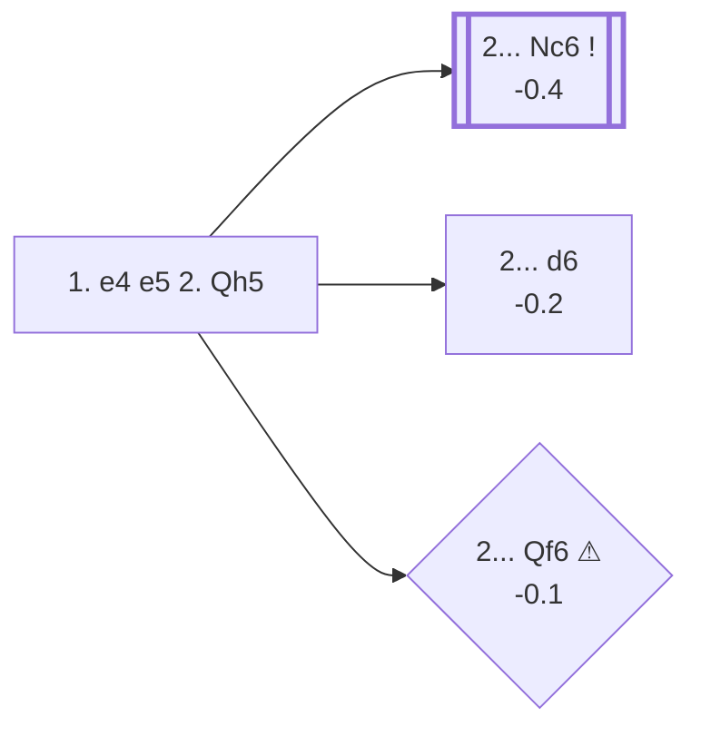

<a name="_TOP_"></a>

# C20 King's Pawn Game: Wayward Queen Attack <br> 1. e4 e5 2. Qh5 #

White brings the queen out on move 2, violating the usual advice to develop minor pieces first. The point is concrete: the queen eyes both e5 and f7, and if Black plays carelessly the game can end almost immediately. Played correctly, though, Black simply develops and the early queen sortie becomes a liability rather than a threat — chasing it around the board costs White the tempo they spent bringing it out.

### Overview

*Quick map of every move covered on this card — see the [shape key](https://github.com/onclemarcel/chess_flashcards/blob/main/start.md#content-diagram-optional) in start.md.*

<!-- content-diagram:start -->

<!-- content-diagram:end -->

<a name="_initial_move_"></a>

[](https://lichess.org/analysis/standard/rnbqkbnr/pppp1ppp/8/4p2Q/4P3/8/PPPP1PPP/RNB1KBNR_b_KQkq_-_1_2)

*... 1. e4 e5 2. Qh5 — Wayward Queen Attack (Parham Attack)*

```
rnbqkbnr/pppp1ppp/8/4p2Q/4P3/8/PPPP1PPP/RNB1KBNR b KQkq - 1 2
```

|  | -0.3 |
| --- | --- |

<!-- lichess-stats:start fen="rnbqkbnr/pppp1ppp/8/4p2Q/4P3/8/PPPP1PPP/RNB1KBNR b KQkq - 1 2" db="lichess,masters" speeds="bullet,blitz" ratings="1800,2000,2200,2500" moves="8" -->
| Move | Online | W/D/B | Masters | W/D/B | |
| :--- | ---: | :--- | ---: | :--- | :-- |
| Nc6 | 708 k (64.9%) | ⬜⬜⬜⬜⬜🟫⬛⬛⬛⬛ 53/5/43 | 43 (89.6%) | ⬜⬜⬜🟫🟫🟫🟫⬛⬛⬛ 28/37/35 |  |
| d6 | 135 k (12.3%) | ⬜⬜⬜⬜⬜🟫⬛⬛⬛⬛ 53/5/42 | 3 (6.2%) | — | ⚠ |
| Nf6 | 112 k (10.2%) | ⬜⬜⬜⬜⬜⬛⬛⬛⬛⬛ 48/4/49 | 0 | — | ⚠ |
| Qf6 | 76 k (7.0%) | ⬜⬜⬜⬜⬜🟫⬛⬛⬛⬛ 55/6/40 | 0 | — | ⚠ |
| Qe7 | 23 k (2.1%) | ⬜⬜⬜⬜⬜⬛⬛⬛⬛⬛ 51/4/45 | 1 (2.1%) | — | ⚠ |
| d5 | 11 k (1.0%) | ⬜⬜⬜⬜⬜⬛⬛⬛⬛⬛ 49/4/47 | 0 | — | ⚠ |
| g6 | 9.9 k (0.9%) | ⬜⬜⬜⬜⬜⬜⬜⬜⬛⬛ 80/3/18 | 0 | — | ⚠ |
| Bc5 | 9.7 k (0.9%) | ⬜⬜⬜⬜⬜⬜⬛⬛⬛⬛ 58/4/38 | 0 | — | ⚠ |
| Bd6 | 0 | — | 1 (2.1%) | — |  |

*Online: bullet/blitz, 1800+ — 1.1 M games. Masters: 48 games. [Open in the explorer](https://lichess.org/analysis/standard/rnbqkbnr/pppp1ppp/8/4p2Q/4P3/8/PPPP1PPP/RNB1KBNR_b_KQkq_-_1_2#explorer) — updated 2026-08-23*
<!-- lichess-stats:end -->

### Candidate moves

* [**2... Nc6**](#_Nc6_) (-0.4): defends e5 and develops a piece — the correct, near-universal reply (89.6% of masters games, 64.9% online).
* [**2... d6**](#_d6_) (-0.2): also defends e5, at the cost of blocking the f8-bishop for now.
* [**2... Qf6**](#_Qf6_) (-0.1 ⚠): an *amateur try* seen 7.0% of the time online but essentially never in masters play — it defends f7 and e5 in one move, but blocks Black's own knight from its best square.

[*Back to TOP*](#_TOP_)

---

<a name="_Nc6_"></a>

### 2... Nc6

[](https://lichess.org/analysis/standard/r1bqkbnr/pppp1ppp/2n5/4p2Q/4P3/8/PPPP1PPP/RNB1KBNR_w_KQkq_-_2_3)

*... 2... Nc6*

```
r1bqkbnr/pppp1ppp/2n5/4p2Q/4P3/8/PPPP1PPP/RNB1KBNR w KQkq - 2 3
```

|  | -0.4 |
| --- | --- |

<!-- lichess-stats:start fen="r1bqkbnr/pppp1ppp/2n5/4p2Q/4P3/8/PPPP1PPP/RNB1KBNR w KQkq - 2 3" db="lichess,masters" speeds="bullet,blitz" ratings="1800,2000,2200,2500" moves="6" -->
| Move | Online | W/D/B | Masters | W/D/B | |
| :--- | ---: | :--- | ---: | :--- | :-- |
| Bc4 | 664 k (93.5%) | ⬜⬜⬜⬜⬜🟫⬛⬛⬛⬛ 54/5/42 | 43 (100.0%) | ⬜⬜⬜🟫🟫🟫🟫⬛⬛⬛ 28/37/35 |  |
| Bb5 | 16 k (2.2%) | ⬜⬜⬜⬜🟫⬛⬛⬛⬛⬛ 42/4/54 | 0 | — | ⚠ |
| Qxf7+ | 8.2 k (1.2%) | ⬜⬜⬜⬛⬛⬛⬛⬛⬛⬛ 28/3/68 | 0 | — | ⚠ |
| Nf3 | 7.1 k (1.0%) | ⬜⬜⬜⬜🟫⬛⬛⬛⬛⬛ 43/3/53 | 0 | — | ⚠ |
| c3 | 6.1 k (0.9%) | ⬜⬜⬜⬜🟫⬛⬛⬛⬛⬛ 41/5/55 | 0 | — | ⚠ |
| Nc3 | 3.1 k (0.4%) | ⬜⬜⬜⬜⬛⬛⬛⬛⬛⬛ 40/4/56 | 0 | — | ⚠ |

*Online: bullet/blitz, 1800+ — 710 k games. Masters: 43 games. [Open in the explorer](https://lichess.org/analysis/standard/r1bqkbnr/pppp1ppp/2n5/4p2Q/4P3/8/PPPP1PPP/RNB1KBNR_w_KQkq_-_2_3#explorer) — updated 2026-08-23*
<!-- lichess-stats:end -->

> [!TIP]
> **3. Bc4** is White's only real try, and it isn't idle: with the queen on h5 and the bishop on c4 both bearing on f7, White is already threatening **4. Qxf7#** — the queen is defended by the bishop along the c4-f7 diagonal, so the king cannot recapture, and the black queen on d8 blocks the king's only other escape square. Black must react at once.
>
> <a name="_Bc4_threat_"></a>
>
> ### 2... Nc6 3. Bc4 — the mate threat
>
> [](https://lichess.org/analysis/standard/r1bqkbnr/pppp1ppp/2n5/4p2Q/2B1P3/8/PPPP1PPP/RNB1K1NR_b_KQkq_-_3_3)
>
> *... 3. Bc4 — red: the Qxf7# threat*
>
> ```
> r1bqkbnr/pppp1ppp/2n5/4p2Q/2B1P3/8/PPPP1PPP/RNB1K1NR b KQkq - 3 3
> ```
>
> |  | -0.4 |
> | --- | --- |
>
> <!-- lichess-stats:start fen="r1bqkbnr/pppp1ppp/2n5/4p2Q/2B1P3/8/PPPP1PPP/RNB1K1NR b KQkq - 3 3" db="lichess,masters" speeds="bullet,blitz" ratings="1800,2000,2200,2500" moves="6" -->
> | Move | Online | W/D/B | Masters | W/D/B | |
> | :--- | ---: | :--- | ---: | :--- | :-- |
> | g6 | 757 k (55.0%) | ⬜⬜⬜⬜⬜⬛⬛⬛⬛⬛ 51/4/45 | 41 (93.2%) | ⬜⬜⬜🟫🟫🟫⬛⬛⬛⬛ 29/34/37 |  |
> | Qf6 | 317 k (23.0%) | ⬜⬜⬜⬜⬜🟫⬛⬛⬛⬛ 52/5/43 | 1 (2.3%) | — | ⚠ |
> | Qe7 | 189 k (13.8%) | ⬜⬜⬜⬜⬜⬛⬛⬛⬛⬛ 50/4/46 | 2 (4.5%) | — | ⚠ |
> | Nf6 | 63 k (4.6%) | ⬜⬜⬜⬜⬜⬜⬜⬜⬜⬜ 95/0/5 | 0 | — | ⚠ |
> | Nh6 | 15 k (1.1%) | ⬜⬜⬜⬜⬜⬜⬛⬛⬛⬛ 55/3/42 | 0 | — | ⚠ |
> | Bc5 | 12 k (0.9%) | ⬜⬜⬜⬜⬜⬜⬜⬜⬜⬜ 99/0/1 | 0 | — | ⚠ |
> 
> *Online: bullet/blitz, 1800+ — 1.4 M games. Masters: 44 games. [Open in the explorer](https://lichess.org/analysis/standard/r1bqkbnr/pppp1ppp/2n5/4p2Q/2B1P3/8/PPPP1PPP/RNB1K1NR_b_KQkq_-_3_3#explorer) — updated 2026-08-23*
> <!-- lichess-stats:end -->
>
> Almost every reply that meets the threat is fine for Black; the only real trap is missing it entirely. The most natural is **3... g6**, gaining a tempo by attacking the queen while blocking the diagonal:
>
> [](https://lichess.org/analysis/standard/r1bqkbnr/pppp1p1p/2n3p1/4p2Q/2B1P3/8/PPPP1PPP/RNB1K1NR_w_KQkq_-_0_4)
>
> *... 3... g6 — attacking the queen*
>
> ```
> r1bqkbnr/pppp1p1p/2n3p1/4p2Q/2B1P3/8/PPPP1PPP/RNB1K1NR w KQkq - 0 4
> ```
>
> |  | -0.2 |
> | --- | --- |
>
> White's queen has to retreat, most commonly **4. Qf3**, and Black is simply better developed for the tempo White spent.
>
> [*Back to 2... Nc6*](#_Nc6_)
> [*Back to TOP*](#_TOP_)

[*Back to 2. Qh5*](#_initial_move_)
[*Back to TOP*](#_TOP_)

---

<a name="_d6_"></a>

### 2... d6

[](https://lichess.org/analysis/standard/rnbqkbnr/ppp2ppp/3p4/4p2Q/4P3/8/PPPP1PPP/RNB1KBNR_w_KQkq_-_0_3)

*... 2... d6*

```
rnbqkbnr/ppp2ppp/3p4/4p2Q/4P3/8/PPPP1PPP/RNB1KBNR w KQkq - 0 3
```

|  | -0.2 |
| --- | --- |

Also defends e5, though it blocks the f8-bishop's diagonal a move earlier than Nc6 does. White typically continues developing with **3. Bc4** or **3. Nc3**; the queen will need to move again before long regardless.

[*Back to 2. Qh5*](#_initial_move_)
[*Back to TOP*](#_TOP_)

---

<a name="_Qf6_"></a>

### 2... Qf6

[](https://lichess.org/analysis/standard/rnb1kbnr/pppp1ppp/5q2/4p2Q/4P3/8/PPPP1PPP/RNB1KBNR_w_KQkq_-_2_3)

*... 2... Qf6*

```
rnb1kbnr/pppp1ppp/5q2/4p2Q/4P3/8/PPPP1PPP/RNB1KBNR w KQkq - 2 3
```

|  | -0.1 |
| --- | --- |

An amateur-level defence: it covers both e5 and f7 in one move, but it blocks Black's own g8-knight from its natural square and puts the queen in the way of Black's own development. White simply continues **3. Nc3**, developing with tempo-free comfort.

[*Back to 2. Qh5*](#_initial_move_)
[*Back to TOP*](#_TOP_)
