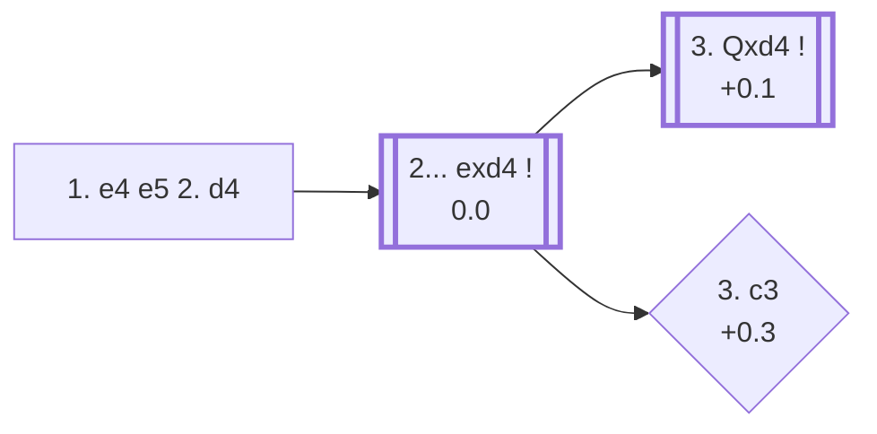

<a name="_TOP_"></a>

# C20 King's Pawn Game: Center Game <br> 1. e4 e5 2. d4 #

White strikes at the centre immediately, offering to trade the d-pawn for rapid piece activity. If Black declines to hold the balance, White can recapture with the queen and develop with tempo, or go further and offer a second pawn with the Danish Gambit for an even faster lead in development.

### Overview

*Quick map of every move covered on this card — see the [shape key](https://github.com/onclemarcel/chess_flashcards/blob/main/start.md#content-diagram-optional) in start.md. 2... Nc6 is discussed below (flagged ⚠ for a real online/masters gap) but has no anchor of its own, so it's left off this map rather than pointing nowhere.*

<!-- content-diagram:start -->

<!-- content-diagram:end -->

<a name="_initial_move_"></a>

[](https://lichess.org/analysis/standard/rnbqkbnr/pppp1ppp/8/4p3/3PP3/8/PPP2PPP/RNBQKBNR_b_KQkq_d3_0_2)

*... 1. e4 e5 2. d4 — Center Game*

```
rnbqkbnr/pppp1ppp/8/4p3/3PP3/8/PPP2PPP/RNBQKBNR b KQkq d3 0 2
```

|  | -0.1 |
| --- | --- |

<!-- lichess-stats:start fen="rnbqkbnr/pppp1ppp/8/4p3/3PP3/8/PPP2PPP/RNBQKBNR b KQkq d3 0 2" db="lichess,masters" speeds="bullet,blitz" ratings="1800,2000,2200,2500" moves="8" -->
| Move | Online | W/D/B | Masters | W/D/B | |
| :--- | ---: | :--- | ---: | :--- | :-- |
| exd4 | 15.1 M (65.2%) | ⬜⬜⬜⬜⬜🟫⬛⬛⬛⬛ 53/4/43 | 1.8 k (95.3%) | ⬜⬜⬜🟫🟫🟫🟫⬛⬛⬛ 30/36/34 |  |
| Nc6 | 4.5 M (19.3%) | ⬜⬜⬜⬜⬜⬛⬛⬛⬛⬛ 52/3/45 | 28 (1.5%) | ⬜⬜⬜⬜🟫🟫🟫⬛⬛⬛ 36/32/32 |  |
| d6 | 1.4 M (6.0%) | ⬜⬜⬜⬜⬜🟫⬛⬛⬛⬛ 52/5/43 | 37 (2.0%) | ⬜⬜⬜⬜⬜🟫🟫⬛⬛⬛ 54/22/24 |  |
| Nf6 | 994 k (4.3%) | ⬜⬜⬜⬜⬜⬛⬛⬛⬛⬛ 51/4/45 | 9 (0.5%) | — |  |
| d5 | 505 k (2.2%) | ⬜⬜⬜⬜⬜🟫⬛⬛⬛⬛ 53/4/43 | 10 (0.5%) | — |  |
| f5 | 223 k (1.0%) | ⬜⬜⬜⬜⬜⬜⬛⬛⬛⬛ 55/3/42 | 0 | — | ⚠ |
| Qf6 | 122 k (0.5%) | ⬜⬜⬜⬜⬜⬜⬛⬛⬛⬛ 57/3/40 | 0 | — | ⚠ |
| Bc5 | 85 k (0.4%) | ⬜⬜⬜⬜⬜⬜⬜⬛⬛⬛ 68/3/29 | 0 | — | ⚠ |
| Qh4 | 0 | — | 1 (0.1%) | — |  |
| g6 | 0 | — | 1 (0.1%) | — |  |
| b6 | 0 | — | 1 (0.1%) | — |  |

*Online: bullet/blitz, 1800+ — 23.2 M games. Masters: 1.9 k games. [Open in the explorer](https://lichess.org/analysis/standard/rnbqkbnr/pppp1ppp/8/4p3/3PP3/8/PPP2PPP/RNBQKBNR_b_KQkq_d3_0_2#explorer) — updated 2026-08-24*
<!-- lichess-stats:end -->

### Candidate moves

* [**2... exd4**](#_exd4_) (0.0): capturing is essentially forced at the top level — 95.3% of masters games — since declining lets White simply keep the extra central pawn for free.
* **2... Nc6** (+0.4 ⚠): declining the pawn and developing instead, protecting e5 a second time. Reasonably common online (19.3%) but rare in masters play (1.5%) — after **3. dxe5 Nxe5**, White simply keeps a small, safe edge.

[*Back to TOP*](#_TOP_)

---

<a name="_exd4_"></a>

### 2... exd4

[](https://lichess.org/analysis/standard/rnbqkbnr/pppp1ppp/8/8/3pP3/8/PPP2PPP/RNBQKBNR_w_KQkq_-_0_3)

*... 2... exd4*

```
rnbqkbnr/pppp1ppp/8/8/3pP3/8/PPP2PPP/RNBQKBNR w KQkq - 0 3
```

|  | 0.0 |
| --- | --- |

<!-- lichess-stats:start fen="rnbqkbnr/pppp1ppp/8/8/3pP3/8/PPP2PPP/RNBQKBNR w KQkq - 0 3" db="lichess,masters" speeds="bullet,blitz" ratings="1800,2000,2200,2500" moves="6" -->
| Move | Online | W/D/B | Masters | W/D/B | |
| :--- | ---: | :--- | ---: | :--- | :-- |
| c3 | 6.5 M (43.3%) | ⬜⬜⬜⬜⬜🟫⬛⬛⬛⬛ 53/4/43 | 200 (11.2%) | ⬜⬜🟫🟫🟫🟫⬛⬛⬛⬛ 16/44/40 |  |
| Nf3 | 3.9 M (25.6%) | ⬜⬜⬜⬜⬜🟫⬛⬛⬛⬛ 54/4/42 | 450 (25.3%) | ⬜⬜⬜🟫🟫🟫🟫⬛⬛⬛ 32/42/26 |  |
| Qxd4 | 3.4 M (22.3%) | ⬜⬜⬜⬜⬜🟫⬛⬛⬛⬛ 53/4/43 | 1.1 k (59.8%) | ⬜⬜⬜🟫🟫🟫⬛⬛⬛⬛ 31/33/36 |  |
| Bc4 | 684 k (4.5%) | ⬜⬜⬜⬜⬜🟫⬛⬛⬛⬛ 53/4/44 | 42 (2.4%) | ⬜⬜⬜🟫🟫🟫⬛⬛⬛⬛ 36/26/38 |  |
| f4 | 430 k (2.9%) | ⬜⬜⬜⬜⬜⬛⬛⬛⬛⬛ 50/3/47 | 21 (1.2%) | ⬜⬜⬜🟫🟫⬛⬛⬛⬛⬛ 24/24/52 |  |
| Bd3 | 112 k (0.7%) | ⬜⬜⬜⬜⬜⬛⬛⬛⬛⬛ 52/3/45 | 0 | — | ⚠ |
| Ne2 | 0 | — | 1 (0.1%) | — |  |

*Online: bullet/blitz, 1800+ — 15.1 M games. Masters: 1.8 k games. [Open in the explorer](https://lichess.org/analysis/standard/rnbqkbnr/pppp1ppp/8/8/3pP3/8/PPP2PPP/RNBQKBNR_w_KQkq_-_0_3#explorer) — updated 2026-08-24*
<!-- lichess-stats:end -->

> [!NOTE]
> Masters recapture immediately with **3. Qxd4** roughly three times out of five (59.8%); online, that drops to 22.3%, and the *Danish Gambit* (**3. c3**) becomes the single most popular try instead (43.3%) — offering a second pawn for an even faster development lead, a much sharper and more forcing choice that rewards preparation more than accuracy.

* [**3. Qxd4**](#_Qxd4_) (+0.1): the simple, principled recapture — masters' main line.
* [**3. c3**](#_c3_) (+0.3): the *Danish Gambit* — offering a second pawn (and often a third with 3... dxc3 4. Bc4) to open lines toward f7 before Black can finish developing.

[*Back to 2. d4*](#_initial_move_)
[*Back to TOP*](#_TOP_)

---

<a name="_Qxd4_"></a>

### 3. Qxd4

[](https://lichess.org/analysis/standard/rnbqkbnr/pppp1ppp/8/8/3QP3/8/PPP2PPP/RNB1KBNR_b_KQkq_-_0_3)

*... 3. Qxd4*

```
rnbqkbnr/pppp1ppp/8/8/3QP3/8/PPP2PPP/RNB1KBNR b KQkq - 0 3
```

|  | 0.0 |
| --- | --- |

The queen sits centrally but is exposed. Black almost always continues **3... Nc6**, developing with tempo against the queen, which typically retreats to e3 or d1 while White finishes development with Nc3, Bc4/Be2, and eventually 0-0-0 or 0-0.

[*Back to 2... exd4*](#_exd4_)
[*Back to TOP*](#_TOP_)

---

<a name="_c3_"></a>

### 3. c3 — Danish Gambit

[](https://lichess.org/analysis/standard/rnbqkbnr/pppp1ppp/8/8/3pP3/2P5/PP3PPP/RNBQKBNR_b_KQkq_-_0_3)

*... 3. c3 — Danish Gambit*

```
rnbqkbnr/pppp1ppp/8/8/3pP3/2P5/PP3PPP/RNBQKBNR b KQkq - 0 3
```

|  | +0.3 |
| --- | --- |

If Black accepts with **3... dxc3**, White typically continues **4. Bc4**, developing onto the same active diagonal seen in the Bishop's/Italian openings while offering yet another pawn (**4... cxb2 5. Bxb2**) for a huge lead in development and open lines against f7. Well-prepared, Black can decline or return the material to reach a safe position; a Danish Gambit specialist can make this very dangerous over the board, which is why the engine's modest evaluation understates its practical bite.

[*Back to 2... exd4*](#_exd4_)
[*Back to TOP*](#_TOP_)
