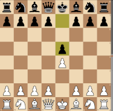
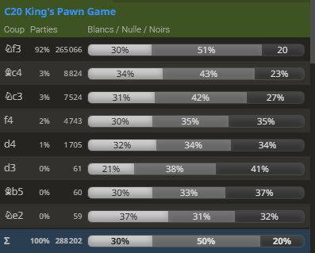

# 1. e4 e5 : The King's Pawn Game (KPG) (C20) #
 

By mirroring White's move, Black grabs an equal share of the centre and scope to develop some pieces. 1...e5 is also one of the few moves that directly interferes with White's ideal plan of playing d4. 
Black's pawn on e5 is undefended, so it is easy for White to develop in a way that restricts Black's possible responses by threatening to capture it. This is White's most common plan, but they may also chose to develop without attacking. 
 

 

     
    The King's Pawn Game 1. e4 e5  
    <table align="center"><tr> 
    <td valign="center"></td><td>+0.2</td></tr></table>
 
 
 

 

- White may try to:
    - Attack Black's undefended e5 pawn directly.
    - Develop a piece.
    - Play for traps.
    - Play unusual opening moves.
  
- [**2. Nf3**](./C40_Nf3_King_Knight.md) (+0.1) : **2. Nf3** leads to the [King's Knight Opening (C40)](./C40_Nf3_King_Knight.md), White directly attacks the pawn while also developing a piece. Additionally, it controls the d4 square, ready to support a future d4 pawn push, and starts to make room for White to castle. This move represents 92% of King's Pawn masters games.
- [**2. f4**](./C30_f4_King_Gambit.md) (-0.4) : [the King's gambit](./C30_f4_King_Gambit.md), confronts the e5 pawn and tries to lever open the f-file for an attack on Black's weak f7 pawn. This is the quintessential Romantic chess opening, popular with the likes of Paul Morphy. A prepared Black player should be able to grab the proffered pawn and keep it. 
- [**2. d4**](./C20_d4_Center_Game.md) (-0.1) : [the Centre Game](./C20_d4_Center_Game.md) smashes the centre open. White can then sacrifice a pawn or two to develop pieces with great speed (2...exd4 3. c3, the Danish gambit).
  
  

 [*Back to initial move*](#_initial_move_)  
 [*Back to TOP*](#_TOP_)

