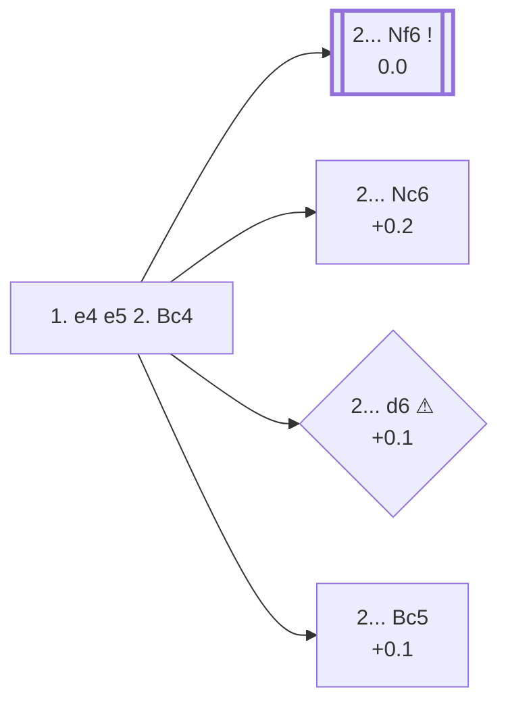

<a name="_TOP_"></a>

# C23 Bishop's Opening <br> 1. e4 e5 2. Bc4 #

White develops the bishop to its most active diagonal at once, eyeing f7 and preventing ... d5, while keeping the king's knight flexible — it can go to f3, e2, or even stay home a move longer to support an early **d4**. The drawback is that e4 stays undefended for now, unlike after 2. Nf3.

### Overview

*Quick map of every move covered on this card — see the [shape key](https://github.com/onclemarcel/chess_flashcards/blob/main/start.md#content-diagram-optional) in start.md.*

<!-- content-diagram:start -->

<!-- content-diagram:end -->

<a name="_initial_move_"></a>

[](https://lichess.org/analysis/standard/rnbqkbnr/pppp1ppp/8/4p3/2B1P3/8/PPPP1PPP/RNBQK1NR_b_KQkq_-_1_2)

*... 1. e4 e5 2. Bc4 — Bishop's Opening*

```
rnbqkbnr/pppp1ppp/8/4p3/2B1P3/8/PPPP1PPP/RNBQK1NR b KQkq - 1 2
```

|  | 0.0 |
| --- | --- |

<!-- lichess-stats:start fen="rnbqkbnr/pppp1ppp/8/4p3/2B1P3/8/PPPP1PPP/RNBQK1NR b KQkq - 1 2" db="lichess,masters" speeds="bullet,blitz" ratings="1800,2000,2200,2500" moves="8" -->
| Move | Online | W/D/B | Masters | W/D/B | |
| :--- | ---: | :--- | ---: | :--- | :-- |
| Nc6 | 8.2 M (40.0%) | ⬜⬜⬜⬜⬜⬛⬛⬛⬛⬛ 49/4/46 | 1.2 k (13.2%) | ⬜⬜⬜⬜🟫🟫🟫🟫⬛⬛ 38/37/25 |  |
| Nf6 | 6.4 M (31.6%) | ⬜⬜⬜⬜⬜⬛⬛⬛⬛⬛ 50/4/46 | 7.8 k (83.2%) | ⬜⬜⬜🟫🟫🟫🟫🟫⬛⬛ 33/45/22 |  |
| d6 | 2.0 M (9.9%) | ⬜⬜⬜⬜⬜⬛⬛⬛⬛⬛ 51/4/44 | 91 (1.0%) | ⬜⬜⬜⬜🟫🟫🟫⬛⬛⬛ 42/34/24 |  |
| Bc5 | 1.9 M (9.5%) | ⬜⬜⬜⬜⬜⬛⬛⬛⬛⬛ 51/4/45 | 175 (1.9%) | ⬜⬜⬜⬜🟫🟫🟫🟫⬛⬛ 42/39/19 |  |
| c6 | 503 k (2.5%) | ⬜⬜⬜⬜⬜⬛⬛⬛⬛⬛ 49/4/47 | 48 (0.5%) | ⬜⬜⬜🟫🟫🟫🟫⬛⬛⬛ 33/40/27 |  |
| f5 | 366 k (1.8%) | ⬜⬜⬜⬜⬜⬛⬛⬛⬛⬛ 48/3/49 | 12 (0.1%) | — |  |
| d5 | 269 k (1.3%) | ⬜⬜⬜⬜⬜⬛⬛⬛⬛⬛ 47/3/50 | 0 | — | ⚠ |
| Qf6 | 189 k (0.9%) | ⬜⬜⬜⬜⬜⬛⬛⬛⬛⬛ 48/4/48 | 0 | — | ⚠ |
| Be7 | 0 | — | 6 (0.1%) | — |  |
| c5 | 0 | — | 1 (0.0%) | — |  |

*Online: bullet/blitz, 1800+ — 20.4 M games. Masters: 9.3 k games. [Open in the explorer](https://lichess.org/analysis/standard/rnbqkbnr/pppp1ppp/8/4p3/2B1P3/8/PPPP1PPP/RNBQK1NR_b_KQkq_-_1_2#explorer) — updated 2026-08-24*
<!-- lichess-stats:end -->

### Candidate moves

* [**2... Nf6**](#_Nf6_) (0.0): attacks e4 directly and is masters' overwhelming preference here (83.2% of masters games) — the *Berlin Defense* to the Bishop's Opening.
* [**2... Nc6**](#_Nc6_) (+0.2): quiet development, keeping options flexible; the second-most common try in both populations, though far more popular online (40.0%) than in masters play (13.2%).
* [**2... d6**](#_d6_) (+0.1 ⚠): a passive setup, played 9.9% of the time online but almost never by masters (1.0%) — a real online/masters gap.
* **2... Bc5** (+0.1): symmetric development, mirroring White's own bishop move.

[*Back to TOP*](#_TOP_)

---

<a name="_Nf6_"></a>

### 2... Nf6

By attacking e4 immediately, Black denies White the leisurely development the Bishop's Opening usually offers.

[](https://lichess.org/analysis/standard/rnbqkb1r/pppp1ppp/5n2/4p3/2B1P3/8/PPPP1PPP/RNBQK1NR_w_KQkq_-_2_3)

*... 2... Nf6*

```
rnbqkb1r/pppp1ppp/5n2/4p3/2B1P3/8/PPPP1PPP/RNBQK1NR w KQkq - 2 3
```

|  | +0.1 |
| --- | --- |

<!-- lichess-stats:start fen="rnbqkb1r/pppp1ppp/5n2/4p3/2B1P3/8/PPPP1PPP/RNBQK1NR w KQkq - 2 3" db="lichess,masters" speeds="bullet,blitz" ratings="1800,2000,2200,2500" moves="6" -->
| Move | Online | W/D/B | Masters | W/D/B | |
| :--- | ---: | :--- | ---: | :--- | :-- |
| d3 | 2.4 M (36.9%) | ⬜⬜⬜⬜⬜⬛⬛⬛⬛⬛ 49/5/46 | 6.7 k (86.4%) | ⬜⬜⬜🟫🟫🟫🟫🟫⬛⬛ 34/45/22 |  |
| Nc3 | 1.4 M (22.1%) | ⬜⬜⬜⬜⬜⬛⬛⬛⬛⬛ 50/4/46 | 465 (6.0%) | ⬜⬜⬜⬜🟫🟫🟫🟫⬛⬛ 35/41/25 |  |
| Nf3 | 1.1 M (17.3%) | ⬜⬜⬜⬜⬜⬛⬛⬛⬛⬛ 49/4/47 | 47 (0.6%) | ⬜⬜🟫🟫🟫⬛⬛⬛⬛⬛ 21/28/51 |  |
| d4 | 842 k (13.0%) | ⬜⬜⬜⬜⬜⬜⬛⬛⬛⬛ 55/4/41 | 447 (5.8%) | ⬜⬜⬜🟫🟫🟫🟫🟫⬛⬛ 27/52/21 |  |
| Qf3 | 298 k (4.6%) | ⬜⬜⬜⬜⬜⬛⬛⬛⬛⬛ 49/4/46 | 12 (0.2%) | — |  |
| Bxf7+ | 166 k (2.6%) | ⬜⬜⬜⬜⬜⬛⬛⬛⬛⬛ 50/3/47 | 0 | — | ⚠ |
| Qe2 | 0 | — | 80 (1.0%) | ⬜⬜⬜⬜🟫🟫🟫🟫⬛⬛ 41/39/20 |  |

*Online: bullet/blitz, 1800+ — 6.5 M games. Masters: 7.8 k games. [Open in the explorer](https://lichess.org/analysis/standard/rnbqkb1r/pppp1ppp/5n2/4p3/2B1P3/8/PPPP1PPP/RNBQK1NR_w_KQkq_-_2_3#explorer) — updated 2026-08-24*
<!-- lichess-stats:end -->

> [!NOTE]
> **3. d3** is masters' near-unanimous reply here (86.4% of masters games) — the *Modern Bishop's Opening*, quietly defending e4 and preparing a slow build-up — but only their top choice online by a much smaller margin (36.9%), where **3. Nc3**, **3. Nf3**, and even the immediate **3. d4** are all tried in real numbers. This card and [C50 Italian](https://github.com/onclemarcel/chess_flashcards/blob/main/e4_openings/C50_Italian.md) converge on the same 3. d3 tabiya whenever Black meets either opening with ... Nf6 — *pending its own dedicated card*.

* **3. d3** (+0.1): defends e4 and keeps the position flexible — masters' overwhelming preference (86.4%).
* **3. Nc3** (+0.1): develops a piece, defending e4 indirectly and inviting transposition to Vienna/Four Knights structures.
* **3. Nf3** (+0.1): the simplest defence, transposing straight into the Italian Game after ... Nc6.

[*Back to 2. Bc4*](#_initial_move_)
[*Back to TOP*](#_TOP_)

---

<a name="_Nc6_"></a>

### 2... Nc6

[](https://lichess.org/analysis/standard/r1bqkbnr/pppp1ppp/2n5/4p3/2B1P3/8/PPPP1PPP/RNBQK1NR_w_KQkq_-_2_3)

*... 2... Nc6*

```
r1bqkbnr/pppp1ppp/2n5/4p3/2B1P3/8/PPPP1PPP/RNBQK1NR w KQkq - 2 3
```

|  | +0.2 |
| --- | --- |

White most naturally continues **3. Nf3**, transposing straight into Italian Game theory a move order Black cannot avoid once both minor developing moves are on the board.

[*Back to 2. Bc4*](#_initial_move_)
[*Back to TOP*](#_TOP_)

---

<a name="_d6_"></a>

### 2... d6

[](https://lichess.org/analysis/standard/rnbqkbnr/ppp2ppp/3p4/4p3/2B1P3/8/PPPP1PPP/RNBQK1NR_w_KQkq_-_0_3)

*... 2... d6*

```
rnbqkbnr/ppp2ppp/3p4/4p3/2B1P3/8/PPPP1PPP/RNBQK1NR w KQkq - 0 3
```

|  | +0.1 |
| --- | --- |

Solid but passive — Black gives up the fight for a fast game and lets White build a broad centre with **3. d4** or **3. Nf3** at no cost.

[*Back to 2. Bc4*](#_initial_move_)
[*Back to TOP*](#_TOP_)

---

<a name="_Bc5_"></a>

### 2... Bc5

[](https://lichess.org/analysis/standard/rnbqk1nr/pppp1ppp/8/2b1p3/2B1P3/8/PPPP1PPP/RNBQK1NR_w_KQkq_-_2_3)

*... 2... Bc5*

```
rnbqk1nr/pppp1ppp/8/2b1p3/2B1P3/8/PPPP1PPP/RNBQK1NR w KQkq - 2 3
```

|  | +0.1 |
| --- | --- |

A symmetrical try. White continues developing with **3. Nf3** or **3. c3**, preparing d4 and aiming for a favourable version of Italian-style structures since Black's knight isn't yet on c6.

[*Back to 2. Bc4*](#_initial_move_)
[*Back to TOP*](#_TOP_)
