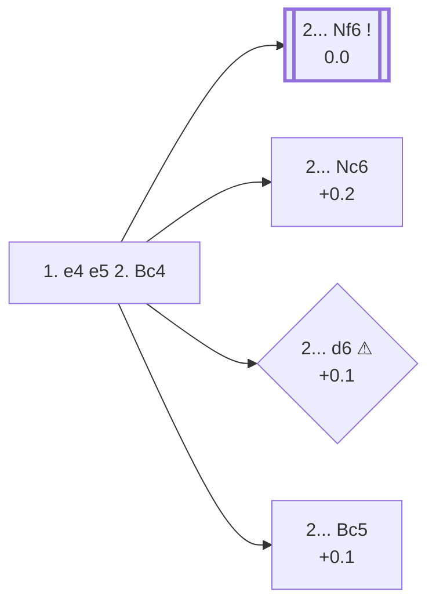

<a name="_TOP_"></a>

# C23 Bishop's Opening <br> 1. e4 e5 2. Bc4 #

White develops the bishop to its most active diagonal at once, eyeing f7 and preventing ... d5, while keeping the king's knight flexible — it can go to f3, e2, or even stay home a move longer to support an early **d4**. The drawback is that e4 stays undefended for now, unlike after 2. Nf3.

### Overview

*Quick map of every move covered on this card — see the [shape key](https://github.com/onclemarcel/chess_flashcards/blob/main/start.md#content-diagram-optional) in start.md.*

<!-- content-diagram:start -->

<!-- content-diagram:end -->

<a name="_initial_move_"></a>

[](https://lichess.org/analysis/standard/rnbqkbnr/pppp1ppp/8/4p3/2B1P3/8/PPPP1PPP/RNBQK1NR_b_KQkq_-_1_2)

*... 1. e4 e5 2. Bc4 — Bishop's Opening*

```
rnbqkbnr/pppp1ppp/8/4p3/2B1P3/8/PPPP1PPP/RNBQK1NR b KQkq - 1 2
```

|  | 0.0 |
| --- | --- |

<!-- lichess-stats:start fen="rnbqkbnr/pppp1ppp/8/4p3/2B1P3/8/PPPP1PPP/RNBQK1NR b KQkq - 1 2" db="lichess,masters" speeds="bullet,blitz" ratings="1800,2000,2200,2500" moves="8" -->
| Move | Online | W/D/B | Masters | W/D/B | |
| :--- | ---: | :--- | ---: | :--- | :-- |
| Nc6 | 8.2 M (40.0%) | ⬜⬜⬜⬜⬜⬛⬛⬛⬛⬛ 49/4/46 | 1.2 k (13.2%) | ⬜⬜⬜⬜🟫🟫🟫🟫⬛⬛ 38/37/25 |  |
| Nf6 | 6.4 M (31.6%) | ⬜⬜⬜⬜⬜⬛⬛⬛⬛⬛ 50/4/46 | 7.8 k (83.2%) | ⬜⬜⬜🟫🟫🟫🟫🟫⬛⬛ 33/45/22 |  |
| d6 | 2.0 M (9.9%) | ⬜⬜⬜⬜⬜⬛⬛⬛⬛⬛ 51/4/44 | 91 (1.0%) | ⬜⬜⬜⬜🟫🟫🟫⬛⬛⬛ 42/34/24 |  |
| Bc5 | 1.9 M (9.5%) | ⬜⬜⬜⬜⬜⬛⬛⬛⬛⬛ 51/4/45 | 175 (1.9%) | ⬜⬜⬜⬜🟫🟫🟫🟫⬛⬛ 42/39/19 |  |
| c6 | 503 k (2.5%) | ⬜⬜⬜⬜⬜⬛⬛⬛⬛⬛ 49/4/47 | 48 (0.5%) | ⬜⬜⬜🟫🟫🟫🟫⬛⬛⬛ 33/40/27 |  |
| f5 | 366 k (1.8%) | ⬜⬜⬜⬜⬜⬛⬛⬛⬛⬛ 48/3/49 | 12 (0.1%) | — |  |
| d5 | 269 k (1.3%) | ⬜⬜⬜⬜⬜⬛⬛⬛⬛⬛ 47/3/50 | 0 | — | ⚠ |
| Qf6 | 189 k (0.9%) | ⬜⬜⬜⬜⬜⬛⬛⬛⬛⬛ 48/4/48 | 0 | — | ⚠ |
| Be7 | 0 | — | 6 (0.1%) | — |  |
| c5 | 0 | — | 1 (0.0%) | — |  |

*Online: bullet/blitz, 1800+ — 20.4 M games. Masters: 9.3 k games. [Open in the explorer](https://lichess.org/analysis/standard/rnbqkbnr/pppp1ppp/8/4p3/2B1P3/8/PPPP1PPP/RNBQK1NR_b_KQkq_-_1_2#explorer) — updated 2026-09-06*
<!-- lichess-stats:end -->

### Candidate moves

* [**2... Nf6**](https://github.com/onclemarcel/chess_flashcards/blob/main/e4_openings/C24_Bishop_Opening_Berlin_Defense.md) (0.0): attacks e4 directly and is masters' overwhelming preference here (83.2% of masters games) — already live-tagged **C24**, the *Berlin Defense* — see `C24_Bishop_Opening_Berlin_Defense.md`, not built out further here.
* [**2... Nc6**](#_Nc6_) (+0.2): quiet development, keeping options flexible; the second-most common try in both populations, though far more popular online (40.0%) than in masters play (13.2%).
* [**2... d6**](#_d6_) (+0.1 ⚠): a passive setup, played 9.9% of the time online but almost never by masters (1.0%) — a real online/masters gap.
* [**2... Bc5**](#_Bc5_) (+0.1): symmetric development, mirroring White's own bishop move — live-tagged the *Boi Variation*, a name `eco.md`'s own "Classical Variation" label doesn't carry. See below.
* [**2... c6**](#_PhilidorCA_) (0.5% masters): the *Philidor Counterattack* — see below.
* [**2... f5**](#_Calabrese_) (0.1% masters): the *Calabrese Countergambit* — see below.

[*Back to TOP*](#_TOP_)

---

<a name="_Nc6_"></a>

### 2... Nc6

[](https://lichess.org/analysis/standard/r1bqkbnr/pppp1ppp/2n5/4p3/2B1P3/8/PPPP1PPP/RNBQK1NR_w_KQkq_-_2_3)

*... 2... Nc6*

```
r1bqkbnr/pppp1ppp/2n5/4p3/2B1P3/8/PPPP1PPP/RNBQK1NR w KQkq - 2 3
```

|  | +0.2 |
| --- | --- |

White most naturally continues **3. Nf3**, transposing straight into Italian Game theory a move order Black cannot avoid once both minor developing moves are on the board.

[*Back to 2. Bc4*](#_initial_move_)
[*Back to TOP*](#_TOP_)

---

<a name="_d6_"></a>

### 2... d6

[](https://lichess.org/analysis/standard/rnbqkbnr/ppp2ppp/3p4/4p3/2B1P3/8/PPPP1PPP/RNBQK1NR_w_KQkq_-_0_3)

*... 2... d6*

```
rnbqkbnr/ppp2ppp/3p4/4p3/2B1P3/8/PPPP1PPP/RNBQK1NR w KQkq - 0 3
```

|  | +0.1 |
| --- | --- |

Solid but passive — Black gives up the fight for a fast game and lets White build a broad centre with **3. d4** or **3. Nf3** at no cost.

[*Back to 2. Bc4*](#_initial_move_)
[*Back to TOP*](#_TOP_)

---

<a name="_Bc5_"></a>

### 2... Bc5 — Boi Variation

[](https://lichess.org/analysis/standard/rnbqk1nr/pppp1ppp/8/2b1p3/2B1P3/8/PPPP1PPP/RNBQK1NR_w_KQkq_-_2_3)

*... 2... Bc5 — Boi Variation*

```
rnbqk1nr/pppp1ppp/8/2b1p3/2B1P3/8/PPPP1PPP/RNBQK1NR w KQkq - 2 3
```

|  | +0.1 |
| --- | --- |

<!-- lichess-stats:start fen="rnbqk1nr/pppp1ppp/8/2b1p3/2B1P3/8/PPPP1PPP/RNBQK1NR w KQkq - 2 3" db="lichess,masters" speeds="bullet,blitz" ratings="1800,2000,2200,2500" moves="4" -->
| Move | Online | W/D/B | Masters | W/D/B | |
| :--- | ---: | :--- | ---: | :--- | :-- |
| Nf3 | 562 k (28.9%) | ⬜⬜⬜⬜⬜⬛⬛⬛⬛⬛ 50/4/46 | 92 (52.6%) | ⬜⬜⬜⬜🟫🟫🟫🟫⬛⬛ 41/37/22 |  |
| Nc3 | 329 k (16.9%) | ⬜⬜⬜⬜⬜🟫⬛⬛⬛⬛ 52/4/44 | 51 (29.1%) | ⬜⬜⬜⬜🟫🟫🟫🟫⬛⬛ 39/39/22 |  |
| d3 | 314 k (16.1%) | ⬜⬜⬜⬜⬜⬛⬛⬛⬛⬛ 50/4/46 | 18 (10.3%) | — |  |
| Qh5 | 193 k (9.9%) | ⬜⬜⬜⬜⬜⬜⬛⬛⬛⬛ 57/5/38 | 0 | — | ⚠ |
| c3 | 0 | — | 5 (2.9%) | — |  |

*Online: bullet/blitz, 1800+ — 1.9 M games. Masters: 175 games. [Open in the explorer](https://lichess.org/analysis/standard/rnbqk1nr/pppp1ppp/8/2b1p3/2B1P3/8/PPPP1PPP/RNBQK1NR_w_KQkq_-_2_3#explorer) — updated 2026-09-06*
<!-- lichess-stats:end -->

**3. Nf3** is masters' clear main try (52.6%), transposing toward Italian-style structures. `eco.md` names nine further tries here, all real if narrow-sample, none built out further here:

* **3. Qe2 Nc6 4. c3 Nf6 5. f4**: the *Lopez Gambit* — Stockfish already rates it clearly better for Black (−2.6), a genuinely unsound try despite the name.
* **3. c3**: the *Philidor Variation* — dead level per Stockfish (−0.1).
* **3. c3 Nf6 4. d4 exd4 5. e5 d5 6. exf6 dxc4 7. Qh5 O-O**: the *Pratt Variation* — a real database rarity, no cached engine eval at this depth.
* **3. c3 d5**: the *Lewis Counter-Gambit* — dead level (0.0).
* **3. c3 Qg5**: the *del Rio Variation* — dead level (+0.1).
* **3. d4**: the *Lewis Gambit* — dead level (0.0).
* **3. b4**: the *Wing Gambit* — dead level (0.0).
* **3. b4 Bxb4 4. f4**: the *MacDonnell double Gambit* — Stockfish already rates it a real edge for Black (−1.2), another gambit that isn't objectively rewarded.
* **3. b4 Bxb4 4. f4 exf4 5. Nf3 Be7 6. d4 Bh4 7. g3 fxg3 8. O-O gxh2 9. Kh1**: the *Four Pawns' Gambit* — the deepest single line on this card, a real database rarity with no cached engine eval at this depth.

[*Back to 2. Bc4*](#_initial_move_)
[*Back to TOP*](#_TOP_)

---

<a name="_PhilidorCA_"></a>

### 2... c6 — Philidor Counterattack

[](https://lichess.org/analysis/standard/rnbqkbnr/pp1p1ppp/2p5/4p3/2B1P3/8/PPPP1PPP/RNBQK1NR_w_KQkq_-_0_3)

*... 2... c6 — Philidor Counterattack*

```
rnbqkbnr/pp1p1ppp/2p5/4p3/2B1P3/8/PPPP1PPP/RNBQK1NR w KQkq - 0 3
```

|  | +0.4 |
| --- | --- |

A real database rarity (0.5% masters, 2.5% online) — Black prepares ... d5 before playing it, the same idea as the French/Caro-Kann but a tempo down since White's bishop is already committed to c4. **3. d4 d5 4. exd5 cxd5 5. Bb5+ Bd7 6. Bxd7+ Nxd7 7. dxe5 Nxe5 8. Ne2** is the *Lisitsyn Variation* — genuinely dead level per Stockfish (−0.1). Deeper theory not covered further here.

[*Back to 2. Bc4*](#_initial_move_)
[*Back to TOP*](#_TOP_)

---

<a name="_Calabrese_"></a>

### 2... f5 — Calabrese Countergambit

[](https://lichess.org/analysis/standard/rnbqkbnr/pppp2pp/8/4pp2/2B1P3/8/PPPP1PPP/RNBQK1NR_w_KQkq_f6_0_3)

*... 2... f5 — Calabrese Countergambit*

```
rnbqkbnr/pppp2pp/8/4pp2/2B1P3/8/PPPP1PPP/RNBQK1NR w KQkq f6 0 3
```

|  | +0.9 |
| --- | --- |

A genuine database rarity (0.1% masters) — offers a pawn to open the f-file, in the spirit of the King's Gambit with colours reversed, though Stockfish already rates it a real, above-average edge for White (+0.9). **3. d3** is the *Jaenisch Variation*, masters' own main try there (66.7%) and a further real edge for White (+0.5). Deeper theory not covered further here.

[*Back to 2. Bc4*](#_initial_move_)
[*Back to TOP*](#_TOP_)
