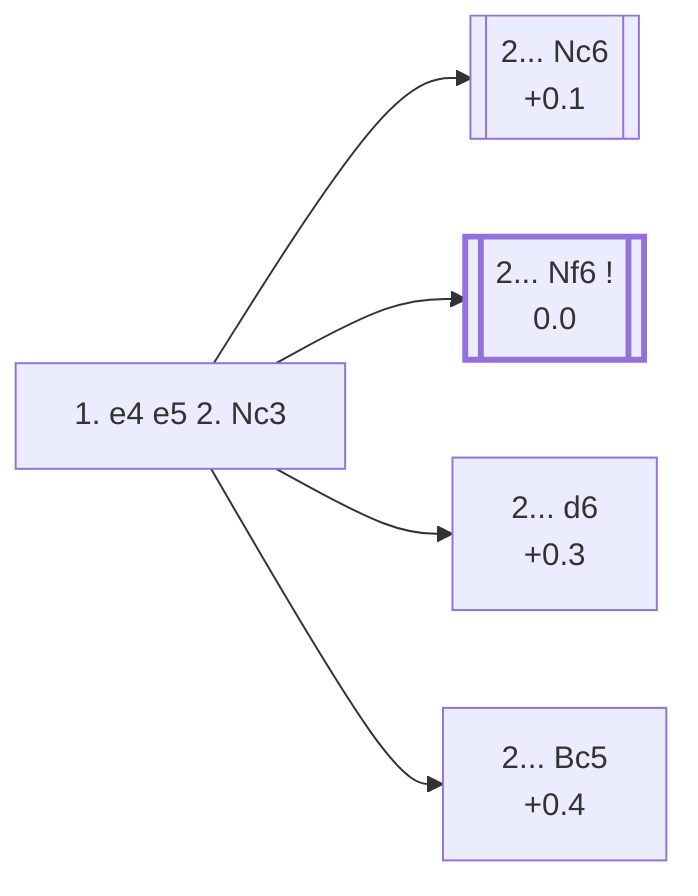

<a name="_TOP_"></a>

# C25 Vienna Game <br> 1. e4 e5 2. Nc3 #

White develops a piece without committing to an immediate attack on e5, keeping several plans in reserve: a later **f4** (the Vienna Gambit), a fianchetto with **g3**, or a quiet **Bc4**/**Nf3** setup that can transpose into other King's Pawn openings. Nc3 also covers d5, discouraging Black from mirroring White's own central ambitions.

### Overview

*Quick map of every move covered on this card — see the [shape key](https://github.com/onclemarcel/chess_flashcards/blob/main/start.md#content-diagram-optional) in start.md.*

<!-- content-diagram:start -->

<!-- content-diagram:end -->

<a name="_initial_move_"></a>

[](https://lichess.org/analysis/standard/rnbqkbnr/pppp1ppp/8/4p3/4P3/2N5/PPPP1PPP/R1BQKBNR_b_KQkq_-_1_2)

*... 1. e4 e5 2. Nc3 — Vienna Game*

```
rnbqkbnr/pppp1ppp/8/4p3/4P3/2N5/PPPP1PPP/R1BQKBNR b KQkq - 1 2
```

|  | +0.1 |
| --- | --- |

<!-- lichess-stats:start fen="rnbqkbnr/pppp1ppp/8/4p3/4P3/2N5/PPPP1PPP/R1BQKBNR b KQkq - 1 2" db="lichess,masters" speeds="bullet,blitz" ratings="1800,2000,2200,2500" moves="8" -->
| Move | Online | W/D/B | Masters | W/D/B | |
| :--- | ---: | :--- | ---: | :--- | :-- |
| Nc6 | 13.4 M (48.2%) | ⬜⬜⬜⬜⬜⬛⬛⬛⬛⬛ 51/4/44 | 1.8 k (22.1%) | ⬜⬜⬜🟫🟫🟫🟫⬛⬛⬛ 33/39/28 |  |
| Nf6 | 7.1 M (25.4%) | ⬜⬜⬜⬜⬜🟫⬛⬛⬛⬛ 52/5/44 | 5.9 k (72.0%) | ⬜⬜⬜🟫🟫🟫🟫🟫⬛⬛ 29/46/25 |  |
| d6 | 2.9 M (10.6%) | ⬜⬜⬜⬜⬜🟫⬛⬛⬛⬛ 53/4/43 | 126 (1.5%) | ⬜⬜⬜🟫🟫🟫⬛⬛⬛⬛ 32/33/36 |  |
| Bc5 | 1.6 M (5.9%) | ⬜⬜⬜⬜⬜⬛⬛⬛⬛⬛ 52/4/44 | 304 (3.7%) | ⬜⬜⬜🟫🟫🟫🟫⬛⬛⬛ 32/39/29 |  |
| f5 | 741 k (2.7%) | ⬜⬜⬜⬜⬜⬛⬛⬛⬛⬛ 51/3/46 | 0 | — | ⚠ |
| d5 | 637 k (2.3%) | ⬜⬜⬜⬜⬜⬛⬛⬛⬛⬛ 50/3/46 | 0 | — | ⚠ |
| c6 | 406 k (1.5%) | ⬜⬜⬜⬜⬜⬜⬛⬛⬛⬛ 54/4/42 | 6 (0.1%) | — |  |
| Bb4 | 388 k (1.4%) | ⬜⬜⬜⬜⬜🟫⬛⬛⬛⬛ 53/4/42 | 35 (0.4%) | ⬜⬜⬜⬜⬜🟫🟫⬛⬛⬛ 49/20/31 |  |
| g6 | 0 | — | 6 (0.1%) | — |  |
| Be7 | 0 | — | 6 (0.1%) | — |  |

*Online: bullet/blitz, 1800+ — 27.8 M games. Masters: 8.2 k games. [Open in the explorer](https://lichess.org/analysis/standard/rnbqkbnr/pppp1ppp/8/4p3/4P3/2N5/PPPP1PPP/R1BQKBNR_b_KQkq_-_1_2#explorer) — updated 2026-08-23*
<!-- lichess-stats:end -->

### Candidate moves

> [!NOTE]
> Online and masters play diverge sharply here: bullet/blitz players reach for the natural developing **2... Nc6** almost half the time (48.2%), while masters overwhelmingly prefer **2... Nf6** (72.0% of masters games, only 25.4% online). Nf6 immediately questions e4 — Nc3 does not defend it a second time the way it looks like it might — which is exactly the kind of concrete test strong players go looking for.

* [**2... Nc6**](#_Nc6_) (+0.1): natural development, defending e5 a second time and keeping options open. Sound, but doesn't challenge White the way Nf6 does — the more popular choice online, the less popular one in masters play.
* [**2... Nf6**](#_Nf6_) (0.0): the *Falkbeer Variation* — attacking e4 immediately. This is the main line in masters practice by a wide margin (72.0%).
* **2... d6** (+0.3): a solid, modest setup that avoids early commitments, at the cost of blocking the f8-bishop's natural diagonal for now.
* **2... Bc5** (+0.4): develops actively and eyes f2, transposing toward Italian-like structures once White plays Nf3.

[*Back to TOP*](#_TOP_)

---

<a name="_Nc6_"></a>

### 2... Nc6

[](https://lichess.org/analysis/standard/r1bqkbnr/pppp1ppp/2n5/4p3/4P3/2N5/PPPP1PPP/R1BQKBNR_w_KQkq_-_2_3)

*... 2... Nc6*

```
r1bqkbnr/pppp1ppp/2n5/4p3/4P3/2N5/PPPP1PPP/R1BQKBNR w KQkq - 2 3
```

|  | +0.1 |
| --- | --- |

White most often continues **3. f4** (the *Vienna Gambit proper*), **3. Bc4**, **3. g3**, or **3. Nf3**, transposing toward a King's Knight Opening structure a tempo down for Black compared to 2. Nf3 lines.

[*Back to 2. Nc3*](#_initial_move_)
[*Back to TOP*](#_TOP_)

---

<a name="_Nf6_"></a>

### 2... Nf6 — Falkbeer Variation

By attacking e4 at once, Black forces White to make a concrete decision on move 3 rather than complete development at leisure.

[](https://lichess.org/analysis/standard/rnbqkb1r/pppp1ppp/5n2/4p3/4P3/2N5/PPPP1PPP/R1BQKBNR_w_KQkq_-_2_3)

*... 2... Nf6 — Falkbeer Variation*

```
rnbqkb1r/pppp1ppp/5n2/4p3/4P3/2N5/PPPP1PPP/R1BQKBNR w KQkq - 2 3
```

|  | 0.0 |
| --- | --- |

<!-- lichess-stats:start fen="rnbqkb1r/pppp1ppp/5n2/4p3/4P3/2N5/PPPP1PPP/R1BQKBNR w KQkq - 2 3" db="lichess,masters" speeds="bullet,blitz" ratings="1800,2000,2200,2500" moves="6" -->
| Move | Online | W/D/B | Masters | W/D/B | |
| :--- | ---: | :--- | ---: | :--- | :-- |
| Nf3 | 3.5 M (34.8%) | ⬜⬜⬜⬜⬜⬛⬛⬛⬛⬛ 49/5/46 | 1.1 k (17.0%) | ⬜⬜⬜🟫🟫🟫🟫🟫⬛⬛ 26/51/23 |  |
| f4 | 2.7 M (26.9%) | ⬜⬜⬜⬜⬜🟫⬛⬛⬛⬛ 54/4/42 | 1.2 k (18.4%) | ⬜⬜⬜🟫🟫🟫🟫⬛⬛⬛ 29/41/30 |  |
| Bc4 | 2.0 M (20.1%) | ⬜⬜⬜⬜⬜⬛⬛⬛⬛⬛ 51/5/45 | 1.6 k (24.1%) | ⬜⬜⬜🟫🟫🟫🟫⬛⬛⬛ 27/44/29 |  |
| d3 | 660 k (6.7%) | ⬜⬜⬜⬜⬜⬛⬛⬛⬛⬛ 48/5/48 | 0 | — | ⚠ |
| g3 | 542 k (5.5%) | ⬜⬜⬜⬜⬜🟫⬛⬛⬛⬛ 54/5/41 | 2.3 k (35.1%) | ⬜⬜⬜🟫🟫🟫🟫🟫⬛⬛ 31/47/22 |  |
| d4 | 267 k (2.7%) | ⬜⬜⬜⬜⬜⬛⬛⬛⬛⬛ 50/4/46 | 274 (4.2%) | ⬜⬜⬜⬜🟫🟫🟫⬛⬛⬛ 40/32/28 |  |
| a3 | 0 | — | 45 (0.7%) | ⬜⬜⬜⬜🟫🟫🟫🟫⬛⬛ 38/42/20 |  |

*Online: bullet/blitz, 1800+ — 9.9 M games. Masters: 6.6 k games. [Open in the explorer](https://lichess.org/analysis/standard/rnbqkb1r/pppp1ppp/5n2/4p3/4P3/2N5/PPPP1PPP/R1BQKBNR_w_KQkq_-_2_3#explorer) — updated 2026-08-23*
<!-- lichess-stats:end -->

No White try dominates the masters statistics the way Nf6 itself did for Black: **3. g3** (35.1% masters), **3. Bc4** (24.2%), **3. f4** (18.4%, the sharp *Vienna Gambit*), and **3. Nf3** (17.0%, transposing back toward C40) are all seen regularly, and Stockfish rates all four within a few hundredths of a pawn of each other. Online, **3. Nf3** is the most reached-for (34.8%).

* **3. g3** (0.0): the quiet fianchetto system, and masters' top choice — flexible, avoiding early commitments while preparing Bg2.
* **3. Bc4** (0.0): develops actively, eyeing f7, and can transpose into Bishop's Opening or Italian-style structures.
* **3. f4** (-0.2): the *Vienna Gambit* — sharp and double-edged, offering a pawn for rapid development and open lines, in the spirit of the King's Gambit with colours reversed.
* **3. Nf3** (+0.1): the calmest choice, folding back into King's Knight Opening themes a tempo down for Black.

[*Back to 2. Nc3*](#_initial_move_)
[*Back to TOP*](#_TOP_)

---

<a name="_d6_"></a>

### 2... d6

[](https://lichess.org/analysis/standard/rnbqkbnr/ppp2ppp/3p4/4p3/4P3/2N5/PPPP1PPP/R1BQKBNR_w_KQkq_-_0_3)

*... 2... d6*

```
rnbqkbnr/ppp2ppp/3p4/4p3/4P3/2N5/PPPP1PPP/R1BQKBNR w KQkq - 0 3
```

|  | +0.3 |
| --- | --- |

A modest, Philidor-like setup. White is free to build a broad centre with **3. d4** or **3. f4**, since Black hasn't contested the centre or developed a piece yet.

[*Back to 2. Nc3*](#_initial_move_)
[*Back to TOP*](#_TOP_)

---

<a name="_Bc5_"></a>

### 2... Bc5

[](https://lichess.org/analysis/standard/rnbqk1nr/pppp1ppp/8/2b1p3/4P3/2N5/PPPP1PPP/R1BQKBNR_w_KQkq_-_2_3)

*... 2... Bc5*

```
rnbqk1nr/pppp1ppp/8/2b1p3/4P3/2N5/PPPP1PPP/R1BQKBNR w KQkq - 2 3
```

|  | +0.4 |
| --- | --- |

White continues naturally with **3. Nf3**, defending e5's attacker in advance and preparing to meet ... d6 or ... Nc6 with a comfortable Italian-flavoured game.

[*Back to 2. Nc3*](#_initial_move_)
[*Back to TOP*](#_TOP_)
