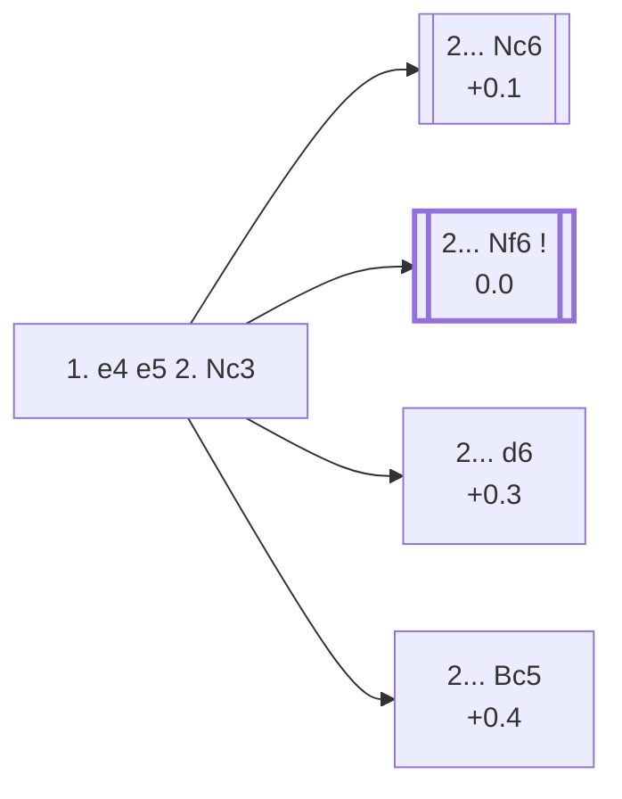

<a name="_TOP_"></a>

# C25 Vienna Game <br> 1. e4 e5 2. Nc3 #

White develops a piece without committing to an immediate attack on e5, keeping several plans in reserve: a later **f4** (the Vienna Gambit), a fianchetto with **g3**, or a quiet **Bc4**/**Nf3** setup that can transpose into other King's Pawn openings. Nc3 also covers d5, discouraging Black from mirroring White's own central ambitions.

### Overview

*Quick map of every move covered on this card — see the [shape key](https://github.com/onclemarcel/chess_flashcards/blob/main/start.md#content-diagram-optional) in start.md.*

<!-- content-diagram:start -->

<!-- content-diagram:end -->

<a name="_initial_move_"></a>

[](https://lichess.org/analysis/standard/rnbqkbnr/pppp1ppp/8/4p3/4P3/2N5/PPPP1PPP/R1BQKBNR_b_KQkq_-_1_2)

*... 1. e4 e5 2. Nc3 — Vienna Game*

```
rnbqkbnr/pppp1ppp/8/4p3/4P3/2N5/PPPP1PPP/R1BQKBNR b KQkq - 1 2
```

|  | +0.1 |
| --- | --- |

<!-- lichess-stats:start fen="rnbqkbnr/pppp1ppp/8/4p3/4P3/2N5/PPPP1PPP/R1BQKBNR b KQkq - 1 2" db="lichess,masters" speeds="bullet,blitz" ratings="1800,2000,2200,2500" moves="8" -->
| Move | Online | W/D/B | Masters | W/D/B | |
| :--- | ---: | :--- | ---: | :--- | :-- |
| Nc6 | 13.4 M (48.2%) | ⬜⬜⬜⬜⬜⬛⬛⬛⬛⬛ 51/4/44 | 1.8 k (22.1%) | ⬜⬜⬜🟫🟫🟫🟫⬛⬛⬛ 33/39/28 |  |
| Nf6 | 7.1 M (25.4%) | ⬜⬜⬜⬜⬜🟫⬛⬛⬛⬛ 52/5/44 | 5.9 k (72.0%) | ⬜⬜⬜🟫🟫🟫🟫🟫⬛⬛ 29/46/25 |  |
| d6 | 2.9 M (10.6%) | ⬜⬜⬜⬜⬜🟫⬛⬛⬛⬛ 53/4/43 | 126 (1.5%) | ⬜⬜⬜🟫🟫🟫⬛⬛⬛⬛ 32/33/36 |  |
| Bc5 | 1.6 M (5.9%) | ⬜⬜⬜⬜⬜⬛⬛⬛⬛⬛ 52/4/44 | 304 (3.7%) | ⬜⬜⬜🟫🟫🟫🟫⬛⬛⬛ 32/39/29 |  |
| f5 | 741 k (2.7%) | ⬜⬜⬜⬜⬜⬛⬛⬛⬛⬛ 51/3/46 | 0 | — | ⚠ |
| d5 | 637 k (2.3%) | ⬜⬜⬜⬜⬜⬛⬛⬛⬛⬛ 50/3/46 | 0 | — | ⚠ |
| c6 | 406 k (1.5%) | ⬜⬜⬜⬜⬜⬜⬛⬛⬛⬛ 54/4/42 | 6 (0.1%) | — |  |
| Bb4 | 388 k (1.4%) | ⬜⬜⬜⬜⬜🟫⬛⬛⬛⬛ 53/4/42 | 35 (0.4%) | ⬜⬜⬜⬜⬜🟫🟫⬛⬛⬛ 49/20/31 |  |
| g6 | 0 | — | 6 (0.1%) | — |  |
| Be7 | 0 | — | 6 (0.1%) | — |  |

*Online: bullet/blitz, 1800+ — 27.8 M games. Masters: 8.2 k games. [Open in the explorer](https://lichess.org/analysis/standard/rnbqkbnr/pppp1ppp/8/4p3/4P3/2N5/PPPP1PPP/R1BQKBNR_b_KQkq_-_1_2#explorer) — updated 2026-09-03*
<!-- lichess-stats:end -->

### Candidate moves

> [!NOTE]
> Online and masters play diverge sharply here: bullet/blitz players reach for the natural developing **2... Nc6** almost half the time (48.2%), while masters overwhelmingly prefer **2... Nf6** (72.0% of masters games, only 25.4% online). Nf6 immediately questions e4 — Nc3 does not defend it a second time the way it looks like it might — which is exactly the kind of concrete test strong players go looking for.

* [**2... Nc6**](#_Nc6_) (+0.1): natural development, defending e5 a second time and keeping options open. Sound, but doesn't challenge White the way Nf6 does — the more popular choice online, the less popular one in masters play.
* [**2... Nf6**](https://github.com/onclemarcel/chess_flashcards/blob/main/e4_openings/C26_Vienna_Falkbeer_Variation.md) (0.0): already live-tagged its own code, **C26**, the *Falkbeer Variation* — attacking e4 immediately, the main line in masters practice by a wide margin (72.0%). See `C26_Vienna_Falkbeer_Variation.md`, not built out further here.
* **2... d6** (+0.3): a solid, modest setup that avoids early commitments, at the cost of blocking the f8-bishop's natural diagonal for now.
* [**2... Bc5**](#_Bc5_) (+0.4): develops actively and eyes f2, transposing toward Italian-like structures once White plays Nf3 — live-tagged the *Anderssen Defense*.
* **2... Bb4**: leads to the *Zhuravlev Countergambit* after 3. Qg4 Nf6 — a real database rarity, stays C25. See below.

[*Back to TOP*](#_TOP_)

---

<a name="_Nc6_"></a>

### 2... Nc6

[](https://lichess.org/analysis/standard/r1bqkbnr/pppp1ppp/2n5/4p3/4P3/2N5/PPPP1PPP/R1BQKBNR_w_KQkq_-_2_3)

*... 2... Nc6*

```
r1bqkbnr/pppp1ppp/2n5/4p3/4P3/2N5/PPPP1PPP/R1BQKBNR w KQkq - 2 3
```

|  | +0.1 |
| --- | --- |

White most often continues **3. f4** (the *Vienna Gambit proper*), **3. Bc4**, **3. g3**, or **3. Nf3**, transposing toward a King's Knight Opening structure a tempo down for Black compared to 2. Nf3 lines.

### Candidate moves

* [**3. g3**](#_g3_) : the *Paulsen Variation* — see below.
* [**3. d4**](#_d4_) : the *Fyfe Gambit* — see below.
* [**3. f4**](#_f4_) : the *Vienna Gambit* proper — see below.
* **3. Nf3**: transposes to the King's Knight Opening (C40) a tempo down for Black, not built out further here.
* **3. Bc4**: transposes toward Bishop's Opening/Italian-style structures, not built out further here.

[*Back to 2. Nc3*](#_initial_move_)
[*Back to TOP*](#_TOP_)

---

<a name="_g3_"></a>

### 3. g3 — Paulsen Variation

[](https://lichess.org/analysis/standard/r1bqkbnr/pppp1ppp/2n5/4p3/4P3/2N3P1/PPPP1P1P/R1BQKBNR_b_KQkq_-_0_3)

*... 3. g3 — Paulsen Variation*

```
r1bqkbnr/pppp1ppp/2n5/4p3/4P3/2N3P1/PPPP1P1P/R1BQKBNR b KQkq - 0 3
```

|  | 0.0 |
| --- | --- |

<!-- lichess-stats:start fen="r1bqkbnr/pppp1ppp/2n5/4p3/4P3/2N3P1/PPPP1P1P/R1BQKBNR b KQkq - 0 3" db="lichess,masters" speeds="bullet,blitz" ratings="1800,2000,2200,2500" moves="4" -->
| Move | Online | W/D/B | Masters | W/D/B | |
| :--- | ---: | :--- | ---: | :--- | :-- |
| Nf6 | 325 k (41.3%) | ⬜⬜⬜⬜⬜⬜⬛⬛⬛⬛ 56/5/39 | 121 (19.7%) | ⬜⬜⬜⬜🟫🟫🟫⬛⬛⬛ 40/35/25 |  |
| Bc5 | 251 k (31.9%) | ⬜⬜⬜⬜⬜🟫⬛⬛⬛⬛ 53/5/43 | 343 (55.8%) | ⬜⬜⬜🟫🟫🟫🟫⬛⬛⬛ 30/43/27 |  |
| d6 | 69 k (8.8%) | ⬜⬜⬜⬜⬜⬜⬛⬛⬛⬛ 58/4/38 | 0 | — | ⚠ |
| f5 | 39 k (4.9%) | ⬜⬜⬜⬜⬜⬛⬛⬛⬛⬛ 51/4/45 | 0 | — | ⚠ |
| g6 | 0 | — | 82 (13.3%) | ⬜⬜⬜⬜🟫🟫🟫🟫⬛⬛ 44/35/21 |  |
| h5 | 0 | — | 30 (4.9%) | ⬜⬜⬜⬜🟫🟫🟫⬛⬛⬛ 33/33/33 |  |

*Online: bullet/blitz, 1800+ — 786 k games. Masters: 615 games. [Open in the explorer](https://lichess.org/analysis/standard/r1bqkbnr/pppp1ppp/2n5/4p3/4P3/2N3P1/PPPP1P1P/R1BQKBNR_b_KQkq_-_0_3#explorer) — updated 2026-09-03*
<!-- lichess-stats:end -->

**3... Bc5** is masters' clear main try (55.8%), developing actively toward the same Boi/Anderssen-style diagonal seen elsewhere on this card. Deeper theory not covered further here.

[*Back to 2... Nc6*](#_Nc6_)
[*Back to TOP*](#_TOP_)

---

<a name="_d4_"></a>

### 3. d4 — Fyfe Gambit

[](https://lichess.org/analysis/standard/r1bqkbnr/pppp1ppp/2n5/4p3/3PP3/2N5/PPP2PPP/R1BQKBNR_b_KQkq_d3_0_3)

*... 3. d4 — Fyfe Gambit*

```
r1bqkbnr/pppp1ppp/2n5/4p3/3PP3/2N5/PPP2PPP/R1BQKBNR b KQkq d3 0 3
```

|  | −0.6 |
| --- | --- |

Offers the d-pawn outright. A genuine database rarity at master level (0 masters games) — Stockfish already rates it a real, above-average edge for Black (−0.6) after **3... exd4**, one more gambit whose name outpaces its objective soundness. Deeper theory not covered further here.

[*Back to 2... Nc6*](#_Nc6_)
[*Back to TOP*](#_TOP_)

---

<a name="_f4_"></a>

### 3. f4 — Vienna Gambit

[](https://lichess.org/analysis/standard/r1bqkbnr/pppp1ppp/2n5/4p3/4PP2/2N5/PPPP2PP/R1BQKBNR_b_KQkq_f3_0_3)

*... 3. f4 — Vienna Gambit*

```
r1bqkbnr/pppp1ppp/2n5/4p3/4PP2/2N5/PPPP2PP/R1BQKBNR b KQkq f3 0 3
```

|  | −0.5 |
| --- | --- |

**3... exf4** is masters' clear main try there. **4. d4**, the *Steinitz Gambit*, and **4. Nf3** are White's two real tries.

<a name="_exf4_"></a>

[](https://lichess.org/analysis/standard/r1bqkbnr/pppp1ppp/2n5/8/4Pp2/2N5/PPPP2PP/R1BQKBNR_w_KQkq_-_0_4)

```
r1bqkbnr/pppp1ppp/2n5/8/4Pp2/2N5/PPPP2PP/R1BQKBNR w KQkq - 0 4
```

|  | −0.3 |
| --- | --- |

<!-- lichess-stats:start fen="r1bqkbnr/pppp1ppp/2n5/8/4Pp2/2N5/PPPP2PP/R1BQKBNR w KQkq - 0 4" db="lichess,masters" speeds="bullet,blitz" ratings="1800,2000,2200,2500" moves="4" -->
| Move | Online | W/D/B | Masters | W/D/B | |
| :--- | ---: | :--- | ---: | :--- | :-- |
| Nf3 | 893 k (85.9%) | ⬜⬜⬜⬜⬜⬛⬛⬛⬛⬛ 51/4/45 | 156 (65.3%) | ⬜⬜⬜🟫🟫🟫⬛⬛⬛⬛ 30/26/44 |  |
| d4 | 115 k (11.0%) | ⬜⬜⬜⬜⬜🟫⬛⬛⬛⬛ 53/4/43 | 79 (33.1%) | ⬜⬜🟫🟫🟫⬛⬛⬛⬛⬛ 22/34/44 |  |
| Bc4 | 18 k (1.7%) | ⬜⬜⬜⬜⬜⬛⬛⬛⬛⬛ 50/3/47 | 4 (1.7%) | — | ⚠ |
| d3 | 9.3 k (0.9%) | ⬜⬜⬜⬜⬜⬛⬛⬛⬛⬛ 47/4/49 | 0 | — | ⚠ |

*Online: bullet/blitz, 1800+ — 1.0 M games. Masters: 239 games. [Open in the explorer](https://lichess.org/analysis/standard/r1bqkbnr/pppp1ppp/2n5/8/4Pp2/2N5/PPPP2PP/R1BQKBNR_w_KQkq_-_0_4#explorer) — updated 2026-09-03*
<!-- lichess-stats:end -->

### Candidate moves

* [**4. Nf3**](#_4Nf3_) (65.3% masters): the calmer choice, sidestepping the sharpest theory — see below.
* [**4. d4**](#_SteinitzGambit_) (33.1% masters): the *Steinitz Gambit* — see below.

[*Back to 2... Nc6*](#_Nc6_)
[*Back to TOP*](#_TOP_)

---

<a name="_SteinitzGambit_"></a>

> [!NOTE]
> **4. d4** is the *Steinitz Gambit* — offers a second pawn to keep the centre and open lines toward Black's king, which is stuck in the middle a while longer.
>
> [](https://lichess.org/analysis/standard/r1bqkbnr/pppp1ppp/2n5/8/3PPp2/2N5/PPP3PP/R1BQKBNR_b_KQkq_d3_0_4)
>
> *... 4. d4 — Steinitz Gambit*
>
> ```
> r1bqkbnr/pppp1ppp/2n5/8/3PPp2/2N5/PPP3PP/R1BQKBNR b KQkq d3 0 4
> ```
>
> |  | −0.5 |
> | --- | --- |
>
> **4... Qh4+** is masters' overwhelming main try (91.1%). **5. Ke2 d5** is the *Zukertort Defence* (dead level per Stockfish, −0.1), while **5. Ke2 b6** is the *Fraser-Minckwitz Variation* (a real Black edge, −0.5). Neither built out further here.
>
> [*Back to TOP*](#_TOP_)

---

<a name="_4Nf3_"></a>

> [!NOTE]
> **4. Nf3** heads into the Vienna Gambit's own romantic-era complex — masters split between a quiet retreat and three further-named 19th-century gambit tries at the next fork, none of them objectively rewarded per Stockfish:
>
> [](https://lichess.org/analysis/standard/r1bqkbnr/pppp1ppp/2n5/8/4Pp2/2N2N2/PPPP2PP/R1BQKB1R_b_KQkq_-_1_4)
>
> *... 4. Nf3*
>
> ```
> r1bqkbnr/pppp1ppp/2n5/8/4Pp2/2N2N2/PPPP2PP/R1BQKB1R b KQkq - 1 4
> ```
>
> |  | −0.3 |
> | --- | --- |
>
> **4... g5**, defending the extra pawn, reaches a genuine three-way fork at masters level: **5. g3** (42.2%, a quiet retreat, unnamed and not built out further here), **5. d4** (24.7%, the *Pierce Gambit*), and **5. h4** (22.3%, heading for the *Hamppe-Allgaier Gambit*); **5. Bc4** (6.0%, the *Hamppe-Muzio Gambit*) is a real minority. Stockfish already rates the position a real edge for Black even before any of these (−0.5):
>
> * **5. h4 g4 6. Ng5**: the *Hamppe-Allgaier Gambit* (−1.1). **6... d6** is the *Alapin Variation* (−0.6).
> * **5. Bc4 g4 6. O-O**: the *Hamppe-Muzio Gambit* (−1.1). **6... gxf3 7. Qxf3 Ne5 8. Qxf4 Qf6** is the *Dubois Variation* — a real database rarity, no cached engine eval at this depth.
> * **5. d4 g4 6. Bc4 gxf3 7. O-O d5 8. exd5 Bg4 9. dxc6**: the *Pierce Gambit* (−1.3), running to the *Rushmere Attack* — genuinely bad for White per Stockfish (−2.3), the worst-rated try on this whole card.
>
> None built out further here.
>
> [*Back to TOP*](#_TOP_)

---

<a name="_d6_"></a>

### 2... d6

[](https://lichess.org/analysis/standard/rnbqkbnr/ppp2ppp/3p4/4p3/4P3/2N5/PPPP1PPP/R1BQKBNR_w_KQkq_-_0_3)

*... 2... d6*

```
rnbqkbnr/ppp2ppp/3p4/4p3/4P3/2N5/PPPP1PPP/R1BQKBNR w KQkq - 0 3
```

|  | +0.3 |
| --- | --- |

A modest, Philidor-like setup. White is free to build a broad centre with **3. d4** or **3. f4**, since Black hasn't contested the centre or developed a piece yet.

[*Back to 2. Nc3*](#_initial_move_)
[*Back to TOP*](#_TOP_)

---

<a name="_Bc5_"></a>

### 2... Bc5 — Anderssen Defense

[](https://lichess.org/analysis/standard/rnbqk1nr/pppp1ppp/8/2b1p3/4P3/2N5/PPPP1PPP/R1BQKBNR_w_KQkq_-_2_3)

*... 2... Bc5 — Anderssen Defense*

```
rnbqk1nr/pppp1ppp/8/2b1p3/4P3/2N5/PPPP1PPP/R1BQKBNR w KQkq - 2 3
```

|  | +0.4 |
| --- | --- |

Live-tagged the *Anderssen Defense* — a name `eco.md` doesn't carry at all for this position. White continues naturally with **3. Nf3**, defending e5's attacker in advance and preparing to meet ... d6 or ... Nc6 with a comfortable Italian-flavoured game.

[*Back to 2. Nc3*](#_initial_move_)
[*Back to TOP*](#_TOP_)

---

<a name="_Bb4_"></a>

### 2... Bb4 — Zhuravlev Countergambit

[](https://lichess.org/analysis/standard/rnbqk2r/pppp1ppp/5n2/4p3/1b2P1Q1/2N5/PPPP1PPP/R1B1KBNR_w_KQkq_-_4_4)

*... 2... Bb4 3. Qg4 Nf6 — Zhuravlev Countergambit*

```
rnbqk2r/pppp1ppp/5n2/4p3/1b2P1Q1/2N5/PPPP1PPP/R1B1KBNR w KQkq - 4 4
```

|  | +0.1 |
| --- | --- |

A genuine database rarity (0.4% masters at the 2... Bb4 fork, and only a single masters game recorded at this exact depth) — Black offers the g7 pawn for a lead in development; **4. Qxg7** is masters' and online's overwhelming reply. Dead level per Stockfish despite the pawn grab. Deeper theory not covered further here.

[*Back to 2. Nc3*](#_initial_move_)
[*Back to TOP*](#_TOP_)
