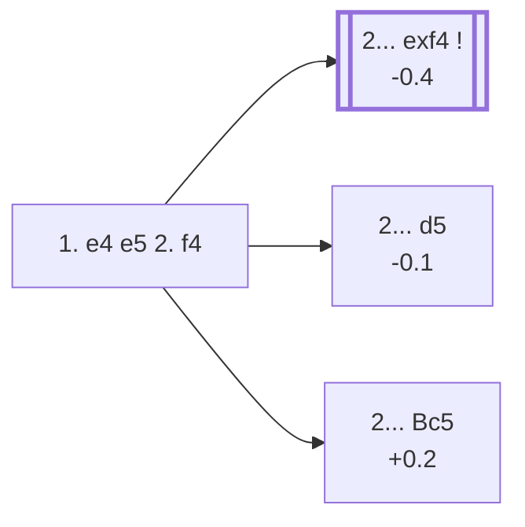

<a name="_TOP_"></a>

# C30 King's Gambit <br> 1. e4 e5 2. f4 #

The quintessential Romantic-era opening: White offers a pawn to lever open the f-file and strike at f7, Black's weakest point. Paul Morphy and generations of attacking players made their names in gambit play that started here. Objectively engines rate it as a small concession, but at the board — especially away from correspondence-length preparation — the attacking chances it generates are real.

### Overview

*Quick map of every move covered on this card — see the [shape key](https://github.com/onclemarcel/chess_flashcards/blob/main/start.md#content-diagram-optional) in start.md. 2... Nc6 and 2... d6 are discussed below (both flagged ⚠ for a real online/masters gap) but have no anchor of their own, so they're left off this map rather than pointing nowhere.*

<!-- content-diagram:start -->

<!-- content-diagram:end -->

<a name="_initial_move_"></a>

[](https://lichess.org/analysis/standard/rnbqkbnr/pppp1ppp/8/4p3/4PP2/8/PPPP2PP/RNBQKBNR_b_KQkq_f3_0_2)

*... 1. e4 e5 2. f4 — King's Gambit*

```
rnbqkbnr/pppp1ppp/8/4p3/4PP2/8/PPPP2PP/RNBQKBNR b KQkq f3 0 2
```

|  | -0.3 |
| --- | --- |

<!-- lichess-stats:start fen="rnbqkbnr/pppp1ppp/8/4p3/4PP2/8/PPPP2PP/RNBQKBNR b KQkq f3 0 2" db="lichess,masters" speeds="bullet,blitz" ratings="1800,2000,2200,2500" moves="8" -->
| Move | Online | W/D/B | Masters | W/D/B | |
| :--- | ---: | :--- | ---: | :--- | :-- |
| exf4 | 10.4 M (37.6%) | ⬜⬜⬜⬜⬜⬛⬛⬛⬛⬛ 50/3/47 | 3.3 k (67.3%) | ⬜⬜⬜🟫🟫🟫🟫⬛⬛⬛ 26/37/36 |  |
| Nc6 | 6.5 M (23.5%) | ⬜⬜⬜⬜⬜⬛⬛⬛⬛⬛ 50/3/47 | 86 (1.7%) | ⬜⬜🟫🟫🟫⬛⬛⬛⬛⬛ 23/31/45 |  |
| d5 | 4.5 M (16.3%) | ⬜⬜⬜⬜⬜⬛⬛⬛⬛⬛ 46/4/50 | 864 (17.5%) | ⬜⬜⬜⬜🟫🟫🟫⬛⬛⬛ 36/34/30 |  |
| d6 | 3.1 M (11.2%) | ⬜⬜⬜⬜⬜⬛⬛⬛⬛⬛ 52/4/44 | 25 (0.5%) | ⬜⬜⬜⬜⬜⬜🟫🟫⬛⬛ 56/24/20 |  |
| Bc5 | 1.3 M (4.6%) | ⬜⬜⬜⬜⬜⬛⬛⬛⬛⬛ 47/4/49 | 518 (10.5%) | ⬜⬜⬜🟫🟫🟫⬛⬛⬛⬛ 35/30/35 |  |
| Nf6 | 978 k (3.5%) | ⬜⬜⬜⬜⬜⬛⬛⬛⬛⬛ 50/3/46 | 41 (0.8%) | ⬜⬜⬜⬜🟫🟫🟫🟫⬛⬛ 39/44/17 |  |
| Qh4+ | 255 k (0.9%) | ⬜⬜⬜⬜⬜⬛⬛⬛⬛⬛ 52/4/45 | 57 (1.2%) | ⬜⬜⬜⬜🟫🟫🟫⬛⬛⬛ 42/33/25 |  |
| f5 | 221 k (0.8%) | ⬜⬜⬜⬜⬜⬛⬛⬛⬛⬛ 50/3/47 | 0 | — | ⚠ |
| Qf6 | 0 | — | 9 (0.2%) | — |  |

*Online: bullet/blitz, 1800+ — 27.6 M games. Masters: 4.9 k games. [Open in the explorer](https://lichess.org/analysis/standard/rnbqkbnr/pppp1ppp/8/4p3/4PP2/8/PPPP2PP/RNBQKBNR_b_KQkq_f3_0_2#explorer) — updated 2026-09-09*
<!-- lichess-stats:end -->

### Candidate moves

* [**2... exf4**](#_exf4_) (-0.4): the *King's Gambit Accepted* — taking the pawn is masters' main choice (67.3%) and gives Black the most testing position, though the resulting complications ask real questions of both sides.
* [**2... d5**](https://github.com/onclemarcel/chess_flashcards/blob/main/e4_openings/C31_Kings_Gambit_Falkbeer.md) (-0.1): already live-tagged its own code, **C31**, the *Falkbeer Countergambit* — see `C31_Kings_Gambit_Falkbeer.md`, not built out further here.
* [**2... Bc5**](#_Bc5_) (+0.2): the *Classical Variation* — declining altogether and developing actively, keeping the f4-pawn's future weakness in view for later.
* **2... Nc6** (⚠): a natural-looking developing move, reasonably common online (23.5%) but rare in masters play (1.7%) — it doesn't address the tension in the centre or on the kingside the way the three replies above do.
* **2... d6** (⚠): similarly popular online (11.2%) yet almost unseen in masters play (0.5%), for the same reason — solid-looking but passive against a gambit that rewards active counterplay.
* [**2... Qh4+**](#_Keene_) (1.2% masters): the *Keene Defense* — see below.
* [**2... c5**](#_Mafia_) : the *Mafia Defense* — see below.
* [**2... Qf6**](#_Norwalde_) : the *Norwalde Variation* — see below.
* [**2... Nf6**](#_PetrovKGD_) (0.8% masters): live-tagged *King's Gambit Declined: Petrov's Defense* — see below.

[*Back to TOP*](#_TOP_)

---

<a name="_exf4_"></a>

### 2... exf4 — King's Gambit Accepted

[](https://lichess.org/analysis/standard/rnbqkbnr/pppp1ppp/8/8/4Pp2/8/PPPP2PP/RNBQKBNR_w_KQkq_-_0_3)

*... 2... exf4 — King's Gambit Accepted*

```
rnbqkbnr/pppp1ppp/8/8/4Pp2/8/PPPP2PP/RNBQKBNR w KQkq - 0 3
```

|  | -0.4 |
| --- | --- |

<!-- lichess-stats:start fen="rnbqkbnr/pppp1ppp/8/8/4Pp2/8/PPPP2PP/RNBQKBNR w KQkq - 0 3" db="lichess,masters" speeds="bullet,blitz" ratings="1800,2000,2200,2500" moves="6" -->
| Move | Online | W/D/B | Masters | W/D/B | |
| :--- | ---: | :--- | ---: | :--- | :-- |
| Nf3 | 9.1 M (88.0%) | ⬜⬜⬜⬜⬜⬛⬛⬛⬛⬛ 50/3/47 | 2.4 k (71.8%) | ⬜⬜⬜🟫🟫🟫🟫⬛⬛⬛ 26/38/35 |  |
| Bc4 | 937 k (9.0%) | ⬜⬜⬜⬜⬜🟫⬛⬛⬛⬛ 53/3/43 | 803 (24.2%) | ⬜⬜⬜🟫🟫🟫⬛⬛⬛⬛ 27/36/37 |  |
| d4 | 157 k (1.5%) | ⬜⬜⬜⬜⬜⬛⬛⬛⬛⬛ 48/3/49 | 11 (0.3%) | — |  |
| Nc3 | 74 k (0.7%) | ⬜⬜⬜⬜⬜⬜⬛⬛⬛⬛ 55/4/41 | 83 (2.5%) | ⬜⬜🟫🟫🟫🟫⬛⬛⬛⬛ 23/34/43 |  |
| d3 | 26 k (0.3%) | ⬜⬜⬜⬜⬜⬛⬛⬛⬛⬛ 45/4/51 | 0 | — | ⚠ |
| Qf3 | 18 k (0.2%) | ⬜⬜⬜⬜⬜🟫⬛⬛⬛⬛ 53/4/44 | 12 (0.4%) | — |  |
| Be2 | 0 | — | 20 (0.6%) | ⬜⬜⬜🟫🟫🟫⬛⬛⬛⬛ 30/30/40 |  |

*Online: bullet/blitz, 1800+ — 10.4 M games. Masters: 3.3 k games. [Open in the explorer](https://lichess.org/analysis/standard/rnbqkbnr/pppp1ppp/8/8/4Pp2/8/PPPP2PP/RNBQKBNR_w_KQkq_-_0_3#explorer) — updated 2026-09-09*
<!-- lichess-stats:end -->

* [**3. Nf3**](https://github.com/onclemarcel/chess_flashcards/blob/main/e4_openings/C34_Kings_Gambit_Knights_Gambit.md) (71.8% masters): the *King's Knight's Gambit* — already live-tagged its own code, **C34** — see `C34_Kings_Gambit_Knights_Gambit.md`, not built out further here.
* [**3. Bc4**](https://github.com/onclemarcel/chess_flashcards/blob/main/e4_openings/C33_Kings_Gambit_Bishops_Gambit.md) (24.2% masters): the *Bishop's Gambit* — already live-tagged its own code, **C33** — see `C33_Kings_Gambit_Bishops_Gambit.md`, not built out further here.

[*Back to 2. f4*](#_initial_move_)
[*Back to TOP*](#_TOP_)

---

<a name="_Bc5_"></a>

### 2... Bc5 — Classical Variation

[](https://lichess.org/analysis/standard/rnbqk1nr/pppp1ppp/8/2b1p3/4PP2/8/PPPP2PP/RNBQKBNR_w_KQkq_-_1_3)

*... 2... Bc5 — King's Gambit Declined*

```
rnbqk1nr/pppp1ppp/8/2b1p3/4PP2/8/PPPP2PP/RNBQKBNR w KQkq - 1 3
```

|  | +0.2 |
| --- | --- |

Black develops actively and keeps an eye on the long-term weakness the f4-pawn creates around White's king, rather than entering sharp forcing lines. White usually continues **3. Nf3**, defending e5's attacker in advance. **3. fxe5??** is a real trap for White to fall into, not just Black: after **3... Qh4+ 4. g3 Qxe4+ 5. Qe2 Qxh1**, Black has already won a rook.

<a name="_d6_"></a>

[](https://lichess.org/analysis/standard/rnbqk1nr/ppp2ppp/3p4/2b1p3/4PP2/5N2/PPPP2PP/RNBQKB1R_w_KQkq_-_0_4)

*... 3. Nf3 d6*

```
rnbqk1nr/ppp2ppp/3p4/2b1p3/4PP2/5N2/PPPP2PP/RNBQKB1R w KQkq - 0 4
```

|  | +0.2 |
| --- | --- |

<!-- lichess-stats:start fen="rnbqk1nr/ppp2ppp/3p4/2b1p3/4PP2/5N2/PPPP2PP/RNBQKB1R w KQkq - 0 4" db="lichess,masters" speeds="bullet,blitz" ratings="1800,2000,2200,2500" moves="4" -->
| Move | Online | W/D/B | Masters | W/D/B | |
| :--- | ---: | :--- | ---: | :--- | :-- |
| Bc4 | 277 k (34.6%) | ⬜⬜⬜⬜🟫⬛⬛⬛⬛⬛ 44/4/53 | 47 (10.2%) | ⬜⬜⬜⬜🟫🟫🟫⬛⬛⬛ 43/28/30 |  |
| c3 | 273 k (34.2%) | ⬜⬜⬜⬜⬜⬛⬛⬛⬛⬛ 47/4/49 | 204 (44.3%) | ⬜⬜⬜⬜🟫🟫🟫⬛⬛⬛ 38/28/34 |  |
| Nc3 | 81 k (10.2%) | ⬜⬜⬜⬜⬜⬛⬛⬛⬛⬛ 46/5/49 | 186 (40.3%) | ⬜⬜⬜🟫🟫🟫⬛⬛⬛⬛ 33/33/34 |  |
| fxe5 | 79 k (9.8%) | ⬜⬜⬜⬜⬜⬛⬛⬛⬛⬛ 44/4/52 | 0 | — | ⚠ |
| b4 | 0 | — | 11 (2.4%) | — |  |

*Online: bullet/blitz, 1800+ — 800 k games. Masters: 461 games. [Open in the explorer](https://lichess.org/analysis/standard/rnbqk1nr/ppp2ppp/3p4/2b1p3/4PP2/5N2/PPPP2PP/RNBQKB1R_w_KQkq_-_0_4#explorer) — updated 2026-09-09*
<!-- lichess-stats:end -->

Genuine near-even fork: **4. c3** (44.3% masters) and **4. Nc3** (40.3%). This exact position isn't independently ECO-tagged (`opening=None`) — the nearest live-tagged ancestor is this card's own root.

### Candidate moves

* [**4. c3**](#_4c3_) (44.3% masters): see below.
* [**4. Nc3**](#_Nc3KGD_) (40.3% masters): forks the *Svenonius Variation* and *Hanham Variation* — see below.
* **4. Bc4** (10.2% masters): stays C30, not built out further here.
* [**4. fxe5**](#_Soldatenkov_) (1.5% masters): the *Soldatenkov Variation* — see below.
* [**4. b4**](#_Heath_) : the *Heath Variation*, live-tagged the *Rotlewi Countergambit* — see below.

[*Back to 2. f4*](#_initial_move_)
[*Back to TOP*](#_TOP_)

---

<a name="_Nc3KGD_"></a>

> [!NOTE]
> **4. Nc3** forks into two further-named lines:
>
> * **4... Nf6 5. Bc4 Nc6 6. d3 Bg4 7. h3 Bxf3 8. Qxf3 exf4**: the *Svenonius Variation* (−0.1, genuinely dead level).
> * **4... Nd7**: the *Hanham Variation* (+0.4, a modest White edge).
>
> Neither built out further here.
>
> [*Back to TOP*](#_TOP_)

---

<a name="_Soldatenkov_"></a>

> [!NOTE]
> **4. fxe5** is the *Soldatenkov Variation* — releases the central tension early rather than reinforcing it.
>
> [](https://lichess.org/analysis/standard/rnbqk1nr/ppp2ppp/3p4/2b1P3/4P3/5N2/PPPP2PP/RNBQKB1R_b_KQkq_-_0_4)
>
> *... 4. fxe5 — Soldatenkov Variation*
>
> ```
> rnbqk1nr/ppp2ppp/3p4/2b1P3/4P3/5N2/PPPP2PP/RNBQKB1R b KQkq - 0 4
> ```
>
> |  | +0.0 |
> | --- | --- |
>
> **4... dxe5** is masters' and online's overwhelming reply. Dead level. Deeper theory not covered further here.
>
> [*Back to TOP*](#_TOP_)

---

<a name="_Heath_"></a>

> [!NOTE]
> **4. b4** is the *Heath Variation* — live-tagged the *Rotlewi Countergambit*, a real name divergence from `eco.md`'s own label — offering a queenside pawn to gain a tempo on the bishop.
>
> [](https://lichess.org/analysis/standard/rnbqk1nr/ppp2ppp/3p4/2b1p3/1P2PP2/5N2/P1PP2PP/RNBQKB1R_b_KQkq_b3_0_4)
>
> *... 4. b4 — Heath Variation / Rotlewi Countergambit*
>
> ```
> rnbqk1nr/ppp2ppp/3p4/2b1p3/1P2PP2/5N2/P1PP2PP/RNBQKB1R b KQkq b3 0 4
> ```
>
> |  | −0.4 |
> | --- | --- |
>
> A genuine near-even fork between **4... Bb6** (54.5% masters) and **4... Bxb4** (45.5%), taking the pawn. Stockfish already rates the position a real edge for Black either way. Deeper theory not covered further here.
>
> [*Back to TOP*](#_TOP_)

---

<a name="_4c3_"></a>

## 4. c3

[](https://lichess.org/analysis/standard/rnbqk1nr/ppp2ppp/3p4/2b1p3/4PP2/2P2N2/PP1P2PP/RNBQKB1R_b_KQkq_-_0_4)

*... 4. c3 — King's Gambit Declined: Classical Variation*

```
rnbqk1nr/ppp2ppp/3p4/2b1p3/4PP2/2P2N2/PP1P2PP/RNBQKB1R b KQkq - 0 4
```

|  | +0.2 |
| --- | --- |

<!-- lichess-stats:start fen="rnbqk1nr/ppp2ppp/3p4/2b1p3/4PP2/2P2N2/PP1P2PP/RNBQKB1R b KQkq - 0 4" db="lichess,masters" speeds="bullet,blitz" ratings="1800,2000,2200,2500" moves="4" -->
| Move | Online | W/D/B | Masters | W/D/B | |
| :--- | ---: | :--- | ---: | :--- | :-- |
| Nf6 | 89 k (32.3%) | ⬜⬜⬜⬜⬜⬛⬛⬛⬛⬛ 46/4/51 | 103 (50.5%) | ⬜⬜⬜⬜🟫🟫🟫⬛⬛⬛ 40/29/31 |  |
| Nc6 | 89 k (32.2%) | ⬜⬜⬜⬜⬜⬛⬛⬛⬛⬛ 49/4/47 | 0 | — | ⚠ |
| Bg4 | 61 k (22.2%) | ⬜⬜⬜⬜⬜⬛⬛⬛⬛⬛ 47/4/49 | 21 (10.3%) | ⬜⬜⬜⬜🟫🟫⬛⬛⬛⬛ 43/19/38 |  |
| Bb6 | 16 k (5.7%) | ⬜⬜⬜⬜🟫⬛⬛⬛⬛⬛ 43/5/52 | 54 (26.5%) | ⬜⬜⬜🟫🟫🟫⬛⬛⬛⬛ 31/28/41 |  |
| Qe7 | 0 | — | 14 (6.9%) | — |  |

*Online: bullet/blitz, 1800+ — 275 k games. Masters: 204 games. [Open in the explorer](https://lichess.org/analysis/standard/rnbqk1nr/ppp2ppp/3p4/2b1p3/4PP2/2P2N2/PP1P2PP/RNBQKB1R_b_KQkq_-_0_4#explorer) — updated 2026-09-09*
<!-- lichess-stats:end -->

**4... Nf6** is masters' clear main try (50.5%), stays C30, not built out further here. **4... Bg4** (10.3%) reaches the *Euwe Attack* (a real name divergence from `eco.md`'s own "Marshall Attack" label) after **5. fxe5 dxe5 6. Qa4+** — Stockfish rates it dead level (+0.1), not built out further here. **4... f5** reaches the *Rubinstein Countergambit* (another divergence from `eco.md`'s own "Classical Counter-Gambit" label) — and after **5. fxe5 dxe5 6. d4 exd4 7. Bc4**, the *Réti Variation* (a real database rarity, Stockfish rating a modest Black edge, −0.4). Neither built out further here.

[*Back to TOP*](#_TOP_)

---

<a name="_Keene_"></a>

> [!NOTE]
> **2... Qh4+ 3. g3 Qe7** is the *Keene Defense* — the queen sortie gets kicked back at once, and retreats to a passive but safe square rather than committing further.
>
> [](https://lichess.org/analysis/standard/rnb1kbnr/ppppqppp/8/4p3/4PP2/6P1/PPPP3P/RNBQKBNR_w_KQkq_-_1_4)
>
> *... 2... Qh4+ 3. g3 Qe7 — Keene Defense*
>
> ```
> rnb1kbnr/ppppqppp/8/4p3/4PP2/6P1/PPPP3P/RNBQKBNR w KQkq - 1 4
> ```
>
> |  | +0.7 |
> | --- | --- |
>
> **4. fxe5** is masters' main try (46.4%), and Stockfish already rates the position a real edge for White (+0.7) — the early queen sortie has cost real time. Deeper theory not covered further here.
>
> [*Back to TOP*](#_TOP_)

---

<a name="_Mafia_"></a>

> [!NOTE]
> **2... c5** is the *Mafia Defense* — a real database rarity (6 masters games), striking on the queenside instead of contesting the kingside gambit directly.
>
> [](https://lichess.org/analysis/standard/rnbqkbnr/pp1p1ppp/8/2p1p3/4PP2/8/PPPP2PP/RNBQKBNR_w_KQkq_c6_0_3)
>
> *... 2... c5 — Mafia Defense*
>
> ```
> rnbqkbnr/pp1p1ppp/8/2p1p3/4PP2/8/PPPP2PP/RNBQKBNR w KQkq c6 0 3
> ```
>
> |  | +0.3 |
> | --- | --- |
>
> **3. Nf3** is masters' and online's clear main try. Deeper theory not covered further here.
>
> [*Back to TOP*](#_TOP_)

---

<a name="_Norwalde_"></a>

> [!NOTE]
> **2... Qf6** is the *Norwalde Variation* — an unusual early queen developing move, defending e5 while eyeing f4.
>
> [](https://lichess.org/analysis/standard/rnb1kbnr/pppp1ppp/5q2/4p3/4PP2/8/PPPP2PP/RNBQKBNR_w_KQkq_-_1_3)
>
> *... 2... Qf6 — Norwalde Variation*
>
> ```
> rnb1kbnr/pppp1ppp/5q2/4p3/4PP2/8/PPPP2PP/RNBQKBNR w KQkq - 1 3
> ```
>
> |  | +0.9 |
> | --- | --- |
>
> A genuine database rarity (9 masters games). **3. Nf3 Qxf4 4. Nc3 Bb4 5. Bc4** is the further-named *Bücker Gambit* — Black grabbed the f4-pawn with the queen, a serious practical risk: Stockfish already rates the resulting position as a huge edge for White (+2.2), one of the most punishing lines on this whole card.
>
> [](https://lichess.org/analysis/standard/rnb1k1nr/pppp1ppp/8/4p3/1bB1Pq2/2N2N2/PPPP2PP/R1BQK2R_b_KQkq_-_3_5)
>
> ```
> rnb1k1nr/pppp1ppp/8/4p3/1bB1Pq2/2N2N2/PPPP2PP/R1BQK2R b KQkq - 3 5
> ```
>
> |  | +2.2 |
> | --- | --- |
>
> Deeper theory not covered further here.
>
> [*Back to TOP*](#_TOP_)

---

<a name="_PetrovKGD_"></a>

> [!NOTE]
> **2... Nf6** is live-tagged *King's Gambit Declined: Petrov's Defense* — a name `eco.md`'s own bare "2...Nf6" label doesn't carry.
>
> [](https://lichess.org/analysis/standard/rnbqkb1r/pppp1ppp/5n2/4p3/4PP2/8/PPPP2PP/RNBQKBNR_w_KQkq_-_1_3)
>
> *... 2... Nf6 — Petrov's Defense*
>
> ```
> rnbqkb1r/pppp1ppp/5n2/4p3/4PP2/8/PPPP2PP/RNBQKBNR w KQkq - 1 3
> ```
>
> |  | +0.1 |
> | --- | --- |
>
> **3. fxe5** is masters' main try (48.8%). Genuinely near-level. Deeper theory not covered further here.
>
> [*Back to TOP*](#_TOP_)
