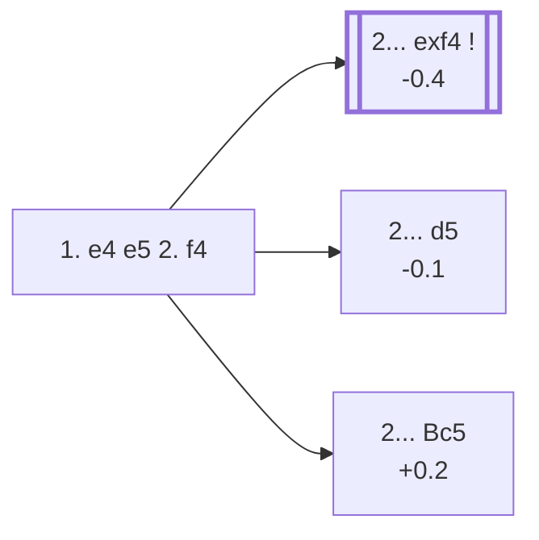

<a name="_TOP_"></a>

# C30 King's Gambit <br> 1. e4 e5 2. f4 #

The quintessential Romantic-era opening: White offers a pawn to lever open the f-file and strike at f7, Black's weakest point. Paul Morphy and generations of attacking players made their names in gambit play that started here. Objectively engines rate it as a small concession, but at the board — especially away from correspondence-length preparation — the attacking chances it generates are real.

### Overview

*Quick map of every move covered on this card — see the [shape key](https://github.com/onclemarcel/chess_flashcards/blob/main/start.md#content-diagram-optional) in start.md. 2... Nc6 and 2... d6 are discussed below (both flagged ⚠ for a real online/masters gap) but have no anchor of their own, so they're left off this map rather than pointing nowhere.*

<!-- content-diagram:start -->

<!-- content-diagram:end -->

<a name="_initial_move_"></a>

[](https://lichess.org/analysis/standard/rnbqkbnr/pppp1ppp/8/4p3/4PP2/8/PPPP2PP/RNBQKBNR_b_KQkq_f3_0_2)

*... 1. e4 e5 2. f4 — King's Gambit*

```
rnbqkbnr/pppp1ppp/8/4p3/4PP2/8/PPPP2PP/RNBQKBNR b KQkq f3 0 2
```

|  | -0.3 |
| --- | --- |

<!-- lichess-stats:start fen="rnbqkbnr/pppp1ppp/8/4p3/4PP2/8/PPPP2PP/RNBQKBNR b KQkq f3 0 2" db="lichess,masters" speeds="bullet,blitz" ratings="1800,2000,2200,2500" moves="8" -->
| Move | Online | W/D/B | Masters | W/D/B | |
| :--- | ---: | :--- | ---: | :--- | :-- |
| exf4 | 10.4 M (37.6%) | ⬜⬜⬜⬜⬜⬛⬛⬛⬛⬛ 50/3/47 | 3.3 k (67.3%) | ⬜⬜⬜🟫🟫🟫🟫⬛⬛⬛ 26/37/36 |  |
| Nc6 | 6.5 M (23.5%) | ⬜⬜⬜⬜⬜⬛⬛⬛⬛⬛ 50/3/47 | 86 (1.7%) | ⬜⬜🟫🟫🟫⬛⬛⬛⬛⬛ 23/31/45 |  |
| d5 | 4.5 M (16.3%) | ⬜⬜⬜⬜⬜⬛⬛⬛⬛⬛ 46/4/50 | 864 (17.5%) | ⬜⬜⬜⬜🟫🟫🟫⬛⬛⬛ 36/34/30 |  |
| d6 | 3.1 M (11.2%) | ⬜⬜⬜⬜⬜⬛⬛⬛⬛⬛ 52/4/44 | 25 (0.5%) | ⬜⬜⬜⬜⬜⬜🟫🟫⬛⬛ 56/24/20 |  |
| Bc5 | 1.3 M (4.6%) | ⬜⬜⬜⬜⬜⬛⬛⬛⬛⬛ 47/4/49 | 518 (10.5%) | ⬜⬜⬜🟫🟫🟫⬛⬛⬛⬛ 35/30/35 |  |
| Nf6 | 978 k (3.5%) | ⬜⬜⬜⬜⬜⬛⬛⬛⬛⬛ 50/3/46 | 41 (0.8%) | ⬜⬜⬜⬜🟫🟫🟫🟫⬛⬛ 39/44/17 |  |
| Qh4+ | 255 k (0.9%) | ⬜⬜⬜⬜⬜⬛⬛⬛⬛⬛ 52/4/45 | 57 (1.2%) | ⬜⬜⬜⬜🟫🟫🟫⬛⬛⬛ 42/33/25 |  |
| f5 | 221 k (0.8%) | ⬜⬜⬜⬜⬜⬛⬛⬛⬛⬛ 50/3/47 | 0 | — | ⚠ |
| Qf6 | 0 | — | 9 (0.2%) | — |  |

*Online: bullet/blitz, 1800+ — 27.6 M games. Masters: 4.9 k games. [Open in the explorer](https://lichess.org/analysis/standard/rnbqkbnr/pppp1ppp/8/4p3/4PP2/8/PPPP2PP/RNBQKBNR_b_KQkq_f3_0_2#explorer) — updated 2026-08-23*
<!-- lichess-stats:end -->

### Candidate moves

* [**2... exf4**](#_exf4_) (-0.4): the *King's Gambit Accepted* — taking the pawn is masters' main choice (67.3%) and gives Black the most testing position, though the resulting complications ask real questions of both sides.
* [**2... d5**](#_d5_) (-0.1): the *Falkbeer Countergambit* — Black strikes back in the centre at once instead of grabbing the f-pawn, a fully sound way to meet the gambit head-on.
* [**2... Bc5**](#_Bc5_) (+0.2): declining altogether and developing actively, keeping the f4-pawn's future weakness in view for later.
* **2... Nc6** (⚠): a natural-looking developing move, reasonably common online (23.5%) but rare in masters play (1.7%) — it doesn't address the tension in the centre or on the kingside the way the three replies above do.
* **2... d6** (⚠): similarly popular online (11.2%) yet almost unseen in masters play (0.5%), for the same reason — solid-looking but passive against a gambit that rewards active counterplay.

[*Back to TOP*](#_TOP_)

---

<a name="_exf4_"></a>

### 2... exf4 — King's Gambit Accepted

[](https://lichess.org/analysis/standard/rnbqkbnr/pppp1ppp/8/8/4Pp2/8/PPPP2PP/RNBQKBNR_w_KQkq_-_0_3)

*... 2... exf4 — King's Gambit Accepted*

```
rnbqkbnr/pppp1ppp/8/8/4Pp2/8/PPPP2PP/RNBQKBNR w KQkq - 0 3
```

|  | -0.4 |
| --- | --- |

<!-- lichess-stats:start fen="rnbqkbnr/pppp1ppp/8/8/4Pp2/8/PPPP2PP/RNBQKBNR w KQkq - 0 3" db="lichess,masters" speeds="bullet,blitz" ratings="1800,2000,2200,2500" moves="6" -->
| Move | Online | W/D/B | Masters | W/D/B | |
| :--- | ---: | :--- | ---: | :--- | :-- |
| Nf3 | 9.1 M (88.0%) | ⬜⬜⬜⬜⬜⬛⬛⬛⬛⬛ 50/3/47 | 2.4 k (71.8%) | ⬜⬜⬜🟫🟫🟫🟫⬛⬛⬛ 26/38/35 |  |
| Bc4 | 937 k (9.0%) | ⬜⬜⬜⬜⬜🟫⬛⬛⬛⬛ 53/3/43 | 803 (24.2%) | ⬜⬜⬜🟫🟫🟫⬛⬛⬛⬛ 27/36/37 |  |
| d4 | 157 k (1.5%) | ⬜⬜⬜⬜⬜⬛⬛⬛⬛⬛ 48/3/49 | 11 (0.3%) | — |  |
| Nc3 | 74 k (0.7%) | ⬜⬜⬜⬜⬜⬜⬛⬛⬛⬛ 55/4/41 | 83 (2.5%) | ⬜⬜🟫🟫🟫🟫⬛⬛⬛⬛ 23/34/43 |  |
| d3 | 26 k (0.3%) | ⬜⬜⬜⬜⬜⬛⬛⬛⬛⬛ 45/4/51 | 0 | — | ⚠ |
| Qf3 | 18 k (0.2%) | ⬜⬜⬜⬜⬜🟫⬛⬛⬛⬛ 53/4/44 | 12 (0.4%) | — |  |
| Be2 | 0 | — | 20 (0.6%) | ⬜⬜⬜🟫🟫🟫⬛⬛⬛⬛ 30/30/40 |  |

*Online: bullet/blitz, 1800+ — 10.4 M games. Masters: 3.3 k games. [Open in the explorer](https://lichess.org/analysis/standard/rnbqkbnr/pppp1ppp/8/8/4Pp2/8/PPPP2PP/RNBQKBNR_w_KQkq_-_0_3#explorer) — updated 2026-08-23*
<!-- lichess-stats:end -->

* **3. Nf3** (the *King's Knight Gambit*): by far the most common try in both populations (71.8% masters, 88.0% online) — preventing ... Qh4+ and preparing to meet ... g5 (the classical way Black tries to hold the extra pawn) with h4 or d4-based play.
* **3. Bc4** (the *Bishop's Gambit*): the second most common try (24.2% masters), eyeing f7 immediately and accepting that ... Qh4+ can be answered with **4. Kf1** — an odd-looking king move that is nonetheless considered fully playable, since Black's queen has to retreat again before it accomplishes much.

[*Back to 2. f4*](#_initial_move_)
[*Back to TOP*](#_TOP_)

---

<a name="_d5_"></a>

### 2... d5 — Falkbeer Countergambit

[](https://lichess.org/analysis/standard/rnbqkbnr/ppp2ppp/8/3pp3/4PP2/8/PPPP2PP/RNBQKBNR_w_KQkq_d6_0_3)

*... 2... d5 — Falkbeer Countergambit*

```
rnbqkbnr/ppp2ppp/8/3pp3/4PP2/8/PPPP2PP/RNBQKBNR w KQkq d6 0 3
```

|  | -0.1 |
| --- | --- |

Rather than grab the f4-pawn, Black hits back at e4 immediately. After **3. exd5**, Black continues **3... e4**, gaining space and open lines toward White's king before it can castle — a fully respectable way to meet the gambit that avoids memorising King's Gambit Accepted theory altogether.

[*Back to 2. f4*](#_initial_move_)
[*Back to TOP*](#_TOP_)

---

<a name="_Bc5_"></a>

### 2... Bc5 — King's Gambit Declined

[](https://lichess.org/analysis/standard/rnbqk1nr/pppp1ppp/8/2b1p3/4PP2/8/PPPP2PP/RNBQKBNR_w_KQkq_-_1_3)

*... 2... Bc5 — King's Gambit Declined*

```
rnbqk1nr/pppp1ppp/8/2b1p3/4PP2/8/PPPP2PP/RNBQKBNR w KQkq - 1 3
```

|  | +0.2 |
| --- | --- |

Black develops actively and keeps an eye on the long-term weakness the f4-pawn creates around White's king, rather than entering sharp forcing lines. White usually continues **3. Nf3**, defending e5's attacker in advance. **3. fxe5??** is a real trap for White to fall into, not just Black: after **3... Qh4+ 4. g3 Qxe4+ 5. Qe2 Qxh1**, Black has already won a rook.

[*Back to 2. f4*](#_initial_move_)
[*Back to TOP*](#_TOP_)
