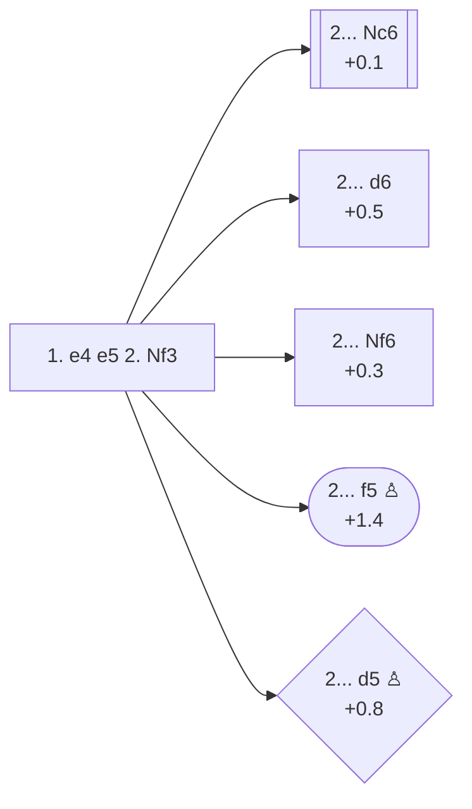

<a name="_TOP_"></a>

# C40 King's Knight Opening <br> 1. e4 e5 2. Nf3 #

White develops a piece to a more active square, makes room for kingside castling, asserts control in the centre and over the d4 square, and attacks Black's e5-pawn. This is the most common opening played in King's Pawn Game masters games (92% of C20).

### Overview

*Quick map of every move covered on this card — see the [shape key](https://github.com/onclemarcel/chess_flashcards/blob/main/start.md#content-diagram-optional) in start.md. None of these candidates continue on this page (all lead to a dedicated card), so no node is marked as the followed line.*

<!-- content-diagram:start -->

<!-- content-diagram:end -->

<a name="_initial_move_"></a>

[](https://lichess.org/analysis/standard/rnbqkbnr/pppp1ppp/8/4p3/4P3/5N2/PPPP1PPP/RNBQKB1R_b_KQkq_-_1_2)

*... 1. e4 e5 2. Nf3 — King's Knight Opening*

```
rnbqkbnr/pppp1ppp/8/4p3/4P3/5N2/PPPP1PPP/RNBQKB1R b KQkq - 1 2
```

|  | +0.2 |
| --- | --- |

<!-- lichess-stats:start fen="rnbqkbnr/pppp1ppp/8/4p3/4P3/5N2/PPPP1PPP/RNBQKB1R b KQkq - 1 2" db="lichess,masters" speeds="bullet,blitz" ratings="1800,2000,2200,2500" moves="8" -->
| Move | Online | W/D/B | Masters | W/D/B | |
| :--- | ---: | :--- | ---: | :--- | :-- |
| Nc6 | 118.7 M (66.7%) | ⬜⬜⬜⬜⬜⬛⬛⬛⬛⬛ 50/5/45 | 248 k (85.6%) | ⬜⬜⬜🟫🟫🟫🟫🟫⬛⬛ 29/51/20 |  |
| d6 | 22.4 M (12.6%) | ⬜⬜⬜⬜⬜🟫⬛⬛⬛⬛ 51/5/44 | 6.5 k (2.2%) | ⬜⬜⬜⬜🟫🟫🟫⬛⬛⬛ 41/35/25 |  |
| Nf6 | 21.1 M (11.8%) | ⬜⬜⬜⬜⬜⬛⬛⬛⬛⬛ 49/5/46 | 34 k (11.8%) | ⬜⬜⬜🟫🟫🟫🟫🟫🟫⬛ 27/61/12 |  |
| d5 | 6.2 M (3.5%) | ⬜⬜⬜⬜⬜⬛⬛⬛⬛⬛ 45/4/51 | 267 (0.1%) | ⬜⬜⬜⬜⬜🟫🟫⬛⬛⬛ 45/22/33 |  |
| f5 | 3.4 M (1.9%) | ⬜⬜⬜⬜⬜⬛⬛⬛⬛⬛ 47/4/49 | 360 (0.1%) | ⬜⬜⬜⬜⬜⬜⬜🟫🟫⬛ 68/17/15 |  |
| Bc5 | 3.2 M (1.8%) | ⬜⬜⬜⬜⬜⬛⬛⬛⬛⬛ 53/4/44 | 0 | — | ⚠ |
| Qf6 | 1.4 M (0.8%) | ⬜⬜⬜⬜⬜⬛⬛⬛⬛⬛ 50/4/46 | 0 | — | ⚠ |
| Qe7 | 451 k (0.3%) | ⬜⬜⬜⬜⬜⬛⬛⬛⬛⬛ 47/4/49 | 301 (0.1%) | ⬜⬜⬜⬜⬜🟫🟫🟫⬛⬛ 45/31/24 |  |
| c6 | 0 | — | 8 (0.0%) | — |  |
| f6 | 0 | — | 5 (0.0%) | — |  |

*Online: bullet/blitz, 1800+ — 178.0 M games. Masters: 290 k games. [Open in the explorer](https://lichess.org/analysis/standard/rnbqkbnr/pppp1ppp/8/4p3/4P3/5N2/PPPP1PPP/RNBQKB1R_b_KQkq_-_1_2#explorer) — updated 2026-08-27*
<!-- lichess-stats:end -->

### Candidate moves

* Black now chooses: defend their e5 pawn, or counter-attack against the e4 pawn.

* [**2... Nc6**](https://github.com/onclemarcel/chess_flashcards/blob/main/e4_openings/C44_Nc6_King_Knight.md) (+0.1): the main line. This develops a piece while also defending e5. A key advantage of **2... Nc6** over alternative moves is that it controls both e5 and d4. It is the most popular Black answer to the King's Knight Opening (86% of masters games). **2... Nc6** leads into many of the most popular openings, including:
  - [**3. Bb5**, the Spanish Opening or Ruy Lopez](https://github.com/onclemarcel/chess_flashcards/blob/main/e4_openings/C60_Ruy_Lopez.md)
  - [**3. Bc4**, the Italian Opening](https://github.com/onclemarcel/chess_flashcards/blob/main/e4_openings/C50_Italian.md)
  - [**3. d4**, the Scotch Opening](https://github.com/onclemarcel/chess_flashcards/blob/main/e4_openings/C44_Scotch.md)
* [**2... d6**](https://github.com/onclemarcel/chess_flashcards/blob/main/e4_openings/C41_Philidor_Defense.md) (+0.5): the [Philidor Defense](https://github.com/onclemarcel/chess_flashcards/blob/main/e4_openings/C41_Philidor_Defense.md). The main disadvantage of defending e5 with a pawn is that, by not developing a piece instead, Black can fall behind in development. **2... d6** also makes it harder to develop Black's kingside bishop: Black will have to move the g-pawn or d-pawn again to free it. Since this move doesn't help control d4, White's most critical response is **3. d4**.
* [**2... Nf6**](https://github.com/onclemarcel/chess_flashcards/blob/main/e4_openings/C42_Petrov_Defense.md) (+0.3): the [Petrov's Defense](https://github.com/onclemarcel/chess_flashcards/blob/main/e4_openings/C42_Petrov_Defense.md), a counter-attack on White's e4 pawn. White can take the undefended e5 pawn but Black has several ways to win it back. This opening is notoriously drawish at the highest levels due to the resultant symmetric positions.
* [**2... f5**](https://github.com/onclemarcel/chess_flashcards/blob/main/gambits/Latvian/Latvian.md) (+1.4): the [Latvian Gambit](https://github.com/onclemarcel/chess_flashcards/blob/main/gambits/Latvian/Latvian.md). White has their choice of captures: 3. exf5 or 3. Nxe5. Both are playable, and it's up to Black to prove they have lured White into a minefield of traps, not just given away a pawn for nothing. This variation is very rare in masters games since White can escape all traps with a good position *(but White needs to know and understand them)*.
* [**2... d5**](https://github.com/onclemarcel/chess_flashcards/blob/main/gambits/Elephant/Elephant.md) (+0.8): the [Elephant Gambit](https://github.com/onclemarcel/chess_flashcards/blob/main/gambits/Elephant/Elephant.md). Again, White has their choice of captures and both 3. exd5 and 3. Nxe5 are playable. There are tactical possibilities for both sides, but White can escape traps with a good position as well. Very rare in masters games.

[*Back to TOP*](#_TOP_)
