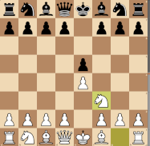
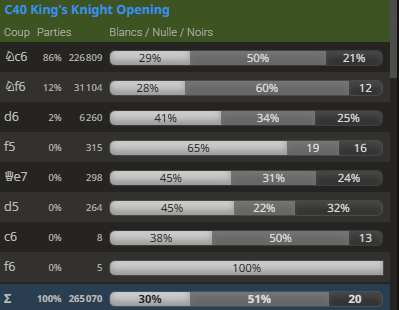

# 1. e4 e5 2. Nf3 : The King's Knight Opening (C40) #
 

White develops a piece to a more active square, makes room for the kingside castling, asserts control in the centre and over the d4 square, and attacks Black's e5-pawn. 
This is the most common opening played in the King's Pawn masters games (92% of KPG (C20)). 
 

 

     
    The King's Knight Game 1. e4 e5 2. Nf3  
    <table align="center"><tr> 
    <td valign="center"></td><td>+0.1</td></tr></table>
 
 
 

 

- Black now chooses: defend the pawn, or counter-attack?
  
- [**... Nc6**](./C44_Nf3_Nc6_King_Knight.md)  (+0.1) : **... Nc6** is the mainline. This develops a piece while also defending e5. A key advantage of **... Nc6** over alternative moves is that it controls both e5 and d4. It is the most popular Black's answer to the **2. Nf3** King's Knight Opening (86% of masters games). **... Nc6** leads into many of the most popular openings, including [**3. Bb5**, the Spanish or Ruy Lopez](./C60_Ruy_Lopez.md), [**3. Bc4**, the Italian](./C50_Italian.md), and [3. d4, the Scotch](./C44_Scotch.md).
  
  

 [*Back to initial move*](#_initial_move_)  
 [*Back to TOP*](#_TOP_)

