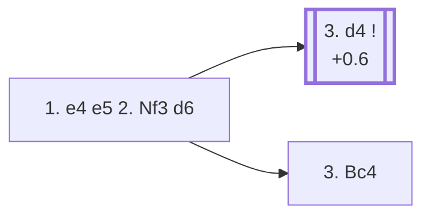

<a name="_TOP_"></a>

# C41 Philidor Defense <br> 1. e4 e5 2. Nf3 d6 #

Black defends the e5-pawn with a second pawn rather than a piece, keeping the structure solid but conceding some flexibility: the d6-pawn blocks the f8-bishop's best diagonal, and Black falls a little behind in development. Named after 18th-century player and composer François-André Danican Philidor, who was famous for the maxim "pawns are the soul of chess."

### Overview

*Quick map of every move covered on this card — see the [shape key](https://github.com/onclemarcel/chess_flashcards/blob/main/start.md#content-diagram-optional) in start.md.*

<!-- content-diagram:start -->

<!-- content-diagram:end -->

<a name="_initial_move_"></a>

[](https://lichess.org/analysis/standard/rnbqkbnr/ppp2ppp/3p4/4p3/4P3/5N2/PPPP1PPP/RNBQKB1R_w_KQkq_-_0_3)

*... 1. e4 e5 2. Nf3 d6 — Philidor Defense*

```
rnbqkbnr/ppp2ppp/3p4/4p3/4P3/5N2/PPPP1PPP/RNBQKB1R w KQkq - 0 3
```

|  | +0.5 |
| --- | --- |

<!-- lichess-stats:start fen="rnbqkbnr/ppp2ppp/3p4/4p3/4P3/5N2/PPPP1PPP/RNBQKB1R w KQkq - 0 3" db="lichess,masters" speeds="bullet,blitz" ratings="1800,2000,2200,2500" moves="6" -->
| Move | Online | W/D/B | Masters | W/D/B | |
| :--- | ---: | :--- | ---: | :--- | :-- |
| d4 | 10.1 M (42.1%) | ⬜⬜⬜⬜⬜🟫⬛⬛⬛⬛ 52/5/43 | 5.8 k (88.8%) | ⬜⬜⬜⬜🟫🟫🟫⬛⬛⬛ 41/34/25 |  |
| Bc4 | 9.6 M (40.2%) | ⬜⬜⬜⬜⬜⬛⬛⬛⬛⬛ 51/4/45 | 574 (8.8%) | ⬜⬜⬜⬜🟫🟫🟫🟫⬛⬛ 40/36/25 |  |
| Nc3 | 1.9 M (7.8%) | ⬜⬜⬜⬜⬜🟫⬛⬛⬛⬛ 51/5/44 | 124 (1.9%) | ⬜⬜⬜⬜🟫🟫🟫🟫⬛⬛ 35/40/24 |  |
| c3 | 867 k (3.6%) | ⬜⬜⬜⬜⬜⬛⬛⬛⬛⬛ 52/4/44 | 10 (0.2%) | — |  |
| h3 | 567 k (2.4%) | ⬜⬜⬜⬜⬜⬛⬛⬛⬛⬛ 49/5/46 | 4 (0.1%) | — | ⚠ |
| d3 | 291 k (1.2%) | ⬜⬜⬜⬜⬜⬛⬛⬛⬛⬛ 49/4/46 | 0 | — | ⚠ |
| g3 | 0 | — | 7 (0.1%) | — |  |

*Online: bullet/blitz, 1800+ — 23.9 M games. Masters: 6.5 k games. [Open in the explorer](https://lichess.org/analysis/standard/rnbqkbnr/ppp2ppp/3p4/4p3/4P3/5N2/PPPP1PPP/RNBQKB1R_w_KQkq_-_0_3#explorer) — updated 2026-09-06*
<!-- lichess-stats:end -->

### Candidate moves

> [!NOTE]
> Online, **3. Bc4** (40.2%) is nearly as popular as **3. d4** (42.1%) — but at master level d4 is played 88.8% of the time and Bc4 only 8.8%. Since 2... d6 doesn't fight for d4 the way 2... Nf6 or 2... Nc6 would, White's most testing try is simply to occupy the centre outright.

* [**3. d4**](#_d4_) (+0.6): occupies the centre while Black's last move did nothing to contest it — masters' overwhelming preference.
* [**3. Bc4**](#_Bc4_): also fine, developing toward f7 first and delaying the central commitment by a move.

[*Back to TOP*](#_TOP_)

---

<a name="_d4_"></a>

### 3. d4

[](https://lichess.org/analysis/standard/rnbqkbnr/ppp2ppp/3p4/4p3/3PP3/5N2/PPP2PPP/RNBQKB1R_b_KQkq_d3_0_3)

*... 3. d4*

```
rnbqkbnr/ppp2ppp/3p4/4p3/3PP3/5N2/PPP2PPP/RNBQKB1R b KQkq d3 0 3
```

|  | +0.6 |
| --- | --- |

<!-- lichess-stats:start fen="rnbqkbnr/ppp2ppp/3p4/4p3/3PP3/5N2/PPP2PPP/RNBQKB1R b KQkq d3 0 3" db="lichess,masters" speeds="bullet,blitz" ratings="1800,2000,2200,2500" moves="6" -->
| Move | Online | W/D/B | Masters | W/D/B | |
| :--- | ---: | :--- | ---: | :--- | :-- |
| exd4 | 6.0 M (56.2%) | ⬜⬜⬜⬜⬜🟫⬛⬛⬛⬛ 53/5/43 | 4.0 k (65.6%) | ⬜⬜⬜⬜🟫🟫🟫⬛⬛⬛ 38/36/26 |  |
| Bg4 | 1.1 M (10.4%) | ⬜⬜⬜⬜⬜🟫⬛⬛⬛⬛ 53/4/42 | 0 | — | ⚠ |
| Nc6 | 960 k (8.9%) | ⬜⬜⬜⬜⬜🟫⬛⬛⬛⬛ 50/5/45 | 71 (1.2%) | ⬜⬜⬜⬜🟫🟫🟫🟫⬛⬛ 45/38/17 |  |
| Nd7 | 817 k (7.6%) | ⬜⬜⬜⬜⬜⬛⬛⬛⬛⬛ 47/5/48 | 774 (12.5%) | ⬜⬜⬜⬜⬜🟫🟫🟫⬛⬛ 52/27/21 |  |
| Nf6 | 367 k (3.4%) | ⬜⬜⬜⬜⬜🟫⬛⬛⬛⬛ 51/6/44 | 1.1 k (17.9%) | ⬜⬜⬜⬜⬜🟫🟫🟫⬛⬛ 45/33/22 |  |
| f6 | 345 k (3.2%) | ⬜⬜⬜⬜⬜🟫⬛⬛⬛⬛ 52/5/43 | 0 | — | ⚠ |
| Qe7 | 0 | — | 86 (1.4%) | ⬜⬜⬜⬜⬜🟫🟫🟫⬛⬛ 48/31/21 |  |
| f5 | 0 | — | 45 (0.7%) | ⬜⬜⬜⬜⬜🟫🟫🟫⬛⬛ 49/27/24 |  |

*Online: bullet/blitz, 1800+ — 10.7 M games. Masters: 6.2 k games. [Open in the explorer](https://lichess.org/analysis/standard/rnbqkbnr/ppp2ppp/3p4/4p3/3PP3/5N2/PPP2PPP/RNBQKB1R_b_KQkq_d3_0_3#explorer) — updated 2026-09-06*
<!-- lichess-stats:end -->

* [**3... exd4**](#_exd4_) (+0.5, 65.6% masters): the *Exchange Variation* — simplest, trading off the central tension. After **4. Nxd4**, White keeps a small, safe space advantage typical of this whole opening.
* [**3... Nf6**](#_Nf6d4_) (17.9% masters, only 3.4% online): live-tagged the *Nimzowitsch Variation* — counter-attacking e4 instead of resolving the tension, transposing toward sharper structures.
* [**3... Nd7**](#_Nd7_) (12.5% masters): the flexible *Hanham Variation* — Black keeps the tension and prepares ... Ngf6/... Be7 without blocking the c8-bishop.
* [**3... f5**](#_f5d4_) (0.7% masters): the *Philidor Countergambit* — a sharp, objectively dubious immediate strike at e4 (Stockfish already prefers White by nearly two pawns at this fork).

[*Back to 2... d6*](#_initial_move_)
[*Back to TOP*](#_TOP_)

---

<a name="_exd4_"></a>

### 3... exd4 — Exchange Variation

[](https://lichess.org/analysis/standard/rnbqkbnr/ppp2ppp/3p4/8/3pP3/5N2/PPP2PPP/RNBQKB1R_w_KQkq_-_0_4)

*... 3... exd4 — Exchange Variation*

```
rnbqkbnr/ppp2ppp/3p4/8/3pP3/5N2/PPP2PPP/RNBQKB1R w KQkq - 0 4
```

|  | +0.5 |
| --- | --- |

* [**4. Nxd4**](#_Nxd4d_) (+0.5, 84.7% masters): masters' clear main try, centralising the knight.
* [**4. Qxd4**](#_Qxd4d_) (+0.8, 14.8% masters): the queen recaptures instead, developing the *Boden Variation* one ply further after **4... Bd7**.

[*Back to 3. d4*](#_d4_)
[*Back to TOP*](#_TOP_)

---

<a name="_Nxd4d_"></a>

### 4. Nxd4

[](https://lichess.org/analysis/standard/rnbqkbnr/ppp2ppp/3p4/8/3NP3/8/PPP2PPP/RNBQKB1R_b_KQkq_-_0_4)

*... 4. Nxd4*

```
rnbqkbnr/ppp2ppp/3p4/8/3NP3/8/PPP2PPP/RNBQKB1R b KQkq - 0 4
```

|  | +0.5 |
| --- | --- |

Masters' clear main try is **4... Nf6** (86.4%), attacking e4 in the same spirit as Petrov's Defense; **4... g6** (12.1%) is the *Larsen Variation*, fianchettoing instead. **4... d5**, offering the centre back at once, is the *Paulsen Attack* after **5. exd5** — real but essentially unplayed today (0.1% masters). Deeper theory past 4... Nf6 (5. Nc3 Be7 6. Be2 O-O 7. O-O c5 8. Nf3 Nc6 9. Bg5 Be6 10. Re1, the *Berger Variation*) is its own body of work, not covered further here (backlog).

[*Back to 3... exd4*](#_exd4_)
[*Back to TOP*](#_TOP_)

---

<a name="_Qxd4d_"></a>

### 4. Qxd4 — toward the Boden Variation

[](https://lichess.org/analysis/standard/rnbqkbnr/ppp2ppp/3p4/8/3QP3/5N2/PPP2PPP/RNB1KB1R_b_KQkq_-_0_4)

*... 4. Qxd4*

```
rnbqkbnr/ppp2ppp/3p4/8/3QP3/5N2/PPP2PPP/RNB1KB1R b KQkq - 0 4
```

|  | +0.8 |
| --- | --- |

**4... Bd7**, the *Boden Variation*, prepares ... Nc6 with tempo on the exposed queen. Not built out further here (backlog).

[*Back to 3... exd4*](#_exd4_)
[*Back to TOP*](#_TOP_)

---

<a name="_Nf6d4_"></a>

### 3... Nf6 — Nimzowitsch Variation

[](https://lichess.org/analysis/standard/rnbqkb1r/ppp2ppp/3p1n2/4p3/3PP3/5N2/PPP2PPP/RNBQKB1R_w_KQkq_-_1_4)

*... 3... Nf6 — Nimzowitsch Variation*

```
rnbqkb1r/ppp2ppp/3p1n2/4p3/3PP3/5N2/PPP2PPP/RNBQKB1R w KQkq - 1 4
```

|  | +0.8 |
| --- | --- |

**Live-confirmed**: the Lichess explorer already tags this exact position (before White's 4th move) the *Nimzowitsch Variation* — `eco.md`'s own umbrella name here is *Nimzovich (Jaenisch) Variation*, only narrowing to the plain *Nimzovich Variation* one ply further at 4. dxe5.

* [**4. Nc3**](#_Nc3Nf6_) (75.1% masters): develops naturally, keeping the central tension.
* [**4. dxe5**](#_dxe5_) (22.8% masters): resolves the tension immediately.
* [**4. Ng5**](#_Ng5d4_) (1.2% masters): the *Locock Variation*.
* [**4. Bc4**](#_Bc4Nf6_) (masters: negligible sample): the *Klein Variation*.

[*Back to 3. d4*](#_d4_)
[*Back to TOP*](#_TOP_)

---

<a name="_Nc3Nf6_"></a>

### 4. Nc3 Nbd7 — Improved Hanham Variation

[](https://lichess.org/analysis/standard/r1bqkb1r/pppn1ppp/3p1n2/4p3/3PP3/2N2N2/PPP2PPP/R1BQKB1R_w_KQkq_-_3_5)

*... 4. Nc3 Nbd7 — Improved Hanham Variation*

```
r1bqkb1r/pppn1ppp/3p1n2/4p3/3PP3/2N2N2/PPP2PPP/R1BQKB1R w KQkq - 3 5
```

|  | +0.4 |
| --- | --- |

Two named deeper lines both continue **5. Bc4 Be7**: the *Sozin Variation* (6. O-O O-O 7. Qe2 c6 8. a4 exd4, roughly level by the engine's own numbers) and the *Larobok Variation* (6. Ng5 O-O 7. Bxf7, a piece sac reaching a fully balanced position, 0.00). Neither built out further here (backlog).

[*Back to 3... Nf6*](#_Nf6d4_)
[*Back to TOP*](#_TOP_)

---

<a name="_dxe5_"></a>

### 4. dxe5 Nxe4 — toward Sokolsky and Rellstab

[](https://lichess.org/analysis/standard/rnbqkb1r/ppp2ppp/3p4/4P3/4n3/5N2/PPP2PPP/RNBQKB1R_w_KQkq_-_0_5)

*... 4. dxe5 Nxe4*

```
rnbqkb1r/ppp2ppp/3p4/4P3/4n3/5N2/PPP2PPP/RNBQKB1R w KQkq - 0 5
```

|  | +0.7 |
| --- | --- |

Masters' clear main try is **5. Qd5** (74.5%), the *Rellstab Variation*, forking the e4-knight and the b7-pawn at once; **5. Nbd2**, the *Sokolsky Variation*, trades it off instead (5.9% masters, +0.3). Neither built out further here (backlog).

[*Back to 3... Nf6*](#_Nf6d4_)
[*Back to TOP*](#_TOP_)

---

<a name="_Ng5d4_"></a>

### 4. Ng5 — Locock Variation

[](https://lichess.org/analysis/standard/rnbqkb1r/ppp2ppp/3p1n2/4p1N1/3PP3/8/PPP2PPP/RNBQKB1R_b_KQkq_-_2_4)

*... 4. Ng5 — Locock Variation*

```
rnbqkb1r/ppp2ppp/3p1n2/4p1N1/3PP3/8/PPP2PPP/RNBQKB1R b KQkq - 2 4
```

|  | -0.1 |
| --- | --- |

A rare, sharp attempt (1.2% masters) that Stockfish already rates as slightly better for Black. Not built out further here (backlog).

[*Back to 3... Nf6*](#_Nf6d4_)
[*Back to TOP*](#_TOP_)

---

<a name="_Bc4Nf6_"></a>

### 4. Bc4 — Klein Variation

[](https://lichess.org/analysis/standard/rnbqkb1r/ppp2ppp/3p1n2/4p3/2BPP3/5N2/PPP2PPP/RNBQK2R_b_KQkq_-_2_4)

*... 4. Bc4 — Klein Variation*

```
rnbqkb1r/ppp2ppp/3p1n2/4p3/2BPP3/5N2/PPP2PPP/RNBQK2R b KQkq - 2 4
```

|  | +0.3 |
| --- | --- |

A minor try (1.2% masters), developing before deciding how to meet the central tension. Not built out further here (backlog).

[*Back to 3... Nf6*](#_Nf6d4_)
[*Back to TOP*](#_TOP_)

---

<a name="_Nd7_"></a>

### 3... Nd7 — Hanham Variation

[](https://lichess.org/analysis/standard/r1bqkbnr/pppn1ppp/3p4/4p3/3PP3/5N2/PPP2PPP/RNBQKB1R_w_KQkq_-_1_4)

*... 3... Nd7 — Hanham Variation*

```
r1bqkbnr/pppn1ppp/3p4/4p3/3PP3/5N2/PPP2PPP/RNBQKB1R w KQkq - 1 4
```

|  | +0.6 |
| --- | --- |

**4. Bc4** is masters' main try (66.9%), heading for a whole family of named lines after **4... c6**; **4. Nc3** (24.7%) is also common. Not built out further here beyond the Bc4 fork below.

* [**4. Bc4 c6**](#_Bc4c6_) — root of the Krause/Steiner, Kmoch/Berger, Schlechter, and Delmar Variations.

[*Back to 3. d4*](#_d4_)
[*Back to TOP*](#_TOP_)

---

<a name="_Bc4c6_"></a>

### 4. Bc4 c6

[](https://lichess.org/analysis/standard/r1bqkbnr/pp1n1ppp/2pp4/4p3/2BPP3/5N2/PPP2PPP/RNBQK2R_w_KQkq_-_0_5)

*... 4. Bc4 c6*

```
r1bqkbnr/pp1n1ppp/2pp4/4p3/2BPP3/5N2/PPP2PPP/RNBQK2R w KQkq - 0 5
```

|  | +0.8 |
| --- | --- |

Four named White tries fork from here, none built out beyond this ply (all backlog):

* **5. O-O** (+0.9): the *Krause Variation* — after **5... Be7 6. dxe5**, the *Steiner Variation* (+0.9).
* **5. Ng5** (+0.7): the *Kmoch Variation* — after **5... Nh6 6. f4 Be7 7. O-O O-O 8. c3 d5**, the *Berger Variation* — a real engine swing toward Black by this point (-0.8).
* **5. Nc3** (+0.4): the *Schlechter Variation*.
* **5. c3** (+0.4): the *Delmar Variation*.

[*Back to 3... Nd7*](#_Nd7_)
[*Back to TOP*](#_TOP_)

---

<a name="_f5d4_"></a>

### 3... f5 — Philidor Countergambit

[](https://lichess.org/analysis/standard/rnbqkbnr/ppp3pp/3p4/4pp2/3PP3/5N2/PPP2PPP/RNBQKB1R_w_KQkq_f6_0_4)

*... 3... f5 — Philidor Countergambit*

```
rnbqkbnr/ppp3pp/3p4/4pp2/3PP3/5N2/PPP2PPP/RNBQKB1R w KQkq f6 0 4
```

|  | +2.0 |
| --- | --- |

Masters split several ways, none dominant: **4. Nc3** (40.0%), the *Zukertort Variation*; **4. dxe5** (31.1%), heading toward the sharp *del Rio Attack* (4... fxe4 5. Ng5 d5 6. e6, +1.6) and its own *Berger Variation* (6... Bc5 7. Nc3, +0.6); **4. Bc4** (17.8%); **4. exf5** (11.1%). None built out further here (backlog) — the whole line is already objectively difficult for Black (+2.0 at the root).

[*Back to 3. d4*](#_d4_)
[*Back to TOP*](#_TOP_)

---

<a name="_Bc4_"></a>

### 3. Bc4

[](https://lichess.org/analysis/standard/rnbqkbnr/ppp2ppp/3p4/4p3/2B1P3/5N2/PPPP1PPP/RNBQK2R_b_KQkq_-_1_3)

*... 3. Bc4*

```
rnbqkbnr/ppp2ppp/3p4/4p3/2B1P3/5N2/PPPP1PPP/RNBQK2R b KQkq - 1 3
```

|  | +0.2 |
| --- | --- |

Popular online (40.2%) and far from bad, but masters treat it as the second choice (8.8%): it develops actively toward f7 but, unlike 3. d4, lets Black equalise the centre with ... Nf6 and ... Be7/... Nc6 at leisure.

* [**3... Be7**](#_Steinitz_) (56.9% masters): heading for the *Steinitz Variation* after **4. c3**.
* [**3... f5**](#_LopezCG_) (0.7% masters, but a real named try): the *Lopez Countergambit*.

[*Back to 2... d6*](#_initial_move_)
[*Back to TOP*](#_TOP_)

---

<a name="_Steinitz_"></a>

### 3... Be7 4. c3 — Steinitz Variation

[](https://lichess.org/analysis/standard/rnbqk1nr/ppp1bppp/3p4/4p3/2B1P3/2P2N2/PP1P1PPP/RNBQK2R_b_KQkq_-_0_4)

*... 4. c3 — Steinitz Variation*

```
rnbqk1nr/ppp1bppp/3p4/4p3/2B1P3/2P2N2/PP1P1PPP/RNBQK2R b KQkq - 0 4
```

|  | +0.1 |
| --- | --- |

Prepares **d4** with support, a quiet build-up in the same spirit as 3. d4 itself but a tempo slower. Not built out further here (backlog).

[*Back to 3. Bc4*](#_Bc4_)
[*Back to TOP*](#_TOP_)

---

<a name="_LopezCG_"></a>

### 3... f5 — Lopez Countergambit

[](https://lichess.org/analysis/standard/rnbqkbnr/ppp3pp/3p4/4pp2/2B1P3/5N2/PPPP1PPP/RNBQK2R_w_KQkq_f6_0_4)

*... 3... f5 — Lopez Countergambit*

```
rnbqkbnr/ppp3pp/3p4/4pp2/2B1P3/5N2/PPPP1PPP/RNBQK2R w KQkq f6 0 4
```

|  | +1.6 |
| --- | --- |

Already objectively difficult for Black (+1.6). Masters' handful of games split between **4. d3** and **4. Nc3**; online, **4. d4** heading into the *Jaenisch Variation* (4... exd4 5. Ng5 Nh6 6. Nxh7) is a real, sharp piece-sac try that levels out to a roughly balanced position (0.00) — real but not covered further here (backlog).

[*Back to 3. Bc4*](#_Bc4_)
[*Back to TOP*](#_TOP_)
