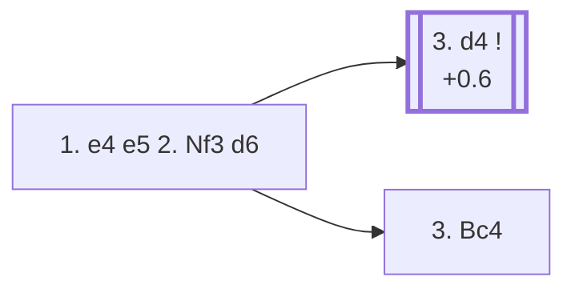

<a name="_TOP_"></a>

# C41 Philidor Defense <br> 1. e4 e5 2. Nf3 d6 #

Black defends the e5-pawn with a second pawn rather than a piece, keeping the structure solid but conceding some flexibility: the d6-pawn blocks the f8-bishop's best diagonal, and Black falls a little behind in development. Named after 18th-century player and composer François-André Danican Philidor, who was famous for the maxim "pawns are the soul of chess."

### Overview

*Quick map of every move covered on this card — see the [shape key](https://github.com/onclemarcel/chess_flashcards/blob/main/start.md#content-diagram-optional) in start.md.*

<!-- content-diagram:start -->

<!-- content-diagram:end -->

<a name="_initial_move_"></a>

[](https://lichess.org/analysis/standard/rnbqkbnr/ppp2ppp/3p4/4p3/4P3/5N2/PPPP1PPP/RNBQKB1R_w_KQkq_-_0_3)

*... 1. e4 e5 2. Nf3 d6 — Philidor Defense*

```
rnbqkbnr/ppp2ppp/3p4/4p3/4P3/5N2/PPPP1PPP/RNBQKB1R w KQkq - 0 3
```

|  | +0.5 |
| --- | --- |

<!-- lichess-stats:start fen="rnbqkbnr/ppp2ppp/3p4/4p3/4P3/5N2/PPPP1PPP/RNBQKB1R w KQkq - 0 3" db="lichess,masters" speeds="bullet,blitz" ratings="1800,2000,2200,2500" moves="6" -->
| Move | Online | W/D/B | Masters | W/D/B | |
| :--- | ---: | :--- | ---: | :--- | :-- |
| d4 | 10.1 M (42.1%) | ⬜⬜⬜⬜⬜🟫⬛⬛⬛⬛ 52/5/43 | 5.8 k (88.8%) | ⬜⬜⬜⬜🟫🟫🟫⬛⬛⬛ 41/34/25 |  |
| Bc4 | 9.6 M (40.2%) | ⬜⬜⬜⬜⬜⬛⬛⬛⬛⬛ 51/4/45 | 574 (8.8%) | ⬜⬜⬜⬜🟫🟫🟫🟫⬛⬛ 40/36/25 |  |
| Nc3 | 1.9 M (7.8%) | ⬜⬜⬜⬜⬜🟫⬛⬛⬛⬛ 51/5/44 | 124 (1.9%) | ⬜⬜⬜⬜🟫🟫🟫🟫⬛⬛ 35/40/24 |  |
| c3 | 867 k (3.6%) | ⬜⬜⬜⬜⬜⬛⬛⬛⬛⬛ 52/4/44 | 10 (0.2%) | — |  |
| h3 | 567 k (2.4%) | ⬜⬜⬜⬜⬜⬛⬛⬛⬛⬛ 49/5/46 | 4 (0.1%) | — | ⚠ |
| d3 | 291 k (1.2%) | ⬜⬜⬜⬜⬜⬛⬛⬛⬛⬛ 49/4/46 | 0 | — | ⚠ |
| g3 | 0 | — | 7 (0.1%) | — |  |

*Online: bullet/blitz, 1800+ — 23.9 M games. Masters: 6.5 k games. [Open in the explorer](https://lichess.org/analysis/standard/rnbqkbnr/ppp2ppp/3p4/4p3/4P3/5N2/PPPP1PPP/RNBQKB1R_w_KQkq_-_0_3#explorer) — updated 2026-08-27*
<!-- lichess-stats:end -->

### Candidate moves

> [!NOTE]
> Online, **3. Bc4** (40.2%) is nearly as popular as **3. d4** (42.1%) — but at master level d4 is played 88.8% of the time and Bc4 only 8.8%. Since 2... d6 doesn't fight for d4 the way 2... Nf6 or 2... Nc6 would, White's most testing try is simply to occupy the centre outright.

* [**3. d4**](#_d4_) (+0.6): occupies the centre while Black's last move did nothing to contest it — masters' overwhelming preference.
* [**3. Bc4**](#_Bc4_): also fine, developing toward f7 first and delaying the central commitment by a move.

[*Back to TOP*](#_TOP_)

---

<a name="_d4_"></a>

### 3. d4

[](https://lichess.org/analysis/standard/rnbqkbnr/ppp2ppp/3p4/4p3/3PP3/5N2/PPP2PPP/RNBQKB1R_b_KQkq_d3_0_3)

*... 3. d4*

```
rnbqkbnr/ppp2ppp/3p4/4p3/3PP3/5N2/PPP2PPP/RNBQKB1R b KQkq d3 0 3
```

|  | +0.6 |
| --- | --- |

<!-- lichess-stats:start fen="rnbqkbnr/ppp2ppp/3p4/4p3/3PP3/5N2/PPP2PPP/RNBQKB1R b KQkq d3 0 3" db="lichess,masters" speeds="bullet,blitz" ratings="1800,2000,2200,2500" moves="6" -->
| Move | Online | W/D/B | Masters | W/D/B | |
| :--- | ---: | :--- | ---: | :--- | :-- |
| exd4 | 6.0 M (56.2%) | ⬜⬜⬜⬜⬜🟫⬛⬛⬛⬛ 53/5/43 | 4.0 k (65.6%) | ⬜⬜⬜⬜🟫🟫🟫⬛⬛⬛ 38/36/26 |  |
| Bg4 | 1.1 M (10.4%) | ⬜⬜⬜⬜⬜🟫⬛⬛⬛⬛ 53/4/42 | 0 | — | ⚠ |
| Nc6 | 960 k (8.9%) | ⬜⬜⬜⬜⬜🟫⬛⬛⬛⬛ 50/5/45 | 71 (1.2%) | ⬜⬜⬜⬜🟫🟫🟫🟫⬛⬛ 45/38/17 |  |
| Nd7 | 817 k (7.6%) | ⬜⬜⬜⬜⬜⬛⬛⬛⬛⬛ 47/5/48 | 774 (12.5%) | ⬜⬜⬜⬜⬜🟫🟫🟫⬛⬛ 52/27/21 |  |
| Nf6 | 367 k (3.4%) | ⬜⬜⬜⬜⬜🟫⬛⬛⬛⬛ 51/6/44 | 1.1 k (17.9%) | ⬜⬜⬜⬜⬜🟫🟫🟫⬛⬛ 45/33/22 |  |
| f6 | 345 k (3.2%) | ⬜⬜⬜⬜⬜🟫⬛⬛⬛⬛ 52/5/43 | 0 | — | ⚠ |
| Qe7 | 0 | — | 86 (1.4%) | ⬜⬜⬜⬜⬜🟫🟫🟫⬛⬛ 48/31/21 |  |
| f5 | 0 | — | 45 (0.7%) | ⬜⬜⬜⬜⬜🟫🟫🟫⬛⬛ 49/27/24 |  |

*Online: bullet/blitz, 1800+ — 10.7 M games. Masters: 6.2 k games. [Open in the explorer](https://lichess.org/analysis/standard/rnbqkbnr/ppp2ppp/3p4/4p3/3PP3/5N2/PPP2PPP/RNBQKB1R_b_KQkq_d3_0_3#explorer) — updated 2026-08-27*
<!-- lichess-stats:end -->

* **3... exd4** (+0.5, 65.6% masters): the *Exchange Variation* — simplest, trading off the central tension. After **4. Nxd4**, White keeps a small, safe space advantage typical of this whole opening.
* **3... Nf6** (17.9% masters, only 3.4% online): counter-attacking e4 instead of resolving the tension, transposing toward sharper structures.
* **3... Nd7** (12.5% masters): the flexible *Hanham Variation* — Black keeps the tension and prepares ... Ngf6/... Be7 without blocking the c8-bishop.

[*Back to 2... d6*](#_initial_move_)
[*Back to TOP*](#_TOP_)

---

<a name="_Bc4_"></a>

### 3. Bc4

[](https://lichess.org/analysis/standard/rnbqkbnr/ppp2ppp/3p4/4p3/2B1P3/5N2/PPPP1PPP/RNBQK2R_b_KQkq_-_1_3)

*... 3. Bc4*

```
rnbqkbnr/ppp2ppp/3p4/4p3/2B1P3/5N2/PPPP1PPP/RNBQK2R b KQkq - 1 3
```

Popular online (40.2%) and far from bad, but masters treat it as the second choice (8.8%): it develops actively toward f7 but, unlike 3. d4, lets Black equalise the centre with ... Nf6 and ... Be7/... Nc6 at leisure.

[*Back to 2... d6*](#_initial_move_)
[*Back to TOP*](#_TOP_)
