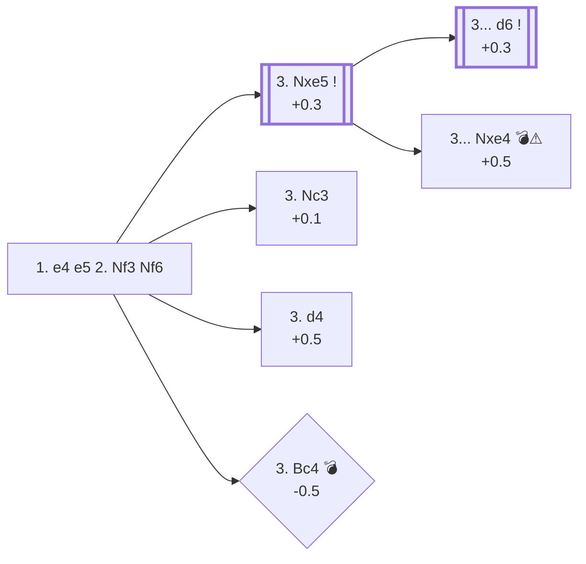

<a name="_TOP_"></a>

# C42 Petrov's Defense (Russian Defense) <br> 1. e4 e5 2. Nf3 Nf6 #

Rather than defend e5, Black counter-attacks e4 directly. If White simply takes the pawn, Black has several ways to win it back with a comfortable, often symmetric position — which is exactly why this opening has such a drawish reputation at the very top level, and exactly why it rewards players who know its two classic traps.

### Overview

*Quick map of every move covered on this card — see the [shape key](https://github.com/onclemarcel/chess_flashcards/blob/main/start.md#content-diagram-optional) in start.md.*

<!-- content-diagram:start -->

<!-- content-diagram:end -->

<a name="_initial_move_"></a>

[](https://lichess.org/analysis/standard/rnbqkb1r/pppp1ppp/5n2/4p3/4P3/5N2/PPPP1PPP/RNBQKB1R_w_KQkq_-_2_3)

*... 1. e4 e5 2. Nf3 Nf6 — Petrov's Defense*

```
rnbqkb1r/pppp1ppp/5n2/4p3/4P3/5N2/PPPP1PPP/RNBQKB1R w KQkq - 2 3
```

|  | +0.3 |
| --- | --- |

<!-- lichess-stats:start fen="rnbqkb1r/pppp1ppp/5n2/4p3/4P3/5N2/PPPP1PPP/RNBQKB1R w KQkq - 2 3" db="lichess,masters" speeds="bullet,blitz" ratings="1800,2000,2200,2500" moves="8" -->
| Move | Online | W/D/B | Masters | W/D/B | |
| :--- | ---: | :--- | ---: | :--- | :-- |
| Nxe5 | 7.2 M (33.8%) | ⬜⬜⬜⬜⬜⬛⬛⬛⬛⬛ 49/5/45 | 23 k (68.1%) | ⬜⬜⬜🟫🟫🟫🟫🟫🟫⬛ 25/64/11 |  |
| Nc3 | 6.3 M (29.9%) | ⬜⬜⬜⬜⬜⬛⬛⬛⬛⬛ 49/5/46 | 3.8 k (11.0%) | ⬜⬜⬜🟫🟫🟫🟫🟫⬛⬛ 31/51/18 |  |
| Bc4 | 3.7 M (17.3%) | ⬜⬜⬜⬜⬜⬛⬛⬛⬛⬛ 49/4/47 | 130 (0.4%) | ⬜⬜⬜🟫🟫🟫🟫⬛⬛⬛ 29/38/32 |  |
| d4 | 2.5 M (11.6%) | ⬜⬜⬜⬜⬜🟫⬛⬛⬛⬛ 51/5/44 | 6.4 k (18.7%) | ⬜⬜⬜🟫🟫🟫🟫🟫🟫⬛ 30/58/12 |  |
| d3 | 1.1 M (5.4%) | ⬜⬜⬜⬜⬜⬛⬛⬛⬛⬛ 47/5/48 | 555 (1.6%) | ⬜⬜⬜⬜🟫🟫🟫🟫⬛⬛ 40/40/20 |  |
| c3 | 184 k (0.9%) | ⬜⬜⬜⬜⬜⬛⬛⬛⬛⬛ 48/4/48 | 0 | — | ⚠ |
| Bd3 | 82 k (0.4%) | ⬜⬜⬜⬜⬜⬛⬛⬛⬛⬛ 47/4/49 | 0 | — | ⚠ |
| Bb5 | 78 k (0.4%) | ⬜⬜⬜⬜⬜⬛⬛⬛⬛⬛ 49/4/47 | 14 (0.0%) | — |  |
| Qe2 | 0 | — | 32 (0.1%) | ⬜⬜⬜⬜⬜🟫🟫⬛⬛⬛ 47/25/28 |  |
| h3 | 0 | — | 11 (0.0%) | — |  |

*Online: bullet/blitz, 1800+ — 21.2 M games. Masters: 34 k games. [Open in the explorer](https://lichess.org/analysis/standard/rnbqkb1r/pppp1ppp/5n2/4p3/4P3/5N2/PPPP1PPP/RNBQKB1R_w_KQkq_-_2_3#explorer) — updated 2026-08-25*
<!-- lichess-stats:end -->

### Candidate moves

* [**3. Nxe5**](#_Nxe5_) (+0.3): simply takes the pawn — masters' clear main line (68.1%). Black must know the right recapture (see below).
* [**3. Nc3**](#_Nc3_) (+0.1): the *Three Knights Game*, sidestepping the theoretical main lines by developing instead.
* [**3. d4**](#_d4_) (+0.5): the *Steinitz Variation*, building the centre before deciding how to meet ... Nxe4.
* [**3. Bc4**](#_Bc4_trap_) (-0.5 💣⚠): a natural-looking developing move that is actually a mistake — see the tip below. Played 17.3% of the time online but almost never by masters (0.4%).

[*Back to TOP*](#_TOP_)

---

<a name="_Nxe5_"></a>

### 3. Nxe5

[](https://lichess.org/analysis/standard/rnbqkb1r/pppp1ppp/5n2/4N3/4P3/8/PPPP1PPP/RNBQKB1R_b_KQkq_-_0_3)

*... 3. Nxe5*

```
rnbqkb1r/pppp1ppp/5n2/4N3/4P3/8/PPPP1PPP/RNBQKB1R b KQkq - 0 3
```

|  | +0.3 |
| --- | --- |

<!-- lichess-stats:start fen="rnbqkb1r/pppp1ppp/5n2/4N3/4P3/8/PPPP1PPP/RNBQKB1R b KQkq - 0 3" db="lichess,masters" speeds="bullet,blitz" ratings="1800,2000,2200,2500" moves="6" -->
| Move | Online | W/D/B | Masters | W/D/B | |
| :--- | ---: | :--- | ---: | :--- | :-- |
| d6 | 3.5 M (48.8%) | ⬜⬜⬜⬜⬜🟫⬛⬛⬛⬛ 49/6/44 | 23 k (98.0%) | ⬜⬜⬜🟫🟫🟫🟫🟫🟫⬛ 25/64/11 |  |
| Nc6 | 2.3 M (32.5%) | ⬜⬜⬜⬜⬜⬛⬛⬛⬛⬛ 48/4/48 | 12 (0.1%) | — |  |
| Nxe4 | 576 k (8.0%) | ⬜⬜⬜⬜⬜⬛⬛⬛⬛⬛ 48/6/46 | 375 (1.6%) | ⬜⬜⬜🟫🟫🟫🟫🟫🟫⬛ 32/56/12 |  |
| Qe7 | 389 k (5.4%) | ⬜⬜⬜⬜⬜🟫⬛⬛⬛⬛ 53/5/42 | 77 (0.3%) | ⬜⬜⬜🟫🟫🟫🟫🟫⬛⬛ 34/45/21 |  |
| d5 | 161 k (2.3%) | ⬜⬜⬜⬜⬜⬛⬛⬛⬛⬛ 48/4/48 | 11 (0.0%) | — |  |
| Bc5 | 133 k (1.9%) | ⬜⬜⬜⬜⬜⬜⬛⬛⬛⬛ 56/3/41 | 0 | — | ⚠ |

*Online: bullet/blitz, 1800+ — 7.2 M games. Masters: 23 k games. [Open in the explorer](https://lichess.org/analysis/standard/rnbqkb1r/pppp1ppp/5n2/4N3/4P3/8/PPPP1PPP/RNBQKB1R_b_KQkq_-_0_3#explorer) — updated 2026-08-25*
<!-- lichess-stats:end -->

* **3... d6** (+0.3, 98.0% of masters games): chasing the knight back before doing anything else — the only fully correct move, and the point of the whole trap below.
* **3... Nxe4?? ⚠** (+0.5, only 1.6% of masters games, but 8.0% online): looks like the natural way to win the pawn back at once — it isn't. See the tip.

[*Back to 2... Nf6*](#_initial_move_)
[*Back to TOP*](#_TOP_)

---

> [!TIP]
> The single most famous trap in the Petrov: recapturing on e4 immediately, instead of chasing the knight with ... d6 first, walks into a pin that wins material back for White.
>
> <a name="_Nxe4_trap_"></a>
>
> ### 3. Nxe5 Nxe4?? — the Petrov Trap
>
> [](https://lichess.org/analysis/standard/rnbqkb1r/pppp1ppp/8/4N3/4n3/8/PPPP1PPP/RNBQKB1R_w_KQkq_-_0_4)
>
> *... 3... Nxe4?? — both knights now hang*
>
> ```
> rnbqkb1r/pppp1ppp/8/4N3/4n3/8/PPPP1PPP/RNBQKB1R w KQkq - 0 4
> ```
>
> |  | +0.5 |
> | --- | --- |
>
> **4. Qe2!** pins the black knight to its own king along the e-file and attacks White's own knight on e5 at the same time — Black cannot defend the pinned knight and save the other one in a single move.
>
> [](https://lichess.org/analysis/standard/rnbqkb1r/pppp1ppp/8/4N3/4n3/8/PPPPQPPP/RNB1KB1R_b_KQkq_-_1_4)
>
> *... 4. Qe2 — green: the queen pins the e4-knight and attacks e5 at once*
>
> ```
> rnbqkb1r/pppp1ppp/8/4N3/4n3/8/PPPPQPPP/RNB1KB1R b KQkq - 1 4
> ```
>
> |  | +0.6 |
> | --- | --- |
>
> Black's best try is **4... Qe7**, offering a queen trade to break the pin, but after **5. Qxe4 d6 6. d4** (or similar) White simply keeps the extra tempo and a safe, comfortable edge — the pawn Black "won" on move 3 comes right back. This is exactly why 98% of masters play 3... d6 first instead.
>
> [*Back to 3. Nxe5*](#_Nxe5_)
> [*Back to TOP*](#_TOP_)

---

<a name="_Nc3_"></a>

### 3. Nc3 — Three Knights Game

[](https://lichess.org/analysis/standard/rnbqkb1r/pppp1ppp/5n2/4p3/4P3/2N2N2/PPPP1PPP/R1BQKB1R_b_KQkq_-_3_3)

*... 3. Nc3 — Three Knights Game*

```
rnbqkb1r/pppp1ppp/5n2/4p3/4P3/2N2N2/PPPP1PPP/R1BQKB1R b KQkq - 3 3
```

|  | +0.1 |
| --- | --- |

Sidesteps Petrov theory entirely; after **3... Nc6**, the game transposes to the Four Knights Game.

[*Back to 2... Nf6*](#_initial_move_)
[*Back to TOP*](#_TOP_)

---

<a name="_d4_"></a>

### 3. d4 — Steinitz Variation

[](https://lichess.org/analysis/standard/rnbqkb1r/pppp1ppp/5n2/4p3/3PP3/5N2/PPP2PPP/RNBQKB1R_b_KQkq_d3_0_3)

*... 3. d4 — Steinitz Variation*

```
rnbqkb1r/pppp1ppp/5n2/4p3/3PP3/5N2/PPP2PPP/RNBQKB1R b KQkq d3 0 3
```

|  | +0.5 |
| --- | --- |

Builds the centre before resolving the tension on e4/e5. After **3... Nxe4**, White gets a comfortable lead in development for the pawn with **4. Bd3** ideas; Black can also decline with **3... exd4**.

[*Back to 2... Nf6*](#_initial_move_)
[*Back to TOP*](#_TOP_)

---

> [!TIP]
> **3. Bc4** looks like a normal developing move, but unlike after 2. Nf3 Nc6 (where Nc3 is already covering e4), nothing defends e4 here — Black simply takes it.
>
> <a name="_Bc4_trap_"></a>
>
> ### 3. Bc4 Nxe4! — the free pawn
>
> [](https://lichess.org/analysis/standard/rnbqkb1r/pppp1ppp/8/4p3/2B1n3/5N2/PPPP1PPP/RNBQK2R_w_KQkq_-_0_4)
>
> *... 3. Bc4 Nxe4! — a clean pawn, no strings attached*
>
> ```
> rnbqkb1r/pppp1ppp/8/4p3/2B1n3/5N2/PPPP1PPP/RNBQK2R w KQkq - 0 4
> ```
>
> |  | -0.4 |
> | --- | --- |
>
> <!-- lichess-stats:start fen="rnbqkb1r/pppp1ppp/8/4p3/2B1n3/5N2/PPPP1PPP/RNBQK2R w KQkq - 0 4" db="lichess,masters" speeds="bullet,blitz" ratings="1800,2000,2200,2500" moves="6" -->
> | Move | Online | W/D/B | Masters | W/D/B | |
> | :--- | ---: | :--- | ---: | :--- | :-- |
> | Nxe5 | 442 k (29.6%) | ⬜⬜⬜⬜🟫⬛⬛⬛⬛⬛ 42/4/54 | 3 (2.5%) | — | ⚠ |
> | O-O | 330 k (22.1%) | ⬜⬜⬜⬜🟫⬛⬛⬛⬛⬛ 43/4/52 | 6 (4.9%) | — |  |
> | Nc3 | 212 k (14.2%) | ⬜⬜⬜⬜⬜🟫⬛⬛⬛⬛ 54/5/42 | 100 (82.0%) | ⬜⬜⬜🟫🟫🟫🟫⬛⬛⬛ 26/38/36 |  |
> | Qe2 | 188 k (12.6%) | ⬜⬜⬜⬜🟫⬛⬛⬛⬛⬛ 43/5/52 | 8 (6.6%) | — |  |
> | d3 | 147 k (9.8%) | ⬜⬜⬜⬜⬜⬛⬛⬛⬛⬛ 45/5/50 | 5 (4.1%) | — |  |
> | d4 | 85 k (5.7%) | ⬜⬜⬜⬜🟫⬛⬛⬛⬛⬛ 43/4/53 | 0 | — | ⚠ |
> 
> *Online: bullet/blitz, 1800+ — 1.5 M games. Masters: 122 games. [Open in the explorer](https://lichess.org/analysis/standard/rnbqkb1r/pppp1ppp/8/4p3/2B1n3/5N2/PPPP1PPP/RNBQK2R_w_KQkq_-_0_4#explorer) — updated 2026-08-25*
> <!-- lichess-stats:end -->
>
> Unlike the similar-looking Italian/Four Knights "Center Fork Trick" (**2. Nf3 Nc6 3. Bc4 Nf6 4. Nc3 Nxe4**), there is no knight fork to win the pawn back here — White simply has nothing better than **4. Nc3**, hitting the knight and hoping for compensation from the bishop's diagonal, but engines still favour Black by roughly half a pawn (-0.5) after best play. Masters who reach 3. Bc4 punish it with 3... Nxe4 68.9% of the time; online, only 31.3% find it, and 34.7% play the more natural-looking (but pointless) 3... Nc6 instead.
>
> [*Back to 2. Nf3 Nf6*](#_initial_move_)
> [*Back to TOP*](#_TOP_)
