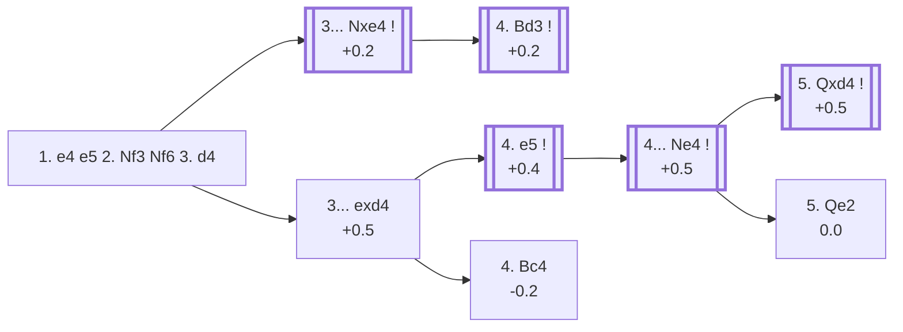

<a name="_TOP_"></a>

# C43 Petrov's Defense: Modern Attack <br> 1. e4 e5 2. Nf3 Nf6 3. d4 #

Spun off from [C42's own "3. d4" section](https://github.com/onclemarcel/chess_flashcards/blob/main/e4_openings/C42_Petrov_Defense.md), which had only a single prose paragraph at standard card depth — a genuine zero-coverage gap surfaced by a full A00-E99 ECO-code audit. Rather than resolve the central tension at once, White builds the centre first and decides how to meet ... Nxe4 only once it actually happens.

### Overview

*Quick map of every move covered on this card — see the [shape key](https://github.com/onclemarcel/chess_flashcards/blob/main/start.md#content-diagram-optional) in start.md.*

<!-- content-diagram:start -->

<!-- content-diagram:end -->

<a name="_initial_move_"></a>

[](https://lichess.org/analysis/standard/rnbqkb1r/pppp1ppp/5n2/4p3/3PP3/5N2/PPP2PPP/RNBQKB1R_b_KQkq_d3_0_3)

*... 1. e4 e5 2. Nf3 Nf6 3. d4 — Petrov's Defense: Modern Attack*

```
rnbqkb1r/pppp1ppp/5n2/4p3/3PP3/5N2/PPP2PPP/RNBQKB1R b KQkq d3 0 3
```

|  | +0.3 |
| --- | --- |

<!-- lichess-stats:start fen="rnbqkb1r/pppp1ppp/5n2/4p3/3PP3/5N2/PPP2PPP/RNBQKB1R b KQkq d3 0 3" db="lichess,masters" speeds="bullet,blitz" ratings="1800,2000,2200,2500" moves="8" -->
| Move | Online | W/D/B | Masters | W/D/B | |
| :--- | ---: | :--- | ---: | :--- | :-- |
| Nxe4 | 1.3 M (51.6%) | ⬜⬜⬜⬜⬜🟫⬛⬛⬛⬛ 49/5/45 | 5.9 k (92.7%) | ⬜⬜⬜🟫🟫🟫🟫🟫🟫⬛ 29/59/12 |  |
| exd4 | 816 k (31.5%) | ⬜⬜⬜⬜⬜🟫⬛⬛⬛⬛ 53/4/43 | 445 (6.9%) | ⬜⬜⬜⬜🟫🟫🟫🟫🟫⬛ 42/48/11 |  |
| Nc6 | 212 k (8.2%) | ⬜⬜⬜⬜⬜🟫⬛⬛⬛⬛ 53/4/43 | 0 | — | ⚠ |
| d5 | 104 k (4.0%) | ⬜⬜⬜⬜⬜⬛⬛⬛⬛⬛ 50/4/45 | 15 (0.2%) | — |  |
| d6 | 90 k (3.5%) | ⬜⬜⬜⬜⬜⬜⬛⬛⬛⬛ 55/5/39 | 11 (0.2%) | — |  |
| Bc5 | 13 k (0.5%) | ⬜⬜⬜⬜⬜⬜⬜⬛⬛⬛ 67/3/29 | 0 | — | ⚠ |
| c6 | 4.8 k (0.2%) | ⬜⬜⬜⬜⬜⬜⬛⬛⬛⬛ 58/4/38 | 0 | — | ⚠ |
| Be7 | 3.9 k (0.2%) | ⬜⬜⬜⬜⬜⬜⬛⬛⬛⬛ 57/4/40 | 0 | — | ⚠ |

*Online: bullet/blitz, 1800+ — 2.6 M games. Masters: 6.4 k games. [Open in the explorer](https://lichess.org/analysis/standard/rnbqkb1r/pppp1ppp/5n2/4p3/3PP3/5N2/PPP2PPP/RNBQKB1R_b_KQkq_d3_0_3#explorer) — updated 2026-09-05*
<!-- lichess-stats:end -->

### Candidate moves

* [**3... Nxe4**](#_Nxe4_) (+0.2, 92.7% masters): the *Center Variation* — masters' overwhelming preference, immediately grabbing the pawn now that the centre is fixed.
* [**3... exd4**](#_exd4_) (+0.5, 6.9% masters): declines the pawn grab in favour of provoking **4. e5**, the line this card follows deeper — much rarer at master level but still a real, named try.

[*Back to TOP*](#_TOP_)

---

<a name="_Nxe4_"></a>

### 3... Nxe4

[](https://lichess.org/analysis/standard/rnbqkb1r/pppp1ppp/8/4p3/3Pn3/5N2/PPP2PPP/RNBQKB1R_w_KQkq_-_0_4)

*... 3... Nxe4*

```
rnbqkb1r/pppp1ppp/8/4p3/3Pn3/5N2/PPP2PPP/RNBQKB1R w KQkq - 0 4
```

|  | +0.2 |
| --- | --- |

<!-- lichess-stats:start fen="rnbqkb1r/pppp1ppp/8/4p3/3Pn3/5N2/PPP2PPP/RNBQKB1R w KQkq - 0 4" db="lichess,masters" speeds="bullet,blitz" ratings="1800,2000,2200,2500" moves="8" -->
| Move | Online | W/D/B | Masters | W/D/B | |
| :--- | ---: | :--- | ---: | :--- | :-- |
| dxe5 | 580 k (43.4%) | ⬜⬜⬜⬜⬜⬛⬛⬛⬛⬛ 48/5/47 | 671 (11.3%) | ⬜⬜⬜⬜🟫🟫🟫🟫⬛⬛ 38/46/17 |  |
| Bd3 | 354 k (26.5%) | ⬜⬜⬜⬜⬜🟫⬛⬛⬛⬛ 52/7/41 | 5.1 k (85.0%) | ⬜⬜⬜🟫🟫🟫🟫🟫🟫⬛ 29/60/11 |  |
| Nxe5 | 318 k (23.8%) | ⬜⬜⬜⬜⬜⬛⬛⬛⬛⬛ 49/5/46 | 214 (3.6%) | ⬜🟫🟫🟫🟫🟫🟫🟫🟫⬛ 15/78/7 |  |
| Qe2 | 37 k (2.8%) | ⬜⬜⬜⬜⬜⬛⬛⬛⬛⬛ 47/4/49 | 1 (0.0%) | — | ⚠ |
| Bc4 | 29 k (2.2%) | ⬜⬜⬜⬜⬜⬛⬛⬛⬛⬛ 44/4/53 | 0 | — | ⚠ |
| Nc3 | 5.3 k (0.4%) | ⬜⬜⬜⬜⬜⬛⬛⬛⬛⬛ 45/4/51 | 0 | — | ⚠ |
| c3 | 4.8 k (0.4%) | ⬜⬜⬜⬜⬜⬛⬛⬛⬛⬛ 44/4/52 | 0 | — | ⚠ |
| d5 | 3.3 k (0.2%) | ⬜⬜⬜⬜⬛⬛⬛⬛⬛⬛ 40/3/57 | 0 | — | ⚠ |
| Be3 | 0 | — | 5 (0.1%) | — |  |

*Online: bullet/blitz, 1800+ — 1.3 M games. Masters: 5.9 k games. [Open in the explorer](https://lichess.org/analysis/standard/rnbqkb1r/pppp1ppp/8/4p3/3Pn3/5N2/PPP2PPP/RNBQKB1R_w_KQkq_-_0_4#explorer) — updated 2026-09-05*
<!-- lichess-stats:end -->

> [!NOTE]
> `eco.md`'s own book name for this line is the *Symmetrical Variation*, but the Lichess explorer itself tags this exact position (and the one after **4. Bd3**) the **Center Variation** instead — used the explorer's own live name here, per this repository's standing convention, rather than the book name.

* [**4. Bd3**](#_Bd3_) (+0.2, 85.0% masters): the natural developing recapture-prep, defending e4's fifth rank and eyeing h7 — masters' clear main try.

[*Back to 3. d4*](#_initial_move_)
[*Back to TOP*](#_TOP_)

---

<a name="_Bd3_"></a>

### 4. Bd3 — Center Variation

[](https://lichess.org/analysis/standard/rnbqkb1r/pppp1ppp/8/4p3/3Pn3/3B1N2/PPP2PPP/RNBQK2R_b_KQkq_-_1_4)

*... 4. Bd3 — Center Variation*

```
rnbqkb1r/pppp1ppp/8/4p3/3Pn3/3B1N2/PPP2PPP/RNBQK2R b KQkq - 1 4
```

|  | +0.2 |
| --- | --- |

<!-- lichess-stats:start fen="rnbqkb1r/pppp1ppp/8/4p3/3Pn3/3B1N2/PPP2PPP/RNBQK2R b KQkq - 1 4" db="lichess,masters" speeds="bullet,blitz" ratings="1800,2000,2200,2500" moves="8" -->
| Move | Online | W/D/B | Masters | W/D/B | |
| :--- | ---: | :--- | ---: | :--- | :-- |
| d5 | 319 k (90.1%) | ⬜⬜⬜⬜⬜🟫⬛⬛⬛⬛ 52/7/41 | 4.6 k (90.2%) | ⬜⬜⬜🟫🟫🟫🟫🟫🟫⬛ 28/61/11 |  |
| Nc6 | 20 k (5.6%) | ⬜⬜⬜⬜🟫⬛⬛⬛⬛⬛ 43/10/47 | 490 (9.7%) | ⬜⬜⬜🟫🟫🟫🟫🟫⬛⬛ 32/54/14 |  |
| Nf6 | 5.8 k (1.7%) | ⬜⬜⬜⬜⬜⬜⬜⬛⬛⬛ 69/3/28 | 0 | — | ⚠ |
| Nxf2 | 4.1 k (1.2%) | ⬜⬜⬜⬜⬜⬜⬛⬛⬛⬛ 63/3/34 | 0 | — | ⚠ |
| f5 | 2.0 k (0.6%) | ⬜⬜⬜⬜⬜⬜⬜⬛⬛⬛ 67/3/30 | 0 | — | ⚠ |
| Nd6 | 1.5 k (0.4%) | ⬜⬜⬜⬜⬜⬜⬜⬜⬜⬛ 85/1/13 | 0 | — | ⚠ |
| exd4 | 667 (0.2%) | ⬜⬜⬜⬜⬜⬜⬜⬛⬛⬛ 68/3/29 | 1 (0.0%) | — | ⚠ |
| d6 | 489 (0.1%) | ⬜⬜⬜⬜⬜⬜⬜⬛⬛⬛ 70/3/27 | 0 | — | ⚠ |
| Be7 | 0 | — | 2 (0.0%) | — |  |

*Online: bullet/blitz, 1800+ — 354 k games. Masters: 5.1 k games. [Open in the explorer](https://lichess.org/analysis/standard/rnbqkb1r/pppp1ppp/8/4p3/3Pn3/3B1N2/PPP2PPP/RNBQK2R_b_KQkq_-_1_4#explorer) — updated 2026-09-05*
<!-- lichess-stats:end -->

Black's overwhelming reply is **4... d5** (90.2% masters), consolidating the extra pawn on e4. Deeper theory continues **5. Nxe5 Bd6 6. O-O O-O 7. c4 Bxe5** — live-confirmed still C43, the **Trifunovic Variation** — but is its own body of work, not covered further here (backlog).

[*Back to 3... Nxe4*](#_Nxe4_)
[*Back to TOP*](#_TOP_)

---

<a name="_exd4_"></a>

### 3... exd4

[](https://lichess.org/analysis/standard/rnbqkb1r/pppp1ppp/5n2/8/3pP3/5N2/PPP2PPP/RNBQKB1R_w_KQkq_-_0_4)

*... 3... exd4*

```
rnbqkb1r/pppp1ppp/5n2/8/3pP3/5N2/PPP2PPP/RNBQKB1R w KQkq - 0 4
```

|  | +0.5 |
| --- | --- |

<!-- lichess-stats:start fen="rnbqkb1r/pppp1ppp/5n2/8/3pP3/5N2/PPP2PPP/RNBQKB1R w KQkq - 0 4" db="lichess,masters" speeds="bullet,blitz" ratings="1800,2000,2200,2500" moves="8" -->
| Move | Online | W/D/B | Masters | W/D/B | |
| :--- | ---: | :--- | ---: | :--- | :-- |
| e5 | 561 k (57.5%) | ⬜⬜⬜⬜⬜⬜⬛⬛⬛⬛ 55/4/41 | 457 (98.1%) | ⬜⬜⬜⬜🟫🟫🟫🟫🟫⬛ 42/47/11 |  |
| Nxd4 | 139 k (14.3%) | ⬜⬜⬜⬜⬜⬛⬛⬛⬛⬛ 49/5/47 | 3 (0.6%) | — | ⚠ |
| Qxd4 | 138 k (14.2%) | ⬜⬜⬜⬜⬜⬛⬛⬛⬛⬛ 49/4/47 | 0 | — | ⚠ |
| Bc4 | 74 k (7.6%) | ⬜⬜⬜⬜⬜⬜⬛⬛⬛⬛ 53/3/43 | 4 (0.9%) | — | ⚠ |
| c3 | 28 k (2.8%) | ⬜⬜⬜⬜⬜⬛⬛⬛⬛⬛ 53/3/44 | 1 (0.2%) | — | ⚠ |
| Bd3 | 17 k (1.8%) | ⬜⬜⬜⬜⬜🟫⬛⬛⬛⬛ 53/4/43 | 0 | — | ⚠ |
| Ne5 | 8.7 k (0.9%) | ⬜⬜⬜⬜🟫⬛⬛⬛⬛⬛ 44/4/52 | 0 | — | ⚠ |
| Bg5 | 4.9 k (0.5%) | ⬜⬜⬜⬜⬜⬛⬛⬛⬛⬛ 49/5/47 | 1 (0.2%) | — | ⚠ |

*Online: bullet/blitz, 1800+ — 976 k games. Masters: 466 games. [Open in the explorer](https://lichess.org/analysis/standard/rnbqkb1r/pppp1ppp/5n2/8/3pP3/5N2/PPP2PPP/RNBQKB1R_w_KQkq_-_0_4#explorer) — updated 2026-09-05*
<!-- lichess-stats:end -->

* [**4. e5**](#_e5_) (+0.4, 98.1% masters): kicks the knight before recapturing the pawn — the line this card follows, and masters' near-unanimous choice.
* [**4. Bc4**](#_Urusov_) (-0.2, 0.9% masters): the *Urusov Gambit*, offering the d4-pawn back for rapid development instead of chasing the knight; not built out further here (backlog).

[*Back to 3. d4*](#_initial_move_)
[*Back to TOP*](#_TOP_)

---

<a name="_e5_"></a>

### 4. e5

[](https://lichess.org/analysis/standard/rnbqkb1r/pppp1ppp/5n2/4P3/3p4/5N2/PPP2PPP/RNBQKB1R_b_KQkq_-_0_4)

*... 4. e5*

```
rnbqkb1r/pppp1ppp/5n2/4P3/3p4/5N2/PPP2PPP/RNBQKB1R b KQkq - 0 4
```

|  | +0.4 |
| --- | --- |

<!-- lichess-stats:start fen="rnbqkb1r/pppp1ppp/5n2/4P3/3p4/5N2/PPP2PPP/RNBQKB1R b KQkq - 0 4" db="lichess,masters" speeds="bullet,blitz" ratings="1800,2000,2200,2500" moves="8" -->
| Move | Online | W/D/B | Masters | W/D/B | |
| :--- | ---: | :--- | ---: | :--- | :-- |
| Ne4 | 183 k (32.7%) | ⬜⬜⬜⬜⬜⬛⬛⬛⬛⬛ 48/5/47 | 453 (99.1%) | ⬜⬜⬜⬜🟫🟫🟫🟫🟫⬛ 41/48/11 |  |
| Nd5 | 159 k (28.3%) | ⬜⬜⬜⬜⬜⬜⬛⬛⬛⬛ 59/4/38 | 2 (0.4%) | — | ⚠ |
| Qe7 | 98 k (17.4%) | ⬜⬜⬜⬜⬜⬜⬛⬛⬛⬛ 56/4/40 | 1 (0.2%) | — | ⚠ |
| Ng4 | 54 k (9.6%) | ⬜⬜⬜⬜⬜⬜⬛⬛⬛⬛ 59/4/37 | 0 | — | ⚠ |
| Ng8 | 48 k (8.6%) | ⬜⬜⬜⬜⬜⬜⬛⬛⬛⬛ 59/4/37 | 1 (0.2%) | — | ⚠ |
| Nc6 | 7.1 k (1.3%) | ⬜⬜⬜⬜⬜⬜⬜⬛⬛⬛ 69/3/29 | 0 | — | ⚠ |
| Bb4+ | 5.7 k (1.0%) | ⬜⬜⬜⬜⬜⬜⬜⬛⬛⬛ 68/4/29 | 0 | — | ⚠ |
| d6 | 1.9 k (0.3%) | ⬜⬜⬜⬜⬜⬜⬜⬛⬛⬛ 71/3/26 | 0 | — | ⚠ |

*Online: bullet/blitz, 1800+ — 561 k games. Masters: 457 games. [Open in the explorer](https://lichess.org/analysis/standard/rnbqkb1r/pppp1ppp/5n2/4P3/3p4/5N2/PPP2PPP/RNBQKB1R_b_KQkq_-_0_4#explorer) — updated 2026-09-05*
<!-- lichess-stats:end -->

**4... Ne4** is essentially forced at master level (99.1%) — the knight has nowhere else useful to go while keeping the extra pawn.

[](https://lichess.org/analysis/standard/rnbqkb1r/pppp1ppp/8/4P3/3pn3/5N2/PPP2PPP/RNBQKB1R_w_KQkq_-_1_5)

```
rnbqkb1r/pppp1ppp/8/4P3/3pn3/5N2/PPP2PPP/RNBQKB1R w KQkq - 1 5
```

|  | +0.5 |
| --- | --- |

<!-- lichess-stats:start fen="rnbqkb1r/pppp1ppp/8/4P3/3pn3/5N2/PPP2PPP/RNBQKB1R w KQkq - 1 5" db="lichess,masters" speeds="bullet,blitz" ratings="1800,2000,2200,2500" moves="8" -->
| Move | Online | W/D/B | Masters | W/D/B | |
| :--- | ---: | :--- | ---: | :--- | :-- |
| Qxd4 | 135 k (73.7%) | ⬜⬜⬜⬜⬜⬛⬛⬛⬛⬛ 47/5/48 | 429 (94.7%) | ⬜⬜⬜⬜🟫🟫🟫🟫🟫⬛ 40/50/10 |  |
| Bd3 | 25 k (13.4%) | ⬜⬜⬜⬜⬜⬛⬛⬛⬛⬛ 49/5/46 | 2 (0.4%) | — | ⚠ |
| Nxd4 | 10 k (5.7%) | ⬜⬜⬜⬜⬜⬛⬛⬛⬛⬛ 47/4/48 | 1 (0.2%) | — | ⚠ |
| Bc4 | 7.6 k (4.1%) | ⬜⬜⬜⬜⬜⬛⬛⬛⬛⬛ 47/4/49 | 0 | — | ⚠ |
| c3 | 2.6 k (1.4%) | ⬜⬜⬜⬜⬜⬜⬛⬛⬛⬛ 54/4/42 | 1 (0.2%) | — | ⚠ |
| Qe2 | 1.6 k (0.8%) | ⬜⬜⬜⬜⬜⬜⬛⬛⬛⬛ 57/4/39 | 6 (1.3%) | — |  |
| Qd3 | 477 (0.3%) | ⬜⬜⬜⬜⬜⬛⬛⬛⬛⬛ 44/3/53 | 0 | — | ⚠ |
| Nbd2 | 367 (0.2%) | ⬜⬜⬜⬜⬜⬛⬛⬛⬛⬛ 47/5/48 | 0 | — | ⚠ |
| Bb5 | 0 | — | 13 (2.9%) | — |  |
| Bf4 | 0 | — | 1 (0.2%) | — |  |

*Online: bullet/blitz, 1800+ — 183 k games. Masters: 453 games. [Open in the explorer](https://lichess.org/analysis/standard/rnbqkb1r/pppp1ppp/8/4P3/3pn3/5N2/PPP2PPP/RNBQKB1R_w_KQkq_-_1_5#explorer) — updated 2026-09-05*
<!-- lichess-stats:end -->

* [**5. Qxd4**](#_Qxd4_) (+0.5, 94.7% masters): the principled recapture, centralising the queen for now — masters' clear main line.
* [**5. Qe2**](#_Qe2_) (0.0, 1.3% masters): the *Steinitz Variation*, pinning the knight instead of recapturing at once; rare at master level despite the name.

[*Back to 3... exd4*](#_exd4_)
[*Back to TOP*](#_TOP_)

---

<a name="_Qxd4_"></a>

### 5. Qxd4 — Center Attack

[](https://lichess.org/analysis/standard/rnbqkb1r/pppp1ppp/8/4P3/3Qn3/5N2/PPP2PPP/RNB1KB1R_b_KQkq_-_0_5)

*... 5. Qxd4 — Center Attack*

```
rnbqkb1r/pppp1ppp/8/4P3/3Qn3/5N2/PPP2PPP/RNB1KB1R b KQkq - 0 5
```

|  | +0.5 |
| --- | --- |

<!-- lichess-stats:start fen="rnbqkb1r/pppp1ppp/8/4P3/3Qn3/5N2/PPP2PPP/RNB1KB1R b KQkq - 0 5" db="lichess,masters" speeds="bullet,blitz" ratings="1800,2000,2200,2500" moves="8" -->
| Move | Online | W/D/B | Masters | W/D/B | |
| :--- | ---: | :--- | ---: | :--- | :-- |
| d5 | 125 k (92.3%) | ⬜⬜⬜⬜⬜⬛⬛⬛⬛⬛ 46/5/48 | 418 (97.4%) | ⬜⬜⬜⬜🟫🟫🟫🟫🟫⬛ 40/50/10 |  |
| Nc5 | 5.4 k (4.0%) | ⬜⬜⬜⬜⬜🟫⬛⬛⬛⬛ 53/4/43 | 3 (0.7%) | — | ⚠ |
| f5 | 3.1 k (2.3%) | ⬜⬜⬜⬜⬜⬛⬛⬛⬛⬛ 46/6/48 | 8 (1.9%) | — |  |
| Nxf2 | 1.0 k (0.7%) | ⬜⬜⬜⬜⬜⬜⬜⬜⬛⬛ 75/2/22 | 0 | — | ⚠ |
| Ng5 | 364 (0.3%) | ⬜⬜⬜⬜⬜⬜⬜⬜⬜⬛ 91/0/9 | 0 | — | ⚠ |
| d6 | 175 (0.1%) | ⬜⬜⬜⬜⬜⬜⬜⬜🟫⬛ 81/5/14 | 0 | — | ⚠ |
| Bc5 | 97 (0.1%) | ⬜⬜⬜⬜⬜⬜⬜⬜⬜⬛ 85/2/13 | 0 | — |  |
| Nc6 | 92 (0.1%) | ⬜⬜⬜⬜⬜⬜⬜⬜⬜⬛ 88/2/10 | 0 | — |  |

*Online: bullet/blitz, 1800+ — 135 k games. Masters: 429 games. [Open in the explorer](https://lichess.org/analysis/standard/rnbqkb1r/pppp1ppp/8/4P3/3Qn3/5N2/PPP2PPP/RNB1KB1R_b_KQkq_-_0_5#explorer) — updated 2026-09-05*
<!-- lichess-stats:end -->

> [!NOTE]
> `eco.md`'s own book name for this exact position is the *Main line*, but the Lichess explorer tags it the **Center Attack** instead — another live name divergence, same shape as the Center Variation note above.

**5... d5** is masters' near-unanimous reply (97.4%), striking back at the queen and the e5-pawn at once and reaching the tabiya both sides steer for.

[](https://lichess.org/analysis/standard/rnbqkb1r/ppp2ppp/8/3pP3/3Qn3/5N2/PPP2PPP/RNB1KB1R_w_KQkq_d6_0_6)

```
rnbqkb1r/ppp2ppp/8/3pP3/3Qn3/5N2/PPP2PPP/RNB1KB1R w KQkq d6 0 6
```

|  | +0.5 |
| --- | --- |

Black's centralised knight and solid pawn duo compensate fully for White's small development lead — a level, well-tested tabiya (average rating over 2300 in the masters database). Deeper theory from here is its own body of work, not covered further here (backlog).

[*Back to 4. e5*](#_e5_)
[*Back to TOP*](#_TOP_)

---

<a name="_Qe2_"></a>

### 5. Qe2 — Steinitz Variation

[](https://lichess.org/analysis/standard/rnbqkb1r/pppp1ppp/8/4P3/3pn3/5N2/PPP1QPPP/RNB1KB1R_b_KQkq_-_2_5)

*... 5. Qe2 — Steinitz Variation*

```
rnbqkb1r/pppp1ppp/8/4P3/3pn3/5N2/PPP1QPPP/RNB1KB1R b KQkq - 2 5
```

|  | 0.0 |
| --- | --- |

Pins the knight to the king's own e-file instead of recapturing at once. Black's main tries are **5... d5** and **5... Nc5**; continuing **... Nc5 6. Nxd4 Nc6** reaches the *Bardeleben Variation*, itself its own further body of theory — not built out further here (backlog).

[*Back to 4. e5*](#_e5_)
[*Back to TOP*](#_TOP_)

---

<a name="_Urusov_"></a>

### 4. Bc4 — Urusov Gambit

[](https://lichess.org/analysis/standard/rnbqkb1r/pppp1ppp/5n2/8/2BpP3/5N2/PPP2PPP/RNBQK2R_b_KQkq_-_1_4)

*... 4. Bc4 — Urusov Gambit*

```
rnbqkb1r/pppp1ppp/5n2/8/2BpP3/5N2/PPP2PPP/RNBQK2R b KQkq - 1 4
```

|  | -0.2 |
| --- | --- |

Offers the d4-pawn straight back for a fast lead in development, in the same gambit spirit as the Scotch Gambit or Danish Gambit reached from other move orders. **Live-confirmed cross-tag**: the explorer files this exact FEN under "Bishop's Opening: Urusov Gambit" (it also arises via 1. e4 e5 2. Bc4 Nf6 3. d4/3. Nf3 move orders) rather than under a Petrov-specific name, even though `eco.md` codes it C43 here. Masters split fairly evenly between **4... Nc6** (50.0%), **4... Nxe4** (21.2%, accepting the second pawn), and **4... Bb4+** (17.9%); not built out further here (backlog).

[*Back to 3... exd4*](#_exd4_)
[*Back to TOP*](#_TOP_)
