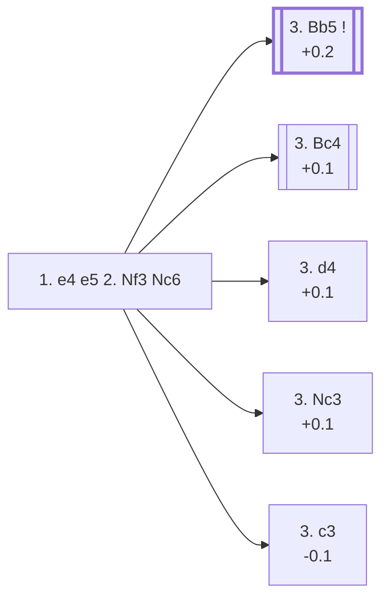

<a name="_TOP_"></a>

# C44 King's Knight Opening: Normal Variation <br> 1. e4 e5 2. Nf3 Nc6 #

Black develops a piece while defending e5 a second time, controlling both e5 and d4 at once. This is masters' overwhelming preference against 2. Nf3 (85.6% of games) and the gateway into most of the game's oldest and best-known openings — none of which continue on this page, since each is its own established body of theory.

### Overview

*Quick map of every move covered on this card — see the [shape key](https://github.com/onclemarcel/chess_flashcards/blob/main/start.md#content-diagram-optional) in start.md.*

<!-- content-diagram:start -->

<!-- content-diagram:end -->

<a name="_initial_move_"></a>

[](https://lichess.org/analysis/standard/r1bqkbnr/pppp1ppp/2n5/4p3/4P3/5N2/PPPP1PPP/RNBQKB1R_w_KQkq_-_2_3)

*... 1. e4 e5 2. Nf3 Nc6 — King's Knight Opening: Normal Variation*

```
r1bqkbnr/pppp1ppp/2n5/4p3/4P3/5N2/PPPP1PPP/RNBQKB1R w KQkq - 2 3
```

|  | +0.2 |
| --- | --- |

<!-- lichess-stats:start fen="r1bqkbnr/pppp1ppp/2n5/4p3/4P3/5N2/PPPP1PPP/RNBQKB1R w KQkq - 2 3" db="lichess,masters" speeds="bullet,blitz" ratings="1800,2000,2200,2500" moves="8" -->
| Move | Online | W/D/B | Masters | W/D/B | |
| :--- | ---: | :--- | ---: | :--- | :-- |
| Bc4 | 48.1 M (39.6%) | ⬜⬜⬜⬜⬜⬛⬛⬛⬛⬛ 49/4/46 | 48 k (19.3%) | ⬜⬜⬜🟫🟫🟫🟫🟫⬛⬛ 30/47/23 |  |
| Bb5 | 33.5 M (27.6%) | ⬜⬜⬜⬜⬜🟫⬛⬛⬛⬛ 50/5/45 | 162 k (65.0%) | ⬜⬜⬜🟫🟫🟫🟫🟫⬛⬛ 29/53/18 |  |
| d4 | 24.6 M (20.2%) | ⬜⬜⬜⬜⬜🟫⬛⬛⬛⬛ 51/5/44 | 22 k (8.9%) | ⬜⬜⬜🟫🟫🟫🟫🟫⬛⬛ 30/46/25 |  |
| Nc3 | 9.4 M (7.7%) | ⬜⬜⬜⬜⬜🟫⬛⬛⬛⬛ 51/5/44 | 14 k (5.7%) | ⬜⬜⬜🟫🟫🟫🟫🟫⬛⬛ 27/48/24 |  |
| c3 | 3.7 M (3.0%) | ⬜⬜⬜⬜⬜⬛⬛⬛⬛⬛ 50/4/46 | 1.6 k (0.6%) | ⬜⬜⬜🟫🟫🟫🟫⬛⬛⬛ 32/38/30 |  |
| d3 | 1.0 M (0.9%) | ⬜⬜⬜⬜⬜⬛⬛⬛⬛⬛ 47/5/49 | 234 (0.1%) | ⬜⬜⬜🟫🟫🟫🟫⬛⬛⬛ 26/39/35 |  |
| Be2 | 365 k (0.3%) | ⬜⬜⬜⬜⬜⬛⬛⬛⬛⬛ 47/5/48 | 278 (0.1%) | ⬜⬜⬜🟫🟫🟫🟫⬛⬛⬛ 31/39/30 |  |
| g3 | 216 k (0.2%) | ⬜⬜⬜⬜⬜⬛⬛⬛⬛⬛ 46/5/49 | 331 (0.1%) | ⬜⬜⬜⬜🟫🟫🟫🟫⬛⬛ 39/39/23 |  |

*Online: bullet/blitz, 1800+ — 121.5 M games. Masters: 249 k games. [Open in the explorer](https://lichess.org/analysis/standard/r1bqkbnr/pppp1ppp/2n5/4p3/4P3/5N2/PPPP1PPP/RNBQKB1R_w_KQkq_-_2_3#explorer) — updated 2026-08-31*
<!-- lichess-stats:end -->

### Candidate moves

None of White's main tries here is objectively much stronger than the others — Stockfish rates all four within a couple tenths of a pawn. The split is almost entirely a matter of style and how much of the resulting theory each side is willing to learn.

* [**3. Bb5**](https://github.com/onclemarcel/chess_flashcards/blob/main/e4_openings/C60_Ruy_Lopez.md) (+0.2): the [Ruy Lopez](https://github.com/onclemarcel/chess_flashcards/blob/main/e4_openings/C60_Ruy_Lopez.md) (Spanish Opening) — masters' clear favourite (65.0% of masters games) and the most studied opening in chess history. Pins the knight defending e5 and prepares to add long-term pressure on the centre.
* [**3. Bc4**](https://github.com/onclemarcel/chess_flashcards/blob/main/e4_openings/C50_Italian.md) (+0.1): the [Italian Game](https://github.com/onclemarcel/chess_flashcards/blob/main/e4_openings/C50_Italian.md), the most popular try online (39.6%) though second to the Ruy Lopez in masters play (19.3%). Develops actively toward f7 at once.
* [**3. d4**](https://github.com/onclemarcel/chess_flashcards/blob/main/e4_openings/C44_Scotch.md) (+0.1): the [Scotch Opening](https://github.com/onclemarcel/chess_flashcards/blob/main/e4_openings/C44_Scotch.md) — opens the centre immediately rather than building up slowly. Popular online (20.2%) but a clear third choice for masters (8.9%).
* [**3. Nc3**](https://github.com/onclemarcel/chess_flashcards/blob/main/e4_openings/C47_Four_Knights_Game.md) (+0.1): the [Four Knights Game](https://github.com/onclemarcel/chess_flashcards/blob/main/e4_openings/C47_Four_Knights_Game.md), developing symmetrically and keeping the position flexible; the least common of the four both online (7.7%) and in masters play (5.7%).
* [**3. c3**](https://github.com/onclemarcel/chess_flashcards/blob/main/e4_openings/C44_Ponziani.md) (-0.1, 0.6% masters): the [Ponziani Opening](https://github.com/onclemarcel/chess_flashcards/blob/main/e4_openings/C44_Ponziani.md) — a genuine rarity today, preparing an immediate d4, covered on its own card.

[*Back to TOP*](#_TOP_)
