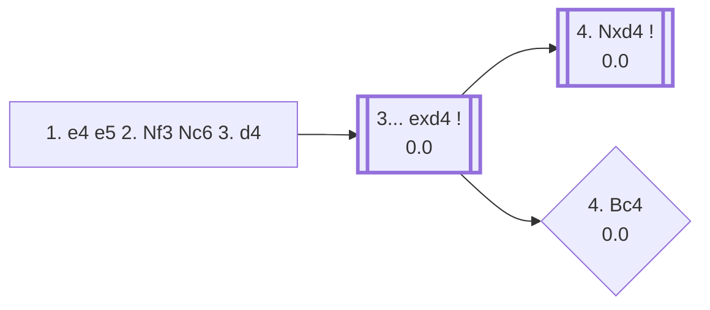

<a name="_TOP_"></a>

# C44 Scotch Opening <br> 1. e4 e5 2. Nf3 Nc6 3. d4 #

White opens the centre immediately rather than developing a piece first, offering a pawn trade that leads to rapid piece activity. Named after a correspondence match between the Edinburgh and London chess clubs in 1824, it was a top-level rarity for most of the 20th century until Garry Kasparov revived it in the 1990s as a way to sidestep well-prepared Ruy Lopez defences.

### Overview

*Quick map of every move covered on this card — see the [shape key](https://github.com/onclemarcel/chess_flashcards/blob/main/start.md#content-diagram-optional) in start.md.*

<!-- content-diagram:start -->

<!-- content-diagram:end -->

<a name="_initial_move_"></a>

[](https://lichess.org/analysis/standard/r1bqkbnr/pppp1ppp/2n5/4p3/3PP3/5N2/PPP2PPP/RNBQKB1R_b_KQkq_d3_0_3)

*... 1. e4 e5 2. Nf3 Nc6 3. d4 — Scotch Opening*

```
r1bqkbnr/pppp1ppp/2n5/4p3/3PP3/5N2/PPP2PPP/RNBQKB1R b KQkq d3 0 3
```

|  | +0.1 |
| --- | --- |

<!-- lichess-stats:start fen="r1bqkbnr/pppp1ppp/2n5/4p3/3PP3/5N2/PPP2PPP/RNBQKB1R b KQkq d3 0 3" db="lichess,masters" speeds="bullet,blitz" ratings="1800,2000,2200,2500" moves="6" -->
| Move | Online | W/D/B | Masters | W/D/B | |
| :--- | ---: | :--- | ---: | :--- | :-- |
| exd4 | 22.3 M (86.1%) | ⬜⬜⬜⬜⬜🟫⬛⬛⬛⬛ 51/5/44 | 22 k (99.6%) | ⬜⬜⬜🟫🟫🟫🟫🟫⬛⬛ 29/46/25 |  |
| d6 | 1.2 M (4.5%) | ⬜⬜⬜⬜⬜🟫⬛⬛⬛⬛ 51/6/43 | 65 (0.3%) | ⬜⬜⬜⬜🟫🟫🟫⬛⬛⬛ 35/35/29 |  |
| Nf6 | 1.0 M (3.9%) | ⬜⬜⬜⬜⬜⬛⬛⬛⬛⬛ 52/4/44 | 11 (0.0%) | — |  |
| f5 | 286 k (1.1%) | ⬜⬜⬜⬜⬜⬛⬛⬛⬛⬛ 47/3/50 | 0 | — | ⚠ |
| Nxd4 | 254 k (1.0%) | ⬜⬜⬜⬜⬜🟫⬛⬛⬛⬛ 53/5/42 | 13 (0.1%) | — |  |
| Bc5 | 207 k (0.8%) | ⬜⬜⬜⬜⬜⬜⬜⬛⬛⬛ 72/3/25 | 0 | — | ⚠ |
| d5 | 0 | — | 6 (0.0%) | — |  |
| Qf6 | 0 | — | 2 (0.0%) | — |  |

*Online: bullet/blitz, 1800+ — 26.0 M games. Masters: 22 k games. [Open in the explorer](https://lichess.org/analysis/standard/r1bqkbnr/pppp1ppp/2n5/4p3/3PP3/5N2/PPP2PPP/RNBQKB1R_b_KQkq_d3_0_3#explorer) — updated 2026-08-24*
<!-- lichess-stats:end -->

### Candidate moves

Capturing is essentially forced at the top level — 99.6% of masters games — since ignoring the tension lets White simply keep an extra central pawn.

* [**3... exd4**](#_exd4_) (0.0): the only serious try.

[*Back to TOP*](#_TOP_)

---

<a name="_exd4_"></a>

### 3... exd4

[](https://lichess.org/analysis/standard/r1bqkbnr/pppp1ppp/2n5/8/3pP3/5N2/PPP2PPP/RNBQKB1R_w_KQkq_-_0_4)

*... 3... exd4*

```
r1bqkbnr/pppp1ppp/2n5/8/3pP3/5N2/PPP2PPP/RNBQKB1R w KQkq - 0 4
```

|  | 0.0 |
| --- | --- |

<!-- lichess-stats:start fen="r1bqkbnr/pppp1ppp/2n5/8/3pP3/5N2/PPP2PPP/RNBQKB1R w KQkq - 0 4" db="lichess,masters" speeds="bullet,blitz" ratings="1800,2000,2200,2500" moves="6" -->
| Move | Online | W/D/B | Masters | W/D/B | |
| :--- | ---: | :--- | ---: | :--- | :-- |
| Nxd4 | 14.3 M (58.4%) | ⬜⬜⬜⬜⬜🟫⬛⬛⬛⬛ 50/5/45 | 19 k (84.1%) | ⬜⬜⬜🟫🟫🟫🟫🟫⬛⬛ 30/46/23 |  |
| Bc4 | 7.3 M (29.7%) | ⬜⬜⬜⬜⬜🟫⬛⬛⬛⬛ 52/4/43 | 2.8 k (12.5%) | ⬜⬜⬜🟫🟫🟫🟫⬛⬛⬛ 25/43/31 |  |
| c3 | 2.3 M (9.3%) | ⬜⬜⬜⬜⬜⬜⬛⬛⬛⬛ 54/4/42 | 736 (3.3%) | ⬜⬜⬜🟫🟫🟫🟫⬛⬛⬛ 31/38/31 |  |
| Ng5 | 342 k (1.4%) | ⬜⬜⬜⬜⬜⬛⬛⬛⬛⬛ 52/3/45 | 0 | — | ⚠ |
| Bb5 | 134 k (0.5%) | ⬜⬜⬜⬜⬜⬛⬛⬛⬛⬛ 51/4/45 | 33 (0.1%) | ⬜⬜🟫🟫🟫🟫🟫⬛⬛⬛ 24/45/30 |  |
| Bd3 | 59 k (0.2%) | ⬜⬜⬜⬜⬜⬛⬛⬛⬛⬛ 52/3/45 | 0 | — | ⚠ |

*Online: bullet/blitz, 1800+ — 24.5 M games. Masters: 23 k games. [Open in the explorer](https://lichess.org/analysis/standard/r1bqkbnr/pppp1ppp/2n5/8/3pP3/5N2/PPP2PPP/RNBQKB1R_w_KQkq_-_0_4#explorer) — updated 2026-08-24*
<!-- lichess-stats:end -->

* [**4. Nxd4**](#_Nxd4_) (0.0): the principled recapture, centralising the knight — masters' clear main line (84.1%).
* [**4. Bc4**](#_Bc4_) (0.0): the *Scotch Gambit* — develops with tempo instead of recapturing at once, offering the pawn back for a lead in development. Notably more popular online (29.7%) than in masters play (12.5%), where 4. Nxd4 is far more trusted.

[*Back to 3. d4*](#_initial_move_)
[*Back to TOP*](#_TOP_)

---

<a name="_Nxd4_"></a>

### 4. Nxd4

[](https://lichess.org/analysis/standard/r1bqkbnr/pppp1ppp/2n5/8/3NP3/8/PPP2PPP/RNBQKB1R_b_KQkq_-_0_4)

*... 4. Nxd4*

```
r1bqkbnr/pppp1ppp/2n5/8/3NP3/8/PPP2PPP/RNBQKB1R b KQkq - 0 4
```

|  | 0.0 |
| --- | --- |

<!-- lichess-stats:start fen="r1bqkbnr/pppp1ppp/2n5/8/3NP3/8/PPP2PPP/RNBQKB1R b KQkq - 0 4" db="lichess,masters" speeds="bullet,blitz" ratings="1800,2000,2200,2500" moves="6" -->
| Move | Online | W/D/B | Masters | W/D/B | |
| :--- | ---: | :--- | ---: | :--- | :-- |
| Bc5 | 5.1 M (35.4%) | ⬜⬜⬜⬜⬜⬛⬛⬛⬛⬛ 50/5/45 | 7.3 k (38.4%) | ⬜⬜⬜🟫🟫🟫🟫⬛⬛⬛ 32/44/24 |  |
| Nxd4 | 3.2 M (22.0%) | ⬜⬜⬜⬜⬜🟫⬛⬛⬛⬛ 54/6/40 | 0 | — | ⚠ |
| Nf6 | 2.8 M (19.7%) | ⬜⬜⬜⬜⬜⬛⬛⬛⬛⬛ 47/6/47 | 8.8 k (46.2%) | ⬜⬜⬜🟫🟫🟫🟫🟫⬛⬛ 26/52/22 |  |
| d6 | 837 k (5.8%) | ⬜⬜⬜⬜⬜🟫⬛⬛⬛⬛ 52/5/43 | 0 | — | ⚠ |
| Qf6 | 764 k (5.3%) | ⬜⬜⬜⬜⬜⬛⬛⬛⬛⬛ 51/4/45 | 907 (4.8%) | ⬜⬜⬜🟫🟫🟫🟫⬛⬛⬛ 33/38/30 |  |
| Qh4 | 551 k (3.8%) | ⬜⬜⬜⬜🟫⬛⬛⬛⬛⬛ 44/5/51 | 275 (1.4%) | ⬜⬜⬜⬜🟫🟫🟫⬛⬛⬛ 45/28/28 |  |
| Bb4+ | 0 | — | 1.2 k (6.1%) | ⬜⬜⬜🟫🟫🟫🟫⬛⬛⬛ 35/39/26 |  |
| g6 | 0 | — | 218 (1.1%) | ⬜⬜⬜⬜🟫🟫🟫⬛⬛⬛ 40/33/27 |  |

*Online: bullet/blitz, 1800+ — 14.3 M games. Masters: 19 k games. [Open in the explorer](https://lichess.org/analysis/standard/r1bqkbnr/pppp1ppp/2n5/8/3NP3/8/PPP2PPP/RNBQKB1R_b_KQkq_-_0_4#explorer) — updated 2026-08-24*
<!-- lichess-stats:end -->

Black's two main tries are close in popularity at master level:

* **4... Nf6** (46.2% masters): the *Mieses Variation* — attacks e4 at once, in the same spirit as Petrov's Defense.
* **4... Bc5** (38.4% masters): the *Classical Variation* — develops actively and eyes f2, at the cost of allowing White's knight to hop to b5 or f5 with tempo in some lines.

Both are considered fully sound; the choice is largely a matter of taste.

[*Back to 3... exd4*](#_exd4_)
[*Back to TOP*](#_TOP_)

---

> [!TIP]
> [DN-1] From Daniel Naroditsky's *Speedrun: Back to 3000* — against 4... Bc5, **5. Nxc6** is masters' second-choice recapture-inducing try; **5... Qf6** answers in kind (87.9% of masters games), and the position becomes a real practical test of whether White meets it correctly.
>
> <a name="_Bc5_Nxc6_"></a>
>
> ### 4... Bc5 5. Nxc6 Qf6 — mind the two different "f3"s
>
> [](https://lichess.org/analysis/standard/r1b1k1nr/pppp1ppp/2N2q2/2b5/4P3/8/PPP2PPP/RNBQKB1R_w_KQkq_-_1_6)
>
> *... 5... Qf6*
>
> ```
> r1b1k1nr/pppp1ppp/2N2q2/2b5/4P3/8/PPP2PPP/RNBQKB1R w KQkq - 1 6
> ```
>
> |  | 0.0 |
> | --- | --- |
>
> White's two main tries are the **queen** moves **6. Qd2** (50.4% masters) and **6. Qf3** (47.9%) — the latter offers a queen trade that's been reached thousands of times in top-level games. [DN-1] The **pawn** move **6. f3??** looks similar on the board but is a very different decision: barely played at master level (1.0%), it blocks White's own king-knight development and, critically, makes it much harder to castle — see [Every pawn move leaves something behind](https://github.com/onclemarcel/chess_flashcards/blob/main/patterns/general_principles.md#_pawn_move_weaknesses_).
>
> After **6. f3 dxc6** (opening Black's own light-squared bishop in the process — doubled pawns are a small price for development here), White's position is still only slightly worse on the engine's own numbers (-0.1), but the practical damage is real: the king is stuck in the centre a long time, and — as happened in the featured game — that's exactly the kind of position where a further slip turns into a full-blown blunder.
>
> [*Back to 3... exd4*](#_exd4_)
> [*Back to TOP*](#_TOP_)

---

<a name="_Bc4_"></a>

### 4. Bc4 — Scotch Gambit

[](https://lichess.org/analysis/standard/r1bqkbnr/pppp1ppp/2n5/8/2BpP3/5N2/PPP2PPP/RNBQK2R_b_KQkq_-_1_4)

*... 4. Bc4 — Scotch Gambit*

```
r1bqkbnr/pppp1ppp/2n5/8/2BpP3/5N2/PPP2PPP/RNBQK2R b KQkq - 1 4
```

|  | 0.0 |
| --- | --- |

<!-- lichess-stats:start fen="r1bqkbnr/pppp1ppp/2n5/8/2BpP3/5N2/PPP2PPP/RNBQK2R b KQkq - 1 4" db="lichess,masters" speeds="bullet,blitz" ratings="1800,2000,2200,2500" moves="5" -->
| Move | Online | W/D/B | Masters | W/D/B | |
| :--- | ---: | :--- | ---: | :--- | :-- |
| Nf6 | 2.6 M (34.9%) | ⬜⬜⬜⬜⬜⬛⬛⬛⬛⬛ 49/5/46 | 1.9 k (67.5%) | ⬜⬜⬜🟫🟫🟫🟫⬛⬛⬛ 26/43/32 |  |
| Bc5 | 1.8 M (24.4%) | ⬜⬜⬜⬜⬜🟫⬛⬛⬛⬛ 53/4/43 | 644 (22.7%) | ⬜⬜🟫🟫🟫🟫⬛⬛⬛⬛ 24/40/36 |  |
| d6 | 1.0 M (13.7%) | ⬜⬜⬜⬜⬜🟫⬛⬛⬛⬛ 52/5/43 | 88 (3.1%) | ⬜⬜⬜⬜🟫🟫🟫⬛⬛⬛ 40/32/28 |  |
| Be7 | 583 k (7.7%) | ⬜⬜⬜⬜⬜⬜⬛⬛⬛⬛ 55/4/41 | 44 (1.5%) | ⬜⬜⬜⬜⬜🟫🟫🟫⬛⬛ 52/32/16 |  |
| Bb4+ | 506 k (6.7%) | ⬜⬜⬜⬜⬜⬛⬛⬛⬛⬛ 53/3/44 | 130 (4.6%) | ⬜🟫🟫🟫🟫🟫🟫🟫🟫⬛ 7/78/15 |  |

*Online: bullet/blitz, 1800+ — 7.5 M games. Masters: 2.8 k games. [Open in the explorer](https://lichess.org/analysis/standard/r1bqkbnr/pppp1ppp/2n5/8/2BpP3/5N2/PPP2PPP/RNBQK2R_b_KQkq_-_1_4#explorer) — updated 2026-08-24*
<!-- lichess-stats:end -->

Masters' clear main try is **4... Nf6** (67.5%), attacking e4 in return rather than accepting a second pawn — after **5. e5 d5** the gambit pawn usually comes back with interest for White's development. **4... Bc5** (22.7%) instead heads straight for Italian Game/Giuoco Piano-style structures a tempo down for Black. Either way, White develops actively and often follows up with **5. O-O** or **5. e5**, betting on faster piece activity to compensate for the pawn — very similar in spirit to the Danish Gambit reached from the Center Game. Not built out further here (backlog).

[*Back to 3... exd4*](#_exd4_)
[*Back to TOP*](#_TOP_)
