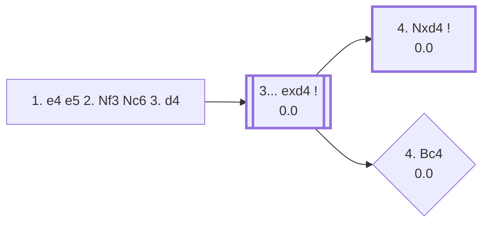

<a name="_TOP_"></a>

# C44 Scotch Opening <br> 1. e4 e5 2. Nf3 Nc6 3. d4 #

White opens the centre immediately rather than developing a piece first, offering a pawn trade that leads to rapid piece activity. Named after a correspondence match between the Edinburgh and London chess clubs in 1824, it was a top-level rarity for most of the 20th century until Garry Kasparov revived it in the 1990s as a way to sidestep well-prepared Ruy Lopez defences.

### Overview

*Quick map of every move covered on this card — see the [shape key](https://github.com/onclemarcel/chess_flashcards/blob/main/start.md#content-diagram-optional) in start.md.*

<!-- content-diagram:start -->

<!-- content-diagram:end -->

<a name="_initial_move_"></a>

[](https://lichess.org/analysis/standard/r1bqkbnr/pppp1ppp/2n5/4p3/3PP3/5N2/PPP2PPP/RNBQKB1R_b_KQkq_d3_0_3)

*... 1. e4 e5 2. Nf3 Nc6 3. d4 — Scotch Opening*

```
r1bqkbnr/pppp1ppp/2n5/4p3/3PP3/5N2/PPP2PPP/RNBQKB1R b KQkq d3 0 3
```

|  | +0.1 |
| --- | --- |

<!-- lichess-stats:start fen="r1bqkbnr/pppp1ppp/2n5/4p3/3PP3/5N2/PPP2PPP/RNBQKB1R b KQkq d3 0 3" db="lichess,masters" speeds="bullet,blitz" ratings="1800,2000,2200,2500" moves="6" -->
| Move | Online | W/D/B | Masters | W/D/B | |
| :--- | ---: | :--- | ---: | :--- | :-- |
| exd4 | 22.3 M (86.1%) | ⬜⬜⬜⬜⬜🟫⬛⬛⬛⬛ 51/5/44 | 22 k (99.6%) | ⬜⬜⬜🟫🟫🟫🟫🟫⬛⬛ 29/46/25 |  |
| d6 | 1.2 M (4.5%) | ⬜⬜⬜⬜⬜🟫⬛⬛⬛⬛ 51/6/43 | 65 (0.3%) | ⬜⬜⬜⬜🟫🟫🟫⬛⬛⬛ 35/35/29 |  |
| Nf6 | 1.0 M (3.9%) | ⬜⬜⬜⬜⬜⬛⬛⬛⬛⬛ 52/4/44 | 11 (0.0%) | — |  |
| f5 | 286 k (1.1%) | ⬜⬜⬜⬜⬜⬛⬛⬛⬛⬛ 47/3/50 | 0 | — | ⚠ |
| Nxd4 | 254 k (1.0%) | ⬜⬜⬜⬜⬜🟫⬛⬛⬛⬛ 53/5/42 | 13 (0.1%) | — |  |
| Bc5 | 207 k (0.8%) | ⬜⬜⬜⬜⬜⬜⬜⬛⬛⬛ 72/3/25 | 0 | — | ⚠ |
| d5 | 0 | — | 6 (0.0%) | — |  |
| Qf6 | 0 | — | 2 (0.0%) | — |  |

*Online: bullet/blitz, 1800+ — 26.0 M games. Masters: 22 k games. [Open in the explorer](https://lichess.org/analysis/standard/r1bqkbnr/pppp1ppp/2n5/4p3/3PP3/5N2/PPP2PPP/RNBQKB1R_b_KQkq_d3_0_3#explorer) — updated 2026-09-05*
<!-- lichess-stats:end -->

### Candidate moves

Capturing is essentially forced at the top level — 99.6% of masters games — since ignoring the tension lets White simply keep an extra central pawn.

* [**3... exd4**](#_exd4_) (0.0): the only serious try.

**3... Nxd4** (0.1% masters), recapturing with the knight directly instead of the pawn, is the *Lolli Variation* — a real, if rare, named alternative. Masters mostly just retake with **4. Nxd4** (69.2% at that point), transposing back toward normal structures; the sharper **4. Nxe5** heads for the *Cochrane Variation* (**4... Ne6 5. Bc4 c6 6. O-O Nf6 7. Nxf7**, a piece sacrifice that levels out to a roughly balanced position, −0.02). Neither built out further here (backlog).

[*Back to TOP*](#_TOP_)

---

<a name="_exd4_"></a>

### 3... exd4

[](https://lichess.org/analysis/standard/r1bqkbnr/pppp1ppp/2n5/8/3pP3/5N2/PPP2PPP/RNBQKB1R_w_KQkq_-_0_4)

*... 3... exd4*

```
r1bqkbnr/pppp1ppp/2n5/8/3pP3/5N2/PPP2PPP/RNBQKB1R w KQkq - 0 4
```

|  | 0.0 |
| --- | --- |

<!-- lichess-stats:start fen="r1bqkbnr/pppp1ppp/2n5/8/3pP3/5N2/PPP2PPP/RNBQKB1R w KQkq - 0 4" db="lichess,masters" speeds="bullet,blitz" ratings="1800,2000,2200,2500" moves="6" -->
| Move | Online | W/D/B | Masters | W/D/B | |
| :--- | ---: | :--- | ---: | :--- | :-- |
| Nxd4 | 14.3 M (58.4%) | ⬜⬜⬜⬜⬜🟫⬛⬛⬛⬛ 50/5/45 | 19 k (84.1%) | ⬜⬜⬜🟫🟫🟫🟫🟫⬛⬛ 30/46/23 |  |
| Bc4 | 7.3 M (29.7%) | ⬜⬜⬜⬜⬜🟫⬛⬛⬛⬛ 52/4/43 | 2.8 k (12.5%) | ⬜⬜⬜🟫🟫🟫🟫⬛⬛⬛ 25/43/31 |  |
| c3 | 2.3 M (9.3%) | ⬜⬜⬜⬜⬜⬜⬛⬛⬛⬛ 54/4/42 | 736 (3.3%) | ⬜⬜⬜🟫🟫🟫🟫⬛⬛⬛ 31/38/31 |  |
| Ng5 | 342 k (1.4%) | ⬜⬜⬜⬜⬜⬛⬛⬛⬛⬛ 52/3/45 | 0 | — | ⚠ |
| Bb5 | 134 k (0.5%) | ⬜⬜⬜⬜⬜⬛⬛⬛⬛⬛ 51/4/45 | 33 (0.1%) | ⬜⬜🟫🟫🟫🟫🟫⬛⬛⬛ 24/45/30 |  |
| Bd3 | 59 k (0.2%) | ⬜⬜⬜⬜⬜⬛⬛⬛⬛⬛ 52/3/45 | 0 | — | ⚠ |

*Online: bullet/blitz, 1800+ — 24.5 M games. Masters: 23 k games. [Open in the explorer](https://lichess.org/analysis/standard/r1bqkbnr/pppp1ppp/2n5/8/3pP3/5N2/PPP2PPP/RNBQKB1R_w_KQkq_-_0_4#explorer) — updated 2026-09-05*
<!-- lichess-stats:end -->

* [**4. Nxd4**](https://github.com/onclemarcel/chess_flashcards/blob/main/e4_openings/C45_Scotch_Main_Line.md) (0.0): the principled recapture, centralising the knight — masters' clear main line (84.1%), and its own card since it's already live-tagged **C45 · Scotch Game**, not C44.
* [**4. Bc4**](#_Bc4_) (0.0): the *Scotch Gambit* — develops with tempo instead of recapturing at once, offering the pawn back for a lead in development. Notably more popular online (29.7%) than in masters play (12.5%), where 4. Nxd4 is far more trusted.
* [**4. Bb5**](#_Relfsson_) (-0.1, 0.1% masters): the *Relfsson Gambit* (also known as "MacLopez"), a rarer bishop check instead.
* [**4. c3**](#_Goering_) (-0.1, 3.3% masters): the *Goering Gambit*, offering the pawn back immediately for rapid development.

[*Back to 3. d4*](#_initial_move_)
[*Back to TOP*](#_TOP_)

---

<a name="_Relfsson_"></a>

### 4. Bb5 — Relfsson Gambit ("MacLopez")

[](https://lichess.org/analysis/standard/r1bqkbnr/pppp1ppp/2n5/1B6/3pP3/5N2/PPP2PPP/RNBQK2R_b_KQkq_-_1_4)

*... 4. Bb5 — Relfsson Gambit*

```
r1bqkbnr/pppp1ppp/2n5/1B6/3pP3/5N2/PPP2PPP/RNBQK2R b KQkq - 1 4
```

|  | -0.1 |
| --- | --- |

Checks first rather than recapturing, in a similar gambit spirit to 4. Bc4. Masters' main try is **4... a6** (57.6%), simply asking the question; online, **4... Bc5** is more common (34.4%). Not built out further here (backlog).

[*Back to 3... exd4*](#_exd4_)
[*Back to TOP*](#_TOP_)

---

<a name="_Goering_"></a>

### 4. c3 — Goering Gambit

[](https://lichess.org/analysis/standard/r1bqkbnr/pppp1ppp/2n5/8/3pP3/2P2N2/PP3PPP/RNBQKB1R_b_KQkq_-_0_4)

*... 4. c3 — Goering Gambit*

```
r1bqkbnr/pppp1ppp/2n5/8/3pP3/2P2N2/PP3PPP/RNBQKB1R b KQkq - 0 4
```

|  | -0.1 |
| --- | --- |

Masters split between **4... d5** (42.7%, declining) and **4... dxc3** (33.6%, accepting a second pawn). After **4... dxc3 5. Nxc3**, White has a big lead in development for the two pawns, and two named lines follow:

* **5... d6 6. Bc4 Bg4 7. O-O Ne5 8. Nxe5 Bxd1 9. Bxf7+ Ke7 10. Nd5+** — the *Sea-cadet mate*: Black grabs the queen but walks into a forced mating attack (no cached engine eval this deep, but the pattern is a well-known named trap — not built out further here).
* **5... Bb4**, continuing **6. Bc4 Nf6**, the *Bardeleben Variation* (0.00) — a fully balanced main line instead of walking into the trap above.

[*Back to 3... exd4*](#_exd4_)
[*Back to TOP*](#_TOP_)

---

<a name="_Bc4_"></a>

### 4. Bc4 — Scotch Gambit

[](https://lichess.org/analysis/standard/r1bqkbnr/pppp1ppp/2n5/8/2BpP3/5N2/PPP2PPP/RNBQK2R_b_KQkq_-_1_4)

*... 4. Bc4 — Scotch Gambit*

```
r1bqkbnr/pppp1ppp/2n5/8/2BpP3/5N2/PPP2PPP/RNBQK2R b KQkq - 1 4
```

|  | 0.0 |
| --- | --- |

<!-- lichess-stats:start fen="r1bqkbnr/pppp1ppp/2n5/8/2BpP3/5N2/PPP2PPP/RNBQK2R b KQkq - 1 4" db="lichess,masters" speeds="bullet,blitz" ratings="1800,2000,2200,2500" moves="5" -->
| Move | Online | W/D/B | Masters | W/D/B | |
| :--- | ---: | :--- | ---: | :--- | :-- |
| Nf6 | 2.6 M (34.9%) | ⬜⬜⬜⬜⬜⬛⬛⬛⬛⬛ 49/5/46 | 1.9 k (67.5%) | ⬜⬜⬜🟫🟫🟫🟫⬛⬛⬛ 26/43/32 |  |
| Bc5 | 1.8 M (24.4%) | ⬜⬜⬜⬜⬜🟫⬛⬛⬛⬛ 53/4/43 | 644 (22.7%) | ⬜⬜🟫🟫🟫🟫⬛⬛⬛⬛ 24/40/36 |  |
| d6 | 1.0 M (13.7%) | ⬜⬜⬜⬜⬜🟫⬛⬛⬛⬛ 52/5/43 | 88 (3.1%) | ⬜⬜⬜⬜🟫🟫🟫⬛⬛⬛ 40/32/28 |  |
| Be7 | 583 k (7.7%) | ⬜⬜⬜⬜⬜⬜⬛⬛⬛⬛ 55/4/41 | 44 (1.5%) | ⬜⬜⬜⬜⬜🟫🟫🟫⬛⬛ 52/32/16 |  |
| Bb4+ | 506 k (6.7%) | ⬜⬜⬜⬜⬜⬛⬛⬛⬛⬛ 53/3/44 | 130 (4.6%) | ⬜🟫🟫🟫🟫🟫🟫🟫🟫⬛ 7/78/15 |  |

*Online: bullet/blitz, 1800+ — 7.5 M games. Masters: 2.8 k games. [Open in the explorer](https://lichess.org/analysis/standard/r1bqkbnr/pppp1ppp/2n5/8/2BpP3/5N2/PPP2PPP/RNBQK2R_b_KQkq_-_1_4#explorer) — updated 2026-09-05*
<!-- lichess-stats:end -->

Masters' clear main try is **4... Nf6** (67.5%), attacking e4 in return rather than accepting a second pawn — after **5. e5 d5** the gambit pawn usually comes back with interest for White's development. **4... Bc5** (22.7%) instead heads straight for Italian Game/Giuoco Piano-style structures a tempo down for Black. Either way, White develops actively and often follows up with **5. O-O** or **5. e5**, betting on faster piece activity to compensate for the pawn — very similar in spirit to the Danish Gambit reached from the Center Game.

* [**4... Bc5**](#_ScotchGambit_Bc5_) (22.7% masters): covered below.
* [**4... Bb4**](#_ScotchGambit_Bb4_) (4.6% masters): covered below.
* [**4... Be7**](#_Benima_) (1.5% masters): the *Benima Defense*.
* [**4... Nf6**](#_DuboisReti_) (67.5% masters): the *Dubois Réti Defense* — covered below.

[*Back to 3... exd4*](#_exd4_)
[*Back to TOP*](#_TOP_)

---

<a name="_ScotchGambit_Bc5_"></a>

### 4... Bc5

[](https://lichess.org/analysis/standard/r1bqk1nr/pppp1ppp/2n5/2b5/2BpP3/5N2/PPP2PPP/RNBQK2R_w_KQkq_-_2_5)

*... 4... Bc5*

```
r1bqk1nr/pppp1ppp/2n5/2b5/2BpP3/5N2/PPP2PPP/RNBQK2R w KQkq - 2 5
```

|  | 0.0 |
| --- | --- |

Two main tries, both with real named theory:

* **5. O-O d6 6. c3 Bg4** (-0.2): the *Anderssen Counter-attack* — Black returns the pawn to finish development safely.
* [**5. Ng5**](#_Sarratt_) — live-tagged the *Sarratt Variation*, a sharper try, covered below.

[*Back to 4. Bc4*](#_Bc4_)
[*Back to TOP*](#_TOP_)

---

<a name="_Sarratt_"></a>

### 5. Ng5 — Sarratt Variation

[](https://lichess.org/analysis/standard/r1bqk1nr/pppp1ppp/2n5/2b3N1/2BpP3/8/PPP2PPP/RNBQK2R_b_KQkq_-_3_5)

*... 5. Ng5 — Sarratt Variation*

```
r1bqk1nr/pppp1ppp/2n5/2b3N1/2BpP3/8/PPP2PPP/RNBQK2R b KQkq - 3 5
```

|  | 0.0 |
| --- | --- |

Masters' near-forced reply is **5... Nh6** (98.1%), covering f7 immediately. Two named White tries follow:

* **6. Nxf7 Nxf7 7. Bxf7+ Kxf7 8. Qh5+ g6 9. Qxc5 d5** (0.00): the *Cochrane-Shumov Defence* — White wins the exchange for a pawn, but Black's centre and development fully compensate.
* **6. Qh5** (-1.1, a real engine swing toward Black): the *Vitzhum Attack* — looks threatening but Stockfish already rates it as a clear error.

[*Back to 4... Bc5*](#_ScotchGambit_Bc5_)
[*Back to TOP*](#_TOP_)

---

<a name="_ScotchGambit_Bb4_"></a>

### 4... Bb4 — London Defense

[](https://lichess.org/analysis/standard/r1bqk1nr/pppp1ppp/2n5/8/1bBpP3/5N2/PPP2PPP/RNBQK2R_w_KQkq_-_2_5)

*... 4... Bb4 — London Defense*

```
r1bqk1nr/pppp1ppp/2n5/8/1bBpP3/5N2/PPP2PPP/RNBQK2R w KQkq - 2 5
```

|  | -0.1 |
| --- | --- |

**Live-confirmed**: this position itself already carries a name, the *London Defense* — one ply earlier than `eco.md`'s own bare "Gambit" label. **5. c3** is masters' near-unanimous reply (97.7%), and after **5... dxc3**, two named branches follow:

* **6. O-O cxb2 7. Bxb2 Nf6 8. Ng5 O-O 9. e5 Nxe5** (0.00): the *Hanneken Variation* — Black grabs a second pawn and returns it right back for full equality.
* [**6. bxc3**](#_ScotchGambit_bxc3_) (-0.2): covered below.

[*Back to 4. Bc4*](#_Bc4_)
[*Back to TOP*](#_TOP_)

---

<a name="_ScotchGambit_bxc3_"></a>

### 6. bxc3

[](https://lichess.org/analysis/standard/r1bqk1nr/pppp1ppp/2n5/8/1bB1P3/2P2N2/P4PPP/RNBQK2R_b_KQkq_-_0_6)

*... 6. bxc3*

```
r1bqk1nr/pppp1ppp/2n5/8/1bB1P3/2P2N2/P4PPP/RNBQK2R b KQkq - 0 6
```

|  | -0.2 |
| --- | --- |

**6... Ba5**, continuing **7. e5**, is the *Cochrane Variation* — a real engine swing toward Black (-0.8) despite the name's aggressive-sounding reputation. Not built out further here (backlog).

[*Back to 4... Bb4*](#_ScotchGambit_Bb4_)
[*Back to TOP*](#_TOP_)

---

<a name="_Benima_"></a>

### 4... Be7 — Benima Defense

[](https://lichess.org/analysis/standard/r1bqk1nr/ppppbppp/2n5/8/2BpP3/5N2/PPP2PPP/RNBQK2R_w_KQkq_-_2_5)

*... 4... Be7 — Benima Defense*

```
r1bqk1nr/ppppbppp/2n5/8/2BpP3/5N2/PPP2PPP/RNBQK2R w KQkq - 2 5
```

|  | +0.4 |
| --- | --- |

A solid, unambitious way to decline further complications — masters split between **5. Nxd4** (51.8%), **5. c3** (35.7%), and **5. O-O** (12.6%). Not built out further here (backlog).

[*Back to 4. Bc4*](#_Bc4_)
[*Back to TOP*](#_TOP_)

---

<a name="_DuboisReti_"></a>

### 4... Nf6 — Dubois Réti Defense

[](https://lichess.org/analysis/standard/r1bqkb1r/pppp1ppp/2n2n2/8/2BpP3/5N2/PPP2PPP/RNBQK2R_w_KQkq_-_2_5)

*... 4... Nf6 — Dubois Réti Defense*

```
r1bqkb1r/pppp1ppp/2n2n2/8/2BpP3/5N2/PPP2PPP/RNBQK2R w KQkq - 2 5
```

|  | 0.0 |
| --- | --- |

Masters' clear main try is **5. e5** (70.0%), pushing the attacked knight before it can consolidate; **5. O-O** (26.8%) is also common. This exact position is reached by transposition from the Two Knights Defense too (3... Nf6 4. d4 exd4) — the deeper theory from here (5. e5's *Keidansky Variation*, 5. O-O's own Nxe4/*Max Lange Attack* fork, 5. Ng5's *Perreux Variation*) is covered on that card's own child, [C56](https://github.com/onclemarcel/chess_flashcards/blob/main/e4_openings/C56_Two_Knights_Defense_Max_Lange_Attack.md), not duplicated here.

[*Back to 4. Bc4*](#_Bc4_)
[*Back to TOP*](#_TOP_)
