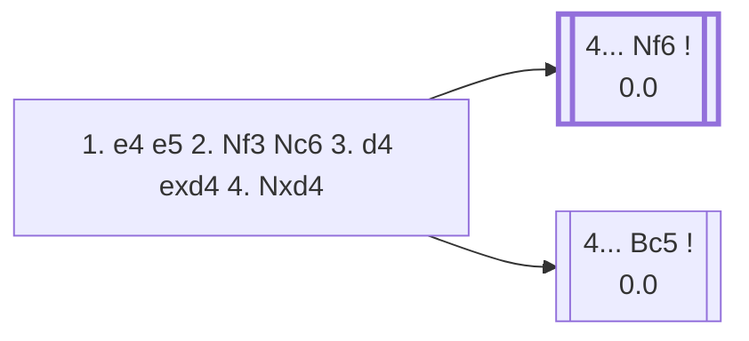

<a name="_TOP_"></a>

# C45 Scotch Game <br> 1. e4 e5 2. Nf3 Nc6 3. d4 exd4 4. Nxd4 #

Spun off from [C44's own "4. Nxd4" section](https://github.com/onclemarcel/chess_flashcards/blob/main/e4_openings/C44_Nc6_King_Knight.md#_Scotch_), which built out the whole recapture-with-the-knight main line as if it stayed C44 — live-confirmed (`tools/explore.py` on the exact post-4.Nxd4 FEN) this position is already **C45**, not C44, the same "wrong root code" shape found repeatedly elsewhere in this repo (A02/A04/B10/D04). C44's own Scotch section (part of `C44_Nc6_King_Knight.md` since the 2026-09-06 C44 merge) was never mislabeled at its own root (1. e4 e5 2. Nf3 Nc6 3. d4) — only this one branch, its deepest-built line, carried the wrong code.

### Overview

*Quick map of every move covered on this card — see the [shape key](https://github.com/onclemarcel/chess_flashcards/blob/main/start.md#content-diagram-optional) in start.md.*

<!-- content-diagram:start -->

<!-- content-diagram:end -->

<a name="_initial_move_"></a>

[](https://lichess.org/analysis/standard/r1bqkbnr/pppp1ppp/2n5/8/3NP3/8/PPP2PPP/RNBQKB1R_b_KQkq_-_0_4)

*... 1. e4 e5 2. Nf3 Nc6 3. d4 exd4 4. Nxd4 — Scotch Game*

```
r1bqkbnr/pppp1ppp/2n5/8/3NP3/8/PPP2PPP/RNBQKB1R b KQkq - 0 4
```

|  | 0.0 |
| --- | --- |

<!-- lichess-stats:start fen="r1bqkbnr/pppp1ppp/2n5/8/3NP3/8/PPP2PPP/RNBQKB1R b KQkq - 0 4" db="lichess,masters" speeds="bullet,blitz" ratings="1800,2000,2200,2500" moves="8" -->
| Move | Online | W/D/B | Masters | W/D/B | |
| :--- | ---: | :--- | ---: | :--- | :-- |
| Bc5 | 5.1 M (35.4%) | ⬜⬜⬜⬜⬜⬛⬛⬛⬛⬛ 50/5/45 | 7.3 k (38.4%) | ⬜⬜⬜🟫🟫🟫🟫⬛⬛⬛ 32/44/24 |  |
| Nxd4 | 3.2 M (22.0%) | ⬜⬜⬜⬜⬜🟫⬛⬛⬛⬛ 54/6/40 | 101 (0.5%) | ⬜⬜⬜⬜🟫🟫🟫🟫⬛⬛ 45/37/19 |  |
| Nf6 | 2.8 M (19.7%) | ⬜⬜⬜⬜⬜⬛⬛⬛⬛⬛ 47/6/47 | 8.8 k (46.2%) | ⬜⬜⬜🟫🟫🟫🟫🟫⬛⬛ 26/52/22 |  |
| d6 | 837 k (5.8%) | ⬜⬜⬜⬜⬜🟫⬛⬛⬛⬛ 52/5/43 | 168 (0.9%) | ⬜⬜⬜⬜🟫🟫🟫🟫⬛⬛ 36/40/23 |  |
| Qf6 | 764 k (5.3%) | ⬜⬜⬜⬜⬜⬛⬛⬛⬛⬛ 51/4/45 | 907 (4.8%) | ⬜⬜⬜🟫🟫🟫🟫⬛⬛⬛ 33/38/30 |  |
| Qh4 | 551 k (3.8%) | ⬜⬜⬜⬜🟫⬛⬛⬛⬛⬛ 44/5/51 | 275 (1.4%) | ⬜⬜⬜⬜🟫🟫🟫⬛⬛⬛ 45/28/28 |  |
| Nge7 | 242 k (1.7%) | ⬜⬜⬜⬜⬜🟫⬛⬛⬛⬛ 52/5/43 | 0 | — | ⚠ |
| Ne5 | 222 k (1.5%) | ⬜⬜⬜⬜⬜⬛⬛⬛⬛⬛ 53/3/44 | 0 | — | ⚠ |
| Bb4+ | 0 | — | 1.2 k (6.1%) | ⬜⬜⬜🟫🟫🟫🟫⬛⬛⬛ 35/39/26 |  |
| g6 | 0 | — | 218 (1.1%) | ⬜⬜⬜⬜🟫🟫🟫⬛⬛⬛ 40/33/27 |  |

*Online: bullet/blitz, 1800+ — 14.3 M games. Masters: 19 k games. [Open in the explorer](https://lichess.org/analysis/standard/r1bqkbnr/pppp1ppp/2n5/8/3NP3/8/PPP2PPP/RNBQKB1R_b_KQkq_-_0_4#explorer) — updated 2026-09-05*
<!-- lichess-stats:end -->

### Candidate moves

Black's two main tries are close in popularity at master level:

* [**4... Nf6**](#_Nf6_) (0.0, 46.2% masters): live-tagged the *Schmidt Variation* — attacks e4 at once, in the same spirit as Petrov's Defense.
* [**4... Bc5**](#_Bc5_) (0.0, 38.4% masters): live-tagged the *Classical Variation* — develops actively and eyes f2, at the cost of allowing White's knight to hop to b5 or f5 with tempo in some lines.

Both are considered fully sound; the choice is largely a matter of taste. Two further real tries:

* [**4... Nxd4**](#_Nxd4_) (0.1% masters): the immediate recapture, heading toward the *Ghulam Kassim Variation*.
* [**4... Qh4**](#_Qh4_) (1.4% masters): live-tagged the *Steinitz Variation* already at this root ply — a sharp, provocative queen sortie, covered below.

[*Back to C44's 3... exd4*](https://github.com/onclemarcel/chess_flashcards/blob/main/e4_openings/C44_Nc6_King_Knight.md#_exd4_)
[*Back to TOP*](#_TOP_)

---

<a name="_Nxd4_"></a>

### 4... Nxd4 — toward the Ghulam Kassim Variation

[](https://lichess.org/analysis/standard/r1bqkbnr/pppp1ppp/8/8/3nP3/8/PPP2PPP/RNBQKB1R_w_KQkq_-_0_5)

*... 4... Nxd4*

```
r1bqkbnr/pppp1ppp/8/8/3nP3/8/PPP2PPP/RNBQKB1R w KQkq - 0 5
```

|  | +0.6 |
| --- | --- |

**5. Qxd4** is essentially forced (99.5% online, no serious alternative in the masters sample). Continuing **5... d6 6. Bd3** is the *Ghulam Kassim Variation* (+0.3) — White keeps a comfortable space and development edge for the simplified position. Not built out further here (backlog).

[*Back to 4. Nxd4*](#_initial_move_)
[*Back to TOP*](#_TOP_)

---

<a name="_Qh4_"></a>

### 4... Qh4 — Steinitz Variation

[](https://lichess.org/analysis/standard/r1b1kbnr/pppp1ppp/2n5/8/3NP2q/8/PPP2PPP/RNBQKB1R_w_KQkq_-_1_5)

*... 4... Qh4 — Steinitz Variation*

```
r1b1kbnr/pppp1ppp/2n5/8/3NP2q/8/PPP2PPP/RNBQKB1R w KQkq - 1 5
```

|  | +0.8 |
| --- | --- |

**Live-confirmed**: the whole *Steinitz Variation* name already applies at this root ply — `eco.md`'s own entry narrows it to specifically **5. Nc3** one ply further, but the explorer tags the bare position the same way. Masters split mainly between two knight retreats:

* [**5. Nc3**](#_Steinitz5Nc3_) (55.6% masters, +0.9): the line `eco.md` itself calls the Steinitz Variation.
* [**5. Nb5**](#_Horwitz_) (32.7% masters, +0.4): the *Horwitz Attack*, covered below.
* **5. Nf3** (2.2% masters, 0.00): the *Fraser Attack* — the queen simply retreats and White has lost no time.

[*Back to 4. Nxd4*](#_initial_move_)
[*Back to TOP*](#_TOP_)

---

<a name="_Steinitz5Nc3_"></a>

### 5. Nc3

[](https://lichess.org/analysis/standard/r1b1kbnr/pppp1ppp/2n5/8/3NP2q/2N5/PPP2PPP/R1BQKB1R_b_KQkq_-_2_5)

*... 5. Nc3*

```
r1b1kbnr/pppp1ppp/2n5/8/3NP2q/2N5/PPP2PPP/R1BQKB1R b KQkq - 2 5
```

|  | +0.9 |
| --- | --- |

Masters' most popular try in this whole Qh4 complex (55.6%) — simply develops, ignoring the queen's sortie since it threatens nothing concrete yet. Not built out further here (backlog).

[*Back to 4... Qh4*](#_Qh4_)
[*Back to TOP*](#_TOP_)

---

<a name="_Horwitz_"></a>

### 5. Nb5 — Horwitz Attack

[](https://lichess.org/analysis/standard/r1b1kbnr/pppp1ppp/2n5/1N6/4P2q/8/PPP2PPP/RNBQKB1R_b_KQkq_-_2_5)

*... 5. Nb5 — Horwitz Attack*

```
r1b1kbnr/pppp1ppp/2n5/1N6/4P2q/8/PPP2PPP/RNBQKB1R b KQkq - 2 5
```

|  | +0.4 |
| --- | --- |

Threatens **6. Nxc7+**, forking king and rook. **5... Bb4+** is the near-universal reply, and White's 6th move forks into two named lines:

* **6. Nd2**, continuing **6... Qxe4 7. Be2 Qxg2 8. Bf3 Qh3 9. Nxc7+ Kd8 10. Nxa8 Nf6 11. a3** — the *Berger Variation*. This looks like White wins the exchange for a pawn, but the knight on a8 is permanently trapped and the engine already rates the position as heavily lost for White (−2.5) — a genuine "looks good, isn't" trap.
* **6. Bd2** (+0.2, no name of its own in `eco.md` at this exact ply), continuing **6... Qxe4 7. Be2 Kd8 8. O-O Bxd2 9. Nxd2 Qg6** — the *Rosenthal Variation* (+0.5), a much calmer path to a small White edge instead of the tactical mess above.

[*Back to 4... Qh4*](#_Qh4_)
[*Back to TOP*](#_TOP_)

---

<a name="_Nf6_"></a>

### 4... Nf6 — Schmidt Variation

[](https://lichess.org/analysis/standard/r1bqkb1r/pppp1ppp/2n2n2/8/3NP3/8/PPP2PPP/RNBQKB1R_w_KQkq_-_1_5)

*... 4... Nf6 — Schmidt Variation*

```
r1bqkb1r/pppp1ppp/2n2n2/8/3NP3/8/PPP2PPP/RNBQKB1R w KQkq - 1 5
```

|  | +0.1 |
| --- | --- |

**5. Nxc6** is masters' clear main try (82.9%), doubling Black's pawns for the bishop pair. After **5... bxc6**, White's 6th move is a genuine named fork:

* **6. e5** (0.0): the *Mieses Variation* — pushes the knight away immediately.
* **6. Nd2** (−0.1): the *Tartakower Variation* — develops instead, letting Black's knight stay on f6 for now.

[*Back to 4. Nxd4*](#_initial_move_)
[*Back to TOP*](#_TOP_)

---

<a name="_Bc5_"></a>

### 4... Bc5 — Classical Variation

[](https://lichess.org/analysis/standard/r1bqk1nr/pppp1ppp/2n5/2b5/3NP3/8/PPP2PPP/RNBQKB1R_w_KQkq_-_1_5)

*... 4... Bc5 — Classical Variation*

```
r1bqk1nr/pppp1ppp/2n5/2b5/3NP3/8/PPP2PPP/RNBQKB1R w KQkq - 1 5
```

|  | +0.2 |
| --- | --- |

**Live-confirmed**: this position is already tagged the *Classical Variation* — `eco.md`'s own entry at this exact ply carries no name of its own (bare "Scotch Opening"), only narrowing to named sub-lines one or more plies further. White's three main tries:

* [**5. Be3**](#_Be3Bc5_) (37.0% masters): covered below — the deepest named complex on this whole card.
* [**5. Nxc6**](#_Bc5_Nxc6_) (33.5% masters): the DN-1 speedrun line, covered above.
* [**5. Nb3**](#_Nb3Bc5_) (28.3% masters): covered below.

[*Back to 4. Nxd4*](#_initial_move_)
[*Back to TOP*](#_TOP_)

---

<a name="_Be3Bc5_"></a>

### 5. Be3 Qf6 6. c3 Nge7

[](https://lichess.org/analysis/standard/r1b1k2r/ppppnppp/2n2q2/2b5/3NP3/2P1B3/PP3PPP/RN1QKB1R_w_KQkq_-_1_7)

*... 6... Nge7*

```
r1b1k2r/ppppnppp/2n2q2/2b5/3NP3/2P1B3/PP3PPP/RN1QKB1R w KQkq - 1 7
```

|  | +0.2 |
| --- | --- |

White's 7th move forks into four named lines, none built out further here beyond this summary (all backlog):

* **7. Qd2** (0.0): the *Blackburne Attack*. Deeper, **7... d5 8. Nb5 Bxe3 9. Qxe3 O-O 10. Nxc7 Rb8 11. Nxd5 Nxd5 12. exd5 Nb4** is the *Gottschall Variation* — another "wins material, loses the game" trap (−1.5, the knight sac for the c7-pawn doesn't hold up).
* **7. Bb5** (+0.1): the *Paulsen Attack*. **7... Nd8** is the *Gunsberg Defence* (+0.7, a real engine swing toward White — the knight retreat costs real time).
* **7. Nc2** (0.0): the *Meitner Variation*.

Earlier, **6. Nb5** (instead of 6. c3) is the *Blumenfeld Attack* — a real engine swing toward Black (−0.6).

[*Back to 4... Bc5*](#_Bc5_)
[*Back to TOP*](#_TOP_)

---

<a name="_Nb3Bc5_"></a>

### 5. Nb3

[](https://lichess.org/analysis/standard/r1bqk1nr/pppp1ppp/2n5/2b5/4P3/1N6/PPP2PPP/RNBQKB1R_b_KQkq_-_2_5)

*... 5. Nb3*

```
r1bqk1nr/pppp1ppp/2n5/2b5/4P3/1N6/PPP2PPP/RNBQKB1R b KQkq - 2 5
```

|  | +0.2 |
| --- | --- |

Retreats the knight to attack the bishop rather than trading it off — the *Potter Variation*. **5... Bb4** (the *Romanishin Variation*, +0.3) keeps the bishop active on a different diagonal instead of retreating it. Neither built out further here (backlog).

[*Back to 4... Bc5*](#_Bc5_)
[*Back to TOP*](#_TOP_)

---

> [!TIP]
> [DN-1] From Daniel Naroditsky's *Speedrun: Back to 3000* — against 4... Bc5, **5. Nxc6** is masters' second-choice recapture-inducing try; **5... Qf6** answers in kind (87.9% of masters games), and the position becomes a real practical test of whether White meets it correctly.
>
> <a name="_Bc5_Nxc6_"></a>
>
> ### 4... Bc5 5. Nxc6 Qf6 — mind the two different "f3"s
>
> [](https://lichess.org/analysis/standard/r1b1k1nr/pppp1ppp/2N2q2/2b5/4P3/8/PPP2PPP/RNBQKB1R_w_KQkq_-_1_6)
>
> *... 5... Qf6*
>
> ```
> r1b1k1nr/pppp1ppp/2N2q2/2b5/4P3/8/PPP2PPP/RNBQKB1R w KQkq - 1 6
> ```
>
> |  | 0.0 |
> | --- | --- |
>
> White's two main tries are the **queen** moves **6. Qd2** (50.4% masters) and **6. Qf3** (47.9%) — the latter offers a queen trade that's been reached thousands of times in top-level games. [DN-1] The **pawn** move **6. f3??** looks similar on the board but is a very different decision: barely played at master level (1.0%), it blocks White's own king-knight development and, critically, makes it much harder to castle — see [Every pawn move leaves something behind](https://github.com/onclemarcel/chess_flashcards/blob/main/patterns/general_principles.md#_pawn_move_weaknesses_).
>
> After **6. f3 dxc6** (opening Black's own light-squared bishop in the process — doubled pawns are a small price for development here), White's position is still only slightly worse on the engine's own numbers (-0.1), but the practical damage is real: the king is stuck in the centre a long time, and — as happened in the featured game — that's exactly the kind of position where a further slip turns into a full-blown blunder.
>
> [*Back to 4. Nxd4*](#_initial_move_)
> [*Back to TOP*](#_TOP_)
