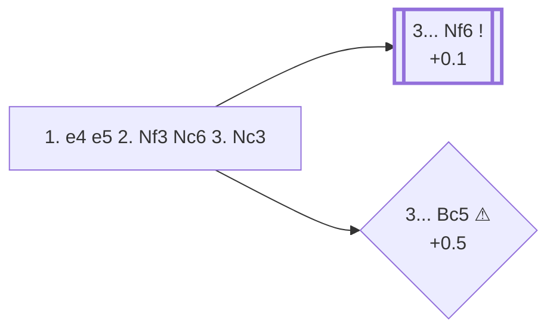

<a name="_TOP_"></a>

# C47 Four Knights Game <br> 1. e4 e5 2. Nf3 Nc6 3. Nc3 #

The most symmetrical and classical of White's tries against 2... Nc6: both sides simply develop knights toward the centre before committing to a plan. Solid and slightly drawish by reputation, but it transposes into some genuinely sharp territory once both sides bring their king's knights out too.

### Overview

*Quick map of every move covered on this card — see the [shape key](https://github.com/onclemarcel/chess_flashcards/blob/main/start.md#content-diagram-optional) in start.md.*

<!-- content-diagram:start -->

<!-- content-diagram:end -->

<a name="_initial_move_"></a>

[](https://lichess.org/analysis/standard/r1bqkbnr/pppp1ppp/2n5/4p3/4P3/2N2N2/PPPP1PPP/R1BQKB1R_b_KQkq_-_3_3)

*... 1. e4 e5 2. Nf3 Nc6 3. Nc3 — Four Knights Game*

```
r1bqkbnr/pppp1ppp/2n5/4p3/4P3/2N2N2/PPPP1PPP/R1BQKB1R b KQkq - 3 3
```

|  | +0.1 |
| --- | --- |

<!-- lichess-stats:start fen="r1bqkbnr/pppp1ppp/2n5/4p3/4P3/2N2N2/PPPP1PPP/R1BQKB1R b KQkq - 3 3" db="lichess,masters" speeds="bullet,blitz" ratings="1800,2000,2200,2500" moves="6" -->
| Move | Online | W/D/B | Masters | W/D/B | |
| :--- | ---: | :--- | ---: | :--- | :-- |
| Nf6 | 7.2 M (49.3%) | ⬜⬜⬜⬜⬜🟫⬛⬛⬛⬛ 50/5/44 | 13 k (92.2%) | ⬜⬜⬜🟫🟫🟫🟫🟫⬛⬛ 26/49/24 |  |
| Bc5 | 4.0 M (27.2%) | ⬜⬜⬜⬜⬜⬛⬛⬛⬛⬛ 50/4/46 | 187 (1.3%) | ⬜⬜⬜⬜🟫🟫🟫⬛⬛⬛ 43/33/24 |  |
| d6 | 1.5 M (9.9%) | ⬜⬜⬜⬜⬜🟫⬛⬛⬛⬛ 52/5/43 | 256 (1.8%) | ⬜⬜⬜⬜🟫🟫🟫⬛⬛⬛ 39/32/29 |  |
| Bb4 | 726 k (4.9%) | ⬜⬜⬜⬜⬜⬛⬛⬛⬛⬛ 50/5/45 | 96 (0.7%) | ⬜⬜⬜⬜🟫🟫🟫🟫⬛⬛ 41/43/17 |  |
| f5 | 497 k (3.4%) | ⬜⬜⬜⬜⬜⬛⬛⬛⬛⬛ 47/4/49 | 18 (0.1%) | — |  |
| Be7 | 181 k (1.2%) | ⬜⬜⬜⬜⬜🟫⬛⬛⬛⬛ 51/5/44 | 0 | — | ⚠ |
| g6 | 0 | — | 552 (3.8%) | ⬜⬜⬜⬜🟫🟫🟫⬛⬛⬛ 40/30/30 |  |

*Online: bullet/blitz, 1800+ — 14.7 M games. Masters: 15 k games. [Open in the explorer](https://lichess.org/analysis/standard/r1bqkbnr/pppp1ppp/2n5/4p3/4P3/2N2N2/PPPP1PPP/R1BQKB1R_b_KQkq_-_3_3#explorer) — updated 2026-08-25*
<!-- lichess-stats:end -->

### Candidate moves

* [**3... Nf6**](#_Nf6_) (+0.1): completes symmetrical development and is masters' overwhelming choice (92.2%) — the *Four Knights Game* proper.
* [**3... Bc5**](#_Bc5_) (+0.5 ⚠): develops actively toward f2 instead. Popular online (27.2%) but a distant second choice in masters play (1.3%) — not because it's refuted, but because White's most direct reply leaves Black slightly worse without quite the same central grip that 3... Nf6 keeps.

[*Back to TOP*](#_TOP_)

---

<a name="_Nf6_"></a>

### 3... Nf6

[](https://lichess.org/analysis/standard/r1bqkb1r/pppp1ppp/2n2n2/4p3/4P3/2N2N2/PPPP1PPP/R1BQKB1R_w_KQkq_-_4_4)

*... 3... Nf6*

```
r1bqkb1r/pppp1ppp/2n2n2/4p3/4P3/2N2N2/PPPP1PPP/R1BQKB1R w KQkq - 4 4
```

|  | +0.1 |
| --- | --- |

<!-- lichess-stats:start fen="r1bqkb1r/pppp1ppp/2n2n2/4p3/4P3/2N2N2/PPPP1PPP/R1BQKB1R w KQkq - 4 4" db="lichess,masters" speeds="bullet,blitz" ratings="1800,2000,2200,2500" moves="8" -->
| Move | Online | W/D/B | Masters | W/D/B | |
| :--- | ---: | :--- | ---: | :--- | :-- |
| d4 | 3.9 M (30.4%) | ⬜⬜⬜⬜⬜🟫⬛⬛⬛⬛ 52/6/42 | 6.3 k (36.8%) | ⬜⬜🟫🟫🟫🟫🟫🟫⬛⬛ 21/56/23 |  |
| Bc4 | 3.5 M (26.9%) | ⬜⬜⬜⬜⬜⬛⬛⬛⬛⬛ 46/5/49 | 224 (1.3%) | ⬜⬜🟫🟫🟫🟫🟫⬛⬛⬛ 18/49/33 |  |
| Bb5 | 3.0 M (23.5%) | ⬜⬜⬜⬜⬜🟫⬛⬛⬛⬛ 51/5/43 | 7.0 k (40.7%) | ⬜⬜⬜🟫🟫🟫🟫🟫⬛⬛ 29/49/22 |  |
| d3 | 786 k (6.1%) | ⬜⬜⬜⬜⬜⬛⬛⬛⬛⬛ 46/5/49 | 0 | — | ⚠ |
| Nxe5 | 579 k (4.5%) | ⬜⬜⬜⬜⬜🟫⬛⬛⬛⬛ 53/4/44 | 0 | — | ⚠ |
| Be2 | 300 k (2.3%) | ⬜⬜⬜⬜⬜🟫⬛⬛⬛⬛ 51/6/44 | 335 (2.0%) | ⬜⬜⬜🟫🟫🟫🟫⬛⬛⬛ 34/41/25 |  |
| a3 | 292 k (2.3%) | ⬜⬜⬜⬜⬜🟫⬛⬛⬛⬛ 52/6/42 | 748 (4.4%) | ⬜⬜⬜🟫🟫🟫🟫⬛⬛⬛ 34/39/27 |  |
| h3 | 217 k (1.7%) | ⬜⬜⬜⬜⬜⬛⬛⬛⬛⬛ 49/5/46 | 409 (2.4%) | ⬜⬜⬜🟫🟫🟫🟫🟫⬛⬛ 30/48/22 |  |
| g3 | 0 | — | 1.9 k (11.1%) | ⬜⬜⬜⬜🟫🟫🟫🟫⬛⬛ 35/42/24 |  |
| Nd5 | 0 | — | 98 (0.6%) | ⬜⬜⬜🟫🟫🟫🟫🟫⬛⬛ 27/52/21 |  |

*Online: bullet/blitz, 1800+ — 12.9 M games. Masters: 17 k games. [Open in the explorer](https://lichess.org/analysis/standard/r1bqkb1r/pppp1ppp/2n2n2/4p3/4P3/2N2N2/PPPP1PPP/R1BQKB1R_w_KQkq_-_4_4#explorer) — updated 2026-08-25*
<!-- lichess-stats:end -->

Masters are genuinely split between two main tries here, with a third real option behind them:

* **4. Bb5** (40.7% masters): the *Spanish Four Knights* — transposes toward Ruy Lopez themes, pinning the c6-knight a second time (both minor pieces now pin/defend along the same idea).
* **4. d4** (36.8% masters): the *Scotch Four Knights* — opens the centre at once, following **4... exd4 5. Nxd4**.
* **4. g3** (11.1% masters): the quieter *Glek Variation*, fianchettoing the king's bishop and aiming for a slow positional squeeze rather than immediate central tension.

Online, **4. Bc4** (26.9%) is also common — the *Italian Four Knights* — though masters treat it as a clear fourth choice (1.3%), since it doesn't put the same pressure on Black's centre as the three tries above.

[*Back to 3. Nc3*](#_initial_move_)
[*Back to TOP*](#_TOP_)

---

<a name="_Bc5_"></a>

### 3... Bc5

[](https://lichess.org/analysis/standard/r1bqk1nr/pppp1ppp/2n5/2b1p3/4P3/2N2N2/PPPP1PPP/R1BQKB1R_w_KQkq_-_4_4)

*... 3... Bc5*

```
r1bqk1nr/pppp1ppp/2n5/2b1p3/4P3/2N2N2/PPPP1PPP/R1BQKB1R w KQkq - 4 4
```

|  | +0.5 |
| --- | --- |

Unlike 3... Nf6, this doesn't add a second defender to e5, so **4. Nxe5** picks up the pawn: after **4... Nxe5 5. d4**, the point isn't a fork that wins material outright — Black simply retreats **5... Bd6** and the pawn comes back with **6. dxe5 Bxe5**, reaching full material equality (this whole line is well tested at GM level, average rating over 2400 in the masters database). The real cost to Black is structural rather than material: White keeps a small, comfortable pull rather than facing the fuller central tension of 3... Nf6.

[*Back to 3. Nc3*](#_initial_move_)
[*Back to TOP*](#_TOP_)
