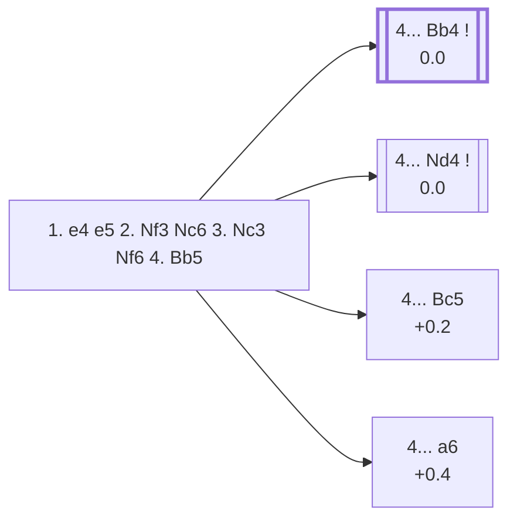

<a name="_TOP_"></a>

# C48 Four Knights Game: Spanish Variation <br> 1. e4 e5 2. Nf3 Nc6 3. Nc3 Nf6 4. Bb5 #

Spun off from [C47's own "3... Nf6" section](https://github.com/onclemarcel/chess_flashcards/blob/main/e4_openings/C47_Four_Knights_Game.md), which named this as masters' single most popular try (40.7%) but left it as a bare mention — a genuine zero-coverage gap surfaced by a full A00-E99 ECO-code audit. White pins the c6-knight a second time (the light-squared bishop now doing the same job the queen's knight already does), transposing toward Ruy Lopez-flavoured structures a tempo apart from the real Spanish.

### Overview

*Quick map of every move covered on this card — see the [shape key](https://github.com/onclemarcel/chess_flashcards/blob/main/start.md#content-diagram-optional) in start.md.*

<!-- content-diagram:start -->

<!-- content-diagram:end -->

<a name="_initial_move_"></a>

[](https://lichess.org/analysis/standard/r1bqkb1r/pppp1ppp/2n2n2/1B2p3/4P3/2N2N2/PPPP1PPP/R1BQK2R_b_KQkq_-_5_4)

*... 1. e4 e5 2. Nf3 Nc6 3. Nc3 Nf6 4. Bb5 — Four Knights Game: Spanish Variation*

```
r1bqkb1r/pppp1ppp/2n2n2/1B2p3/4P3/2N2N2/PPPP1PPP/R1BQK2R b KQkq - 5 4
```

|  | 0.0 |
| --- | --- |

<!-- lichess-stats:start fen="r1bqkb1r/pppp1ppp/2n2n2/1B2p3/4P3/2N2N2/PPPP1PPP/R1BQK2R b KQkq - 5 4" db="lichess,masters" speeds="bullet,blitz" ratings="1800,2000,2200,2500" moves="8" -->
| Move | Online | W/D/B | Masters | W/D/B | |
| :--- | ---: | :--- | ---: | :--- | :-- |
| Bc5 | 898 k (26.2%) | ⬜⬜⬜⬜⬜🟫⬛⬛⬛⬛ 51/5/45 | 570 (7.5%) | ⬜⬜⬜🟫🟫🟫🟫🟫⬛⬛ 32/45/23 |  |
| d6 | 848 k (24.7%) | ⬜⬜⬜⬜⬜🟫⬛⬛⬛⬛ 53/6/42 | 277 (3.6%) | ⬜⬜⬜⬜🟫🟫🟫🟫⬛⬛ 38/45/17 |  |
| Bb4 | 659 k (19.2%) | ⬜⬜⬜⬜⬜🟫⬛⬛⬛⬛ 49/6/45 | 2.9 k (37.5%) | ⬜⬜⬜🟫🟫🟫🟫🟫⬛⬛ 30/50/20 |  |
| Nd4 | 516 k (15.1%) | ⬜⬜⬜⬜⬜🟫⬛⬛⬛⬛ 48/6/46 | 2.7 k (35.7%) | ⬜⬜🟫🟫🟫🟫🟫🟫⬛⬛ 25/57/19 |  |
| a6 | 260 k (7.6%) | ⬜⬜⬜⬜⬜🟫⬛⬛⬛⬛ 54/5/41 | 39 (0.5%) | ⬜⬜⬜🟫🟫🟫🟫🟫⬛⬛ 33/51/15 |  |
| Bd6 | 115 k (3.4%) | ⬜⬜⬜⬜⬜🟫⬛⬛⬛⬛ 49/6/45 | 1.1 k (15.1%) | ⬜⬜⬜🟫🟫🟫🟫⬛⬛⬛ 28/39/32 |  |
| Be7 | 77 k (2.3%) | ⬜⬜⬜⬜⬜🟫⬛⬛⬛⬛ 52/5/43 | 10 (0.1%) | — |  |
| d5 | 28 k (0.8%) | ⬜⬜⬜⬜⬜🟫⬛⬛⬛⬛ 52/4/44 | 0 | — | ⚠ |
| Qe7 | 0 | — | 1 (0.0%) | — |  |

*Online: bullet/blitz, 1800+ — 3.4 M games. Masters: 7.6 k games. [Open in the explorer](https://lichess.org/analysis/standard/r1bqkb1r/pppp1ppp/2n2n2/1B2p3/4P3/2N2N2/PPPP1PPP/R1BQK2R_b_KQkq_-_5_4#explorer) — updated 2026-09-14*
<!-- lichess-stats:end -->

### Candidate moves

Masters split across four real tries, with the first two nearly tied for the lead:

* [**4... Bb4**](https://github.com/onclemarcel/chess_flashcards/blob/main/e4_openings/C49_Four_Knights_Symmetrical.md) (0.0, 37.5% masters): the *double Ruy Lopez* — both sides now pin the other's queen's knight — live-tagged its own code, **C49**, and covered on its own card.
* [**4... Nd4**](#_Nd4_) (0.0, 35.7% masters): the *Rubinstein Variation* — counter-pins by attacking the bishop instead of matching it.
* [**4... Bc5**](#_Bc5_) (+0.2, 7.5% masters): the *Classical Variation* — develops actively rather than pinning back.
* [**4... a6**](#_a6_) (+0.4, 0.5% masters): the *Ranken Variation* — challenges the bishop immediately; rare at master level despite being fairly common online (7.6%).

**4... Bd6** (15.1% masters) is also real and reasonably common at that level, but carries no name of its own in `eco.md`; not built out further here (backlog).

[*Back to TOP*](#_TOP_)

---

<a name="_Nd4_"></a>

### 4... Nd4 — Rubinstein Variation

[](https://lichess.org/analysis/standard/r1bqkb1r/pppp1ppp/5n2/1B2p3/3nP3/2N2N2/PPPP1PPP/R1BQK2R_w_KQkq_-_6_5)

*... 4... Nd4 — Rubinstein Variation*

```
r1bqkb1r/pppp1ppp/5n2/1B2p3/3nP3/2N2N2/PPPP1PPP/R1BQK2R w KQkq - 6 5
```

|  | 0.0 |
| --- | --- |

<!-- lichess-stats:start fen="r1bqkb1r/pppp1ppp/5n2/1B2p3/3nP3/2N2N2/PPPP1PPP/R1BQK2R w KQkq - 6 5" db="lichess,masters" speeds="bullet,blitz" ratings="1800,2000,2200,2500" moves="8" -->
| Move | Online | W/D/B | Masters | W/D/B | |
| :--- | ---: | :--- | ---: | :--- | :-- |
| Nxd4 | 122 k (23.7%) | ⬜⬜⬜⬜⬜⬛⬛⬛⬛⬛ 47/6/47 | 618 (22.7%) | ⬜🟫🟫🟫🟫🟫🟫🟫🟫⬛ 11/78/11 |  |
| Bc4 | 112 k (21.6%) | ⬜⬜⬜⬜⬜🟫⬛⬛⬛⬛ 48/6/46 | 712 (26.2%) | ⬜⬜⬜🟫🟫🟫🟫🟫⬛⬛ 28/55/17 |  |
| O-O | 78 k (15.2%) | ⬜⬜⬜⬜⬜🟫⬛⬛⬛⬛ 50/6/44 | 425 (15.6%) | ⬜⬜⬜🟫🟫🟫🟫🟫⬛⬛ 28/55/17 |  |
| Ba4 | 71 k (13.7%) | ⬜⬜⬜⬜⬜🟫⬛⬛⬛⬛ 50/5/45 | 842 (31.0%) | ⬜⬜⬜🟫🟫🟫🟫🟫⬛⬛ 30/45/25 |  |
| Nxe5 | 70 k (13.6%) | ⬜⬜⬜⬜⬜🟫⬛⬛⬛⬛ 51/5/44 | 64 (2.4%) | ⬜⬜⬜⬜🟫🟫🟫🟫⬛⬛ 36/42/22 |  |
| d3 | 27 k (5.2%) | ⬜⬜⬜⬜⬜⬛⬛⬛⬛⬛ 46/5/49 | 1 (0.0%) | — | ⚠ |
| Be2 | 17 k (3.3%) | ⬜⬜⬜⬜⬜🟫⬛⬛⬛⬛ 48/6/45 | 16 (0.6%) | — |  |
| Bd3 | 11 k (2.1%) | ⬜⬜⬜⬜⬜⬛⬛⬛⬛⬛ 46/6/48 | 42 (1.5%) | ⬜⬜⬜🟫🟫🟫🟫⬛⬛⬛ 26/43/31 |  |

*Online: bullet/blitz, 1800+ — 516 k games. Masters: 2.7 k games. [Open in the explorer](https://lichess.org/analysis/standard/r1bqkb1r/pppp1ppp/5n2/1B2p3/3nP3/2N2N2/PPPP1PPP/R1BQK2R_w_KQkq_-_6_5#explorer) — updated 2026-09-14*
<!-- lichess-stats:end -->

Masters are genuinely split four ways here — no single reply dominates:

* **5. Ba4** (31.0%): keeps the pin alive, retreating rather than resolving the tension.
* **5. Bc4** (26.2%): redeploys toward f7 instead.
* **5. Nxd4** (22.7%): the *Exchange Variation*, trading off the counter-attacking knight at once.
* **5. O-O** (15.6%): the *Henneberger Variation*, castling and leaving the tension for Black to resolve.

Deeper theory — the *Bogolyubov Variation* (5. Nxe5 Qe7 6. f4) and the line reached via **5. Be2**, itself forking toward the *Maroczy Variation* (5... Nxf3 6. Bxf3 Bc5 7. O-O O-O 8. d3 d6 9. Na4 Bb6) — is its own body of work, not covered further here (backlog).

[*Back to 4. Bb5*](#_initial_move_)
[*Back to TOP*](#_TOP_)

---

<a name="_Bc5_"></a>

### 4... Bc5 — Classical Variation

[](https://lichess.org/analysis/standard/r1bqk2r/pppp1ppp/2n2n2/1Bb1p3/4P3/2N2N2/PPPP1PPP/R1BQK2R_w_KQkq_-_6_5)

*... 4... Bc5 — Classical Variation*

```
r1bqk2r/pppp1ppp/2n2n2/1Bb1p3/4P3/2N2N2/PPPP1PPP/R1BQK2R w KQkq - 6 5
```

|  | +0.2 |
| --- | --- |

<!-- lichess-stats:start fen="r1bqk2r/pppp1ppp/2n2n2/1Bb1p3/4P3/2N2N2/PPPP1PPP/R1BQK2R w KQkq - 6 5" db="lichess,masters" speeds="bullet,blitz" ratings="1800,2000,2200,2500" moves="8" -->
| Move | Online | W/D/B | Masters | W/D/B | |
| :--- | ---: | :--- | ---: | :--- | :-- |
| O-O | 411 k (37.6%) | ⬜⬜⬜⬜⬜🟫⬛⬛⬛⬛ 50/5/45 | 357 (62.2%) | ⬜⬜⬜🟫🟫🟫🟫🟫⬛⬛ 30/48/22 |  |
| Bxc6 | 317 k (29.0%) | ⬜⬜⬜⬜⬜🟫⬛⬛⬛⬛ 51/5/45 | 30 (5.2%) | ⬜⬜🟫🟫🟫🟫🟫⬛⬛⬛ 23/50/27 |  |
| d3 | 229 k (20.9%) | ⬜⬜⬜⬜⬜⬛⬛⬛⬛⬛ 49/5/46 | 72 (12.5%) | ⬜⬜⬜⬜🟫🟫🟫🟫⬛⬛ 40/36/24 |  |
| Nxe5 | 92 k (8.4%) | ⬜⬜⬜⬜⬜⬜⬛⬛⬛⬛ 58/5/37 | 113 (19.7%) | ⬜⬜⬜🟫🟫🟫🟫⬛⬛⬛ 35/39/27 |  |
| h3 | 25 k (2.3%) | ⬜⬜⬜⬜⬜⬛⬛⬛⬛⬛ 47/5/48 | 0 | — | ⚠ |
| d4 | 4.6 k (0.4%) | ⬜⬜⬜⬜⬛⬛⬛⬛⬛⬛ 41/4/55 | 0 | — | ⚠ |
| a3 | 3.3 k (0.3%) | ⬜⬜⬜⬜🟫⬛⬛⬛⬛⬛ 43/4/53 | 0 | — | ⚠ |
| Qe2 | 2.3 k (0.2%) | ⬜⬜⬜⬜⬛⬛⬛⬛⬛⬛ 42/4/54 | 0 | — | ⚠ |
| Bc4 | 0 | — | 2 (0.3%) | — |  |

*Online: bullet/blitz, 1800+ — 1.1 M games. Masters: 574 games. [Open in the explorer](https://lichess.org/analysis/standard/r1bqk2r/pppp1ppp/2n2n2/1Bb1p3/4P3/2N2N2/PPPP1PPP/R1BQK2R_w_KQkq_-_6_5#explorer) — updated 2026-09-14*
<!-- lichess-stats:end -->

**5. O-O** is masters' clear main try (62.2%), simply completing development; **5. Nxe5** (19.7%) trades into an ending after **5... Nxe5 6. d4**, and **5. d3** (12.5%) keeps things quiet. After **5. O-O O-O**, White's **6. Nxe5** fork produces two named deeper lines — the *Bardeleben Variation* (6... Nxe5 7. d4 Bd6 8. f4 Nc6 9. e5 Bb4) and the *Marshall Variation* (6... Nd4 instead) — both their own body of work, not covered further here (backlog).

[*Back to 4. Bb5*](#_initial_move_)
[*Back to TOP*](#_TOP_)

---

<a name="_a6_"></a>

### 4... a6 — Ranken Variation

[](https://lichess.org/analysis/standard/r1bqkb1r/1ppp1ppp/p1n2n2/1B2p3/4P3/2N2N2/PPPP1PPP/R1BQK2R_w_KQkq_-_0_5)

*... 4... a6 — Ranken Variation*

```
r1bqkb1r/1ppp1ppp/p1n2n2/1B2p3/4P3/2N2N2/PPPP1PPP/R1BQK2R w KQkq - 0 5
```

|  | +0.4 |
| --- | --- |

**5. Bxc6** is masters' overwhelming reply (97.4%), giving up the bishop pair rather than retreating — unlike the main Ruy Lopez, White has no useful square to fall back to here. After **5... dxc6**, deeper theory continues into the *Spielmann Variation* (6. Nxe5 Nxe4 7. Nxe4 Qd4 8. O-O Qxe5 9. Re1 Be6 10. d4 Qd5), a sharp forcing sequence that is its own body of work, not covered further here (backlog).

[*Back to 4. Bb5*](#_initial_move_)
[*Back to TOP*](#_TOP_)
