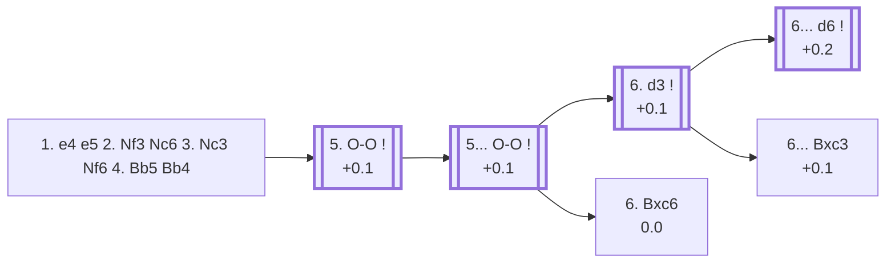

<a name="_TOP_"></a>

# C49 Four Knights Game: Double Spanish <br> 1. e4 e5 2. Nf3 Nc6 3. Nc3 Nf6 4. Bb5 Bb4 #

Spun off from [C48's own "4... Bb4" candidate bullet](https://github.com/onclemarcel/chess_flashcards/blob/main/e4_openings/C48_Four_Knights_Spanish.md), masters' single most popular try there (37.5%) but previously just a pointer with no content of its own — a genuine zero-coverage gap surfaced by a full A00-E99 ECO-code audit. Both sides now pin the other's queen's knight to its own king — `eco.md`'s own book name for this is the *double Ruy Lopez*, but the Lichess explorer itself tags every position on this page the **Double Spanish** instead, used here per this repository's standing convention of preferring the explorer's own live name.

### Overview

*Quick map of every move covered on this card — see the [shape key](https://github.com/onclemarcel/chess_flashcards/blob/main/start.md#content-diagram-optional) in start.md.*

<!-- content-diagram:start -->

<!-- content-diagram:end -->

<a name="_initial_move_"></a>

[](https://lichess.org/analysis/standard/r1bqk2r/pppp1ppp/2n2n2/1B2p3/1b2P3/2N2N2/PPPP1PPP/R1BQK2R_w_KQkq_-_6_5)

*... 1. e4 e5 2. Nf3 Nc6 3. Nc3 Nf6 4. Bb5 Bb4 — Double Spanish*

```
r1bqk2r/pppp1ppp/2n2n2/1B2p3/1b2P3/2N2N2/PPPP1PPP/R1BQK2R w KQkq - 6 5
```

|  | +0.1 |
| --- | --- |

<!-- lichess-stats:start fen="r1bqk2r/pppp1ppp/2n2n2/1B2p3/1b2P3/2N2N2/PPPP1PPP/R1BQK2R w KQkq - 6 5" db="lichess,masters" speeds="bullet,blitz" ratings="1800,2000,2200,2500" moves="8" -->
| Move | Online | W/D/B | Masters | W/D/B | |
| :--- | ---: | :--- | ---: | :--- | :-- |
| O-O | 285 k (41.9%) | ⬜⬜⬜⬜⬜🟫⬛⬛⬛⬛ 51/6/43 | 2.7 k (94.2%) | ⬜⬜⬜🟫🟫🟫🟫🟫⬛⬛ 30/50/20 |  |
| Bxc6 | 175 k (25.7%) | ⬜⬜⬜⬜⬜🟫⬛⬛⬛⬛ 49/6/45 | 25 (0.9%) | ⬜⬜⬜⬜🟫🟫🟫🟫⬛⬛ 40/44/16 |  |
| d3 | 171 k (25.2%) | ⬜⬜⬜⬜⬜⬛⬛⬛⬛⬛ 48/5/47 | 109 (3.8%) | ⬜⬜⬜🟫🟫🟫🟫🟫⬛⬛ 28/51/21 |  |
| Nd5 | 20 k (2.9%) | ⬜⬜⬜⬜⬜🟫⬛⬛⬛⬛ 51/6/44 | 24 (0.8%) | ⬜🟫🟫🟫🟫🟫🟫⬛⬛⬛ 12/58/29 |  |
| a3 | 14 k (2.0%) | ⬜⬜⬜⬜🟫⬛⬛⬛⬛⬛ 42/5/54 | 6 (0.2%) | — |  |
| Qe2 | 5.2 k (0.8%) | ⬜⬜⬜⬜⬜⬛⬛⬛⬛⬛ 45/4/51 | 1 (0.0%) | — | ⚠ |
| d4 | 4.1 k (0.6%) | ⬜⬜⬜⬜🟫⬛⬛⬛⬛⬛ 44/4/52 | 0 | — | ⚠ |
| h3 | 2.4 k (0.4%) | ⬜⬜⬜⬜⬜⬛⬛⬛⬛⬛ 49/4/47 | 0 | — | ⚠ |
| Be2 | 0 | — | 1 (0.0%) | — |  |

*Online: bullet/blitz, 1800+ — 680 k games. Masters: 2.9 k games. [Open in the explorer](https://lichess.org/analysis/standard/r1bqk2r/pppp1ppp/2n2n2/1B2p3/1b2P3/2N2N2/PPPP1PPP/R1BQK2R_w_KQkq_-_6_5#explorer) — updated 2026-09-06*
<!-- lichess-stats:end -->

### Candidate moves

* [**5. O-O**](#_OO_) (+0.1, 94.2% masters): simply completes development — masters' overwhelming choice, and the line this card follows.
* **5. d3** (3.8% masters): also fine, keeping the tension a move longer; not built out further here (backlog).

**5. Nd5**, chasing an immediate tactic after **5... Nxd5 6. exd5 e4**, is the *Gunsberg Counter-attack* — real but rare (0.8% masters); not built out further here (backlog).

[*Back to TOP*](#_TOP_)

---

<a name="_OO_"></a>

### 5. O-O

[](https://lichess.org/analysis/standard/r1bqk2r/pppp1ppp/2n2n2/1B2p3/1b2P3/2N2N2/PPPP1PPP/R1BQ1RK1_b_kq_-_7_5)

*... 5. O-O*

```
r1bqk2r/pppp1ppp/2n2n2/1B2p3/1b2P3/2N2N2/PPPP1PPP/R1BQ1RK1 b kq - 7 5
```

|  | +0.1 |
| --- | --- |

<!-- lichess-stats:start fen="r1bqk2r/pppp1ppp/2n2n2/1B2p3/1b2P3/2N2N2/PPPP1PPP/R1BQ1RK1 b kq - 7 5" db="lichess,masters" speeds="bullet,blitz" ratings="1800,2000,2200,2500" moves="8" -->
| Move | Online | W/D/B | Masters | W/D/B | |
| :--- | ---: | :--- | ---: | :--- | :-- |
| O-O | 158 k (55.2%) | ⬜⬜⬜⬜⬜🟫⬛⬛⬛⬛ 50/7/43 | 2.6 k (95.4%) | ⬜⬜⬜🟫🟫🟫🟫🟫⬛⬛ 29/50/21 |  |
| d6 | 69 k (24.3%) | ⬜⬜⬜⬜⬜🟫⬛⬛⬛⬛ 54/6/41 | 46 (1.7%) | ⬜⬜⬜⬜⬜🟫🟫🟫⬛⬛ 50/35/15 |  |
| Bxc3 | 49 k (17.2%) | ⬜⬜⬜⬜⬜🟫⬛⬛⬛⬛ 50/6/44 | 73 (2.7%) | ⬜⬜⬜🟫🟫🟫🟫🟫⬛⬛ 33/49/18 |  |
| a6 | 3.3 k (1.2%) | ⬜⬜⬜⬜⬜⬜⬛⬛⬛⬛ 60/4/35 | 0 | — | ⚠ |
| Nd4 | 3.2 k (1.1%) | ⬜⬜⬜⬜⬜🟫⬛⬛⬛⬛ 51/5/44 | 5 (0.2%) | — |  |
| h6 | 982 (0.3%) | ⬜⬜⬜⬜⬜🟫⬛⬛⬛⬛ 52/5/43 | 0 | — | ⚠ |
| Qe7 | 941 (0.3%) | ⬜⬜⬜⬜⬜⬜⬛⬛⬛⬛ 61/4/35 | 0 | — | ⚠ |
| Kf8 | 242 (0.1%) | ⬜⬜⬜⬜⬜⬜🟫⬛⬛⬛ 60/5/35 | 0 | — | ⚠ |

*Online: bullet/blitz, 1800+ — 285 k games. Masters: 2.7 k games. [Open in the explorer](https://lichess.org/analysis/standard/r1bqk2r/pppp1ppp/2n2n2/1B2p3/1b2P3/2N2N2/PPPP1PPP/R1BQ1RK1_b_kq_-_7_5#explorer) — updated 2026-09-06*
<!-- lichess-stats:end -->

**5... O-O** is masters' near-unanimous reply (95.4%), completing the full symmetry.

[](https://lichess.org/analysis/standard/r1bq1rk1/pppp1ppp/2n2n2/1B2p3/1b2P3/2N2N2/PPPP1PPP/R1BQ1RK1_w_-_-_8_6)

```
r1bq1rk1/pppp1ppp/2n2n2/1B2p3/1b2P3/2N2N2/PPPP1PPP/R1BQ1RK1 w - - 8 6
```

|  | +0.1 |
| --- | --- |

<!-- lichess-stats:start fen="r1bq1rk1/pppp1ppp/2n2n2/1B2p3/1b2P3/2N2N2/PPPP1PPP/R1BQ1RK1 w - - 8 6" db="lichess,masters" speeds="bullet,blitz" ratings="1800,2000,2200,2500" moves="8" -->
| Move | Online | W/D/B | Masters | W/D/B | |
| :--- | ---: | :--- | ---: | :--- | :-- |
| d3 | 93 k (59.0%) | ⬜⬜⬜⬜⬜🟫⬛⬛⬛⬛ 51/6/42 | 2.1 k (83.3%) | ⬜⬜⬜🟫🟫🟫🟫🟫⬛⬛ 31/48/21 |  |
| Bxc6 | 29 k (18.3%) | ⬜⬜⬜⬜⬜🟫⬛⬛⬛⬛ 50/8/42 | 365 (14.2%) | ⬜⬜🟫🟫🟫🟫🟫🟫⬛⬛ 21/59/20 |  |
| Re1 | 15 k (9.7%) | ⬜⬜⬜⬜⬜⬛⬛⬛⬛⬛ 47/5/48 | 15 (0.6%) | — |  |
| Nd5 | 8.9 k (5.7%) | ⬜⬜⬜⬜⬜🟫⬛⬛⬛⬛ 50/6/43 | 36 (1.4%) | ⬜⬜⬜🟫🟫🟫🟫🟫⬛⬛ 28/50/22 |  |
| d4 | 4.6 k (2.9%) | ⬜⬜⬜⬜⬜🟫⬛⬛⬛⬛ 49/7/44 | 8 (0.3%) | — |  |
| a3 | 3.8 k (2.4%) | ⬜⬜⬜⬜🟫⬛⬛⬛⬛⬛ 42/5/53 | 3 (0.1%) | — | ⚠ |
| h3 | 2.5 k (1.6%) | ⬜⬜⬜⬜⬜⬛⬛⬛⬛⬛ 48/5/47 | 0 | — | ⚠ |
| Qe2 | 308 (0.2%) | ⬜⬜⬜⬜⬜⬛⬛⬛⬛⬛ 46/5/49 | 0 | — | ⚠ |
| Nxe5 | 0 | — | 1 (0.0%) | — |  |

*Online: bullet/blitz, 1800+ — 158 k games. Masters: 2.6 k games. [Open in the explorer](https://lichess.org/analysis/standard/r1bq1rk1/pppp1ppp/2n2n2/1B2p3/1b2P3/2N2N2/PPPP1PPP/R1BQ1RK1_w_-_-_8_6#explorer) — updated 2026-09-06*
<!-- lichess-stats:end -->

* [**6. d3**](#_d3_) (+0.1, 83.3% masters): keeps the position closed and flexible — masters' clear main try, and the line this card follows.
* [**6. Bxc6**](#_Bxc6_) (0.0, 14.2% masters): the *Nimzowitsch Variation*, resolving the pin immediately instead.

[*Back to 4... Bb4*](#_initial_move_)
[*Back to TOP*](#_TOP_)

---

<a name="_d3_"></a>

### 6. d3

[](https://lichess.org/analysis/standard/r1bq1rk1/pppp1ppp/2n2n2/1B2p3/1b2P3/2NP1N2/PPP2PPP/R1BQ1RK1_b_-_-_0_6)

*... 6. d3*

```
r1bq1rk1/pppp1ppp/2n2n2/1B2p3/1b2P3/2NP1N2/PPP2PPP/R1BQ1RK1 b - - 0 6
```

|  | +0.1 |
| --- | --- |

<!-- lichess-stats:start fen="r1bq1rk1/pppp1ppp/2n2n2/1B2p3/1b2P3/2NP1N2/PPP2PPP/R1BQ1RK1 b - - 0 6" db="lichess,masters" speeds="bullet,blitz" ratings="1800,2000,2200,2500" moves="8" -->
| Move | Online | W/D/B | Masters | W/D/B | |
| :--- | ---: | :--- | ---: | :--- | :-- |
| d6 | 63 k (58.2%) | ⬜⬜⬜⬜⬜🟫⬛⬛⬛⬛ 52/6/42 | 1.4 k (67.4%) | ⬜⬜⬜🟫🟫🟫🟫🟫⬛⬛ 31/49/20 |  |
| Bxc3 | 29 k (26.6%) | ⬜⬜⬜⬜⬜🟫⬛⬛⬛⬛ 48/7/45 | 668 (31.2%) | ⬜⬜⬜🟫🟫🟫🟫🟫⬛⬛ 30/49/21 |  |
| h6 | 6.3 k (5.8%) | ⬜⬜⬜⬜⬜🟫⬛⬛⬛⬛ 53/5/42 | 0 | — | ⚠ |
| Re8 | 3.0 k (2.7%) | ⬜⬜⬜⬜⬜🟫⬛⬛⬛⬛ 55/5/40 | 19 (0.9%) | — |  |
| Nd4 | 2.6 k (2.4%) | ⬜⬜⬜⬜⬜🟫⬛⬛⬛⬛ 52/5/43 | 7 (0.3%) | — |  |
| a6 | 2.3 k (2.1%) | ⬜⬜⬜⬜⬜⬜⬛⬛⬛⬛ 60/4/36 | 0 | — | ⚠ |
| d5 | 1.6 k (1.5%) | ⬜⬜⬜⬜⬜⬛⬛⬛⬛⬛ 48/5/47 | 0 | — | ⚠ |
| Qe7 | 272 (0.3%) | ⬜⬜⬜⬜⬜⬜⬛⬛⬛⬛ 56/3/40 | 0 | — | ⚠ |
| Ne7 | 0 | — | 4 (0.2%) | — |  |

*Online: bullet/blitz, 1800+ — 107 k games. Masters: 2.1 k games. [Open in the explorer](https://lichess.org/analysis/standard/r1bq1rk1/pppp1ppp/2n2n2/1B2p3/1b2P3/2NP1N2/PPP2PPP/R1BQ1RK1_b_-_-_0_6#explorer) — updated 2026-09-06*
<!-- lichess-stats:end -->

* [**6... d6**](#_d6_) (+0.2, 67.4% masters): the *Symmetrical Variation* — matches White's own setup, and the line this card follows.
* [**6... Bxc3**](#_Bxc3_) (+0.1, 31.2% masters): trades off the bishop for the knight instead, resolving the tension a different way.

**6... Qe7**, intending **7. Ne2 d5**, is the *Alatortsev Variation* — real but very rare at master level; not built out further here (backlog).

[*Back to 5. O-O*](#_OO_)
[*Back to TOP*](#_TOP_)

---

<a name="_d6_"></a>

### 6... d6 — Symmetrical Variation

[](https://lichess.org/analysis/standard/r1bq1rk1/ppp2ppp/2np1n2/1B2p3/1b2P3/2NP1N2/PPP2PPP/R1BQ1RK1_w_-_-_0_7)

*... 6... d6 — Symmetrical Variation*

```
r1bq1rk1/ppp2ppp/2np1n2/1B2p3/1b2P3/2NP1N2/PPP2PPP/R1BQ1RK1 w - - 0 7
```

|  | +0.2 |
| --- | --- |

<!-- lichess-stats:start fen="r1bq1rk1/ppp2ppp/2np1n2/1B2p3/1b2P3/2NP1N2/PPP2PPP/R1BQ1RK1 w - - 0 7" db="lichess,masters" speeds="bullet,blitz" ratings="1800,2000,2200,2500" moves="8" -->
| Move | Online | W/D/B | Masters | W/D/B | |
| :--- | ---: | :--- | ---: | :--- | :-- |
| Bg5 | 47 k (58.0%) | ⬜⬜⬜⬜⬜🟫⬛⬛⬛⬛ 54/6/40 | 1.0 k (68.8%) | ⬜⬜⬜🟫🟫🟫🟫🟫⬛⬛ 32/46/22 |  |
| h3 | 12 k (14.7%) | ⬜⬜⬜⬜⬜⬛⬛⬛⬛⬛ 48/5/47 | 27 (1.8%) | ⬜🟫🟫🟫🟫🟫🟫🟫⬛⬛ 11/70/19 |  |
| Ne2 | 8.7 k (10.8%) | ⬜⬜⬜⬜⬜🟫⬛⬛⬛⬛ 52/6/42 | 351 (23.6%) | ⬜⬜⬜🟫🟫🟫🟫🟫⬛⬛ 29/54/17 |  |
| Bxc6 | 6.0 k (7.5%) | ⬜⬜⬜⬜⬜🟫⬛⬛⬛⬛ 51/8/42 | 81 (5.4%) | ⬜⬜⬜🟫🟫🟫🟫🟫⬛⬛ 31/52/17 |  |
| a3 | 2.9 k (3.6%) | ⬜⬜⬜⬜🟫⬛⬛⬛⬛⬛ 42/6/52 | 3 (0.2%) | — | ⚠ |
| Nd5 | 1.9 k (2.4%) | ⬜⬜⬜⬜🟫⬛⬛⬛⬛⬛ 45/5/50 | 1 (0.1%) | — | ⚠ |
| Bd2 | 1.5 k (1.9%) | ⬜⬜⬜⬜⬛⬛⬛⬛⬛⬛ 38/5/57 | 0 | — | ⚠ |
| Be3 | 252 (0.3%) | ⬜⬜⬜⬜⬜⬛⬛⬛⬛⬛ 46/3/51 | 0 | — | ⚠ |
| Re1 | 0 | — | 1 (0.1%) | — |  |
| Ba4 | 0 | — | 1 (0.1%) | — |  |

*Online: bullet/blitz, 1800+ — 80 k games. Masters: 1.5 k games. [Open in the explorer](https://lichess.org/analysis/standard/r1bq1rk1/ppp2ppp/2np1n2/1B2p3/1b2P3/2NP1N2/PPP2PPP/R1BQ1RK1_w_-_-_0_7#explorer) — updated 2026-09-06*
<!-- lichess-stats:end -->

**7. Bg5** is masters' clear main try (68.8%), pinning the f6-knight in return; **7. Ne2** (23.6%) is the *Maroczy System*, regrouping the knight toward g3 instead. Deeper theory branches into a whole family of named lines — the **Metger unpin** (7. Bg5 Bxc3 8. bxc3 Qe7), then the *Capablanca* (9. Re1 Nd8 10. d4 Bg4), *Pillsbury* (7... Ne7), *Blake* (8. Nh4 c6 9. Bc4 d5 10. Bb3 Qd6), and *Tarrasch* (7... Be6) Variations — each its own body of work, not covered further here (backlog).

[*Back to 6. d3*](#_d3_)
[*Back to TOP*](#_TOP_)

---

<a name="_Bxc3_"></a>

### 6... Bxc3

[](https://lichess.org/analysis/standard/r1bq1rk1/pppp1ppp/2n2n2/1B2p3/4P3/2bP1N2/PPP2PPP/R1BQ1RK1_w_-_-_0_7)

*... 6... Bxc3*

```
r1bq1rk1/pppp1ppp/2n2n2/1B2p3/4P3/2bP1N2/PPP2PPP/R1BQ1RK1 w - - 0 7
```

|  | +0.1 |
| --- | --- |

**7. bxc3** is forced (100% masters), doubling White's pawns for the bishop pair — a simpler, more positional path than the Symmetrical Variation's own deep theory. Two named replies follow, both fully balanced:

* **7... d6 8. Re1** (0.00): the *Janowski Variation*.
* **7... d5** (+0.3): the *Svenonius Variation*, striking the centre immediately instead.

Neither built out further here (backlog).

[*Back to 6. d3*](#_d3_)
[*Back to TOP*](#_TOP_)

---

<a name="_Bxc6_"></a>

### 6. Bxc6 — Nimzowitsch Variation

[](https://lichess.org/analysis/standard/r1bq1rk1/pppp1ppp/2B2n2/4p3/1b2P3/2N2N2/PPPP1PPP/R1BQ1RK1_b_-_-_0_6)

*... 6. Bxc6 — Nimzowitsch Variation*

```
r1bq1rk1/pppp1ppp/2B2n2/4p3/1b2P3/2N2N2/PPPP1PPP/R1BQ1RK1 b - - 0 6
```

|  | 0.0 |
| --- | --- |

Masters recapture with the pawn — **6... dxc6** (85.8%) over **6... bxc6** (14.0%) — accepting doubled pawns for the bishop pair and an open d-file, the same trade-off White offered a move earlier via 6. Bxc6 on the other wing. Not built out further here (backlog).

[*Back to 5. O-O*](#_OO_)
[*Back to TOP*](#_TOP_)
