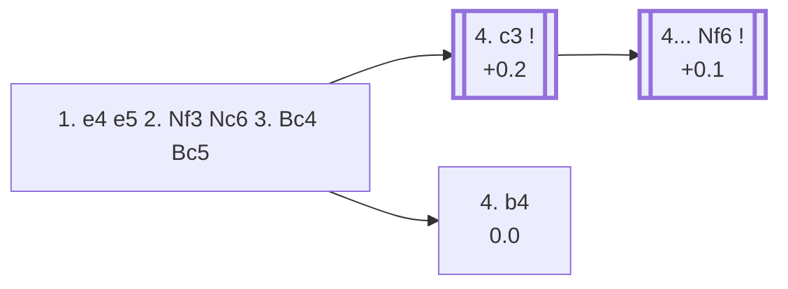

<a name="_TOP_"></a>

# C50 Italian Game: Giuoco Piano <br> 1. e4 e5 2. Nf3 Nc6 3. Bc4 Bc5 #

Spun off from [C50 Italian's 3... Bc5 bullet](https://github.com/onclemarcel/chess_flashcards/blob/main/e4_openings/C50_Italian.md#_initial_move_), previously flagged "pending its own dedicated card." Despite the Two Knights Defense (3... Nf6) getting full depth treatment first — thanks to the sharp, name-worthy Fried Liver Attack — the Giuoco Piano is actually masters' *more* popular choice here (52.3% vs. the Two Knights' 43.9%): a quieter developing move that keeps control of g5 so Black can castle and defend f7 with the rook before White's knight gets any sharp ideas.

### Overview

*Quick map of every move covered on this card — see the [shape key](https://github.com/onclemarcel/chess_flashcards/blob/main/start.md#content-diagram-optional) in start.md.*

<!-- content-diagram:start -->

<!-- content-diagram:end -->

<a name="_initial_move_"></a>

[](https://lichess.org/analysis/standard/r1bqk1nr/pppp1ppp/2n5/2b1p3/2B1P3/5N2/PPPP1PPP/RNBQK2R_w_KQkq_-_4_4)

*... 3... Bc5 — Giuoco Piano*

```
r1bqk1nr/pppp1ppp/2n5/2b1p3/2B1P3/5N2/PPPP1PPP/RNBQK2R w KQkq - 4 4
```

|  | +0.2 |
| --- | --- |

<!-- lichess-stats:start fen="r1bqk1nr/pppp1ppp/2n5/2b1p3/2B1P3/5N2/PPPP1PPP/RNBQK2R w KQkq - 4 4" db="lichess,masters" speeds="bullet,blitz" ratings="1800,2000,2200,2500" moves="6" -->
| Move | Online | W/D/B | Masters | W/D/B | |
| :--- | ---: | :--- | ---: | :--- | :-- |
| c3 | 6.7 M (32.5%) | ⬜⬜⬜⬜⬜⬛⬛⬛⬛⬛ 50/4/45 | 14 k (54.9%) | ⬜⬜⬜🟫🟫🟫🟫🟫⬛⬛ 27/52/21 |  |
| O-O | 5.4 M (26.3%) | ⬜⬜⬜⬜⬜⬛⬛⬛⬛⬛ 49/4/47 | 5.1 k (19.9%) | ⬜⬜⬜🟫🟫🟫🟫🟫⬛⬛ 28/48/23 |  |
| d3 | 3.1 M (15.0%) | ⬜⬜⬜⬜⬜⬛⬛⬛⬛⬛ 48/5/47 | 4.2 k (16.3%) | ⬜⬜⬜🟫🟫🟫🟫🟫⬛⬛ 29/47/24 |  |
| b4 | 2.5 M (11.9%) | ⬜⬜⬜⬜⬜⬛⬛⬛⬛⬛ 51/3/45 | 1.7 k (6.7%) | ⬜⬜⬜🟫🟫🟫🟫⬛⬛⬛ 27/44/29 |  |
| Nc3 | 1.7 M (8.0%) | ⬜⬜⬜⬜⬜⬛⬛⬛⬛⬛ 47/5/48 | 397 (1.6%) | ⬜⬜⬜🟫🟫🟫🟫🟫⬛⬛ 26/53/21 |  |
| d4 | 777 k (3.8%) | ⬜⬜⬜⬜⬜⬛⬛⬛⬛⬛ 51/4/45 | 99 (0.4%) | ⬜⬜🟫🟫🟫🟫🟫🟫⬛⬛ 17/66/17 |  |

*Online: bullet/blitz, 1800+ — 20.7 M games. Masters: 26 k games. [Open in the explorer](https://lichess.org/analysis/standard/r1bqk1nr/pppp1ppp/2n5/2b1p3/2B1P3/5N2/PPPP1PPP/RNBQK2R_w_KQkq_-_4_4#explorer) — updated 2026-08-26*
<!-- lichess-stats:end -->

### Candidate moves

* [**4. c3**](#_c3_) (+0.2): masters' clear main try (54.9%) — prepares d4 to build a real centre, the line this card follows.
* **4. O-O** (19.9%): castles first, keeping options open for c3/d4 or d3 later.
* **4. d3** (16.3%): the quiet "Giuoco Pianissimo" setup, forgoing c3/d4 entirely.
* **4. b4** (0.0): the [**Evans Gambit**](https://en.wikipedia.org/wiki/Evans_Gambit), a real, historically famous pawn sacrifice for rapid development and a bishop redeployed to b2/a3 (6.7% masters, 11.9% online) — not built out further here (backlog).

[*Back to TOP*](#_TOP_)

---

<a name="_c3_"></a>

## 4. c3

[](https://lichess.org/analysis/standard/r1bqk1nr/pppp1ppp/2n5/2b1p3/2B1P3/2P2N2/PP1P1PPP/RNBQK2R_b_KQkq_-_0_4)

*... 4. c3*

```
r1bqk1nr/pppp1ppp/2n5/2b1p3/2B1P3/2P2N2/PP1P1PPP/RNBQK2R b KQkq - 0 4
```

|  | +0.1 |
| --- | --- |

<!-- lichess-stats:start fen="r1bqk1nr/pppp1ppp/2n5/2b1p3/2B1P3/2P2N2/PP1P1PPP/RNBQK2R b KQkq - 0 4" db="lichess,masters" speeds="bullet,blitz" ratings="1800,2000,2200,2500" moves="5" -->
| Move | Online | W/D/B | Masters | W/D/B | |
| :--- | ---: | :--- | ---: | :--- | :-- |
| Nf6 | 3.9 M (56.8%) | ⬜⬜⬜⬜⬜🟫⬛⬛⬛⬛ 51/5/45 | 13 k (96.0%) | ⬜⬜⬜🟫🟫🟫🟫🟫⬛⬛ 26/53/21 |  |
| d6 | 2.0 M (29.0%) | ⬜⬜⬜⬜⬜⬛⬛⬛⬛⬛ 50/4/45 | 169 (1.2%) | ⬜⬜⬜⬜🟫🟫🟫🟫⬛⬛ 40/36/25 |  |
| Qf6 | 209 k (3.1%) | ⬜⬜⬜⬜🟫⬛⬛⬛⬛⬛ 43/4/53 | 28 (0.2%) | ⬜⬜⬜⬜🟫🟫🟫⬛⬛⬛ 43/29/29 |  |
| Nge7 | 174 k (2.5%) | ⬜⬜⬜⬜⬜⬛⬛⬛⬛⬛ 51/4/46 | 0 | — | ⚠ |
| h6 | 161 k (2.3%) | ⬜⬜⬜⬜⬜⬜⬛⬛⬛⬛ 54/4/42 | 0 | — | ⚠ |
| Qe7 | 0 | — | 266 (1.9%) | ⬜⬜⬜⬜⬜🟫🟫🟫⬛⬛ 48/28/24 |  |
| Bb6 | 0 | — | 97 (0.7%) | ⬜⬜⬜⬜⬜🟫🟫⬛⬛⬛ 47/26/27 |  |

*Online: bullet/blitz, 1800+ — 6.9 M games. Masters: 14 k games. [Open in the explorer](https://lichess.org/analysis/standard/r1bqk1nr/pppp1ppp/2n5/2b1p3/2B1P3/2P2N2/PP1P1PPP/RNBQK2R_b_KQkq_-_0_4#explorer) — updated 2026-08-26*
<!-- lichess-stats:end -->

**4... Nf6** is masters' near-unanimous reply (96.0%) — develops with tempo on e4, reaching the *Classical Variation*.

[*Back to 3... Bc5*](#_initial_move_)
[*Back to TOP*](#_TOP_)

---

<a name="_Nf6_"></a>

## 4... Nf6 — Classical Variation

[](https://lichess.org/analysis/standard/r1bqk2r/pppp1ppp/2n2n2/2b1p3/2B1P3/2P2N2/PP1P1PPP/RNBQK2R_w_KQkq_-_1_5)

*... 4... Nf6 — Classical Variation*

```
r1bqk2r/pppp1ppp/2n2n2/2b1p3/2B1P3/2P2N2/PP1P1PPP/RNBQK2R w KQkq - 1 5
```

|  | +0.1 |
| --- | --- |

<!-- lichess-stats:start fen="r1bqk2r/pppp1ppp/2n2n2/2b1p3/2B1P3/2P2N2/PP1P1PPP/RNBQK2R w KQkq - 1 5" db="lichess,masters" speeds="bullet,blitz" ratings="1800,2000,2200,2500" moves="6" -->
| Move | Online | W/D/B | Masters | W/D/B | |
| :--- | ---: | :--- | ---: | :--- | :-- |
| d4 | 2.2 M (54.3%) | ⬜⬜⬜⬜⬜🟫⬛⬛⬛⬛ 52/5/44 | 2.8 k (21.1%) | ⬜⬜⬜🟫🟫🟫🟫🟫⬛⬛ 25/51/24 |  |
| d3 | 1.3 M (32.1%) | ⬜⬜⬜⬜⬜⬛⬛⬛⬛⬛ 50/5/45 | 10 k (75.7%) | ⬜⬜⬜🟫🟫🟫🟫🟫⬛⬛ 26/55/19 |  |
| O-O | 326 k (7.9%) | ⬜⬜⬜⬜⬜⬛⬛⬛⬛⬛ 50/4/45 | 27 (0.2%) | ⬜⬜🟫🟫🟫🟫🟫⬛⬛⬛ 22/44/33 |  |
| b4 | 101 k (2.4%) | ⬜⬜⬜⬜⬜⬛⬛⬛⬛⬛ 47/4/49 | 367 (2.7%) | ⬜⬜⬜🟫🟫🟫🟫⬛⬛⬛ 32/36/32 |  |
| Qe2 | 44 k (1.1%) | ⬜⬜⬜⬜⬜⬛⬛⬛⬛⬛ 48/4/48 | 29 (0.2%) | ⬜⬜⬜🟫🟫🟫🟫⬛⬛⬛ 31/38/31 |  |
| Qb3 | 22 k (0.5%) | ⬜⬜⬜⬜⬜⬛⬛⬛⬛⬛ 45/4/51 | 0 | — | ⚠ |
| Ng5 | 0 | — | 4 (0.0%) | — |  |

*Online: bullet/blitz, 1800+ — 4.1 M games. Masters: 13 k games. [Open in the explorer](https://lichess.org/analysis/standard/r1bqk2r/pppp1ppp/2n2n2/2b1p3/2B1P3/2P2N2/PP1P1PPP/RNBQK2R_w_KQkq_-_1_5#explorer) — updated 2026-08-26*
<!-- lichess-stats:end -->

Another sharp online/masters inversion: masters strongly prefer **5. d3** (75.7%) — the quiet *Giuoco Pianissimo* setup, keeping the centre closed and playing for a slow manoeuvring game — over **5. d4** (21.1%, the sharper central break, sometimes called the *Möller Attack* after 5... exd4 6. cxd4). Online it flips: d4 leads (54.3%) over d3 (32.1%), the more forcing try being the online favourite as usual. Not built out further here (backlog).

[*Back to 4. c3*](#_c3_)
[*Back to TOP*](#_TOP_)
