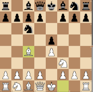
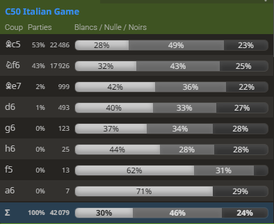
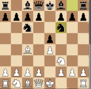
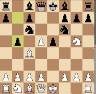
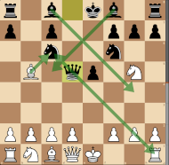

# 1. e4 e5 2. Nf3 Nc6 3. Bc4: The Italian Opening (C50) #
 

White develops the bishop to a good square where it controls a valuable diagonal. From c4 the Bishop controls d5 and pressures Black's f7-pawn, the most vulnerable pawn in Blacks position. Having developed both their kingside minor pieces quickly, White is ready to castle. White's plans include a swift attack on f7 and building a big centre with c3 and d4. 

 

     
    The Italian Game 1. e4 e5 2. Nf3 Nc6 3. Bc4  
    <table align="center"><tr> 
    <td valign="center"></td><td>+0.1</td></tr></table>
 
 
 

 

There is no immediate threat to Black's position so they have some flexibility in how to respond. It would be good to develop a piece, and there are several options, the top two being 3...Nf6, the Two Knights, or 3...Bc5, the Giuoco Piano. 
 

- [**... Nf6**](#_Nf6_) (+0.1) : The [Two Knights Defense](#_Nf6_) develops a piece while putting pressure on the undefended e4 pawn. This is played at 53% of the masters games and lead to the best score according to Stockfish. Note that **... Nf6** allows 4.Ng5, a sharp move that also attacks f7 and can lead to an aggressive knight sacrifice known as the [Fried Liver Attack](#_Fried_Liver_); this opening trap needs to be known by Black.

- [**... Bc5**](#_Bc5_) (+0.2) : By developing the kingside bishop before the kingside knight, Black's queen keeps control of the g5 square, then after 4...Nf6, Black is ready to castle 5...O-O. By developing the kingside in this order, Black avoids the sharper Ng5 lines that follow the Two Knights defence: g5 is controlled by the queen until Black is ready to castle and defend f7 with the rook. Hence this continuation is called the [Giuoco Piano](#_Bc5_).

- [**... f5**](../gambits/Rousseau/Rousseau.md) (+1.1) : The [Rousseau Gambit](../gambits/Rousseau/Rousseau.md) resembles a Vienna gambit with colours reversed. Black hopes White will take the offered pawn, 4.exf5?, deflecting one of their pawns from the centre and allowing 4...e4, and the only place for the White's knight to go is back to g1. However, White can decline with 4.d3 or countergambit with 4.d4.

- Following Black moves allow White's control of the center with 4.d4: 

  - **... h6** (+0.6) : called the **Anti-Fried Liver**, is an amateur attempt to avoid the Ng5 lines. The idea is to allow Black to play 4...Nf6 without giving up control of g5. Though this is a straightforward idea, its drawbacks are that it does not control the centre or develop a piece, and essentially just gives White extra tempo to attack. White can play 4. d4 to bust open the centre

  - **... Be7** (+0.5), the **Hungarian defense**, is a minor sideline. This is a more conservative developing move to get ready to castle while not giving up control of g5 yet. After 4. d4 d6, a Philidor-style position is reached.

  - **... d6**, the **Paris defense**, is very passive. It avoids developing a piece and restricts Black's kingside bishop to over defend e5, which wasn't at risk anyway. This usually transposes into an Exchange Philidor.

 
 

 

     
    The Two Knights Defense 3. Bc4 Nf6  
    <table align="center"><tr> 
    <td valign="center"></td><td>+0.1</td></tr></table>
 
 
 

 

With **...Nf6**, Black develops a knight and attacks the e4-pawn, getting one step closer to castling. This move seems like the most obvious one Black can play in the Italian, but it also comes at a disadvantage of blocking the d8-h4 diagonal of the black queen. 
 

White has several options to defend the e4 pawn:
- [**4. d3**](#_Modern_Bishop_) (+0.1) : the most common move to the Two Knights Defence, defending the pawn and opening the c1-h6 diagonal for the dark squared bishop. This is known as the Modern Bishop's Opening. It represents 73% of the masters games.

- [**4. Nc3**](./C47_Four_Knights_Game.md) (-0.2) : transposes into the Italian Variation of the [Four Knights Game](./C47_Four_Knights_Game.md). This move looks like a logical move to defend the pawn, but it allows Black the opportunity to play **... Nxe4!** : This is the common ***Center Fork Trick***, in where Black temporarily sacrifices a piece in order to play d5 and get back the piece with a comfortable position.

- [**4. Ng5**](#_Fried_Liver_) (0.0) : With this move, leading to the [Fried Liver Attack](#_Fried_Liver_), White double attacks the f7-pawn, and also takes advantage of the fact that Black did not develop his f8-bishop and cannot react to this attack by castling. This usually results in Black sacrificing a pawn for a lead in development in master level

White can also open up the center:
- [**4. d4**](#_Nf6_d4_) (0.0) : this move almost always transposes to the Scotch Gambit after 4...exd4. White can then either continue with 5. O-O, playing aggressively in gambit-style fashion, or can gain more space in the center with 5. e5.

> [!TIP]
> ### 3. Bc4 Nf6 4. Ng5 : the Knight Attack ( : +0.0)
> - Black's only sensible way to defend f7 is to block the bishop's access with **... d5**
> - After **5.exd5**, there are several possible Black answers 
>   - **... Nxd5?!** (+0.7) is *not* played at master level and considered an incorrect positional move, due to the open line created by White's move **6.Nxf7** : The **Fried Liver Attack**
>   - **... Na5** (0.0) is the *most played move* at master level, attacking Bb4 and chasing White's bishop. Then Black can go after the Knight with **...h6**, and push e5 to e4 to carry on bullying the White knight coming back to f3. Pawn on d5 can also be taken back with the Queen, when possible.
>     - If white plays **6. Bb5+ c6 7. dxc6 bxc6 8. Be2**, the bishop will have to come back on a safe square, eventually
>   - **... b5** (+0.3) : while giving a better score to White, this move is rarely played (7% of masters games) and best score is provided for the unnatural move 6.Bf1 *(known by master players, though...)*.
>
> 

>      
>     Ulvestad Variation 4. Ng5 d5 5. exd5 b5  
>     <table align="center"><tr><td valign="center"></td><td>Rare (7%)</td> 
>     <td valign="center"></td><td>+0.3</td></tr></table>
>   

>
> Other White moves that **6.Bf1** lead to a better game for Black with a careful play:
> - **6. Bxb5** allows **... Qxd5**, forking the bishop and g2 pawn - Black gets open diagonals and a central queen
> 

>      
>     Ulvestad Variation 6. Bxb5  
>     <table align="center"><tr><td valign="center"></td><td>15% in Ulvestad</td> 
>     <td valign="center"></td><td>+0.0</td></tr></table>
>   

>
>  [*Back to previous move*](#_Nf6_)

 [*Back to previous move*](#_Nf6_)  
 
 [*Back to initial move*](#_initial_move_)  
 
 [*Back to TOP*](#_TOP_)

