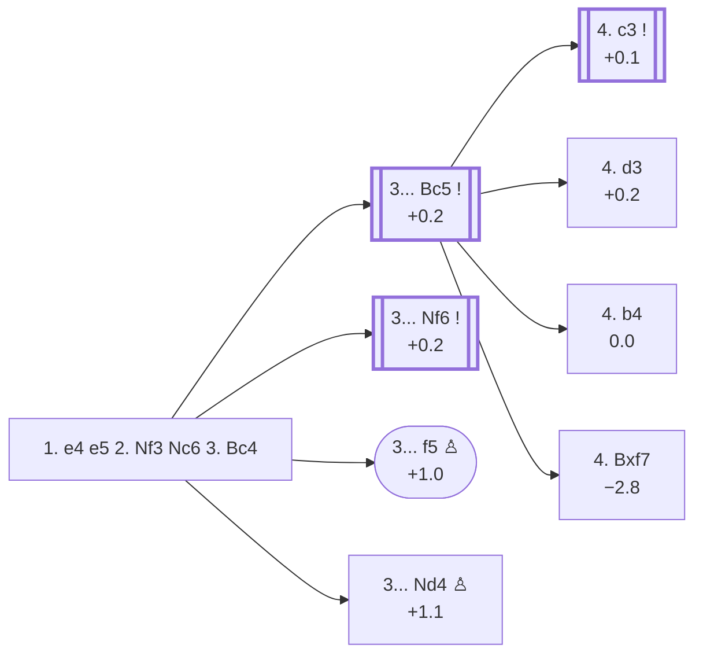

<a name="_TOP_"></a>

# C50 Italian Game <br> 1. e4 e5 2. Nf3 Nc6 3. Bc4 #

White develops the bishop to a good square where it controls a valuable diagonal. From c4 the bishop controls d5 and pressures Black's f7-pawn, the most vulnerable pawn in Black's position. Having developed both kingside minor pieces quickly, White is ready to castle. White's plans include a swift attack on f7 and building a big centre with c3 and d4.

**Merged 2026-09-05**: this card previously split the 3... Bc5 branch (the Giuoco Piano, masters' actual most popular try here) onto its own separate file. Folded back into this page as its own section below, alongside a full pass filling in every remaining C50 gap — the whole Giuoco Pianissimo tree, the Jerome and Blackburne-Kostić Gambits, the Four Knights Variation, and the Hungarian Defense's own Tartakower Variation — none of which had any coverage before this batch.

### Overview

*Quick map of every move covered on this card — see the [shape key](https://github.com/onclemarcel/chess_flashcards/blob/main/start.md#content-diagram-optional) in start.md.*

<!-- content-diagram:start -->

<!-- content-diagram:end -->

<a name="_initial_move_"></a>

[](https://lichess.org/analysis/standard/r1bqkbnr/pppp1ppp/2n5/4p3/2B1P3/5N2/PPPP1PPP/RNBQK2R_b_KQkq_-_3_3)

*... 1. e4 e5 2. Nf3 Nc6 3. Bc4 — Italian Game*

```
r1bqkbnr/pppp1ppp/2n5/4p3/2B1P3/5N2/PPPP1PPP/RNBQK2R b KQkq - 3 3
```

|  | +0.1 |
| --- | --- |

<!-- lichess-stats:start fen="r1bqkbnr/pppp1ppp/2n5/4p3/2B1P3/5N2/PPPP1PPP/RNBQK2R b KQkq - 3 3" db="lichess,masters" speeds="bullet,blitz" ratings="1800,2000,2200,2500" moves="8" -->
| Move | Online | W/D/B | Masters | W/D/B | |
| :--- | ---: | :--- | ---: | :--- | :-- |
| Bc5 | 20.3 M (40.1%) | ⬜⬜⬜⬜⬜⬛⬛⬛⬛⬛ 49/4/46 | 25 k (52.3%) | ⬜⬜⬜🟫🟫🟫🟫🟫⬛⬛ 27/50/22 |  |
| Nf6 | 18.3 M (36.2%) | ⬜⬜⬜⬜⬜⬛⬛⬛⬛⬛ 49/4/47 | 21 k (43.9%) | ⬜⬜⬜🟫🟫🟫🟫⬛⬛⬛ 31/44/25 |  |
| d6 | 3.4 M (6.6%) | ⬜⬜⬜⬜⬜⬛⬛⬛⬛⬛ 51/5/45 | 647 (1.3%) | ⬜⬜⬜⬜🟫🟫🟫⬛⬛⬛ 37/33/29 |  |
| Be7 | 2.9 M (5.6%) | ⬜⬜⬜⬜⬜⬛⬛⬛⬛⬛ 49/5/46 | 1.0 k (2.1%) | ⬜⬜⬜⬜🟫🟫🟫🟫⬛⬛ 42/37/21 |  |
| h6 | 2.1 M (4.1%) | ⬜⬜⬜⬜⬜⬜⬛⬛⬛⬛ 55/4/41 | 28 (0.1%) | ⬜⬜⬜⬜⬜🟫🟫⬛⬛⬛ 46/25/29 |  |
| f5 | 1.5 M (2.9%) | ⬜⬜⬜⬜⬜⬛⬛⬛⬛⬛ 46/3/51 | 13 (0.0%) | — |  |
| Nd4 | 1.3 M (2.6%) | ⬜⬜⬜⬜⬜⬛⬛⬛⬛⬛ 50/4/46 | 0 | — | ⚠ |
| g6 | 195 k (0.4%) | ⬜⬜⬜⬜⬜⬛⬛⬛⬛⬛ 48/4/48 | 129 (0.3%) | ⬜⬜⬜⬜🟫🟫🟫⬛⬛⬛ 36/34/30 |  |
| a6 | 0 | — | 7 (0.0%) | — |  |

*Online: bullet/blitz, 1800+ — 50.6 M games. Masters: 49 k games. [Open in the explorer](https://lichess.org/analysis/standard/r1bqkbnr/pppp1ppp/2n5/4p3/2B1P3/5N2/PPPP1PPP/RNBQK2R_b_KQkq_-_3_3#explorer) — updated 2026-09-06*
<!-- lichess-stats:end -->

### Candidate moves

There is no immediate threat to Black's position so they have some flexibility in how to respond. It would be good to develop a piece, and there are several options, the top two being 3... Nf6 (the Two Knights) or 3... Bc5 (the Giuoco Piano).

* [**3... Nf6**](#_Nf6_) (+0.2): the [Two Knights Defense](#_Nf6_) develops a piece while putting pressure on the undefended e4 pawn, at 43.9% of masters games (second to 3... Bc5's 52.3%). Note that **3... Nf6** allows 4. Ng5, a sharp move that also attacks f7 and can lead to an aggressive knight sacrifice known as the [Fried Liver Attack](https://github.com/onclemarcel/chess_flashcards/blob/main/e4_openings/C57_Two_Knights_Defense_Knight_Attack.md); this opening trap needs to be known by Black.
* [**3... Bc5**](#_Bc5_) (+0.2): by developing the kingside bishop before the kingside knight, Black keeps control of the g5 square, then after 4... Nf6 Black is ready to castle 5... O-O. By developing in this order, Black avoids the sharper Ng5 lines that follow the Two Knights Defense: g5 is controlled by the queen until Black is ready to castle and defend f7 with the rook. Hence this continuation is called the ***Giuoco Piano*** — masters' actual most popular try here (52.3%, ahead of the Two Knights' 43.9%), covered below.
* [**3... f5**](https://github.com/onclemarcel/chess_flashcards/blob/main/gambits/Rousseau/Rousseau.md) (+1.0): the [Rousseau Gambit](https://github.com/onclemarcel/chess_flashcards/blob/main/gambits/Rousseau/Rousseau.md) resembles a Vienna Gambit with colours reversed. Black hopes White will take the offered pawn, 4. exf5?, deflecting one of their pawns from the centre and allowing 4... e4, when the attacked knight retreats with 5. Ng1 or holds its ground with 5. Qe2 (defending it in place) — engines actually prefer the more active 5. Nd4. However, White can decline with 4. d3 or countergambit with 4. d4.
* [**3... Nd4**](#_Nd4_) (+1.1): live-tagged the ***Blackburne-Kostić Gambit*** (`eco.md`'s own name is *Blackburne Shilling Gambit*, a real name divergence) — a pure practical trap, not a sound try; covered below.
* **3... h6** (+0.6): called the **Anti-Fried Liver**, an amateur attempt to avoid the Ng5 lines. The idea is to allow Black to play 4... Nf6 without giving up control of g5. Though this is a straightforward idea, its drawback is that it doesn't control the centre or develop a piece, essentially giving White an extra tempo to attack with **4. d4**.
* [**3... Be7**](#_Be7_) (+0.5): the ***Hungarian Defense*** — see below.
* **3... d6** (+0.4): the **Paris Defense**, very passive. It avoids developing a piece and over-defends e5, which wasn't at risk anyway. This usually transposes into an Exchange Philidor.

[*Back to TOP*](#_TOP_)

---

<a name="_Nf6_"></a>

### 3... Nf6 — Two Knights Defense

With **3... Nf6**, Black develops a knight and attacks the e4-pawn, getting one step closer to castling. This move seems like the most obvious one Black can play in the Italian, but it also comes at the cost of blocking the d8-h4 diagonal of the black queen. This position is itself already live-tagged its own code, **C55** — covered in full on its own card, [C55](https://github.com/onclemarcel/chess_flashcards/blob/main/e4_openings/C55_Two_Knights_Defense.md), including the full White 4th-move fork (d3/Nc3/Ng5/d4). **4. Ng5**, the Fried Liver Attack, is itself already live-tagged its own code, **C57** — covered in full on [its own card](https://github.com/onclemarcel/chess_flashcards/blob/main/e4_openings/C57_Two_Knights_Defense_Knight_Attack.md), migrated there from this page.

[*Back to TOP*](#_TOP_)

---

<a name="_Nd4_"></a>

### 3... Nd4 — Blackburne-Kostić Gambit

[](https://lichess.org/analysis/standard/r1bqkbnr/pppp1ppp/8/4p3/2BnP3/5N2/PPPP1PPP/RNBQK2R_w_KQkq_-_4_4)

*... 3... Nd4 — Blackburne-Kostić Gambit*

```
r1bqkbnr/pppp1ppp/8/4p3/2BnP3/5N2/PPPP1PPP/RNBQK2R w KQkq - 4 4
```

|  | +1.1 |
| --- | --- |

A pure practical trap, not a sound opening try: masters' overwhelming reply is simply **4. Nxd4** (44.9%), taking the free piece outright. The whole point only shows up if White instead grabs a second pawn with **4. Nxe5?! Qg5!**, forking the knight (e5) and the g2 pawn at once — after **5. Nxf7?! Qxg2 6. Rf1 Qxe4+ 7. Be2 Nf3#!**, Black delivers checkmate. This exact trap-line is the reason `eco.md` and the live explorer disagree on the name — *Blackburne Shilling Gambit* versus **Blackburne-Kostić Gambit** — but either way, it only works against a White player who doesn't know to just take the knight. Not built out further here (backlog).

[*Back to TOP*](#_TOP_)

---

<a name="_Be7_"></a>

### 3... Be7 — Hungarian Defense

[](https://lichess.org/analysis/standard/r1bqk1nr/ppppbppp/2n5/4p3/2B1P3/5N2/PPPP1PPP/RNBQK2R_w_KQkq_-_4_4)

*... 3... Be7 — Hungarian Defense*

```
r1bqk1nr/ppppbppp/2n5/4p3/2B1P3/5N2/PPPP1PPP/RNBQK2R w KQkq - 4 4
```

|  | +0.5 |
| --- | --- |

A conservative developing move, getting ready to castle while not giving up control of g5 yet. After **4. d4 exd4 5. c3!? Nf6 6. e5 Ne4**, the *Tartakower Variation* (+0.7) offers a pawn back for rapid development — masters' clear main try from there is **7. Bd5**, forking the e4-knight and threatening the c6-knight too. Not built out further here (backlog).

[*Back to TOP*](#_TOP_)

---

<a name="_Bc5_"></a>

## 3... Bc5 — Giuoco Piano

Despite the Two Knights Defense (3... Nf6) getting full depth treatment above — thanks to the sharp, name-worthy Fried Liver Attack — the Giuoco Piano is actually masters' *more* popular choice here (52.3% vs. the Two Knights' 43.9%): a quieter developing move that keeps control of g5 so Black can castle and defend f7 with the rook before White's knight gets any sharp ideas.

[](https://lichess.org/analysis/standard/r1bqk1nr/pppp1ppp/2n5/2b1p3/2B1P3/5N2/PPPP1PPP/RNBQK2R_w_KQkq_-_4_4)

*... 3... Bc5 — Giuoco Piano*

```
r1bqk1nr/pppp1ppp/2n5/2b1p3/2B1P3/5N2/PPPP1PPP/RNBQK2R w KQkq - 4 4
```

|  | +0.2 |
| --- | --- |

<!-- lichess-stats:start fen="r1bqk1nr/pppp1ppp/2n5/2b1p3/2B1P3/5N2/PPPP1PPP/RNBQK2R w KQkq - 4 4" db="lichess,masters" speeds="bullet,blitz" ratings="1800,2000,2200,2500" moves="6" -->
| Move | Online | W/D/B | Masters | W/D/B | |
| :--- | ---: | :--- | ---: | :--- | :-- |
| c3 | 6.7 M (32.5%) | ⬜⬜⬜⬜⬜⬛⬛⬛⬛⬛ 50/4/45 | 14 k (54.9%) | ⬜⬜⬜🟫🟫🟫🟫🟫⬛⬛ 27/52/21 |  |
| O-O | 5.4 M (26.3%) | ⬜⬜⬜⬜⬜⬛⬛⬛⬛⬛ 49/4/47 | 5.1 k (19.9%) | ⬜⬜⬜🟫🟫🟫🟫🟫⬛⬛ 28/48/23 |  |
| d3 | 3.1 M (15.0%) | ⬜⬜⬜⬜⬜⬛⬛⬛⬛⬛ 48/5/47 | 4.2 k (16.3%) | ⬜⬜⬜🟫🟫🟫🟫🟫⬛⬛ 29/47/24 |  |
| b4 | 2.5 M (11.9%) | ⬜⬜⬜⬜⬜⬛⬛⬛⬛⬛ 51/3/45 | 1.7 k (6.7%) | ⬜⬜⬜🟫🟫🟫🟫⬛⬛⬛ 27/44/29 |  |
| Nc3 | 1.7 M (8.0%) | ⬜⬜⬜⬜⬜⬛⬛⬛⬛⬛ 47/5/48 | 397 (1.6%) | ⬜⬜⬜🟫🟫🟫🟫🟫⬛⬛ 26/53/21 |  |
| d4 | 777 k (3.8%) | ⬜⬜⬜⬜⬜⬛⬛⬛⬛⬛ 51/4/45 | 99 (0.4%) | ⬜⬜🟫🟫🟫🟫🟫🟫⬛⬛ 17/66/17 |  |

*Online: bullet/blitz, 1800+ — 20.7 M games. Masters: 26 k games. [Open in the explorer](https://lichess.org/analysis/standard/r1bqk1nr/pppp1ppp/2n5/2b1p3/2B1P3/5N2/PPPP1PPP/RNBQK2R_w_KQkq_-_4_4#explorer) — updated 2026-09-06*
<!-- lichess-stats:end -->

### Candidate moves

* [**4. c3**](#_c3_) (+0.1): masters' clear main try (54.9%) — prepares d4 to build a real centre, covered below.
* **4. O-O** (19.9%): castles first, keeping options open for c3/d4 or d3 later.
* [**4. d3**](#_Pianissimo_) (16.3%, +0.2): the quiet ***Giuoco Pianissimo*** setup, forgoing c3/d4 entirely — covered below.
* [**4. b4**](https://github.com/onclemarcel/chess_flashcards/blob/main/e4_openings/C51_Evans_Gambit.md) (0.0): the [**Evans Gambit**](https://github.com/onclemarcel/chess_flashcards/blob/main/e4_openings/C51_Evans_Gambit.md), a real, historically famous pawn sacrifice for rapid development and a bishop redeployed to b2/a3 (6.7% masters, 11.9% online) — its own code, **C51**, covered on its own card.
* [**4. Nc3**](#_FourKnightsVar_) (+0.1, 1.6% masters): the *Four Knights Variation*, transposing toward Four Knights Game structures — covered below.
* [**4. Bxf7**](#_Jerome_) (−2.8 💣, masters: negligible sample): the ***Jerome Gambit*** — covered below.

[*Back to TOP*](#_TOP_)

---

<a name="_c3_"></a>

### 4. c3

[](https://lichess.org/analysis/standard/r1bqk1nr/pppp1ppp/2n5/2b1p3/2B1P3/2P2N2/PP1P1PPP/RNBQK2R_b_KQkq_-_0_4)

*... 4. c3*

```
r1bqk1nr/pppp1ppp/2n5/2b1p3/2B1P3/2P2N2/PP1P1PPP/RNBQK2R b KQkq - 0 4
```

|  | +0.1 |
| --- | --- |

<!-- lichess-stats:start fen="r1bqk1nr/pppp1ppp/2n5/2b1p3/2B1P3/2P2N2/PP1P1PPP/RNBQK2R b KQkq - 0 4" db="lichess,masters" speeds="bullet,blitz" ratings="1800,2000,2200,2500" moves="5" -->
| Move | Online | W/D/B | Masters | W/D/B | |
| :--- | ---: | :--- | ---: | :--- | :-- |
| Nf6 | 3.9 M (56.8%) | ⬜⬜⬜⬜⬜🟫⬛⬛⬛⬛ 51/5/45 | 13 k (96.0%) | ⬜⬜⬜🟫🟫🟫🟫🟫⬛⬛ 26/53/21 |  |
| d6 | 2.0 M (29.0%) | ⬜⬜⬜⬜⬜⬛⬛⬛⬛⬛ 50/4/45 | 169 (1.2%) | ⬜⬜⬜⬜🟫🟫🟫🟫⬛⬛ 40/36/25 |  |
| Qf6 | 209 k (3.1%) | ⬜⬜⬜⬜🟫⬛⬛⬛⬛⬛ 43/4/53 | 28 (0.2%) | ⬜⬜⬜⬜🟫🟫🟫⬛⬛⬛ 43/29/29 |  |
| Nge7 | 174 k (2.5%) | ⬜⬜⬜⬜⬜⬛⬛⬛⬛⬛ 51/4/46 | 0 | — | ⚠ |
| h6 | 161 k (2.3%) | ⬜⬜⬜⬜⬜⬜⬛⬛⬛⬛ 54/4/42 | 0 | — | ⚠ |
| Qe7 | 0 | — | 266 (1.9%) | ⬜⬜⬜⬜⬜🟫🟫🟫⬛⬛ 48/28/24 |  |
| Bb6 | 0 | — | 97 (0.7%) | ⬜⬜⬜⬜⬜🟫🟫⬛⬛⬛ 47/26/27 |  |

*Online: bullet/blitz, 1800+ — 6.9 M games. Masters: 14 k games. [Open in the explorer](https://lichess.org/analysis/standard/r1bqk1nr/pppp1ppp/2n5/2b1p3/2B1P3/2P2N2/PP1P1PPP/RNBQK2R_b_KQkq_-_0_4#explorer) — updated 2026-09-06*
<!-- lichess-stats:end -->

**4... Nf6** is masters' near-unanimous reply (96.0%) — develops with tempo on e4, reaching the *Classical Variation*.

[*Back to 3... Bc5*](#_Bc5_)
[*Back to TOP*](#_TOP_)

---

<a name="_Classical_"></a>

### 4... Nf6 — Classical Variation

[](https://lichess.org/analysis/standard/r1bqk2r/pppp1ppp/2n2n2/2b1p3/2B1P3/2P2N2/PP1P1PPP/RNBQK2R_w_KQkq_-_1_5)

*... 4... Nf6 — Classical Variation*

```
r1bqk2r/pppp1ppp/2n2n2/2b1p3/2B1P3/2P2N2/PP1P1PPP/RNBQK2R w KQkq - 1 5
```

|  | +0.1 |
| --- | --- |

<!-- lichess-stats:start fen="r1bqk2r/pppp1ppp/2n2n2/2b1p3/2B1P3/2P2N2/PP1P1PPP/RNBQK2R w KQkq - 1 5" db="lichess,masters" speeds="bullet,blitz" ratings="1800,2000,2200,2500" moves="6" -->
| Move | Online | W/D/B | Masters | W/D/B | |
| :--- | ---: | :--- | ---: | :--- | :-- |
| d4 | 2.2 M (54.3%) | ⬜⬜⬜⬜⬜🟫⬛⬛⬛⬛ 52/5/44 | 2.8 k (21.1%) | ⬜⬜⬜🟫🟫🟫🟫🟫⬛⬛ 25/51/24 |  |
| d3 | 1.3 M (32.1%) | ⬜⬜⬜⬜⬜⬛⬛⬛⬛⬛ 50/5/45 | 10 k (75.7%) | ⬜⬜⬜🟫🟫🟫🟫🟫⬛⬛ 26/55/19 |  |
| O-O | 326 k (7.9%) | ⬜⬜⬜⬜⬜⬛⬛⬛⬛⬛ 50/4/45 | 27 (0.2%) | ⬜⬜🟫🟫🟫🟫🟫⬛⬛⬛ 22/44/33 |  |
| b4 | 101 k (2.4%) | ⬜⬜⬜⬜⬜⬛⬛⬛⬛⬛ 47/4/49 | 367 (2.7%) | ⬜⬜⬜🟫🟫🟫🟫⬛⬛⬛ 32/36/32 |  |
| Qe2 | 44 k (1.1%) | ⬜⬜⬜⬜⬜⬛⬛⬛⬛⬛ 48/4/48 | 29 (0.2%) | ⬜⬜⬜🟫🟫🟫🟫⬛⬛⬛ 31/38/31 |  |
| Qb3 | 22 k (0.5%) | ⬜⬜⬜⬜⬜⬛⬛⬛⬛⬛ 45/4/51 | 0 | — | ⚠ |
| Ng5 | 0 | — | 4 (0.0%) | — |  |

*Online: bullet/blitz, 1800+ — 4.1 M games. Masters: 13 k games. [Open in the explorer](https://lichess.org/analysis/standard/r1bqk2r/pppp1ppp/2n2n2/2b1p3/2B1P3/2P2N2/PP1P1PPP/RNBQK2R_w_KQkq_-_1_5#explorer) — updated 2026-09-06*
<!-- lichess-stats:end -->

Another sharp online/masters inversion: masters strongly prefer **5. d3** (75.7%) — the quiet *Giuoco Pianissimo* setup, keeping the centre closed and playing for a slow manoeuvring game — over **5. d4** (21.1%, the sharper central break, sometimes called the *Möller Attack* after 5... exd4 6. cxd4). Online it flips: d4 leads (54.3%) over d3 (32.1%), the more forcing try being the online favourite as usual. Not built out further here (backlog).

[*Back to 4. c3*](#_c3_)
[*Back to TOP*](#_TOP_)

---

<a name="_FourKnightsVar_"></a>

### 4. Nc3 — Four Knights Variation

[](https://lichess.org/analysis/standard/r1bqk1nr/pppp1ppp/2n5/2b1p3/2B1P3/2N2N2/PPPP1PPP/R1BQK2R_b_KQkq_-_5_4)

*... 4. Nc3 — Four Knights Variation*

```
r1bqk1nr/pppp1ppp/2n5/2b1p3/2B1P3/2N2N2/PPPP1PPP/R1BQK2R b KQkq - 5 4
```

|  | +0.1 |
| --- | --- |

**4... Nf6** transposes straight into the [Four Knights Game's own Italian Variation](https://github.com/onclemarcel/chess_flashcards/blob/main/e4_openings/C47_Four_Knights_Game.md) (live-confirmed the exact same tag) — masters' clear main try there is **5. d3** (88.4%). Not built out further here (backlog); see the Four Knights card for this transposition's own theory.

[*Back to 3... Bc5*](#_Bc5_)
[*Back to TOP*](#_TOP_)

---

<a name="_Jerome_"></a>

### 4. Bxf7 — Jerome Gambit

[](https://lichess.org/analysis/standard/r1bqk1nr/pppp1Bpp/2n5/2b1p3/4P3/5N2/PPPP1PPP/RNBQK2R_b_KQkq_-_0_4)

*... 4. Bxf7 — Jerome Gambit*

```
r1bqk1nr/pppp1Bpp/2n5/2b1p3/4P3/5N2/PPPP1PPP/RNBQK2R b KQkq - 0 4
```

|  | −2.8 |
| --- | --- |

A genuinely unsound piece sacrifice — one of the internet's favourite "troll" openings, not a real practical weapon at any serious level. Masters' only recorded reply is **4... Ke7**; online, **4... Kxf7** (98.0%) is near-universal, and Black simply keeps the extra piece for one pawn with no real compensation. Not built out further here (backlog).

[*Back to 3... Bc5*](#_Bc5_)
[*Back to TOP*](#_TOP_)

---

<a name="_Pianissimo_"></a>

### 4. d3 — Giuoco Pianissimo

[](https://lichess.org/analysis/standard/r1bqk1nr/pppp1ppp/2n5/2b1p3/2B1P3/3P1N2/PPP2PPP/RNBQK2R_b_KQkq_-_0_4)

*... 4. d3 — Giuoco Pianissimo*

```
r1bqk1nr/pppp1ppp/2n5/2b1p3/2B1P3/3P1N2/PPP2PPP/RNBQK2R b KQkq - 0 4
```

|  | +0.2 |
| --- | --- |

<!-- lichess-stats:start fen="r1bqk1nr/pppp1ppp/2n5/2b1p3/2B1P3/3P1N2/PPP2PPP/RNBQK2R b KQkq - 0 4" db="lichess,masters" speeds="bullet,blitz" ratings="1800,2000,2200,2500" moves="6" -->
| Move | Online | W/D/B | Masters | W/D/B | |
| :--- | ---: | :--- | ---: | :--- | :-- |
| Nf6 | 1.5 M (46.2%) | ⬜⬜⬜⬜⬜⬛⬛⬛⬛⬛ 48/5/47 | 3.9 k (91.7%) | ⬜⬜⬜🟫🟫🟫🟫🟫⬛⬛ 30/47/23 |  |
| d6 | 1.2 M (36.1%) | ⬜⬜⬜⬜⬜⬛⬛⬛⬛⬛ 47/4/48 | 283 (6.7%) | ⬜⬜⬜🟫🟫🟫🟫⬛⬛⬛ 29/43/28 |  |
| h6 | 376 k (11.6%) | ⬜⬜⬜⬜⬜⬛⬛⬛⬛⬛ 49/5/46 | 47 (1.1%) | ⬜⬜⬜⬜🟫🟫🟫⬛⬛⬛ 36/34/30 |  |
| Nge7 | 92 k (2.9%) | ⬜⬜⬜⬜⬜⬛⬛⬛⬛⬛ 48/4/48 | 0 | — | ⚠ |
| Qf6 | 44 k (1.4%) | ⬜⬜⬜⬜🟫⬛⬛⬛⬛⬛ 44/4/52 | 1 (0.0%) | — | ⚠ |
| a6 | 19 k (0.6%) | ⬜⬜⬜⬜⬜⬛⬛⬛⬛⬛ 50/4/46 | 16 (0.4%) | — |  |

*Online: bullet/blitz, 1800+ — 3.2 M games. Masters: 4.2 k games. [Open in the explorer](https://lichess.org/analysis/standard/r1bqk1nr/pppp1ppp/2n5/2b1p3/2B1P3/3P1N2/PPP2PPP/RNBQK2R_b_KQkq_-_0_4#explorer) — updated 2026-09-06*
<!-- lichess-stats:end -->

The quietest, slowest-burning try on this whole card — White forgoes both c3/d4 and Nc3, simply developing and castling before deciding on a plan.

* [**4... Nf6**](#_PianissimoNormal_) (91.7% masters): masters' overwhelming choice — covered below.
* **4... d6** (6.7% masters): also fine, delaying ... Nf6 by a move.

Deeper, **4... f5!? 5. Ng5 f4!?**, the *Dubois Variation* (+0.4, a genuine database curiosity), immediately counterattacks in Rousseau-Gambit style rather than developing normally. Not built out further here (backlog).

[*Back to 3... Bc5*](#_Bc5_)
[*Back to TOP*](#_TOP_)

---

<a name="_PianissimoNormal_"></a>

### 4... Nf6 — Giuoco Pianissimo, Normal

[](https://lichess.org/analysis/standard/r1bqk2r/pppp1ppp/2n2n2/2b1p3/2B1P3/3P1N2/PPP2PPP/RNBQK2R_w_KQkq_-_1_5)

*... 4... Nf6 — Giuoco Pianissimo, Normal*

```
r1bqk2r/pppp1ppp/2n2n2/2b1p3/2B1P3/3P1N2/PPP2PPP/RNBQK2R w KQkq - 1 5
```

|  | +0.4 |
| --- | --- |

<!-- lichess-stats:start fen="r1bqk2r/pppp1ppp/2n2n2/2b1p3/2B1P3/3P1N2/PPP2PPP/RNBQK2R w KQkq - 1 5" db="lichess,masters" speeds="bullet,blitz" ratings="1800,2000,2200,2500" moves="6" -->
| Move | Online | W/D/B | Masters | W/D/B | |
| :--- | ---: | :--- | ---: | :--- | :-- |
| c3 | 1.6 M (30.2%) | ⬜⬜⬜⬜⬜⬛⬛⬛⬛⬛ 51/4/45 | 5.0 k (42.0%) | ⬜⬜⬜🟫🟫🟫🟫🟫⬛⬛ 27/53/20 |  |
| O-O | 1.6 M (29.9%) | ⬜⬜⬜⬜⬜⬛⬛⬛⬛⬛ 48/5/47 | 4.1 k (34.3%) | ⬜⬜⬜🟫🟫🟫🟫🟫⬛⬛ 30/47/23 |  |
| Nc3 | 652 k (12.1%) | ⬜⬜⬜⬜⬜🟫⬛⬛⬛⬛ 50/5/45 | 1.4 k (11.7%) | ⬜⬜⬜🟫🟫🟫🟫🟫⬛⬛ 29/47/23 |  |
| Bg5 | 497 k (9.2%) | ⬜⬜⬜⬜⬜⬛⬛⬛⬛⬛ 48/4/48 | 593 (5.0%) | ⬜⬜⬜⬜🟫🟫🟫⬛⬛⬛ 38/36/26 |  |
| h3 | 339 k (6.3%) | ⬜⬜⬜⬜⬜⬛⬛⬛⬛⬛ 48/5/47 | 0 | — | ⚠ |
| Be3 | 283 k (5.2%) | ⬜⬜⬜⬜⬜⬛⬛⬛⬛⬛ 48/5/47 | 0 | — | ⚠ |
| a4 | 0 | — | 238 (2.0%) | ⬜⬜⬜⬜🟫🟫🟫🟫⬛⬛ 39/39/22 |  |
| Bb3 | 0 | — | 225 (1.9%) | ⬜⬜⬜🟫🟫🟫🟫⬛⬛⬛ 35/37/28 |  |

*Online: bullet/blitz, 1800+ — 5.4 M games. Masters: 12 k games. [Open in the explorer](https://lichess.org/analysis/standard/r1bqk2r/pppp1ppp/2n2n2/2b1p3/2B1P3/3P1N2/PPP2PPP/RNBQK2R_w_KQkq_-_1_5#explorer) — updated 2026-09-06*
<!-- lichess-stats:end -->

Masters' clear main try is **5. c3** (42.0%), transposing back toward the main Giuoco Piano tabiya a move later; **5. O-O** (34.3%) also common.

* **5. c3** (42.0% masters): transposes toward the main line above. Not built out further here (backlog).
* [**5. Nc3**](#_ItalianFourKnights_) (11.7% masters): the *Italian Four Knights Variation* — covered below.

[*Back to 4. d3*](#_Pianissimo_)
[*Back to TOP*](#_TOP_)

---

<a name="_ItalianFourKnights_"></a>

### 5. Nc3 — Italian Four Knights Variation

[](https://lichess.org/analysis/standard/r1bqk2r/pppp1ppp/2n2n2/2b1p3/2B1P3/2NP1N2/PPP2PPP/R1BQK2R_b_KQkq_-_2_5)

*... 5. Nc3 — Italian Four Knights Variation*

```
r1bqk2r/pppp1ppp/2n2n2/2b1p3/2B1P3/2NP1N2/PPP2PPP/R1BQK2R b KQkq - 2 5
```

|  | +0.1 |
| --- | --- |

<!-- lichess-stats:start fen="r1bqk2r/pppp1ppp/2n2n2/2b1p3/2B1P3/2NP1N2/PPP2PPP/R1BQK2R b KQkq - 2 5" db="lichess,masters" speeds="bullet,blitz" ratings="1800,2000,2200,2500" moves="6" -->
| Move | Online | W/D/B | Masters | W/D/B | |
| :--- | ---: | :--- | ---: | :--- | :-- |
| d6 | 1.4 M (45.3%) | ⬜⬜⬜⬜⬜⬛⬛⬛⬛⬛ 48/5/48 | 858 (45.0%) | ⬜⬜⬜🟫🟫🟫🟫🟫⬛⬛ 28/49/23 |  |
| O-O | 788 k (24.6%) | ⬜⬜⬜⬜⬜🟫⬛⬛⬛⬛ 52/5/43 | 110 (5.8%) | ⬜⬜⬜🟫🟫🟫🟫⬛⬛⬛ 30/45/25 |  |
| h6 | 755 k (23.6%) | ⬜⬜⬜⬜⬜⬛⬛⬛⬛⬛ 49/5/46 | 611 (32.1%) | ⬜⬜⬜🟫🟫🟫🟫🟫⬛⬛ 25/52/22 |  |
| a6 | 88 k (2.7%) | ⬜⬜⬜⬜⬜⬛⬛⬛⬛⬛ 49/5/46 | 324 (17.0%) | ⬜⬜⬜⬜🟫🟫🟫🟫⬛⬛ 37/41/22 |  |
| Ng4 | 59 k (1.8%) | ⬜⬜⬜⬜⬜⬛⬛⬛⬛⬛ 53/3/44 | 1 (0.1%) | — | ⚠ |
| Nd4 | 11 k (0.4%) | ⬜⬜⬜⬜⬜⬜⬛⬛⬛⬛ 57/4/39 | 0 | — | ⚠ |
| a5 | 0 | — | 2 (0.1%) | — |  |

*Online: bullet/blitz, 1800+ — 3.2 M games. Masters: 1.9 k games. [Open in the explorer](https://lichess.org/analysis/standard/r1bqk2r/pppp1ppp/2n2n2/2b1p3/2B1P3/2NP1N2/PPP2PPP/R1BQK2R_b_KQkq_-_2_5#explorer) — updated 2026-09-06*
<!-- lichess-stats:end -->

Masters split between **5... d6** (45.0%) and **5... h6** (32.1%). Deeper, **5... d6 6. Bg5!?**, the *Canal Variation* (0.00, a real secondary try), pins the f6-knight before Black castles — masters' clear reply is **6... h6** (80.3%). Neither built out further here (backlog).

[*Back to 4... Nf6*](#_PianissimoNormal_)
[*Back to TOP*](#_TOP_)
